# matplotlib 中的绘图组织—您的一站式指南

> 原文：<https://towardsdatascience.com/plot-organization-in-matplotlib-your-one-stop-guide-if-you-are-reading-this-it-is-probably-f79c2dcbc801?source=collection_archive---------1----------------------->

本教程的 [Jupyter 笔记本](https://github.com/maticalderini/Tutorial_pltOrganization)可以在我的 [Github 页面](https://github.com/maticalderini)找到。

如果你正在读这篇文章，可能是因为你同意我的观点，大多数 *matplotlib* 教程都缺少绘图和数据可视化的一个关键方面。

虽然可能有成千上万的关于如何改变线条粗细或标题大小的教程，但他们似乎都忘记了支线剧情的组织在传达数据所讲述的故事中起着巨大的作用。有时，您可能希望通过放大某个地块来强调其重要性，或者通过在其上添加另一个插图来补充该地块。

为了进行这些编辑，我见过(太多)许多人保存用 Python 完成的单个图，然后在其他图像编辑软件上重新排列。这不仅效率低下，而且无法扩展到大容量绘图或需要多次调整和/或重做的绘图。

对于所有那些朋友和所有仍在为这些问题而奋斗的人，这里是你的一站式指南，教你如何只用 Python 上的 *matplotlib* 来组织你的情节和支线剧情。

一张图胜过千言万语，所以对于那些想要快速预览的人，那些正在重新阅读这篇文章的人，或者那些患有 TLDR 综合症的人，这里有一个我们将在本教程中完成的示例代码:

```
import matplotlib.pyplot as plt
from matplotlib.gridspec import GridSpec
import numpy as nptime = np.linspace(0, 10, 1000)
height = np.sin(time)
weight = time*0.3 + 2
score = time**2 + height
distribution = np.random.normal(0, 1, len(time))fig = plt.figure(figsize=(10, 5))
gs = GridSpec(nrows=2, ncols=2)ax0 = fig.add_subplot(gs[0, 0])
ax0.plot(time, height)ax1 = fig.add_subplot(gs[1, 0])
ax1.plot(time, weight)ax2 = fig.add_subplot(gs[:, 1])
ax2.plot(time, score)ax3 = fig.add_axes([0.6, 0.6, 0.2, 0.2])
ax3.hist(distribution)plt.show()
```

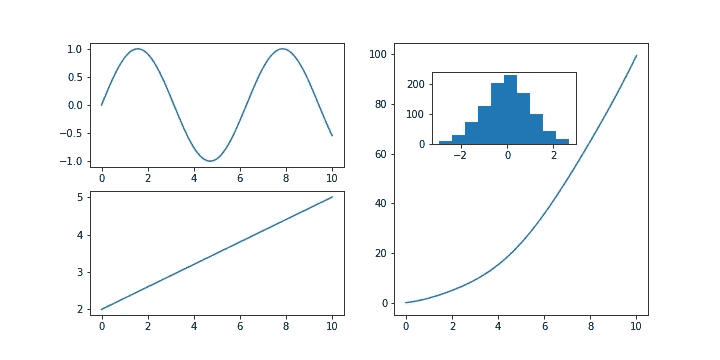

Overview of subplot organization elements

下面是我们将如何处理支线剧情组织问题的示意图:

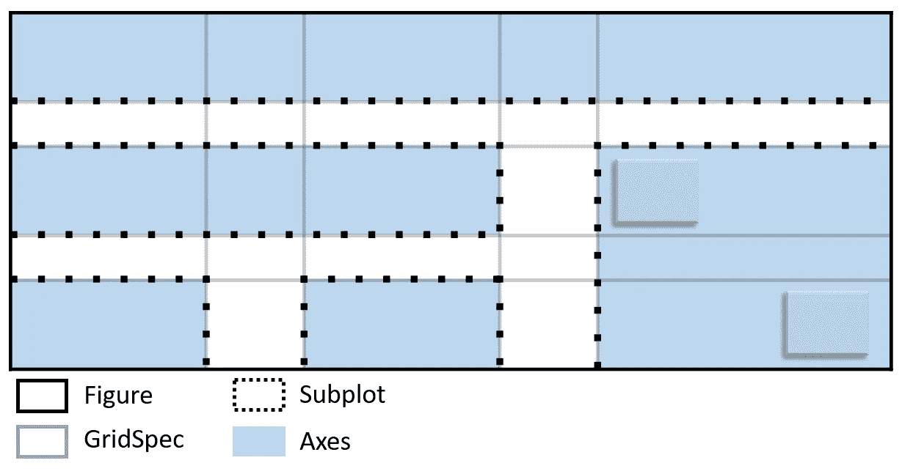

Schematic of subplot organization elements

如果这激起了你的兴趣，或者如果你回来回顾你以前读过的内容，欢迎来到关于使用 *matplotlib* 在 Python 中组织你的情节的综合初学者教程！

我们处理组织问题的方法是澄清图形、支线剧情和轴之间的区别，以及我们如何用 matplotlib 的 gridSpec 优化它。事不宜迟，让我们从第一个也是最基本的开始。

# 身材——你的框架

一个 *matplotlib* 图的最基本元素是**图形**。该图形对象应被视为您的**帧**。把任何可视化想象成潜在的图形拼贴，把图形想象成所有这些图形被粘贴和移动的地方。

就像一个相框一样，这个图形本身就是一个等待内容的空结构。这是我们初始原理图的第一个元素:

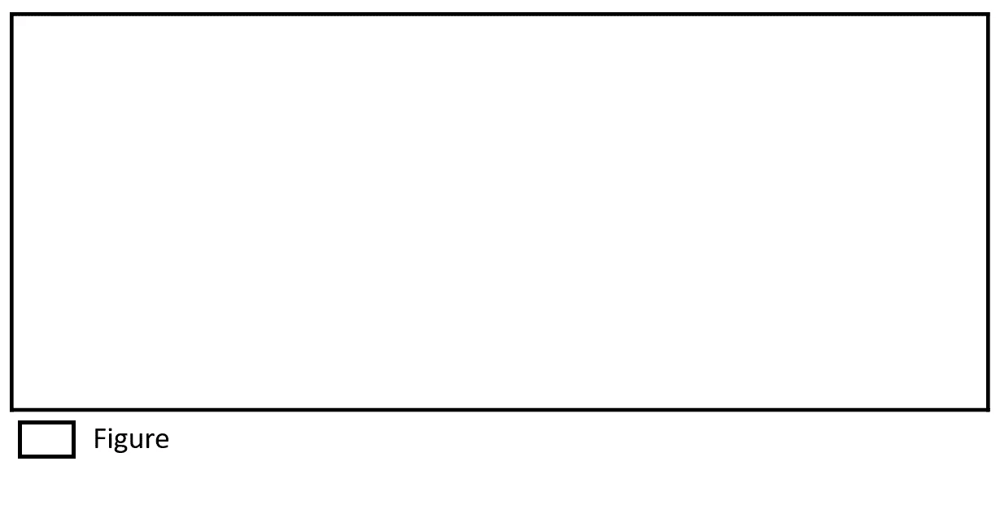

Schematic — Figure

在 *matplotlib* 中，我们在使用线`fig = plt.figure()`时创建图形对象。我们也可以省略放`fig =`。这很简单，所以我们将 figure 对象存储在某个变量中，以防我们以后需要使用它。例如，如果您想用`fig.save()`将图形保存为图像。如果您要保存新创建的图形，您将看到新创建的漂亮的空白图像。

如果你想要的只是绘制一个图形，那么你就不需要考虑坐标轴或者支线剧情。你可以简单地这样做:

```
# Synthetic Data
time = np.linspace(0, 10, 1000)
height = np.sin(time)# Plotting on a figure
fig = plt.figure()
plt.plot(time, height)
fig.savefig(‘figures/basicFigure.png’)
plt.show()
```

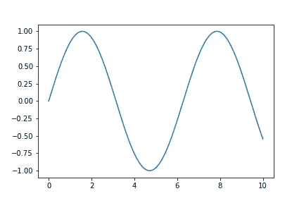

我们可以解构前面的代码块:

*   `plt.figure()`创建一个图形对象
*   `plt.plot(time, height)`会取可用空间，画出时间(x 轴)和高度(y 轴)的关系
*   `plt.show()`会简单渲染剧情。这在笔记本中是不必要的，但是如果你在一个文本编辑器或者一个交互较少的编辑器上编码，这是一个很好的实践。

如果你有更多的数据，你可以在这个简单的图中添加更多的线条。但是如果我们想在不同的图上画第二个变量呢？这就是轴和支线剧情变得有用的地方。

# 轴-绘图画布

当图形对象是您的绘图框架时，您将在其上绘图的**画布**是**轴**对象。轴本身是自由浮动的，这意味着它们可以放在图形的任何位置。我们可以将它们添加到原始原理图中:

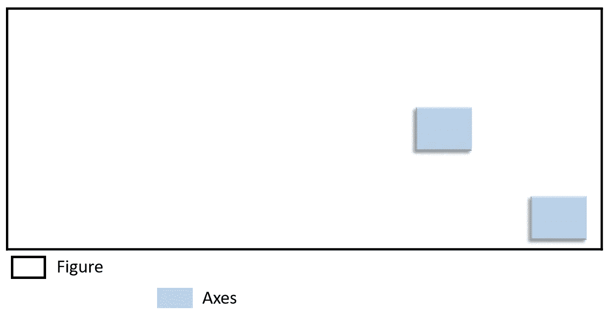

Schematic — Axes

在代码中，这很简单，如下所示:

```
# Original plot
fig = plt.figure()
plt.plot(time, height)# Adding new empty axes
fig.add_axes([0.43, 0.6, 0.15, 0.15])  #[lowerCorner_x, lowerCorner_y, width, height]
fig.add_axes([0.2, 0.4, 0.1, 0.1])     #[lowerCorner_x, lowerCorner_y, width, height]fig.savefig('figures/figureAxes')
plt.show()
```

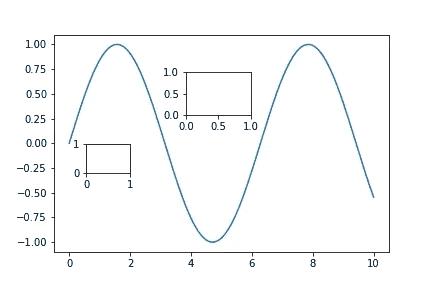

这里我们看到`add_axes([left, bottom, width, height])`函数在原始绘图上添加了两个新的绘图区域。新轴的具体位置和大小在相应的函数输入数组中指定。

然而，添加空轴并没有多大作用，所以让我们看看如何使用它们来绘图:

```
# Original plot
fig = plt.figure()
plt.plot(time, height)# First new axes
ax1 = fig.add_axes([0.43, 0.6, 0.15, 0.15])
ax1.hist(height)# Second new axes
ax2 = fig.add_axes([0.2, 0.3, 0.1, 0.1])
ax2.plot(time, time**2)fig.savefig('figures/figureAxes2.png')
plt.show()
```

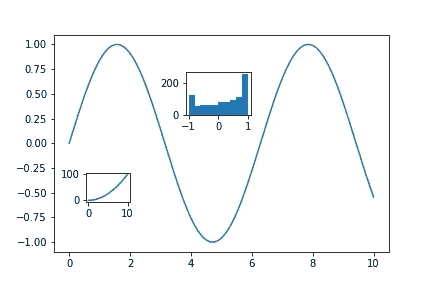

在这个例子中，我们看到`add_axes()`实际上给出或者**返回**我们可以在其上绘图的实际轴对象，我们将它存储在变量 ax1 和 ax2 中。然后，我们可以使用这些变量来绘制不同的有意义的数据，以类似于我们之前所做的方式为我们的图增加价值。

在这种情况下，我们添加了高度值的直方图，并绘制了时间的平方(除了显示如何在轴上绘制之外，这不是非常有意义的信息)。

# 子图—组织多个轴

当一个人第一次学习用 matplotlib 绘图时，支线剧情和轴线之间的区别不是特别明显。这是因为，通常情况下，支线剧情会在引入轴线之前引入。正如你现在将看到的，那个微小的细节可以改变你对一个人如何组织他们的视觉化的整体感知。

简而言之，**支线剧情**只是一种将你自由浮动的坐标轴组织成一个刚性网格的方式。你可以想象*支线剧情*创建了一个表格，表格的每一个单独的单元格都是一个新的坐标轴供你填充数据。就像这个对原始示意图的新诠释一样:

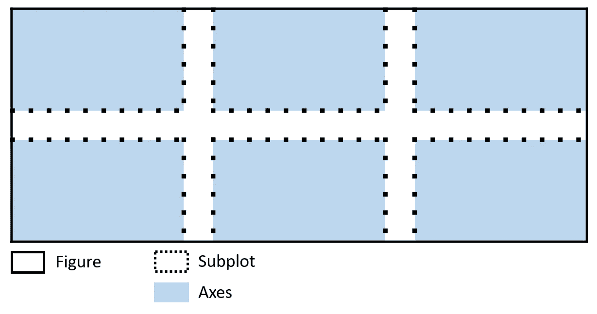

Schematic — Subplots

这就是如何使用**支线剧情**:

```
# Synthetic Data
time = np.linspace(0, 10, 1000)
height = np.sin(time)
weight = np.cos(time)# Plotting all the subplots
fig, axes = plt.subplots(2, 3)axes[0, 0].plot(time, height)
axes[0, 1].plot(time, time**2)
axes[0, 2].hist(height)axes[1, 0].plot(time, weight, color='green')
axes[1, 1].plot(time, 1/(time+1), color='green')
axes[1, 2].hist(weight, color='green')plt.tight_layout()
fig.savefig('figures/figureAxesSubplots.png')
plt.show()
```

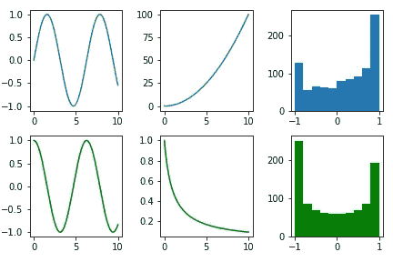

同样，让我们一次看一行:

*   `plt.subplots()`，创建了一个网格(2 行 3 列)。该函数返回图形对象(存储在`fig`中)，该对象将保存所有支线剧情，以及所有单独的轴(存储在`axes`)。
*   这些轴包含在一个 2D 数字阵列中(如果你喜欢的话，可以是一个矩阵或表格)，可以根据它们的位置单独访问。比如带`axes[0, 0]`的左上轴。如果我们有大量的绘图要做，这里我们可以遍历这些位置来分别绘制它们。
*   `plt.tight_layout()`通常在使用`plt.subplots()`时使用，以确保轴刻度和标签不会跨支线剧情重叠。请随意删除它，看看这意味着什么。

我强烈推荐查看[官方文档](https://matplotlib.org/3.1.1/api/_as_gen/matplotlib.pyplot.subplots.html)以进一步定制子情节网格，例如行/列之间的间距或者轴是否共享。

因此，我们知道如何在特定的、自由浮动的位置和结构良好的网格下绘制多个图形。那么在组织方面还有什么要做的呢？那么，如果我们想通过把一个情节放大一倍来强调另一个情节呢？如果我们想创建某种类型的平铺式图库呢？这就是 GridSpec 有用的地方。

# GridSpec——一个灵活的组织

GridSpec 的工作方式是，和支线剧情一样，定义一个网格。但是，可以选择每个单独的绘图区域将占用多少个单元，而不是自动将轴与网格的每个单元相关联。因此，如果我们希望一个图占据另一个图的两倍面积，我们可以将它与网格中两倍数量的单元相关联。

让我们看看代码:

```
# A new set of data
time = np.linspace(0, 10, 1000)
height = np.sin(time)
weight = time*0.3 + 2
distribution = np.random.normal(0, 1, len(time))# Setting up the plot surface
fig = plt.figure(figsize=(10, 5))
gs = GridSpec(nrows=2, ncols=2)# First axes
ax0 = fig.add_subplot(gs[0, 0])
ax0.plot(time, height)# Second axes
ax1 = fig.add_subplot(gs[1, 0])
ax1.plot(time, weight)# Third axes
ax2 = fig.add_subplot(gs[:, 1])
ax2.hist(distribution)fig.savefig('figures/gridspec.png')
plt.show()
```

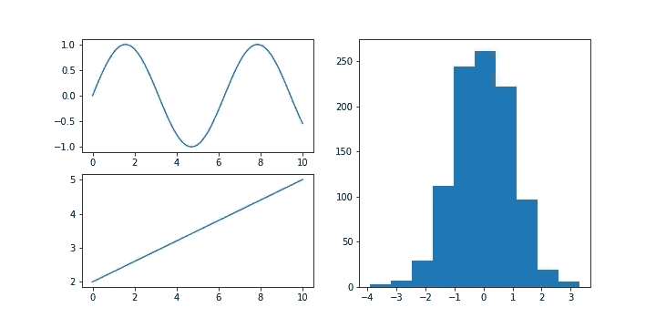

*   我们首先用`gs = gridspec.GridSpec(nrows=2, ncols=2)`创建(2 乘 2)的网格。
*   在这种情况下，`fig.add_subplot(gs[0, 0])`将通过索引`[0, 0]`访问这些单元格来获取它们的子集。
*   这个子集可以包含 gridSpec 网格的多个单元格，只需像使用`ax2 = fig.add_subplot(gs[:, 1])` 那样访问多个单元格，它选择所有行和第二列。

我们可以通过设置每行或每列的大小来进一步定制我们的绘图。这意味着一些行可能比其他行更窄或更宽。例如:

```
# Setting up the plot surface
fig = plt.figure(figsize=(10, 5))
gs = gridspec.GridSpec(nrows=2, ncols=2, width_ratios=[3, 1], height_ratios=[3, 1])# First axes
ax0 = fig.add_subplot(gs[0, 0])
ax0.plot(time, height)# Second axes
ax1 = fig.add_subplot(gs[1, 0])
ax1.plot(time, weight)# Third axes
ax2 = fig.add_subplot(gs[:, 1])
ax2.hist(distribution)plt.show()
```

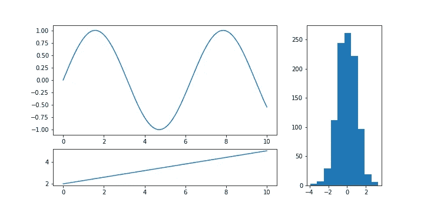

有了这个，我们终于可以得到我们最初的原理图:


Schematic of subplot organization elements

从我们到这里所学到的一切，我们可以完全解构这个示意图:我们在这里看到的是，我们在(5，5)的网格上应用了 gridspec，但是一些行比其他的小。然后我们添加了覆盖整个第一行的支线剧情，一个覆盖第三行一半的支线剧情，两个覆盖最后一行的支线剧情和一个覆盖最后一列和最后三行的支线剧情。在最后一个支线剧情的顶部，我们添加了两个自由浮动的轴。

和以前一样，我强烈建议查看官方文档来进一步定制 gridSpec，比如行/列之间的间距或者如何创建嵌套的 grid spec。

至此，希望你现在知道如何使用**人物**、**轴**、**支线剧情**和 **GridSpec** 来构建你的剧情。如果您有任何问题或意见，请在下面留下您的评论。