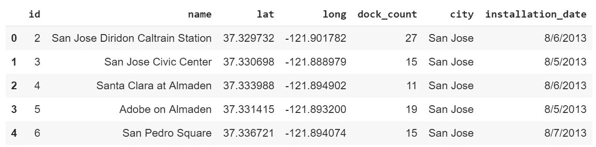
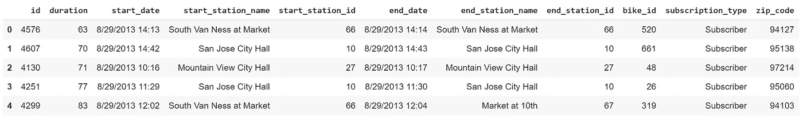

# Plotly 实验—柱形图和线图

> 原文：<https://towardsdatascience.com/plotly-experiments-bar-column-plots-71dd32eed7ef?source=collection_archive---------8----------------------->

Photo by [Ren Ran](https://unsplash.com/photos/vulGK2GkhAs?utm_source=unsplash&utm_medium=referral&utm_content=creditCopyText) on [Unsplash](https://unsplash.com/search/photos/columns?utm_source=unsplash&utm_medium=referral&utm_content=creditCopyText)

# 条形图

在我的[上一篇文章](/plotly-experiments-scatterplots-e08f16fb1a17)中，我已经解释了如何使用 Plotly 从 King County 住房数据集中创建散点图。另一种流行的绘图类型是柱形图或条形图。与散点图不同，散点图用于比较两个数值变量并检查它们之间的关系，条形图/柱形图用于调查不同类别的一个或多个数值变量。有不同类型的条形图—单独的、聚集的、堆积的等等。

## 数据集

在这篇文章中，我将使用来自 Kaggle 的[湾区自行车共享数据集](https://www.kaggle.com/benhamner/sf-bay-area-bike-share)。[湾区自行车共享区](http://www.bayareabikeshare.com/)让人们可以在旧金山湾区快速、轻松、经济地骑自行车旅行。他们使[定期开放数据发布](http://www.bayareabikeshare.com/open-data)(这个数据集是来自这个链接的数据的[转换版本](https://github.com/benhamner/bay-area-bike-share))，加上维护一个实时 API。数据集包含各种文件，这些文件包含湾区不同站点的信息、每天的行程以及天气信息。在这个数据探索练习中，我将使用车站和行程数据集。

## 站

让我们看一下台站数据集:

该数据集包含湾区每个站的名称、位置和容量。哪些城市拥有最多的车站和容量(码头)？

这也可以通过“瀑布”图来描述。让我们看看如何。

让我们看一个“聚集”柱形图，每个城市的车站和码头的数量都聚集在一起。

# 旅行

现在让我们检查 trips 数据集。这包含了我们在上面看到的各个站点的自行车往返信息。

开始和结束日期列包含对我们的分析有用的日期和时间信息。让我们从这些专栏中提取更多信息。

让我们问一些问题，通过我们的视觉化来回答。

*   旅行持续时间的分布是怎样的？
*   自行车租赁者中最受欢迎的月份/日期/时间是什么？
*   哪些自行车站最受欢迎？
*   订阅类型如何影响这些参数？

我们将看到回答上述每个问题的图表，以及因订阅类型不同而导致的变化。

# 持续时间分布

让我们通过直方图来研究行程长度的分布。

现在，让我们按照订阅类型来划分直方图，看看客户和订阅者之间的旅行持续时间是否不同。订阅者是经常使用自行车共享的用户，并且是湾区自行车共享的会员。另一方面，顾客没有会员资格，按需使用自行车。

很明显，顾客倾向于比用户使用自行车的时间更长！

# 自行车旅行的流行时间

人们通常什么时候骑自行车旅行？一天中的哪几个小时，一周中的哪几天，一年中的哪几个月最受骑车人欢迎？客户和订户之间有什么不同？让我们一起探索。

## 一年中受欢迎的月份

让我们从绘制每月的旅行次数开始。

订阅类型是否因月份而异？让我们看看。

总的来说，对出行次数的逐月分析表明，冬季的乘客量较低，从春季到夏季和秋季，乘客量逐渐增加。客户与用户的比例似乎不会因月份而有太大变化。现在让我们看看星期几是如何影响乘客量的。

## 一周中受欢迎的日子

一周中的哪几天骑自行车的次数多？趋势是否因工作日和周末而异？让我们一起探索。由于数据集更大，我将只关注 2013 年最后三个月的分析。

显然，周末的使用率比工作日低。这些天订阅类型有什么不同？

看起来用户的使用率在工作日较高，在周末较低。我认为，如果我们用堆积柱形图绘制百分比数字，会比绘制绝对值数字更好。我们可以这样做:

我们可以从对一周中不同日子的出行次数的分析中得出以下结论:

*   订户大多倾向于在工作日使用自行车。这表明他们可能使用它上下班(我们可以在以后按小时进行分析时确认这一点)
*   客户大多倾向于在周末和节假日使用自行车(在上图中，您可以看到客户在圣诞节的使用率高于用户，即使是在工作日)

## 一天中受欢迎的时间

现在让我们看看在一天中的哪些时段自行车使用率很高。由于这是大量的数据点，我将只检查一周的数据，比如 2013 年 12 月的第一周。

工作日期间，尤其是早上和晚上(上午 8 点和下午 5 点)，出行次数往往会更多。我们已经看到用户大多在工作日使用自行车。这证实了我们的假设，即用户主要在日常上下班时使用它。

这篇文章中用来生成情节的所有代码都可以在 [GitHub](https://github.com/meetnaren/DataViz/blob/master/plotly_experiments_bar_column_plots.ipynb) 上获得。

# 线形图

线形图通常有助于研究数值变量随时间变化的趋势。没有折线图，任何时间序列分析都是不完整的。折线图有各种各样的风格——有或没有标记、面积图、步进折线图、线性和平滑线等。让我们在这本笔记本中探索这些。

在 Plotly 中，折线图只是散点图的一种变体，只是用一条线将点连接起来。因此，我们将使用 scatter(或 scattergl)函数进行绘图。

让我们使用相同的数据集，并使用线图来研究它。首先，让我们按日期画出旅行的次数。

不可否认，这个图表看起来太拥挤了，因为我们试图在一个图表中塞进一个很宽的时间段。令人欣慰的是，Plotly 提供了一个非常方便的工具，叫做 rangeslider，它将使用户能够非常容易地选择一个特定的时间框架。让我们看看怎么做。

你可以在 x 轴下方看到的“较小的”图形称为范围滑块。您可以单击并拖动滑块来放大特定的时间范围。

人们可以看到，冬天的乘客量往往很低，尤其是在接近年底的时候。让我们画一些移动平均线来平滑曲线，看看模式。

移动平均曲线清楚地显示了在冬季的几个月里乘客量是如何下降的。

## 标记+线条

现在让我们放大到一个特定的时间窗口，并做一些分析。我将关注 Q2 青奥会。

我们可以看到数据有一个每周循环的模式。在时间序列分析中，这被称为“季节性”。让我们根据星期几给标记涂上颜色。

这张图表清楚地表明周末乘客量下降了。然而，为什么 2014 年 5 月 26 日的客流量很低呢？这里的答案是[这里的](https://www.timeanddate.com/holidays/us/memorial-day)。

另一种突出周末的方法是用 Plotly 通过形状画出盒子。让我们看看怎么做。

## 面积图

面积图与折线图的不同之处在于，线下的区域会变得有阴影，这让查看者感觉到所绘制的数字的大小。例如，通过折线图绘制股价可能更合适，但通过面积图绘制市值可能更合适。面积图在堆叠模型中使用时也很有用，它在阴影区域中显示两个数值之间的差异。

首先让我们看一下乘客数量的面积图。

让我们查看客户和订户之间的差异，并在面积图上画出差异。

我们也可以将这些类别堆叠在一起，这样我们就可以比较这些数字。

## 阶梯式折线图

阶梯折线图通过垂直线和水平线连接各点，而不是用直线连接两点。这让用户看到哪里有急剧的增加和减少，哪里的数字保持稳定。

我希望这篇文章能帮助你学会如何用 Plotly 绘制不同类型的柱形图、条形图和折线图。