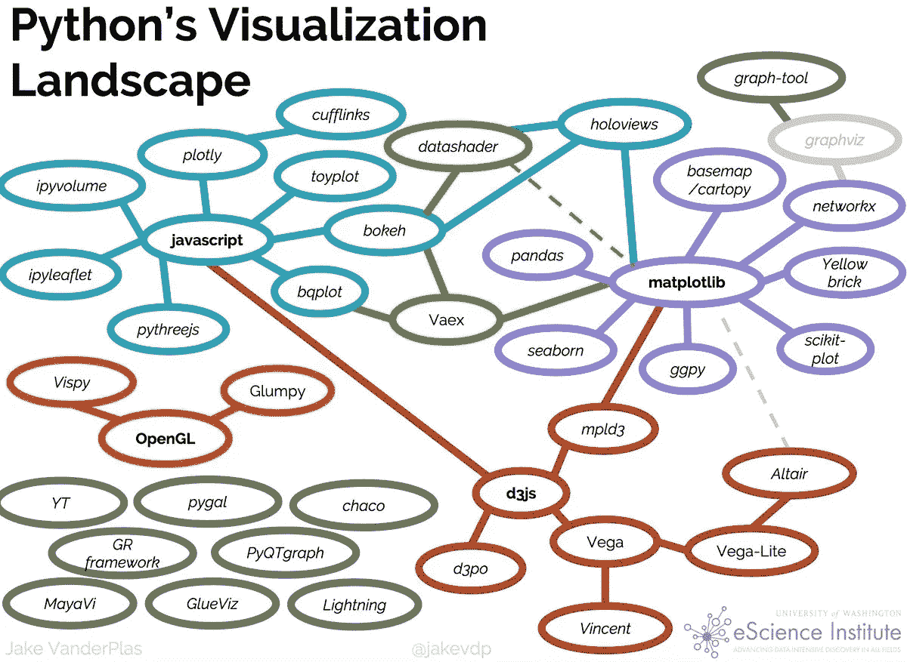
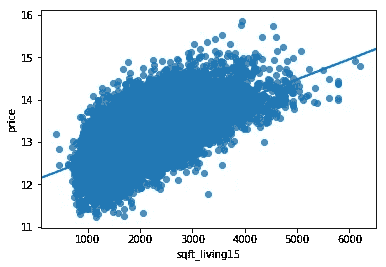

# 绘图实验——散点图

> 原文：<https://towardsdatascience.com/plotly-experiments-scatterplots-e08f16fb1a17?source=collection_archive---------4----------------------->

让我以一个有点不受欢迎的观点开始这篇文章:Python 中的数据可视化绝对是一团糟。不像 R,[gg plot](https://ggplot2.tidyverse.org/)在绘图方面几乎是独占鳌头，Python 有太多的选项可供选择。这张图片很好地概括了这一点:

Courtesy: Jake VanderPlas (@jakevdp on Twitter)

毫无疑问，matplotlib 是最受欢迎的，因为它提供了一系列可用的绘图和面向对象的绘图方法。有些软件包是基于 matplotlib 构建的，以使绘图更容易，例如 Seaborn。然而 matplotlib 的主要缺点是陡峭的学习曲线和缺乏交互性。

还有另一种基于 JavaScript 的绘图包，比如 Bokeh 和 Plotly。我最近一直在玩 Plotly 包，它肯定是我最喜欢的 Python 数据可视化包之一。事实上，它是下载量第二大的可视化软件包，仅次于 matplotlib:

Plotly 有各种各样的图，并为用户提供了对各种参数的高度控制，以自定义图。随着我对这个包了解得越来越多，我想在这里介绍一下我的一些实验，作为我练习的一种方式，也作为任何想学习的人的一个教程。

# 关于 Plotly 的注释

Plotly 图表有两个主要部分:数据和布局。

数据—这代表我们试图绘制的数据。这将通知 Plotly 的绘图功能需要绘制的绘图类型。它基本上是一个应该是图表的一部分的图的列表。图表中的每个图都被称为“轨迹”。

布局—这表示图表中除数据以外的所有内容。这意味着背景、网格、轴、标题、字体等。我们甚至可以在图表顶部添加形状和注释，以便向用户突出显示某些点。

然后，数据和布局被传递给“图形”对象，该对象又被传递给 Plotly 中的绘图函数。

How objects are structured for a Plotly graph

# 散点图

在 Plotly 中，散点图函数用于散点图、折线图和气泡图。我们将在这里探索散点图。散点图是检查两个变量之间关系的好方法，通常两个变量都是连续的。它可以告诉我们这两个变量之间是否有明显的相关性。

在这个实验中，我将使用 Kaggle 上的[金县房屋销售数据集](https://www.kaggle.com/harlfoxem/housesalesprediction)。直观来看，房价确实取决于房子有多大，有几个卫生间，房子有多旧等等。让我们通过一系列散点图来研究这些关系。

数据集包含分类属性和连续属性的良好组合。房子的价格是目标变量，我们可以在这篇文章中看到这些属性如何影响价格。

Plotly 有一个散点函数，还有一个 scattergl 函数，当涉及大量数据点时，它可以提供更好的性能。在这篇文章中，我将使用 scattergl 函数。

客厅面积和价格有关系吗？

这看起来像一个很好的图表，显示了客厅面积和价格之间的关系。我认为，如果我们用对数(价格)来代替，这种关系会得到更好的证明。

通常，显示线性关系的散点图伴随着“最佳拟合线”。如果您熟悉 Seaborn visualization 软件包，您可能会意识到它提供了一种绘制最佳拟合线的简单方法，如下所示:

我们如何在 Plotly 中做到这一点？通过向数据组件添加另一个“跟踪”,如下所示:

现在让我们看看散点图的变化。如何通过颜色显示散点图中的类别？例如，数据是否因房屋中楼层、卧室和浴室的数量而不同？我们可以通过将颜色参数传递给 Scatter 函数中的标记来检查这一点，如下所示:

请注意，这给出了一个“色阶”,而不是用不同颜色表示不同“等级”的图例。当有多条迹线时，Plotly 会指定单独的颜色。我们可以这样做:

我们可以清楚的看到，除了客厅面积，房子的档次(景郡分配)也影响着房子的价格。但是，如果我们想同时看到这个图表中等级、条件和其他变量的影响呢？答案:[支线剧情](https://plot.ly/python/subplots/)。

让我们画一个上图的堆积子图，但是以卧室数量、浴室数量、条件、等级和滨水区作为参数。

在 Plotly 中，我们通过将轨迹添加到图形中并指定它们在图中的位置来制作支线剧情。让我们看看怎么做。

“plotly.tools”下提供了支线剧情功能。

Click on the picture to see the interactive plot

等级看起来像是一个非常明显的区别因素，与客厅面积一起决定价格。其他变量似乎有一些影响，但我们可能需要进行回归分析来检验这一点。

我希望这能让你对如何在 Plotly 中使用散点图有所了解。我将在随后的文章中练习柱形图/条形图。

这篇文章使用的代码可以在 [GitHub](https://github.com/meetnaren/DataViz/blob/master/plotly_experiments_scatterplots.ipynb) 上找到。