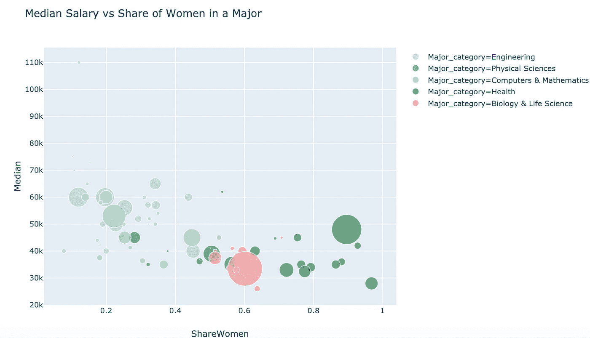
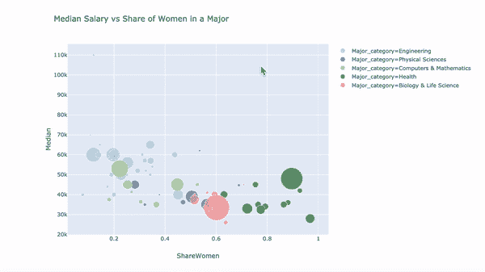
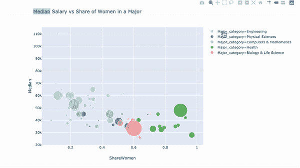
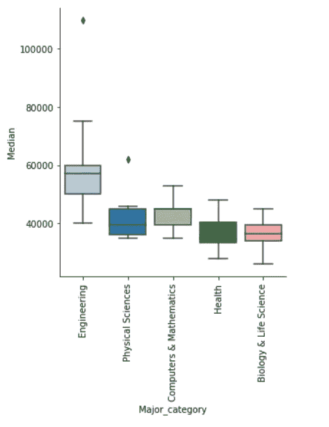
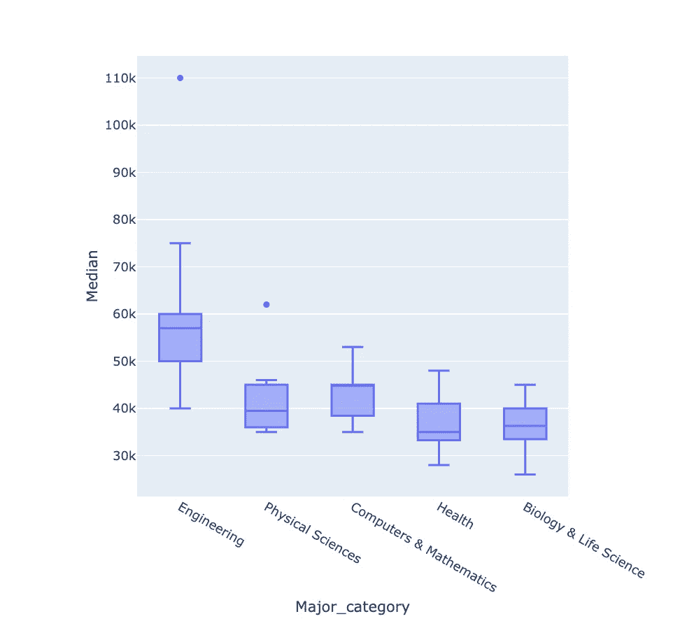
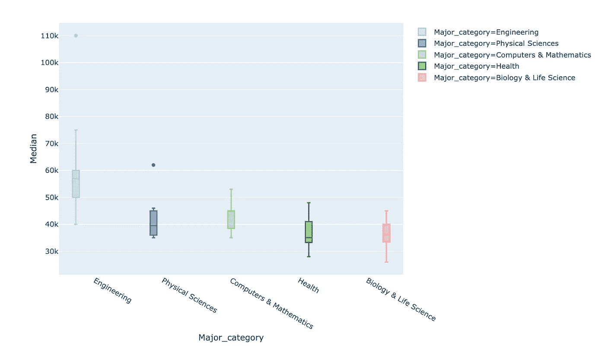
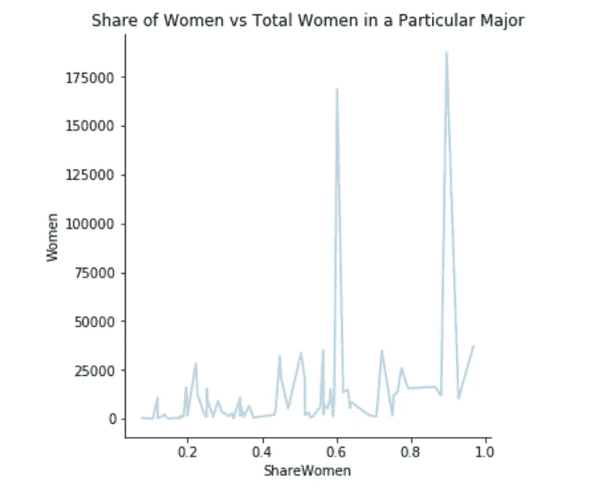
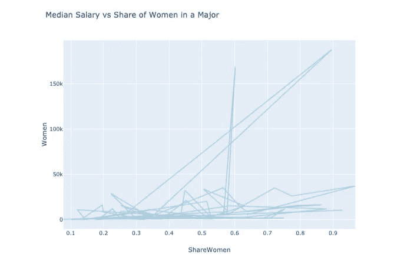
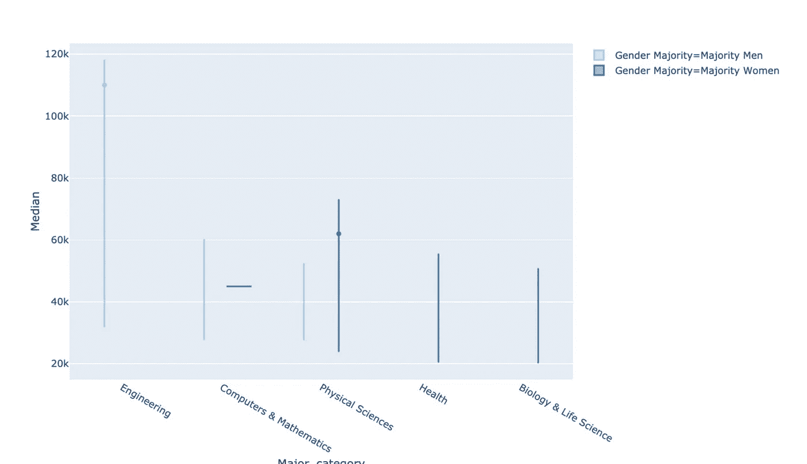

# 好的、坏的和丑陋的

> 原文：<https://towardsdatascience.com/plotly-express-the-good-the-bad-and-the-ugly-dc941649687c?source=collection_archive---------5----------------------->

## 它可能更新，但它更好吗？

从数据科学过程的开始到结束，创建有效的数据可视化是数据科学的一个非常重要的部分。在探索性数据分析过程中使用可视化是了解数据内容的好方法。在项目结束时创建可视化效果是以一种易于理解的方式传达您的发现的好方法。Python 中有很多不同的数据可视化工具，从像 [Matplotlib](/a-beginners-guide-to-data-visualization-using-matplotlib-22b15a0b090) 和 [Seaborn](https://medium.com/swlh/visual-storytelling-with-seaborn-28dc548dbc4b) 这样的狂热爱好者，到新发布的 Plotly Express。这三个工具都很容易使用，并且不需要很多深入的编程知识，但是如何决定使用哪一个呢？

## 什么是 Plotly Express？

如果您曾经使用过 Plotly，或者只是查看过使用 Plotly 编写的代码，您就会知道它绝对不是用于可视化的最简单的库。这就是 Plotly Express 的用武之地。Plotly Express 是 Plotly 的一个高级包装器，本质上意味着它可以用更简单的语法做很多你可以用 Plotly 做的事情。它非常容易使用，并且不需要连接你的文件到 Plotly 或者指定你想要离线使用 Plotly。安装 Plotly Express 后，只需一个简单的`import plotly_express as px`就可以开始用 Python 创建简单的交互式可视化。

## 好人

使用 Plotly Express 创建可视化效果有几个优点。

*   整个可视化可以用一行代码创建(某种程度上)。

```
px.scatter(df, x='ShareWomen', y = 'Median',
           color = 'Major_category',
           size = 'Total', size_max = 40,
           title = 'Median Salary vs Share of Women in a Major', 
           color_discrete_sequence = px.colors.colorbrewer.Paired, 
           hover_name = 'Major'
```



虽然从技术上来说*用了 6 行代码来创建它，但它仍然只用了一个命令。在创建 Plotly Express 可视化时，所有事情都可以在同一命令中完成，从调整图形的大小，到它使用的颜色，再到轴标签。在我看来，Plotly Express 是快速创建和修改可视化的最简单的方法。此外，可视化是自动交互的，这就引出了我的下一个观点。*

*   它是互动的。



将鼠标悬停在特定点上会弹出一个框，其中包含用于创建图表的任何信息，以及您想要包含的任何额外信息。在这个特殊的图表中，包括`hover_name = 'Major'`在内的特定专业指的是每个框的标题。这使得我们能够从图形中获取大量信息，而这些信息是我们无法通过其他方式获得的。此外，我们还可以看到两个最大的专业是什么，这是我们在使用 Seaborn 创建类似的情节时无法做到的。

*   你可以分离出某些信息。



单击可视化图例中的某个类别两次将会隔离该类别，因此它是我们在图形中可以看到的唯一类别。单击一次将会删除该类别，因此我们可以看到除该类别之外的所有类别。如果你想放大某个区域，你所要做的就是点击并拖动来创建一个矩形，它包含了你想要更仔细检查的较小区域。

*   你可以激发变化。

Plotly Express 提供的最酷的功能之一是添加动画帧的能力。通过这样做，你允许自己观察某个变量的变化。大多数情况下，动画帧是基于年份的，因此您可以直观地看到事物如何随着时间的推移而变化。这不仅看起来很酷，因为你正在为自己创建可视化效果，而且能够创建一个动画和交互式的可视化效果会让你看起来很清楚自己在做什么。

## 坏事

*   它没有*吨*的特点。

不要误会我的意思，你可以用 Plotly express 做很多事情。只是在调整图形外观时，它没有太多的选项。例如，在 Seaborn 中，您可以通过改变`jitter = False`和`kind = 'swarm'`来改变分类散点图上的点排列的原因。据我所知，使用 Plotly Express 这两种方法都是不可能的。这真的不是世界末日，特别是考虑到 Plotly Express 的主要目标之一是允许用户在执行探索性数据分析时快速轻松地创建交互式可视化。我猜想，出于这个目的使用它的大多数人并不太关心他们的点在散点图上是如何排列的。

*   每次创建新图形时，都需要设置颜色。

```
# Seaborn
sns.catplot(x = 'Major_category', y = 'Median', kind = 'box', data = df)
plt.xticks(rotation = 90)
plt.show()# Plotly Express
px.box(df, x = "Major_category", y = 'Median', hover_name = 'Major')
```

您可能希望这两种方法能够创建非常相似的可视化效果，事实也确实如此(在很大程度上)。



Boxplots created with Seaborn (left) and Plotly Express (right)

在使用 Seaborn 运行代码之前，配色方案被设置为“Paired ”,这贯穿于笔记本的其余部分，除非后来有所改变。在 Plotly Express 中，图形使用的配色方案需要包含在每个单独的绘图中。此外，Seaborn 会自动为不同的类别分配不同的颜色，而 Plotly Express 不会。这可能是也可能不是一件好事，取决于你的数据。一个好的经验法则是，如果没有理由在你的图中给类别不同的颜色，就不要这样做。在创建可视化效果的过程中，您可能希望每个类别都有自己的颜色，但也可能不希望这样。如果这是您想要的，只需将`color = 'Major_category'`添加到您的`px.box()`通话中。这可能有点不方便，但也没什么大不了的。

但是，当将不同的颜色指定给不同的类别时，Plotly Express 中会出现一些问题。

```
px.box(df, x = "Major_category", y = 'Median', 
       color = 'Major_category',
       color_discrete_sequence = px.colors.colorbrewer.Paired, 
       hover_name = 'Major')
```



当类别被指定一种颜色时，Plotly Express 会创建明显更小的箱线图。因为这个图是交互式的，你可以将鼠标放在这些点上来查看对应的数字，这并不是一个大问题。然而，一件小事就能让图形的实际格式发生如此大的变化，这仍然很烦人。我找不到关于这个问题的任何信息，我也不相信有一个好的解决办法，这就引出了我的下一个观点。

*   Plotly Express 仍然相对较新，所以没有太多的在线帮助。

Plotly Express 是今年 3 月发布的，所以截至目前，它只有 3 个月的历史。因此，在网上还没有很多关于它的问答。另一个问题是，任何时候你在谷歌上搜索“如何在 plotly express 中做 *x* ，所有出现的信息都与 plotly 有关。我想随着时间的推移，这将不再是一个问题。我也想象这些关于创造情节的问题只是程序中的一些错误，希望随着时间的推移会得到解决。

## 丑陋的

Plotly Express 仍然是相当新的，是为了探索性的数据分析，所以它的一些问题是彻头彻尾的丑陋。

*   这个线形图

```
#Seabornsns.relplot(x= 'ShareWomen', y = 'Women', kind = 'line', data = df)
plt.title('Share of Women vs Total Women in a Particular Major')
plt.show()#Plotly Express
px.line(df, x ='ShareWomen', y = 'Women', 
        title = 'Median Salary vs Share of Women in a Major', 
           color_discrete_sequence = px.colors.colorbrewer.Paired, 
           hover_name = 'Major')
```



Line Graphs created with Seaborn (left) & Plotly Express (right)

默认情况下，Seaborn 按照 x 和 y 值的顺序对点进行排序，以避免图表看起来像右边的图表。Plotly Express 只是按数据帧中出现的顺序绘制点。Plotly Express `line()`函数中没有`sort` 参数，所以最好的办法是根据感兴趣的变量对数据进行排序，然后相应地绘制数据。这不是最复杂的修复，但绝对不方便。

*   这个小提琴的情节

```
px.violin(df, x = "Major_category", y = 'Median', 
       color = 'Gender Majority',
       color_discrete_sequence =px.colors.colorbrewer.Paired,
       hover_name = 'Major')
```



我们再一次遇到了这样一个问题，分配不同的类别用不同的颜色来表示，这使得它们在可视化上看起来比类别被分类之前要小得多。如果你没有构建这个图，你甚至不会知道你在看一个小提琴图，而且绝对没有办法通过这个图得到这些东西的密度。当然，您仍然可以将鼠标悬停在图形上以获得相关的数值，但是创建可视化的主要原因之一是为了直观地感受您的数据，而这种可视化并不能做到这一点。

*   没有一种好的方法可以将视觉效果融入到演示文稿中。

同样，因为 Plotly Express 主要用于探索性数据分析，所以这不是 Plotly Express 提供的功能也就不足为奇了。我对普通版本的 Plotly 不太熟悉，但我相信你需要通过他们的网站创建演示文稿，以便在你的演示文稿中包含交互式可视化。这可能是 PowerPoint/Google 幻灯片没有嵌入交互式可视化功能的结果，而不是 Plotly 没有制作可视化功能，因此它们可以嵌入到演示文稿中。

## 结论

plotly Express*真的很酷*。我 100%推荐使用它进行探索性数据分析。图形的交互性让你可以轻松地对你的数据*进行更彻底的调查。*将鼠标悬停在某个点上并获取与其相关的所有信息，这比你只需查看图表并猜测这些点是什么更能让你得出更好的结论。然而，它可能无法像你希望的那样做你想让它做的所有事情。除了 Matplotlib 和 Seaborn 之外，我建议使用 Plotly Express 来创建最佳的可视化数组。

我强烈推荐查看这个[代码](https://www.plotly.express/)，以便查看 Plotly Express 提供的更多不同选项。