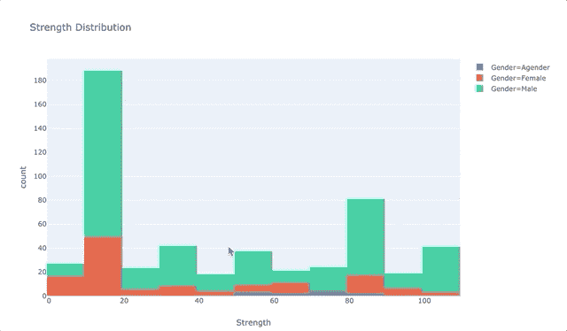

# 巧妙地表达自己

> 原文：<https://towardsdatascience.com/plotly-express-yourself-98366e35ad0f?source=collection_archive---------9----------------------->

## 使用 Python 中的 Plotly Express 快速浏览基本可视化。

我最近发现了 [Plotly Express](https://medium.com/@plotlygraphs/introducing-plotly-express-808df010143d) ，我非常兴奋地将它添加到我的工具箱中，因为它的潜力。

对于那些不熟悉 Plotly 的人(或者更困惑为什么会有一个 **express** 版本的 *need* )，让我们让你了解一下。

Plotly 是一个[可视化库](https://plot.ly/graphing-libraries/)，可以在许多平台上使用，包括 Java、Python 和 R(这是我个人过去使用 Plotly 的经验，尽管有限)以及 Plotly(组织)[的商业产品](https://plot.ly/feed/#/)。Plotly 很棒，因为你可以创建高度互动的可视化，而不是通过`matplotlib`或`seaborn` ( `matplotlib`更酷的兄弟)的静态可视化。例如:


[https://mangrobang.shinyapps.io/Project_Draft_AV/](https://mangrobang.shinyapps.io/Project_Draft_AV/)

但是不利的一面(至少对我来说)是，在 Plotly 中完成任何事情总让人感觉有很多代码行。例如，前面绘图的代码如下所示(为了简洁起见，没有包括一些数据设置):

```
p <- plot_ly(draft
                 , x = ~Rnd
                 , y = ~First4AV
                 , type = "scatter"
                 , mode = "markers", color = ~draft$Position.Standard
                 , colors = brewer.pal(8, "Spectral")
                 , marker = list(size = 10, opacity = .25 )
    ) %>%
      # Plot the average for each draft round
      layout(title = "Accumulated AV over First 4 Years of Player Careers by Draft Round, Yrs 1994-2012") %>%
      layout(xaxis = xx, yaxis = yy) %>%
      add_trace( data=avg.4.AV, x = ~Rnd, y = ~avg.F4.AV, type = "scatter"
              , name = "Avg 4-Yr AV", color=I("lightpink"), mode="lines" ) %>%
      # Plot the predicted value
      add_trace(x = input.rnd, y = mod.draft.pred(), type = "scatter"
              , mode = "markers"
              , marker = list(symbol='x',size=15, color='black')) %>%
      layout(annotations = jj) %>%
      layout(annotations = pr)p
```

注意上面是用 R 写的，不是 Python，因为我过去用 Plotly 的大部分经验都是用 R 写的。但是我在 Python 中看到和使用的似乎在语法复杂性上是相似的。

Plotly Express 所做的是围绕基本 Plotly 代码创建一个更高级别的包装器，因此语法更简单。对我来说，这意味着更容易学习，更容易建立编码肌肉记忆。减少从旧项目中复制和粘贴代码或堆栈溢出！

为了测试它，我认为这将是有用的，通过一些标准的勘探地块运行。当我们完成时，我们希望最终能为 Plotly Express 提供一个方便的备忘单！

## 准备！(和前言思想)

1.  对于我们的测试数据，我在 Kaggle 上找到了这个关于超级英雄的有趣数据集(嘿，我刚看了复仇者联盟 4：终局之战！):


Multiple Spider-Men and Captains America? Yes, the multiverse exists!

2.获取和清理数据的代码以及下面的片段可以在这个 [jupyter 笔记本这里](https://github.com/MangrobanGit/blog_px/blob/master/blog_2.ipynb)找到。

3.如果您尚未安装或导入它:

```
# Install
pip install plotly_express# Import
import plotly_express as px
```

4.我们假设您对下面显示的图有一些概念上的熟悉，所以我们不会深究每个图的优缺点。但是我们也会在可能的时候添加一些想法和参考。

5.以下情节的外观变化很大，因为我很好奇各种内置模板(即主题)的外观和感觉。所以，如果这很烦人，我很抱歉，但就像我提到的，我正在努力弯曲所有的肌肉。

## 绘制单变量数据

让我们来看几个经典的方法来对**连续**变量进行单变量探索:直方图和箱线图。

**直方图(单变量)**:

```
px.histogram(data_frame=heroes_clean
     , x="Strength"
     , title="Strength Distribution : Count of Heroes"
     , template='plotly'
     )
```


Not the prettiest histogram.

你可以在这里阅读更多关于直方图有多酷的信息。

**箱线图(单变量):**

…以及箱线图。简单中透着优雅。

```
px.box(data_frame=heroes
    , y="Speed"
    , title="Distribution of Heroes' Speed Ratings"
    , template='presentation'
    )
```


Boxplot.

更多信息可在箱线图[此处](https://medium.com/@hussein.sajid7/data-visualization-box-plot-989b69967834?sk=97e0c9969b829920eb6b3d6fdb6db411)、箱线图[此处](https://dev.to/annalara/deconstructing-the-box-and-whisker-plot-11f3)和箱线图[此处](https://medium.com/@larrychewy/the-box-and-the-bees-7d0b6ded65db)中找到。但是如果你觉得盒子情节有点方，也许小提琴情节也可以？

**小提琴剧情**

```
px.violin(data_frame=heroes
          , y="Speed"
          , box=True
          , title="Distribution of Heroes' Speed Ratings"
          , template='presentation'
         )
```


More of an upright bass plot.

[小提琴情节](https://en.wikipedia.org/wiki/Violin_plot)越来越受欢迎。我喜欢把它们看作 boxplot 更酷、更帅的兄弟姐妹。哎哟。

但是，如果您想要探究的变量或特征是**分类的**，而不是连续的，该怎么办呢？在这种情况下，您可能希望从一个条形图开始，以获得对数值计数的感觉。

**条形图(单变量)**

```
px.bar(data_frame=heroes_publisher
       , x='publisher'
       , y='counts'
       , template='plotly_white'
       , title='Count of Heroes by Publisher'
      )
```


Remember when NBC’s Heroes was cool?

这里有一个关于[条形图](https://medium.com/@Infogram/the-dos-and-donts-of-bar-charts-bd2df09e5cd1)的快速入门。

单变量分析很好，但实际上，我们通常希望将变量与其他变量进行比较，试图梳理出有趣的关系，这样我们就可以建立模型。因此，让我们继续在一些二元技术的例子上建立我们的`plotly-express`超能力。

## 绘制二元数据

让我们从比较**连续**变量**和连续**变量开始。

**散点图**

```
px.scatter(data_frame=heroes
           , x="Strength"
           , y="Intelligence"
           , trendline='ols'
           , title='Heroes Comparison: Strength vs Intelligence'
           , hover_name='Name'
           , template='plotly_dark'
          )
```


If a theoretical character has 0 Strength, they at least rate 57 in Intelligence. Hmm.

[散点图](https://medium.com/@mia.iseman/in-praise-of-scatterplots-and-bubble-charts-e1f39548ee84)是比较两个连续(数字)变量的可靠方法。这是快速评估两个变量之间是否存在关系的好方法。

在上面的例子中，我们通过添加一条[趋势线](https://en.wikipedia.org/wiki/Ordinary_least_squares)来进一步帮助自己确定关系。看来在`Strength`和`Intelligence`之间存在微弱的正相关。

**线条图**

```
px.line(data_frame=heroes_first_appear_year
        ,x='Year'
        ,y='Num_Heroes'
        ,template='ggplot2'
        ,title="Number of Heroes by Year of First Appearance"
        ,labels={"Num_Heroes":"Number of Heroes"}
       )
```


The early ’60s was a big turning point in comic superheroes.

连续与连续比较的一个特例是**时间序列**。经典的方法是用[线图](https://medium.com/@patrickbfuller/line-plot-7b4068a3a9fc)。几乎总是日期/时间变量沿着 x 轴，而另一个连续变量沿着 y 轴测量。现在你可以看到它是如何随着时间的推移而变化的！

如果我们想要**比较分类变量和连续变量**呢？事实证明，我们可以只使用单变量技术，但只是“重复”它们！我最喜欢的方法之一是使用堆叠直方图。我们可以为连续变量，分类变量的每个值做一个直方图，然后把它们叠加起来！

例如，让我们再看一下之前在`Strength`上的直方图，但是这次我们想看看由`Gender`分离出来的数据。

**堆积直方图**

```
px.histogram(data_frame=heroes[~heroes.Gender.isna()]
             , x="Strength"
             , color='Gender'
             , labels={'count':'Count of Heroes'}
             , title="Strength Distribution : Count of Heroes"
             , template='plotly'
            )
```



I’m guessing the big bar for 10–19 is non-superpowered characters, like Batman. Nerd.

可能堆栈让您感到困惑，您只想看到按媒体夹分组的条形:

**堆积直方图(分组仓)**

```
px.histogram(data_frame=heroes[~heroes.Gender.isna()]
             , x="Strength"
             , color='Gender'
             , barmode = 'group'
             , labels={'count':'Count of Heroes'}
             , title="Strength Distribution : Count of Heroes"
             , template='plotly'
            )
```


…或者，如果这两种外观中的任何一种在视觉上对您来说都太过繁忙，那么您可能只想为每个类别值绘制一个图。你会看到这有时被称为刻面(或者至少我是这样称呼它的)。

**多面直方图**

```
px.histogram(data_frame=heroes[~heroes.Gender.isna()]
             , x="Strength"
             , color='Gender'
             , facet_row='Gender'
             , labels={'count':'Count of Heroes'}
             , title="Strength Distribution"
             , template='plotly'
             )
```


哇，我被历史淘汰了。让我们看看如何将相同的分面/分割概念应用于盒状图。

**分割方框图**

```
px.box(data_frame=heroes[~heroes.Gender.isna()]
        , y="Speed"
        , color="Gender"
        , title="Distribution of Heroes' Speed Ratings"
        , template='presentation'
        )
```


无论盒子情节可以做什么，小提琴情节也可以！

**分裂小提琴剧情**

```
px.violin(heroes[~heroes.Gender.isna()]
        , y="Speed"
        , color="Gender"
        , box=True
        , title="Distribution of Heroes' Speed Ratings"
        , template='presentation'
       )
```


‘Agender’ characters have higher median (and likely mean) Speed.

那么，如果你只想比较**分类值和**分类值呢？如果是这种情况，你通常想看看相对计数。所以堆积条形图是个不错的选择:

**堆积条形图(分类对比分类)**

```
px.histogram(data_frame=heroes
             ,x="Publisher"
             ,y="Name"
             ,color="Alignment"
             ,histfunc="count"
             ,title="Distribution of Heroes, by Publisher | Good-Bad-Neutral"
             ,labels={'Name':'Characters'}
             ,template='plotly_white'
            )
```


Marvel and DC Comics are pretty top heavy with ‘Good’ characters.

题外话:事实证明，使用`.histogram`的堆叠条形图更容易，因为它提供了对`histfunc`的访问，这允许您对直方图应用函数。这省去了必须先进行汇总的步骤(您可能已经注意到，上面的条形图就是这样做的)。

## 绘制三个或更多变量

我们可能感觉到了一种模式。通过使用另一种视觉元素，比如颜色，我们可以将任何一元可视化转换成二元(或多元)可视化；或者通过沿着类别值分面/分割。

让我们探索添加一个第三变量**。一种常见的技术是使用**颜色**将**分类变量**添加到散点图中。**

**彩色散点图**

```
px.scatter(data_frame=heroes[~heroes.Gender.isna()]
           , x="Strength"
           , y="Intelligence"
           , color="Alignment"
           , trendline='ols'
           , title='Heroes Comparison: Strength vs Intelligence'
           , hover_name='Name'
           , opacity=0.5
           , template='plotly_dark'
           )
```


Similar relationships across Alignments.

也许*这些*数据对于添加的类别来说并不那么有趣，但是当你找到正确的模式时，类别真的会脱颖而出，例如经典的[虹膜数据集](https://archive.ics.uci.edu/ml/datasets/iris)…就像这样:


credit: [https://www.plotly.express/](https://www.plotly.express/)

但是回到我们最初的带颜色的散点图，如果我们想添加一个第三连续变量**会怎么样呢？如果我们把它绑在我们的马克笔的**尺寸**上怎么样？**

**散点图，带颜色和大小**

下面我们添加连续的`Power`变量作为标记的**大小**。

```
px.scatter(data_frame=heroes[~heroes.Gender.isna()]
           , x="Strength"
           , y="Intelligence"
           , color="Alignment"
           , size="Power"
           , trendline='ols'
           , title='Heroes Comparison: Strength vs Intelligence'
           , hover_name='Name'
           , opacity=0.5
           , template='plotly_dark'
          )
```


Wow, Galactus is tops in `Strength`, `Intelligence`, and `Power`!

我注意到的一件事是，图例不会自动为**尺寸**添加图例。这有点烦人。我能说什么呢，Plotly Express 已经在这篇文章中宠坏了我！

根据我在文档中所看到的，我们仅仅开始触及可能的表面。我们可以继续下去，但是让我们以更多的例子来结束我们的探索。

**散布矩阵**

散点图矩阵在一组连续变量上执行**成对散点图**，然后您可以用**颜色、符号等对其进行定制。代表分类变量**。

```
px.scatter_matrix(data_frame=heroes[~heroes['Gender'].isna()]
                  , dimensions=["Strength", "Speed", "Power"] 
                  , color="Alignment"
                  , symbol="Gender" 
                  , title='Heroes Attributes Comparison'
                  , hover_name='Name'
                  , template='seaborn'
                 )
```


Maybe a future release will have the option to toggle the diagonal plots into a histogram (or some other univariate plot).

**带边际图的散点图**

这很简洁，但是下一个我真的很喜欢它的简洁。这个想法是，你可以将我们已经讨论过的****单变量图**添加到散点图的**边缘。****

```
px.scatter(data_frame=heroes[~heroes.Gender.isna()]
           , x="Strength"
           , y="Speed"
           , color="Alignment"
           , title='Strength vs Speed | by Alignment'
           , marginal_x='histogram'
           , marginal_y='box'
           , hover_name='Name'
           , opacity=0.2
           , template='seaborn'
          )
```

****

**咻！那…太多了。但是我认为这是一个很好的开始，可以创建一个更常见的绘图技术的快速参考，全部使用 **plotly express** 。我真的很挖掘我到目前为止所看到的(我们在这个帖子中所做的一切从技术上来说都是一句话！)并期待他们未来的更新！感谢阅读。**

***请随意伸手！|*LinkedIn|[GitHub](https://github.com/MangrobanGit)**

****来源:****

**[https://www.plotly.express/](https://www.plotly.express/)**

**普洛特利。介绍 Plotly Express，2019 年 3 月 20 日，[https://medium . com/@ Plotly graphs/introducing-Plotly-Express-808 df 010143d](https://medium.com/@plotlygraphs/introducing-plotly-express-808df010143d)。2019 年 5 月 11 日访问。**