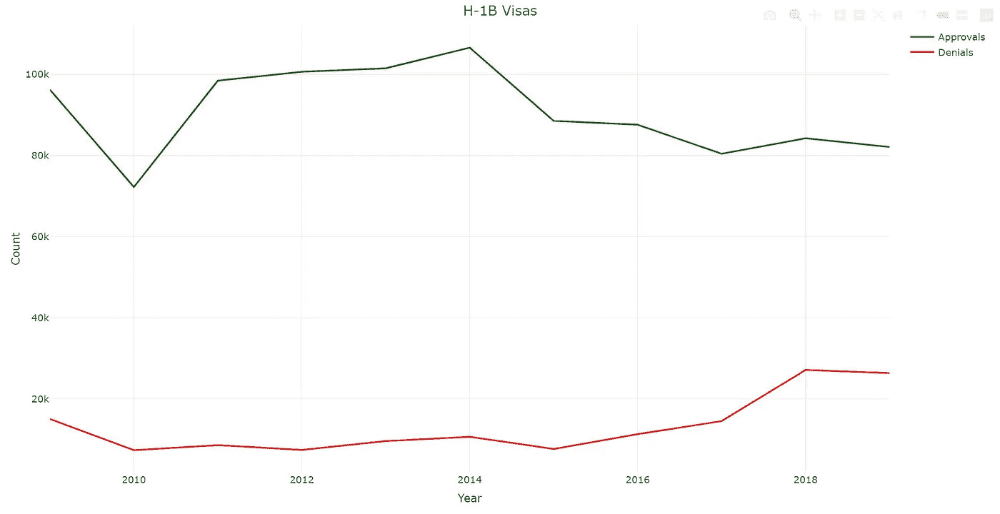
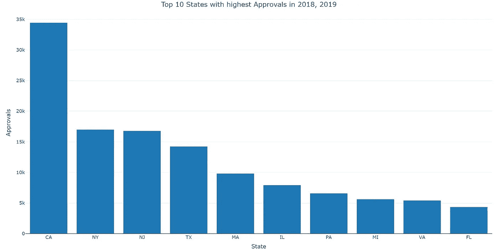
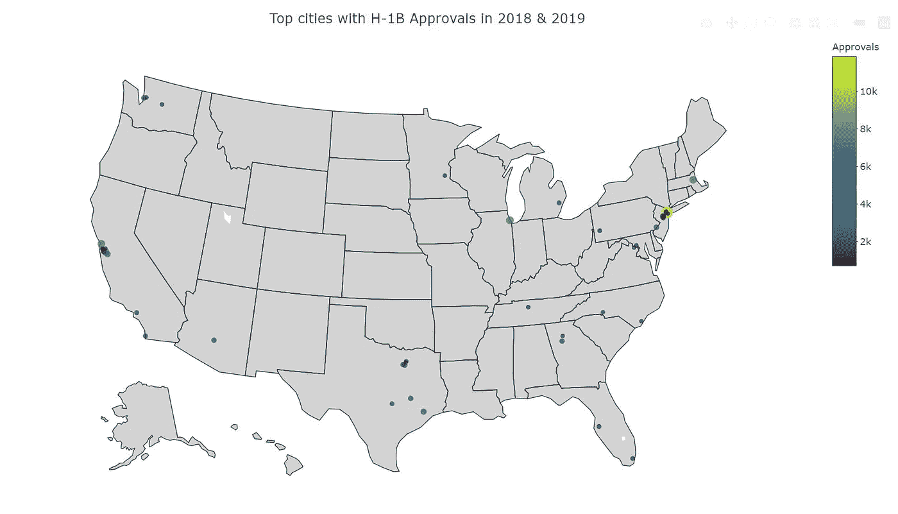
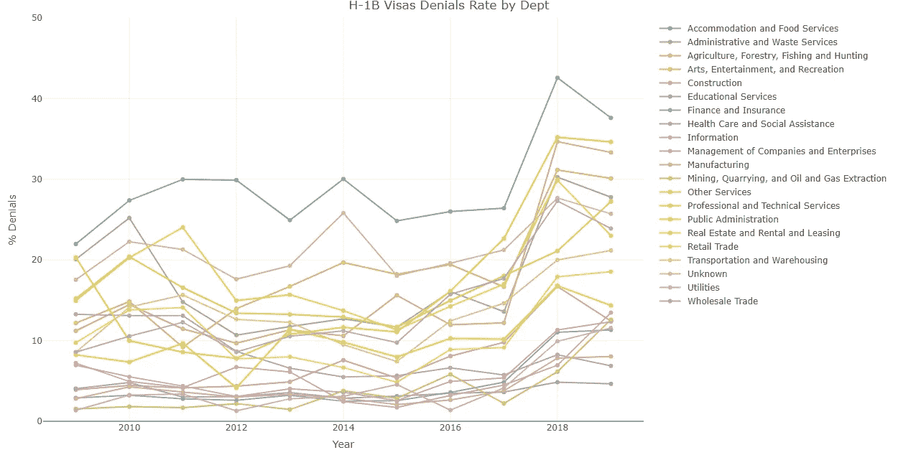
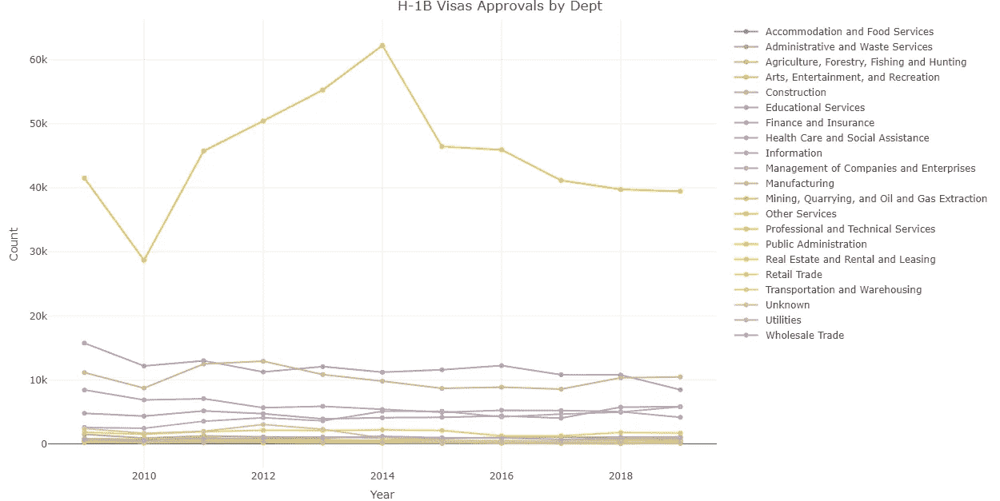

# H-1B 签证分析-R 闪亮的情节视觉效果

> 原文：<https://towardsdatascience.com/plotly-with-r-shiny-495f19f4aba3?source=collection_archive---------7----------------------->

## 国际学生在美国找工作指南


Photo by [Andrew Neel](https://unsplash.com/@andrewtneel?utm_source=medium&utm_medium=referral) on [Unsplash](https://unsplash.com?utm_source=medium&utm_medium=referral)

大约一个月前，我在某一周安排了三次电话面试。由于我的美国签证身份，他们都以我的申请“没有进一步发展”而告终。其中一次对话持续了不到 60 秒，因为他们问的第一个问题是我现在或将来是否需要签证担保，仅此而已。采访到此结束。

是的，臭名昭著的 H-1B 签证，它让美国公司可以临时雇佣外国人才长达 6 年。雇主必须代表雇员向 USCIS 提出申请，USCIS 的批准使雇员有资格在美国工作。可以理解的是，由于频繁的法律变更和不确定性，雇主们正变得不愿意雇佣将来需要签证担保的人。

很多和我一样的留学生都因为这个原因觉得找工作很难。作为一名有抱负的数据科学家，我决定分析美国公民及移民服务局数据中心的公开数据。数据的详细描述可在[这里](https://www.uscis.gov/tools/reports-studies/understanding-our-h-1b-employer-data-hub)获得。

我使用 R 中的*‘plotly’*包来创建交互式图形，并最终使用*‘R Shiny’*开发了一个 web 应用。本文末尾详细描述了如何使用该应用程序并以交互方式浏览这些数据。目的是让求职更有针对性，这个应用程序对所有和我处境相同的国际学生都有用。

*注意*:我想把这篇文章的重点放在描述性报告上，因此我省略了帖子中的一些代码。然而，所有这些都可以在 [Github 上找到。](https://github.com/SurajMalpani/Shiny_H1b)本帖中的图表是静态的，但你可以在网络应用中与它们互动。

以下是我发现的一些见解:

## 1B 签证拒签率上升了吗？

是的，他们有。当我们在下图中查看批准和拒签的总数时，我们意识到，自 2015 年以来，签证批准数量在减少，而拒签数量在增加。在接下来的章节中，我们将更深入地研究批准和拒绝的数量，并从地理、行业、组织等不同角度进行分析。

```
## Code for plotly chart of total approvals and denialsrequire(tidyverse)
require(plotly)
output$plot1 <- renderPlotly({
 Data %>%
 group_by(Year) %>%
 summarize(Approvals = sum(Initial_Approvals), Denials = sum(Initial_Denials), C_Approvals = sum(Continuing_Approvals), C_Denials = sum(Continuing_Denials)) %>%
 plot_ly(x = ~Year, y = ~Approvals, type = “scatter”, mode = “lines”, color = I(‘dark green’), name = “Approvals”) %>%
 add_trace(x = ~Year, y = ~Denials, type = “scatter”, mode = “lines”, color = I(‘red’), name = “Denials”) %>%
 layout(title = “H-1B Visas by Year”,
 xaxis = list(title = “Year”),
 yaxis = list(title = “Count”))
 })
```



Total Visa Approvals And Denials Since 2009

## 地理分析

作为国际学生，你最有可能在哪些城市/州找到职业机会？

我想考察一下这个国家哪些地区的签证批准率最高，这也意味着国际学生有更多的机会。此外，由于许多公司更喜欢“本地”候选人，我正在考虑是否应该搬到这些城市中的任何一个。所以，我调查了过去两年签证批准数量最多的州和城市；特别是最近两年，我们目睹了这一时期的急剧下降。*您可以在应用程序中选择想要查看的年份，并进行更深入的分析。*

加利福尼亚州是签证批准数量最多的州。这并不奇怪，因为加州是美国大陆最大的州之一，硅谷和几个主要科技中心城市经常招聘人才。以不到加州一半的支持率，纽约、新泽西和德克萨斯分别位居第二、第三和第四。



Top states with highest H-1B visa approvals in the last two years

就城市而言，我发现纽约市是过去两年中签证批准数量最多的热点城市。紧随纽约之后的分别是芝加哥、旧金山和波士顿。

```
# Plot of top cities for shiny serverrequire(plotly)
require(ggmap)#geo styling for plot
g <- list(
 scope = ‘usa’,
 showland = TRUE,
 landcolor = toRGB(‘light gray’),
 projection = list(type = ‘albers usa’),
 showlakes = TRUE,
 lakecolor = toRGB(‘white’)
 )

 output$cities <- renderPlotly({
 Data %>%
 filter(Year %in% input$Year) %>%
 group_by(City) %>%
 summarize(Approvals = sum(Initial_Approvals), Denials = sum(Initial_Denials),
 C_Approvals = sum(Continuing_Approvals), C_Denials = sum(Continuing_Denials)) %>%
 arrange(desc(Approvals)) %>%
 top_n(50, Approvals) %>%
 left_join(coords_cities, by=”City”) %>%
 plot_geo(lat = ~lat, lon = ~lon, color = ~Approvals, size=~(Approvals)) %>%
 add_markers(hovertext = ~(paste(“City:”, City, “\nNo. of Approvals:”, Approvals))) %>%
 layout(title = ‘Top cities with H-1B Visa approvals in the selected Years’, geo=g)
 })
```



Top cities with highest H-1B approvals in the last two years

## 哪些行业受影响最大？

当我们在下图中查看拒签率时，我们注意到 2018 年签证拒签率全面上升。*拒签率是以拒签占全部申请的百分比来计算的。*

教育服务行业受影响最小，总体拒绝率最低。教育行业免除每年 85，000 份 H-1B 认证或许是一种解释。

> 高等教育机构、与高等教育机构相关或附属的非营利组织、非营利研究组织和政府研究组织不受 H-1B 年度配额的限制。

```
# Code for denial rate plot
 output$dept_denial <- renderPlotly({
 plot_ly(Dept_Data, x = ~Year, y=~Denial_Rate, color =~Dept_Name, type=’scatter’, mode = ‘line’) %>%
 layout(title = “H-1B Visas Denial Rate by Department”,
 xaxis = list(title = “Year”),
 yaxis = list(range = c(0,50), title = “% Denials”))
 })
```



Denial Rates For The Departments

当考虑批准总数时，“专业和技术服务”行业占主导地位，占批准总数的 50%以上。虽然，自 2015 年以来，这个行业的批准已经下降，并稳步下降。



Number of approvals per department

## 瞄准哪些雇主？

这是最有趣的部分。平均而言，我个人在每份工作申请上花费大约 5-10 分钟。我不想在向一家雇主申请工作时，却听到他们告诉我，他们不考虑国际学生或“*现在或将来需要担保”的申请人。*

你可以在应用程序中查找任何雇主，以查看这些年来他们赞助了多少候选人的详细信息。对于分析部分，我决定寻找排名靠前的雇主，比如在过去两年中支持率最高的雇主。

```
#Code for employer wordcloudrequire(wordcloud2)
employer_wc <- Data %>%
 filter(Year > 2017) %>%
 group_by(Employer) %>%
 summarize(Approvals = sum(Initial_Approvals), Denials = sum(Initial_Denials), C_Approvals = sum(Continuing_Approvals), C_Denials = sum(Continuing_Denials)) %>%
 mutate(Denial_Rate = Denials/(Approvals+Denials)*100) %>% 
 select(Employer, Approvals) %>%
 arrange(desc(Approvals)) %>%
 top_n(15, Approvals)wordcloud2(employer_wc, size = .25, minRotation = 0, maxRotation = 0, color=rep_len(c(“blueviolet”,”blue”,”darkgreen”,”purple”,”deeppink”,”darkorchid”,”darkviolet”,”brown”,”darkred”), nrow(demoFreq) ), backgroundColor = “white”)
```


Top employers with H-1B approvals in the last two years

正如我们所见，所有的科技公司在签证审批方面都处于领先地位。在过去两年中，苹果公司以大约 1700 项批准位居榜首。德勤、英特尔、IBM、微软、脸书、谷歌和其他公司也是顶级竞争者。

这是我用我发现的一些见解完成的分析。我知道人们可以利用这些数据做更多的事情。如果你想在应用程序中看到任何变化，请在评论中提出建议或直接在 [Github](https://github.com/SurajMalpani/Shiny_H1b) 上合作。

# App 怎么用？

对使用这些数据并与之互动感到兴奋吗？您可以使用以下任一选项来完成此操作:

**1)使用 R 在本地运行:**如果您的系统上安装了 R 和 R studio/任何其他 IDE，请在 R 控制台中运行以下命令。该应用程序将直接从 GitHub repo 加载。首次加载应用程序可能需要一些时间。

```
runGitHub("Shiny_H1b","SurajMalpani")
```

2)虚拟主机:[https://surajmalpani.shinyapps.io/Visas/](https://surajmalpani.shinyapps.io/Visas/)

您可以通过访问上述地址来访问 web 应用程序。然而，我个人建议使用第一种方法(runGitHub ),因为 Shinyapps 不支持其中的一些图，因此我必须删除它们。

# 关于该应用程序的详细信息:

如您在以下视频中所见，共有 4 个选项卡。视频下面提到了他们的描述:

Demonstration video of the shiny web app

I)所有数据:该标签包含来自 USCIS 的所有数据。您可以查找感兴趣的任何或多个雇主、年份、州、城市。根据您的输入过滤数据后，您可以下载. csv 格式的过滤文件以供进一步分析。

**ii)批准与拒绝:**您可以查看自 2009 年以来的批准和拒绝总数。

**三)地域:**你可以看看批准人数最多的前 10 个州和前 50 个城市。您可以选择您希望查看的年份，这些图将针对所选年份进行更新。

**iv)部门:**您可以查看一段时间内每个部门的审批数量。此外，您可以查看这些部门的拒绝率。

请随时在评论区提问/给出建议，或者随时在我的[网站](https://surajmalpani.github.io/)或 [LinkedIn](https://www.linkedin.com/in/suraj-malpani/) 与我联系。

感谢您的阅读。希望这个分析和 web app 对你有帮助！

**参考文献:**

1.  [Plotly 网站](https://plot.ly/r/)
2.  [闪亮的 RStudio](http://shiny.rstudio.com)
3.  [Plotly-R](http://plotly-r.com)
4.  美国移民局