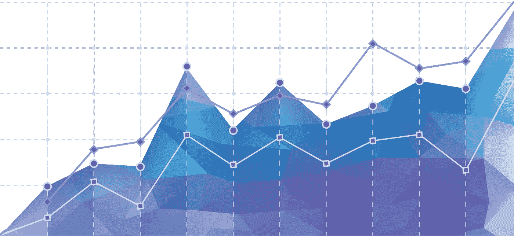
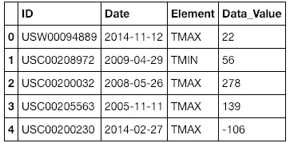
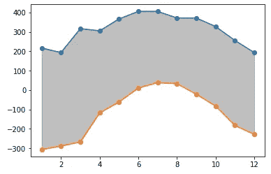
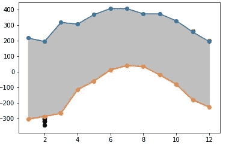
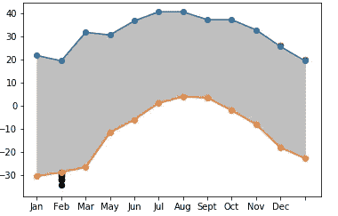

# 使用 Python 绘图和数据表示。使用 Coursera 问题的引导式演练

> 原文：<https://towardsdatascience.com/plotting-and-data-representation-using-python-a-guided-example-using-a-coursera-question-602191003139?source=collection_archive---------6----------------------->



这篇文章基于 Coursera 课程的一个作业，“Python 中的应用绘图、图表和数据表示”。这是密歇根大学 Python 专业应用数据科学的第 2 部分。这是为了向您介绍我对其中一个作业的一个解决方案，这种解释方式对于 Python 经验有限的人来说更容易理解。请注意，如果你正在学习这门课程，你可以从我的解决方案中学习，但不要抄袭它对你最有利，因为从长远来看，这只会伤害你。此外，还有一个更好的解决方案，可以让你更好地理解作业的目的。

**场景**

假设您正在某个城市或地区的气象站测量温度。根据我的研究，尽管有限，这种天气经常被测量到十分之一度(不管什么原因)。你开始收集超过十年的数据，测量每日和每月的最高和最低温度，并将这些数据编辑成 excel 电子表格。

新的一年过去了，假设现在是 2015 年，你继续像往常一样测量温度。2015 年，你一直在观察全国各地创纪录的高点、低点和热浪。你开始想知道今年的气温与过去 10 年的气温相比如何。你想回答问题；如何将今年每个月的历史高点和低点与过去 10 年每个月的历史高点进行对比？

你决定呈现这些发现的最佳方式是通过可视化的折线图，该图将显示过去 10 年中每个月的创纪录高点和低点。为了回答您当前的问题，您还需要叠加一个散点图，显示 2015 年以来的创纪录高点和低点，这些高点和低点要么超过了过去 10 年创下的创纪录低点或高点。

**代码**

所以现在你有一个问题，你知道你需要发展什么来回答你的问题。你决定用 Python 写出代码。为了有助于你的可视化，你需要导入某些[库](https://www.quora.com/What-is-a-Python-library-and-what-can-I-use-it-for)，这将帮助你执行许多复杂的动作，而无需编写冗长复杂的代码。

**导入库并读取数据**

```
import datetime
import pandas as pd
import numpy as np
import matplotlib.pyplot as plt
#read data from a csv
df = pd.read_csv('data/C2A2_data/BinnedCsvs_d400/fb441e62df2d58994928907a91895ec62c2c42e6cd075c2700843b89.csv')
```

对于这种可视化，我们希望使用日期时间库来规定截止日期，以便我们可以将数据分成两个表；2005 年至 2014 年 12 月 31 日之间的温度测量值；ii .)在截止日期之后进行的测量。

Numpy 是数字 python 的缩写，它将允许我们在多维矩阵和数组上执行数学函数。

熊猫和图书馆将允许我们对将要与之互动的数据框架进行操作和计算。而 matplotlib 将用于绘制我们的图形。为了便于引用，我们使用别名 pd 和 plt(以及 numpy 的 np)与这些库进行交互。

然后，下一行代码使用 pandas 库中包含的 read_csv 模块从 csv 中读取我们想要的数据。这被自动保存为熊猫数据帧——我们将该数据帧命名为“df”。

此时，我喜欢使用 head 方法来读取数据帧的前 5 行。这有助于我理解数据帧有哪些列，并对数据的外观有更好的感觉

```
df.head()
```



Output

现在我们知道数据帧有 4 列；ID、日期、元素和数据值。还有一个索引列，列出从零开始的行号。数据帧总共包含 165 085 行

您会注意到，测量结果分为 TMAX(最高温度)和 TMIN(最低温度)。ID 显示了站点识别代码，该代码大概显示了哪个站点进行了测量。

**删除闰年数据**

由于 2015 年不是闰年，我们希望删除所有闰年数据。如果闰年在 10 年内记录了高/低温，因为这可能会对高/低温测量记录产生影响。由于 2015 年将比闰年(2008 年和 2012 年)少一天，这不是一个准确的比较。

```
#converting date to date timestamp
df['Date'] = pd.DatetimeIndex(df['Date']).date
lis = ['2922008','2922012'] #list of 29 Febs appearing in each leap year
dates = [datetime.datetime.strptime(i, '%d%m%Y').date() for i in lis] #converting into list of datetime.date objects
df = df[~df['Date'].isin(dates)] #remove all 29 February dates
```

在这段代码中，我们使用 [DatetimeIndex](https://pandas.pydata.org/pandas-docs/version/0.23.4/generated/pandas.DatetimeIndex.html) 模块转换整个日期列。这将日期列转换为时间戳对象。然后我们用。我们希望返回 datetime.date 对象的日期(“不带时区信息的时间戳的日期时间”)。

使用 datetime.date 库，我们将闰年日期列表转换为 datetime.date 对象。然后，我们只选择没有列为闰年日期的日期(在列表“lis”下)，并从我们的数据框架中过滤出所有闰年日期。

**日期、截止日期和将数据帧分成两个表格**

接下来，因为我们已经确保了日期列中的所有日期都是相同的数据类型(例如，它们都是日期而不是字符串)，所以我们希望根据测量是发生在截止日期之前还是之后，将数据划分到两个表中。

```
#creating a separate column for the month
df['Month'] = pd.DatetimeIndex(df['Date']).month
#we are colleting dates between 2005 - 2014, so want to remove any data from dates after 31 Dec 2014
#creating datetime.date format of cutoff date
a= '31122014'
#converting a string into datetime.date object
cutoff_date = datetime.datetime.strptime(a,'%d%m%Y').date()
#dataframe for values after 31 Dec 2014
df2 = df[df['Date'] <= cutoff_date]
#returning dates before cutoff date
df3 = df[df['Date'] > cutoff_date]
```

因为我们希望表格显示十年期间的月度高点，所以我们还希望创建一个月列。仅将日期列的月份作为整数列出。

对于截止日期，我们添加了一个整数形式的日期，并使用 datetime.date 模块将字符串转换为 datetime.date 对象(类似于我们的 date 列)，格式为“日期/月/年”。

然后，我们继续创建 2 个新的数据帧；df2-包含截止日期之前或之时的所有测量值，df3-包含截止日期之后的所有测量值。

**发现历史高点和低点**

现在我们需要回答这个问题，我们如何按月找到 2005 年到 2014 年这十年间创纪录的高温和低温。

通过使用 head 方法查看我们的数据框架，我们已经知道有一列指定了测量值是否记录为最高温度的最小值。此外，由于我们已经创建了一个 month 列，我们知道它包含了记录测量的月份。为了帮助我们完成这个计算，我们将使用 [groupby](http://pandas.pydata.org/pandas-docs/stable/groupby.html) 。这是一个 pandas 模块，允许我们根据一个或多个标准将数据分组。这可以与聚合方法“aggregate”结合使用，该方法允许我们对数据进行聚合，例如返回最大值或最小值。[结合 groupby](https://jakevdp.github.io/PythonDataScienceHandbook/03.08-aggregation-and-grouping.html) 我们可以确定我们创建的按月分组的组之间的最大值和最小值。

```
df_min = df2[df2['Element'] =='TMIN'].groupby('Month').aggregate({'Data_Value':np.min})
df_max = df2[df2['Element'] == 'TMAX'].groupby('Month').aggregate({'Data_Value':np.max})
```

在这段代码中，我们创建了 2 个数据帧；df_min-在这里，我们过滤了分类为最低温度的测量值，按月分组，找到了十年期间每个月的最低温度，而 df_max-我们过滤了分类为最高温度的测量值，按月分组，找到了每个月的最高温度。

**可视化过程**

现在我们想开始利用 matplotlib 库来可视化我们的数据。

```
plt.plot(df_max, '-o',df_min,'-o')
```


plt.show() output

我们首先将过去十年间的历史高点和低点绘制成一个线形图。这两个将自动以不同的颜色绘制。我们使用“-o”来标识该图表上绘制的每个数据值，这在我们的折线图上表示为一个圆圈。

为了可视化的目的，我们想在最高点和最低点之间的区域加阴影。我相信这将使数据看起来更容易，帮助你关注最高和最低温度以及十年期间记录温度的可变性。

```
x = df_max.index.values
plt.fill_between(x,df_min.values.flatten(),df_max.values.flatten(), color='grey',alpha='0.5')
```



plt.show() output

我们使用 [fill_between](https://matplotlib.org/api/_as_gen/matplotlib.pyplot.fill_between.html) 模块来填充两条线之间的区域。对于 fill_between 函数，您需要有要填充的 x 坐标的长度以及来自 df_min 和 df_max 的坐标/值。

为了找到 x 坐标的长度，我们创建了一个包含 df_max 索引值的 x 变量。这将返回一个 numpy 数组，其中包含与一年中的月份相对应的数字 1-12。

因为 df_min 和 df_max 是数据帧，我们只需要 df_min 和 df_max 的数据帧(温度)中的值。然而，这将返回一个数组的数组，而我们需要一个一维数组来使用 fill_between 模块。然后我们选择[将](https://docs.scipy.org/doc/numpy-1.15.0/reference/generated/numpy.ndarray.flatten.html)数组展平成一维数组。颜色和 alpha 只允许我们指定填充之间的颜色和色调。

**超级气势散点图**

为了回答我们的中心问题，我们需要开始查看截止日期之后的记录。为了做到这一点，我们需要按月对数据进行分组，并在我们的折线图上寻找超过最低和最高记录温度的测量值。

```
#superimpose scatterplot
df3_max = df3[df3['Data_Value'] > df3['Month'].map(df_max['Data_Value'])]
df4_min = df3[df3['Data_Value'] < df3['Month'].map(df_min['Data_Value'])]
plt.scatter(df3_max.Month.tolist(),df3_max['Data_Value'],s=10,c='red') #values over max
plt.scatter(df4_min.Month.tolist(),df4_min['Data_Value'],s=10,c='black') #values under min
```



plt.show() output

为了将我所在月份的每个温度分组与每个月的最低和最高温度进行比较，我们使用[映射函数](http://book.pythontips.com/en/latest/map_filter.html)遍历 df3 数据库，确定每列的月份，并将 Data_Value 列下列出的温度与 df_min 和 df_max 数据帧中该特定月份的值进行比较(取决于我们查看的是最低还是最高温度)。如果该值高于或低于十年期间记录的最高和最低温度，我们将该行添加到新的数据帧中；df3_max 和 df4_min。

现在我们想把我们的[散点图](https://matplotlib.org/api/_as_gen/matplotlib.pyplot.scatter.html)叠加到我们的折线图上。对于散点图，我们需要指定 x 轴(月)和 y 轴(数据值)。我们还想指定代表每个值的圆圈的大小和颜色，以区别于折线图圆圈。

**让图表更容易解读**

如果你打算把这个图表展示给其他人，重要的是要确保这个图表易于理解，并显示你想要它显示的内容，而不误导你的观众。

图表的第一个问题是 x 轴在 2s 内增加，跳过奇数个月。

```
plt.xticks(list(df_max.index),['Jan','Feb','Mar','Apr','May','Jun','Jul','Aug','Sept','Oct','Nov','Dec']) #we want to show all the x values and rename according to the month
```

为了纠正这一点，我指定了 xticks，并将它们重命名为它们所代表的月份的缩写。

下一个问题是如何记录温度。我们希望以摄氏度显示温度，而不是十分之一度。

```
df_max['Data_Value'] = df_max['Data_Value']/10
df_min['Data_Value'] = df_min['Data_Value']/10
df4_min['Data_Value'] = df4_min['Data_Value']/10
df3_max['Data_Value'] = df3_max['Data_Value']/10
```



plt.show() output — I mistakenly left out April bur corrected this error

然后，我将所有温度值除以 10，将十分之一度转换为摄氏度。

最后一个问题是图表没有标注，而且图表的大小使我们很难知道记录的超过每月高温或低温的天数。

```
plt.title('Min and Max temperatures in Ann Arbor Michigan United States between 2005-2015', fontsize=20)
plt.xlabel('Years', fontsize=20)
plt.ylabel('Temperatures', fontsize=20)
fig = plt.gcf()
fig.set_size_inches(20,10)
plt.tick_params(labelsize=20)
plt.show()
```


plt.show() output

然后，我开始放大图表，首先获取当前数字(gcf)，将其保存为 fig，并以英寸为单位设置 fig 的大小。由于这只会放大数字，我需要同时放大 x 和 y 刻度参数以及 y 和 x 标签的字体大小。

从这张图表中，我们可以看出，2 月份大约有 6 天的最低温度低于 2005 年至 2014 年期间记录的最低温度，而 11 月和 12 月的另外两天的温度超过了 10 年来记录的最高温度。这种解释的意义很大程度上取决于你试图用这种想象回答的问题。

这不是表示该数据的唯一方式，因为您可以选择显示十年期间每天的最高记录温度，并使用它来确定 2015 年后超过先前设定的最高和最低记录的个别日期。如果这样做的话，可能会让你对 2015 年的气温记录有一个更清晰的了解(答案应该不会太不同)。