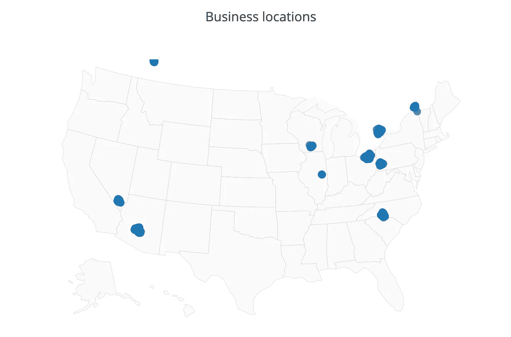

# 使用 Python 中的多个绘图库在地图上绘制商业位置

> 原文：<https://towardsdatascience.com/plotting-business-locations-on-maps-using-multiple-plotting-libraries-in-python-45a00ea770af?source=collection_archive---------7----------------------->

Photo by [Andrew Stutesman](https://unsplash.com/@drewmark?utm_source=medium&utm_medium=referral) on [Unsplash](https://unsplash.com?utm_source=medium&utm_medium=referral)

我在浏览 Kaggle 时，发现了一个数据集，其中包括经度和纬度的位置。我没有在地图上绘制过地图，所以我决定使用这个数据集并探索各种可用的选项来处理它们。这是一个关于我所做的事情和我对这些库的推断的基本指南。

> 我们的目标是寻找一个非常容易使用的库，并且可以无缝地在地图上绘制。另一个目标是找到一个可以一次打印数据集中所有点(190，000+点)的库。

在这里，我探索了四个库，`gmplot`、`geopandas`、`plotly`和`bokeh`。我会在需要的时候导入这些库，而不是一开始就全部导入。完整代码可从 GitHub repo 获得:

 [## kb22/Python 绘图地图

### 一个数据可视化项目，包括多种在地图上绘制位置的方法。-kb22/Python 绘图地图

github.com](https://github.com/kb22/Plot-Maps-in-Python) 

我们开始吧！！

# 资料组

我从 [Kaggle](https://www.kaggle.com/darshank2019/business) 中取出数据集，并将其保存在`data`文件夹中，命名为`dataset.csv`。它包括一个完整的地址，州，位置和更多的企业列表。我在不同的数组中提取了纬度、经度、州、unique_states 和名称。我还提取了最小和最大的纬度和经度值，这将有助于我放大世界地图上的特定区域，我们将在下面看到。

对于每个库，我将绘制前 1000 个位置，然后尝试绘制所有的点。

# gmplot

`gmplot`是一个库，它通过创建一个可以在浏览器中加载的 html 文件来生成绘图。这是开始在地图上绘制数据的最简单快捷的方法之一。它在谷歌地图上绘制信息，因此看起来真的很好。

首先，我们创建一个`GoogleMapPlotter`，它采用描述地图中心的前两个值(在我们的例子中是美国),第三个参数是缩放级别。你可以在这里选择任何数字，但我发现 5 是适合这种情况。数据文件夹中会生成一个文件`gmplot.html`。让我们在浏览器中打开它。

gmplot without API Key

哎呀！整个地图变暗，被文字`For development purposes only`覆盖。这是因为现在对谷歌地图 API 的访问是付费的，我们需要一个 API 密钥。为此，你必须在[https://console.cloud.google.com](https://console.cloud.google.com/)上创建一个账户。默认情况下，你可以免费试用 12 个月，有足够的学分来完成这个项目和更多。转到 Google Maps Javascript API 并生成一个 API 密钥。让我们现在把它填上。

只需用 API 键替换文本`<API-KEY>`。让我们看看新的 HTML 文档是什么样子的。

gmplot with API key

现在，地图已正确生成。由于这是一个实际的谷歌地图，我们可以将左上角的设置改为卫星，放大并根据需要移动地图。接下来，让我们试着在地图上标出所有的位置。

我试图加载 HTML 页面，但它加载了几秒钟，过了一段时间后就没有反应了。我尝试了多次，但无法得到一个工作页面。

Unresponsive page

# 地质公园

`GeoPandas`是一个建立在熊猫数据结构上的库，并使用它们在地图上绘制空间数据。

图书馆期望所有的位置都被描述为点。因此，第一步是创建一个点数组，我将它们存储在`data_points`中。我发现这个库的惊人之处在于，它使得给每个位置添加颜色变得非常简单。如果你熟悉熊猫和 matplotlib，你会觉得很舒服。我在`colormap`创建了一个基于独特州的颜色列表，并用它来生成所有地点的颜色数组，只需一个循环。

首先，我们需要一张地图来标出这些点。图书馆提供了一些地图，我用过`naturalearth_lowres`。我简单地用浅灰色的背景和黑色的边界来绘制它。一旦我们准备好地图，我们就可以使用`GeoDataFrame`来绘制数据。这就像熊猫数据帧，所以我们首先传递数据集，限制为 1000，以便在开始时只绘制 1000 个位置。使用`crs`定义所需的坐标系，我们在`geometry`中定义数据。我关闭了轴，并根据纬度和经度值设置了 x-极限和 y-极限。

GeoPandas with 1000 locations

如你所见，每个位置都是蓝色的略微不同的变体。让我们也画出所有的点。

GeoPandas will all points

瞧啊。GeoPandas 能够绘制出所有的点。然而，我在这里发现了两个主要的缺点，包括没有一个交互式地图，以及如何正确使用它的文档非常有限。

# Plotly

`Plotly`是另一个绘制高度交互式图表的库，也允许用户与图表交互。但是，它需要用户名和 API 密钥才能工作。你必须在 https://plot.ly/feed/#/注册并获得一个 API 密匙。

你必须用你自己的价值观取代`<USERNAME>`和`<API-KEY>`。

我们使用`ScatterGeo`来定义我们想要绘制的点，也可以在`text`参数中传递它们的名称。设置标记也很容易，可以修改其大小，不透明度，颜色等。`layout`用于定义图的标题、基色等。最后，`Figure()`方法创建了我们可以使用`iplot`绘制的图形。

Plotly plot for 1000 locations

我们能够用相同的颜色绘制 1000 个点，但是要用不同的颜色绘制它们，我们必须用不同的颜色绘制不同的`ScatterGeo`方法。让我们试着画出所有的点。

过了一段时间后生成了这个图，但是所有的位置都是可见的，尽管它非常滞后。甚至会出现一个警告，说对于绘制大量的点，我们应该使用其他方法。这很烦人，因为当我试图将它作为图像返回时，它需要库`plotly-ocra`，而库`plotly-ocra`不能与`pip`一起安装，只能与`conda`一起工作。

Plotly map for all locations

# 散景

`Bokeh`是一个惊人的可视化库，它依赖于 Google Maps 的地图，因此，也需要我们上面使用的 API 键来工作。鉴于它使用谷歌地图，我非常怀疑它能否一次标绘所有的点。

我们将输出保存为`bokeh.html`。`GMapOptions`帮助我们定义地图的中心，并根据需要进行缩放。然后我们用这些选项生成一个`gmap`，并传入 API 密钥。我们将数据定义为 ColumnDataSource，如上面的要点所示。然后，我们在图上将所有点标为`circle`，并用`show`显示出来。它加载 html，我们可以看到结果，这是一个交互式地图。

Bokeh plot for 1000 points

所有位置都已正确绘制。让我们试着画出所有的点。

不出所料，该页面打开时显示了地图，但无法工作，也没有显示任何数据点。

# 结果

从上面的图中，我发现所有的库对于绘制数据点都非常有用，我的观察如下:

1.  最简单的入门方法是从`gmplot`开始。它需要最少的代码来启动，并且能够产生良好的结果。
2.  在`GeoPandas`中，根据状态用不同的颜色绘制点是最容易的。很容易画出所有的点，可能是因为这个图不是交互式的，是静态的。
3.  最具互动性的是`Plotly`的剧情。他们能够绘制出包含所有点的图，但反应较慢，并提出了其他绘制方法。
4.  `Bokeh`能够用最少的代码生成非常好的谷歌地图。然而，它也没有画出所有的点。

希望你喜欢读这篇文章。这里还有一些你可能会喜欢的文章:

 [## Python 虚拟环境变得简单

### 虚拟快速指南

towardsdatascience.com](/python-virtual-environments-made-easy-fe0c603fe601)  [## 在 Kaggle 上使用 CNN 进行深度学习以识别疟疾细胞

### 医学领域的深度学习

towardsdatascience.com](/deep-learning-to-identify-malaria-cells-using-cnn-on-kaggle-b9a987f55ea5)  [## 使用 Flask、Flask RESTPlus 和 Swagger UI 处理 API

### Flask 和 Flask-RESTPlus 简介

towardsdatascience.com](/working-with-apis-using-flask-flask-restplus-and-swagger-ui-7cf447deda7f)  [## 使用 React 和 Flask 创建一个完整的机器学习 web 应用程序

### 用 UI 和后端构建完整的 ML 应用程序

towardsdatascience.com](/create-a-complete-machine-learning-web-application-using-react-and-flask-859340bddb33) 

请随时分享你的想法，想法和建议。我很乐意收到你的来信。