# 绘制离散和连续随机变量的概率

> 原文：<https://towardsdatascience.com/plotting-probabilities-for-discrete-and-continuous-random-variables-353c5bb62336?source=collection_archive---------11----------------------->

## 通过用代码绘制概率来学习分布

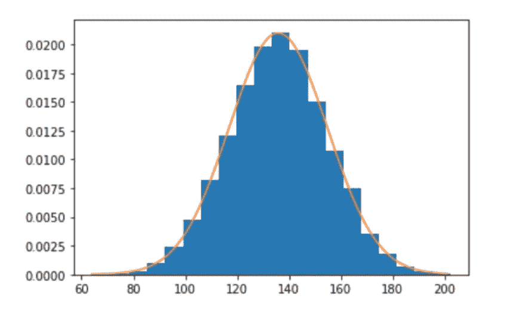

理解统计学可以帮助我们看到随机数据中的模式。

让我们讨论两种主要类型的随机变量，以及如何为每一种绘制概率图。

# 什么是随机变量

据 [investopedia](https://www.investopedia.com/terms/r/random-variable.asp) 报道。

> 随机变量是一个值未知的变量，或者是一个为每个实验结果赋值的函数。

与我们对随机性的直觉相反，这个函数的可能值并不是同样可能的。

[维基百科](https://en.wikipedia.org/wiki/Random_variable#Distribution_functions)言简意赅。一个随机变量…

> 被非正式地描述为一个变量，其值取决于随机现象的结果。

随机变量依赖于使用随机性的函数，但不一定输出均匀的随机性。

重要提示:当我们谈论一个随机变量时，通常用 X 表示，它的最终值仍然未知。随机变量是“X”。不是 x 的输出不是`random.random()`的输出。只有 X，有可能的结果和相关的概率。

酷毙了。现在随机变量通常分为两类:

1)离散随机变量
2)连续随机变量

让我们从离散开始，因为它更符合我们人类看待世界的方式。

# 离散随机变量

据[维基百科](https://en.wikipedia.org/wiki/Random_variable#Discrete_random_variable)。

> 当 X 的图像(或范围)是可数的时，该随机变量被称为离散随机变量，并且其分布可以由概率质量函数来描述，该概率质量函数将概率分配给 X 的图像中的每个值。

如果随机变量只能取有限数量的值，那么它就是离散的。是 **PMF(概率质量函数)**给每个可能的值分配一个概率。请注意，离散随机变量有 PMF，而连续随机变量没有。

如果您事先不知道 PMF(我们通常不知道)，您可以根据与您的随机变量来自相同分布的样本来估计它。

**步骤:**
1 .从总体中收集一个样本。计算每个值的频率
3。将频率转换成概率

对于一些任意数据，我们可以遵循这个逻辑，其中`sample = [0,1,1,1,1,1,2,2,2,2]`。

```
def frequencies(values):
    frequencies = {}
    for v in values:
        if v in frequencies:
            frequencies[v] += 1
        else:
            frequencies[v] = 1
    return frequenciesdef probabilities(sample, freqs):
    probs = []
    for k,v in freqs.items():
        probs.append(round(v/len(sample),1))
    return probssample = [0,1,1,1,1,1,2,2,2,2]freqs = frequencies(sample)
probs = probabilities(sample, freqs)
x_axis = list(set(sample))plt.bar(x_axis, probs)
```

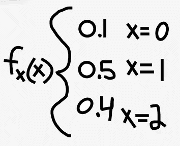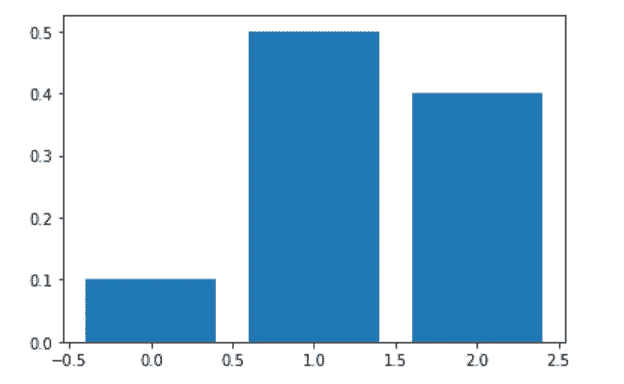

PMF (left). Probability distribution (right).

继续我们上面的代码，PMF 计算如下。

```
dict(zip(x_axis, probs))
#=> {0: 0.1, 1: 0.5, 2: 0.4}
```

直觉上，所有可能性的概率总是加 1。

**经验法则:**假设一个随机变量是离散的，如果你能事先列出它可能的所有可能值。这不是定义，而是一个有用的启发。

许多分布是基于离散随机变量的。这些包括伯努利，二项式和泊松分布。

在我们深入研究连续随机变量之前，让我们再看几个离散随机变量的例子。

**示例 1:抛硬币(离散)**

抛硬币是离散的，因为结果只能是正面或反面。这符合伯努利分布，只有两种可能的结果，一次只能抛一次硬币。

让我们用 numpy 生成数据来对此建模。

```
import numpy as np
import matplotlib.pyplot as pltn = 1    # number of trials
p = 0.5  # probability of success
sample = np.random.binomial(n, p, 100)plt.hist(sample, bins=10)
```

并绘制出结果的频率。以及概率。

```
# using the functions we wrote above
freqs = frequencies(sample)
probs = probabilities(sample, freqs)
x_axis = list(set(sample))plt.bar(x_axis, probs)
```

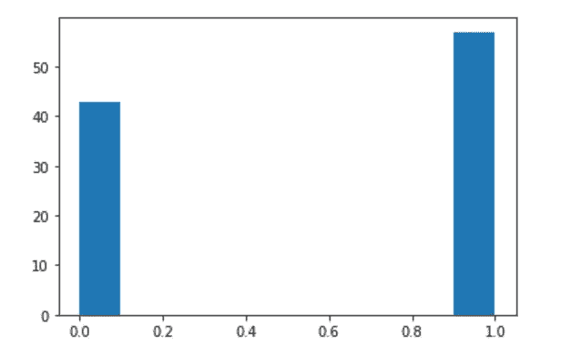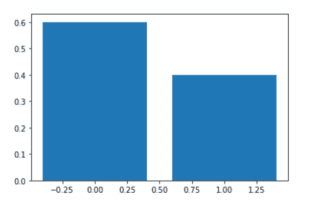

请注意值落入的桶的离散数量。

**例 2:一个人的四舍五入体重(精确到磅)(离散)**

四舍五入的砝码(精确到磅)是不连续的，因为砝码可以落入间隔为 1 磅的不连续桶中。

未舍入的权重是连续的，因此我们将在讨论连续随机变量时再次回到这个例子。

从 [Kaggle](https://www.kaggle.com/mustafaali96/weight-height) 下载数据集，并保存在与此笔记本相同的目录下。

```
import pandas as pddf = pd.read_csv('weight-height.csv')# convert values to integer to round them
df['Height'] = df['Height'].astype(int)
df['Weight'] = df['Weight'].astype(int)df.head(3)
```

我们将对数据进行采样(如上)并绘制图表。

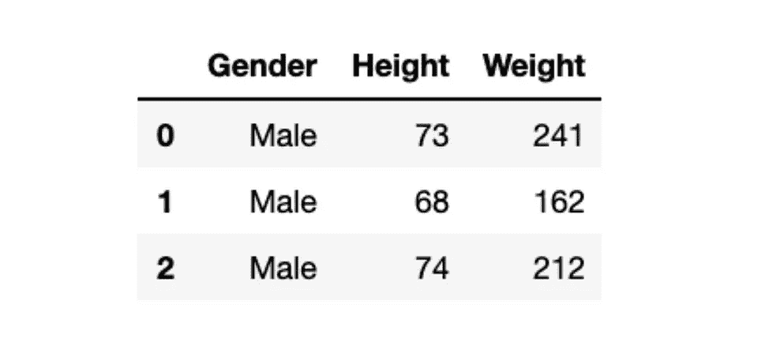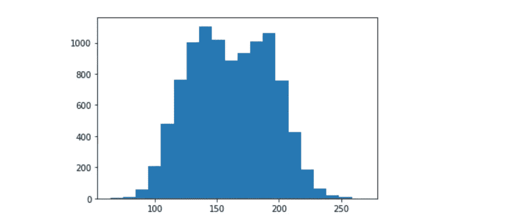

现在添加`density=True`将我们的图转换成概率。

```
plt.hist(weights, bins=20, density=True)
```

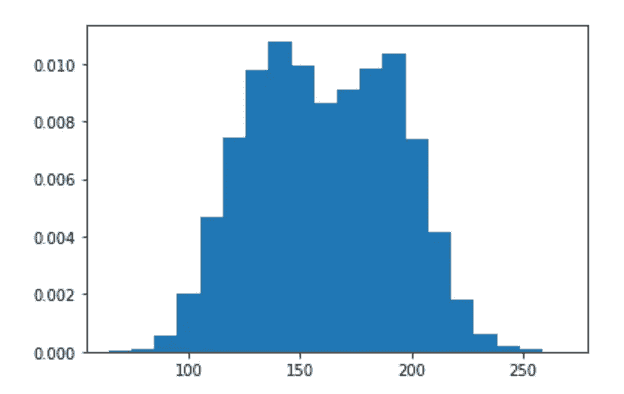

再次注意离散的桶。现在让我们继续讨论连续随机变量。

# 连续随机变量

据[维基百科](https://en.wikipedia.org/wiki/Random_variable#Continuous_random_variable)。

> 如果像是不可数无穷的，那么 X 称为连续随机变量。

输出可以是一个范围内的无限个值。因此，虽然曲线下的组合概率等于 1，但不可能计算任何单个点的概率——它非常小。可以计算曲线下 x 值范围的概率，但我们不会在这里讨论。

连续随机变量有一个 **PDF(概率密度函数)**，不是 PMF。与 PMF 不同，该函数定义了随分布变化的曲线，而不是列出每个可能输出的概率。

让我们回到我们的重量例子。这一次，权重没有四舍五入。

为什么重量是连续的？因为真正的体重不会整齐地落在 1 磅的区间内。一个人站在磅秤上可以重达 150 磅。但是如果我们放大到分子水平，它们实际上可能有 150.0000001 磅重。

**步骤:**
1 .在直方图上绘制样本数据
2。找出一个众所周知的样本服从的分布
3。计算从样本
4 生成分布所需的参数。生成 PDF 并绘制在直方图的顶部

让我们用上面的重量例子来做这件事。

如果您还没有从 [Kaggle](https://www.kaggle.com/mustafaali96/weight-height) 下载数据集，并将其保存在与笔记本相同的目录中。

检查数据的形状。

```
import pandas as pd
df = pd.read_csv('weight-height.csv')
df.head(3)
```

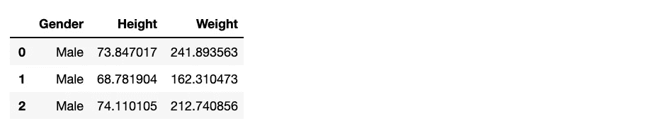

我们将移除男性，让我们的生活更轻松。包括男性和女性将导致双峰分布(2 个峰而不是 1 个),这使我们的计算变得复杂。

```
df = df[df['Gender']=='Female']
df.head(3)
```

绘制剩余的重量数据。

```
weights = df['Weight'].tolist()
plt.hist(weights, bins=20)
```

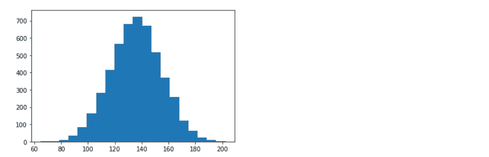

这看起来像什么一般的分布？一个正态分布，呵呵。

计算均值和标准差，因为我们需要它们来生成正态分布。

```
from numpy import mean,stdmean = mean(weights)
std = std(weights)print(mean, std)
#=> 135.86009300746835 19.020565463416645
```

使用这些参数生成正态分布。

```
from scipy.stats import norm
distribution = norm(mean, std)
```

选择我们将绘制 PDF 的范围。

```
min_weight = min(weights)
max_weight = max(weights)
values = list(range(int(min_weight), int(max_weight)))
```

生成该范围的概率。

```
probabilities = [distribution.pdf(v) for v in values]
```

绘制我们的样本分布和我们生成的 PDF。

```
from matplotlib import pyplot
pyplot.hist(weights, bins=20, density=True) # , 
pyplot.plot(values, probabilities)
```

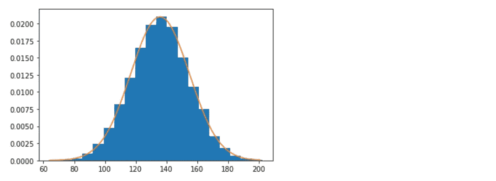

现在我们有了。

我们有意选择了一个服从正态分布的样本来简化这个过程。但是最好了解不同的常见分布类型和生成它们所需的参数。