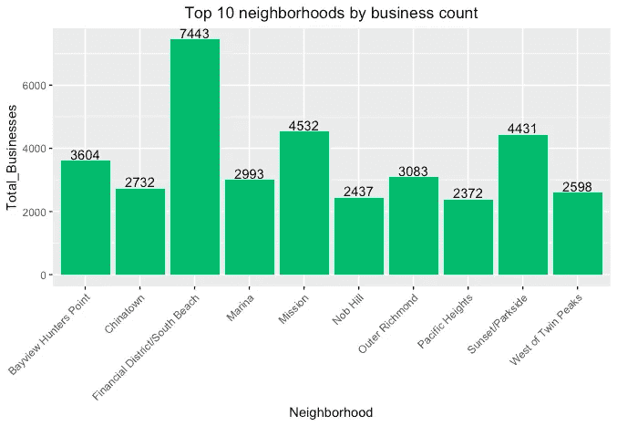

# R 中基于位置的数据可视化

> 原文：<https://towardsdatascience.com/plotting-spatial-data-in-r-a38a405a07f1?source=collection_archive---------7----------------------->

## 在旧金山城市地图上标出商业高度集中的街区


Photo by [Anastasia Petrova](https://unsplash.com/@anastasia_p?utm_source=medium&utm_medium=referral) on [Unsplash](https://unsplash.com?utm_source=medium&utm_medium=referral)

我最近得到了一个处理空间数据的机会，想分享我对一个这样的数据集的分析。

这些数据包括旧金山湾区的各种注册企业，可以在这里找到。更新版本可以在[这里](https://data.sfgov.org/Economy-and-Community/Registered-Business-Locations-San-Francisco/g8m3-pdis)找到。

空间数据属于与位置相关联的数据。通常用坐标参考系统(纬度和经度)来描述。

本练习的目标是找到旧金山商业高度集中的街区。你需要从谷歌的地理定位 API 获得一个密钥来使用他们的地图。我使用 R 中的 ggmap 包来绘制这些数据。然后，我将分析范围缩小到一个特定的高度集中的社区，看看企业是如何在该区域内分散的。

**首先…快速扫描数据集**

```
str(biz)head(biz, 25)summary(biz)
```

在这个练习中，我只关心邻居、地址、日期，最重要的是包含每个企业的纬度和经度数据的位置列。企业名称及其代码(由城市为注册企业分配)暂时没有考虑。

在进行了基本的数据清理活动(比如消除重复和空值)之后，我只提取了与旧金山有关的信息，并消除了与海湾地区相邻城市有关的记录。

**识别仅与旧金山相关的数据**

我有几种方法可以实现这个目标；基于 c *城市*或 b *业务地点*或邮政编码*过滤数据集。我选择使用邮政编码逻辑，因为其他两个字段具有不一致的旧金山城市名称模式，很容易被遗漏。但是，我已经包含了过滤这些数据的所有三种方法的命令。*

*按邮编*

```
sf_biz_zip <- biz %>% filter(grepl(pattern = "94016|94105|94110|94115|94119|94123|94127|94132|94139|94143|94147|94156|94161|94171|94102|94107|94108|94109|94111|94112|94114|94116|94117|94118|94120|94121|94122|94124|94125|94126|94129|94130|94131|94133|94134|94137|94140|94141|94142|94144|94145|94146|94151|94153|94154|94158|94159|94160|94162|94163|94164|94172|94177|94188", Business.Location))
```

*按城市*

```
sf_biz_city <- biz %>% filter((grepl(".*San Francisco.*|.*SAN    FRANCISCO.*|.*SF.*|.*S SAN FRAN.*|.*Sf.*|.*San+francisco.*|.*S+san+fran.*", City)))
```

*通过业务。位置*

```
sf_biz_loc <- biz %>% filter((grepl(".*San Francisco.*|.*SAN FRANCISCO.*|.*SF.*|.*S SAN FRAN.*|.*Sf.*|.*San+francisco.*|.*S+san+fran.*", Business.Location)))
```

**转换日期对象**

接下来，我想消除已经不复存在的企业。为此，我对每个地点使用了*结束日期*。然而，日期字段存储为转换为 posixct 的因子，这通常有助于进一步分析日期。

```
sf_biz_zip$Business.Start.Date <- as.POSIXct(sf_biz_zip$Business.Start.Date, format = "%m/%d/%Y")sf_biz_zip$Business.End.Date <- as.POSIXct(sf_biz_zip$Business.End.Date, format = "%m/%d/%Y")sf_biz_zip$Location.Start.Date <- as.POSIXct(sf_biz_zip$Location.Start.Date, format = "%m/%d/%Y")sf_biz_zip$Location.End.Date <- as.POSIXct(sf_biz_zip$Location.End.Date, format = "%m/%d/%Y")
```

**过滤掉不活跃的业务**

2018 年 12 月 1 日后查封存在的企业予以剔除。

```
sf_biz_active_zip <- sf_biz_zip %>% filter(is.na(Location.End.Date))sf_biz_active_zip <- sf_biz_zip %>% filter(Location.Start.Date < "2018-12-01")
```

**从业务位置字段中剥离坐标**

业务位置列包含地址和坐标信息。因此需要提取纬度和经度信息。

```
sf_biz_active_zip <- sf_biz_active_zip %>% separate(Business.Location, c("Address", "Location"), sep = "[(]")sf_biz_active_zip <- sf_biz_active_zip %>% filter(!(is.na(Location)))sf_biz_active_zip <- separate(data = sf_biz_active_zip, col = Location, into = c("Latitude", "Longitude"), sep = ",")
```

其他字符也需要清除。

```
sf_biz_active_zip$Longitude <- gsub(sf_biz_active_zip$Longitude, pattern = "[)]", replacement = "")
```

然后，我将纬度和经度变量从离散转换为连续，并将它们存储为数字变量，因为这有助于绘制/可视化数据，并避免错误。

```
sf_biz_active_zip$Latitude <- as.numeric(sf_biz_active_zip$Latitude)sf_biz_active_zip$Longitude <- as.numeric(sf_biz_active_zip$Longitude)
```

现在有趣的部分…

**可视化数据**

产生的数据集有 88，785 条记录，需要绘制在 Google 地图上。至少可以说，在地图上解释这么多的记录是一件非常困难的事情。尽管取样是一种方法，但我还是试图找出拥有最多企业的前 10 个街区，并在地图上画出一个这样的街区。

```
viz <- sf_biz_active_zip %>% group_by(Neighborhoods...Analysis.Boundaries) %>% tally() %>% arrange(desc(n))col.names(viz)[2] <- “Total_businesses”viz <- viz[1:10, ]
```

然后我创建了一个前 10 个街区的直方图。

```
fin_plot <- ggplot(viz, aes(x = Neighborhood, y = Total_Businesses)) + geom_bar(stat = "identity", fill = "#00bc6c")fin_plot <- fin_plot + geom_text(aes(label = Total_Businesses), vjust = -0.2) + theme(axis.text.x = element_text(angle = 45, size = 9, hjust = 1), plot.title = element_text(hjust = 0.5))fin_plot <- fin_plot + ggtitle("Top 10 neighborhoods by business count", size = 2)
```



让我们更详细地看看金融区/南海滩社区，因为它拥有最大数量的活跃企业。

**注册谷歌地图密钥**

我安装了“ggmap”、“digest”和“glue”包，然后向 Google API 注册以获得地理位置 API 密钥。

```
install.packages("ggmap","digest","glue")register_google(key = "<google maps key>")
```

谷歌提供地形、卫星、混合以及其他类型的地图。我选择使用地形图。简单的谷歌搜索就能给你旧金山的城市坐标。

```
sf <- c(lon = -122.3999, lat = 37.7846)map <- get_map(location = sf, zoom = 14, scale = 2)
```

通过调节变焦，你可以看得更清楚。下面两张图片的缩放比例不同

```
fin_map <- ggmap(map) + geom_point(aes(Longitude, Latitude), data = fin_dis) fin_map <- fin_map + ggtitle("Concentration of businesses in Fin. District and South Beach") + xlab("Longitude") + ylab("Latitude") + theme(plot.title = element_text(hjust = 0.5))
```


Zoom out view


Zoom in view

**更好的可视化**

热图可能会使可视化更加直观。为了做到这一点，除了 x 和 y 坐标之外，我们还需要增加一种美感；z .这种美学是特定纬度的商业总数。-朗。组合。

```
fin_heatmap <- ggmap(map, extent = "device") + stat_summary_2d(data = u, aes(x = Longitude, y = Latitude, z = n), fun = mean, alpha = 0.6, bins = 30) + scale_fill_gradient(name = "Price", low = "green", high = "red")fin_heatmap <- fin_heatmap + ggtitle("Concentration of businesses in Fin. District and South Beach") + xlab("Longitude") + ylab("Latitude") + theme(plot.title = element_text(hjust = 0.5))")
```


**结论**

鲍威尔街地铁站、联合广场和恩巴卡德罗地铁站周围的区域有相对较多的商业，而南海滩和林肯山周围的区域人口稀少。

类似地，可以绘制其他单个社区的地图，以了解那里的商业分布。

这是一种非常直观的可视化空间数据的方式。我欢迎任何反馈和建设性的批评。

感谢您的阅读！