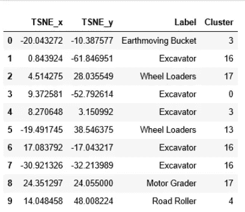
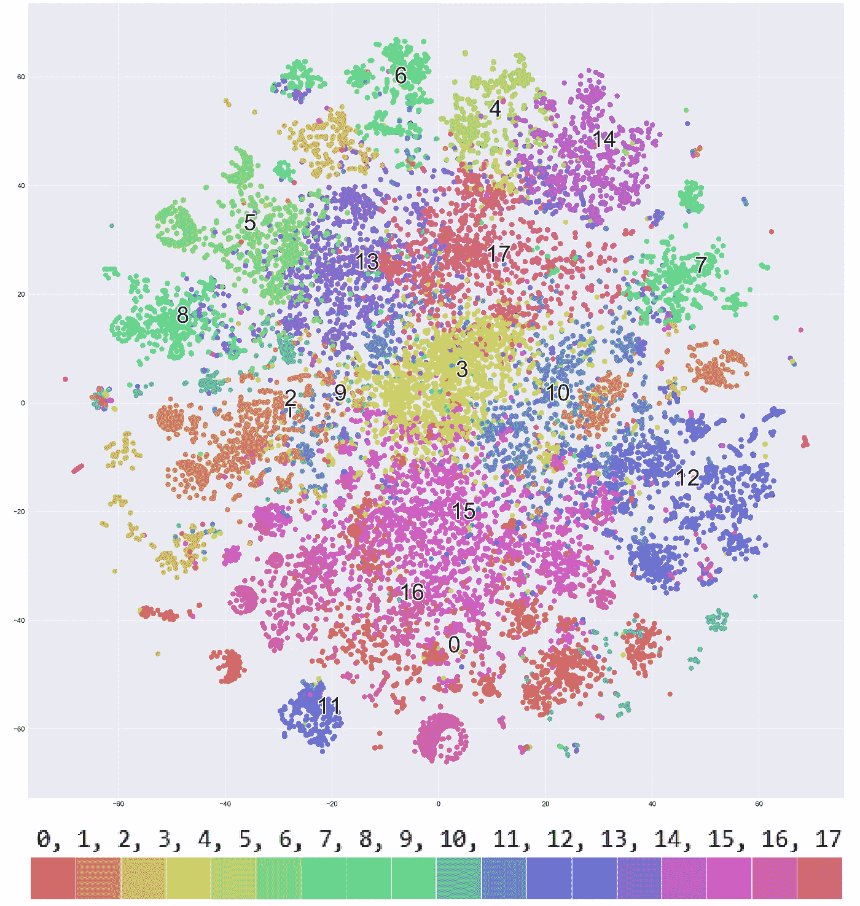
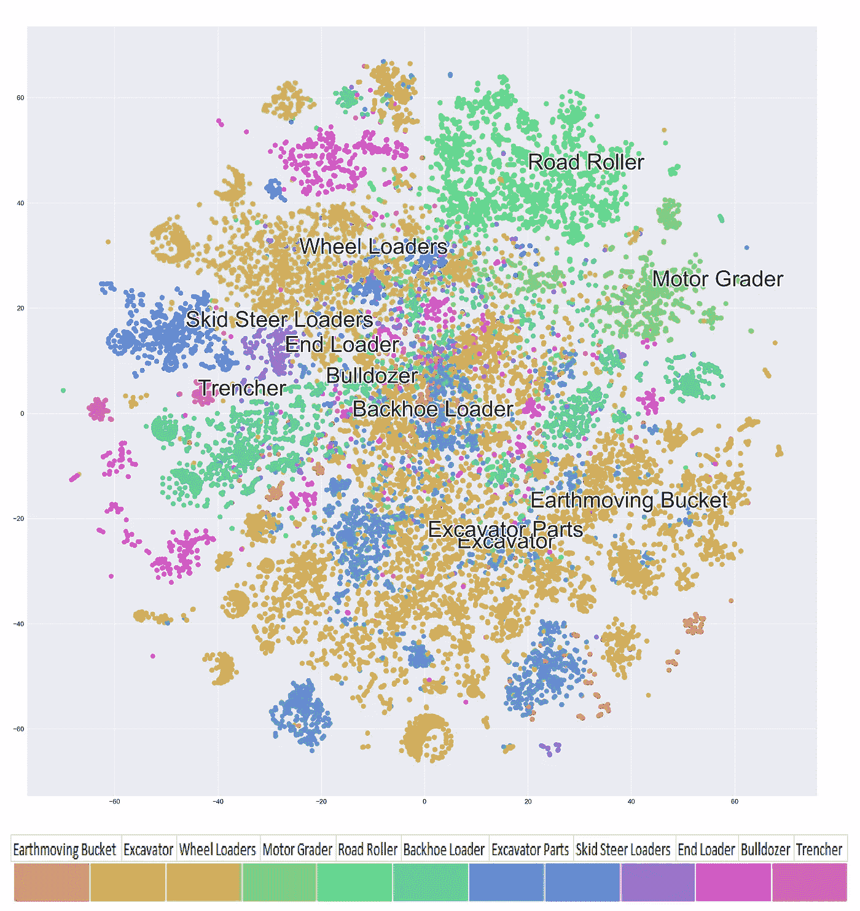
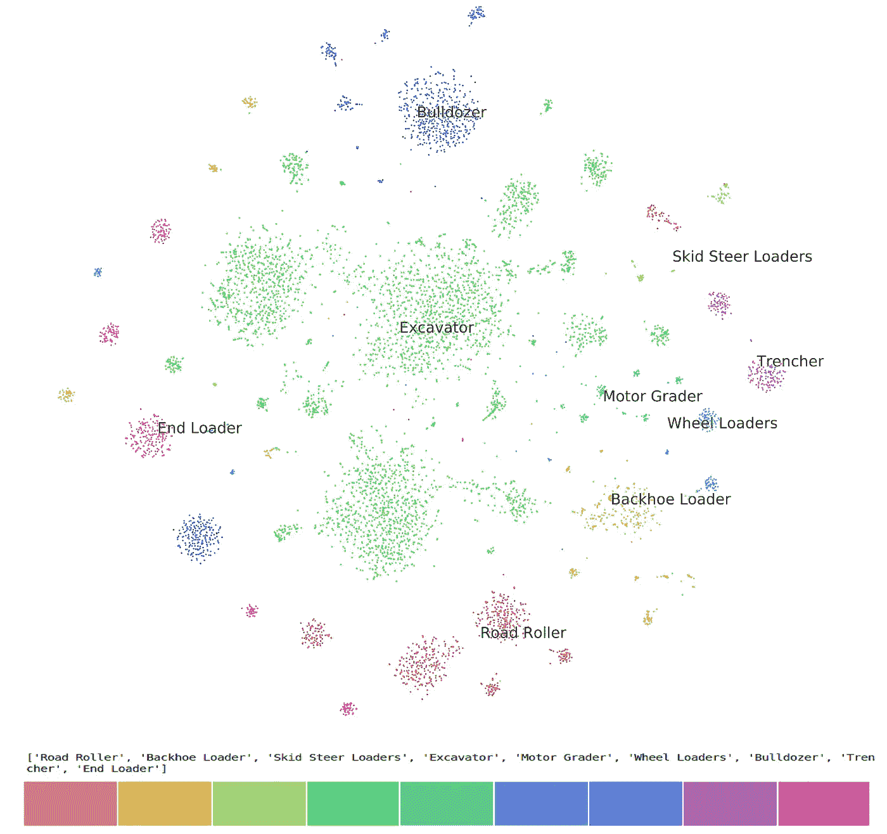

# 使用 t-SNE 绘制文本和图像向量

> 原文：<https://towardsdatascience.com/plotting-text-and-image-vectors-using-t-sne-d0e43e55d89?source=collection_archive---------11----------------------->

## *如何在二维空间中绘制使用 Infersent 和 Resnet 创建的多维向量。*

Power to your eye - Happy Visualizing

# 用可视化创造奇迹

约翰·米特尔南正确地指出，“展示才是真正的娱乐”，如果你能以另一个人希望的方式展示你的数据，他将处于一种幸福的状态。想象一个所有数据的交流都可以可视化的世界，我的大脑和我的老板都会感谢我的这个姿态。[维克拉姆·瓦什尼](https://medium.com/u/47a096395dd5?source=post_page-----d0e43e55d89--------------------------------) [阿尤什·古普塔](https://medium.com/u/f3499cb43377?source=post_page-----d0e43e55d89--------------------------------)。考虑到人脑对于图像内容的舒适性，并且考虑到通过人脑传输的 90%的信息是视觉的，我们已经尝试在 2-D 空间中绘制句子和图像向量，其中每个空间点代表一个句子，并且相似的句子向量将被放置在空间邻近处。

**问题陈述:**

绘制句子和图像向量，其中句子向量是使用 Infersent 或 Google 的通用句子编码器得出的，图像向量是在 Resnet 50 模型中提取的特征。

我们的句子只不过是产品名称、描述和规格的组合，而图像基本上就是产品图像。要了解产品在 Indiamart 中的含义，请[阅读此处。](/classifying-products-as-banned-or-approved-using-text-mining-5b48d2eb1544)

# **理解文本和图像向量**

文本向量(单词向量或句子向量)是通过使用嵌入技术(如 word2vec、fasttext、Infersent、Google universal sent encoder 等)将文本数据转换为数字形式来创建的。你的向量的维度可能取决于你准备它的技术。例如，Infesent 为每个句子创建 4096 维的向量，而 GUSE(Google 通用句子编码器)为每个句子创建 512 维的向量。

图像向量是使用一些图像特征提取技术创建的图像的特征向量。在我们的例子中，对于每个图像，我们有 512 维的 Resnet 图像向量。

*注意:在这篇文章中，我们不会详细讨论一个句子或单词的嵌入(它们将在另一篇博客中单独讨论)，而是关注我们如何在散点图上描绘它们。*

# **去多维化再回来**

可视化文本和图像特征向量的分布式表示的困难在于它们是多维的(例如，一些向量是 512 维的，而一些是 4096 维的)，这比人类可以看到和解释的通常的 2 维或 3 维矢量图高得多。

由于没有直接的方法将这些数据点投影到易于人类理解的图上，我们需要一些强大的方法将这些高维数据映射到 2 或 3 维空间。在这里，SNE 霸王龙为我们开了一个玩笑。

下图显示了如何将每个矢量转换为二维数组，以便于绘图。

Multidimensional Vectors converted to a two-dimensional vector using t-SNE.

# 什么是 SNE 霸王龙？

[t-SNE](http://www.jmlr.org/papers/volume9/vandermaaten08a/vandermaaten08a.pdf) 代表 t 分布随机邻居嵌入。这是一种降维技术，最适合于高维数据集的可视化。t-SNE 是一种随机化算法，I；e .每次我们运行该算法时，它都会在相同的数据集上返回稍微不同的结果。为了控制这一点，我们用任意值设置一个随机状态。这里使用随机状态来播种算法的成本函数。

# **给思想上色——散点图**

以下步骤将指导您在散点图上描绘您的矢量。

**步骤 1:** 导入必要的库:

**第二步:加载使用不同嵌入技术创建的向量:**在这一步中，我们已经加载了使用 GUSE、Infersent 或 Resnet(在图像向量的情况下)创建的大维向量，并使用 t-SNE 算法拟合到 2 d 空间中。

**步骤 3:创建一个用户定义的函数，在二维空间中绘制上述向量:**我们已经使用了 t-SNE、matplotlib 和 seaborn 的组合来创建散点图。

**步骤 4:可视化并保存图形**

***基于上述句子向量的 K-Means 聚类的可视化***

我们使用 [K-Means](https://en.wikipedia.org/wiki/K-means_clustering) 聚类对相似的句子向量进行分组。形成了 18 个这样的集群。下面的散点图显示了产品在每个集群中的分布。

***可视化基于已有的句子向量的聚类。***

在这里，句子向量是基于其现有的簇绘制的。每个产品(句子向量)属于某个聚类或类别，并且每个类别都有唯一的颜色。

We can see how the products(sentences) from Earthmoving Bucket are spread across the plot suggesting their nearness to other related clusters.

**添加一个轴到你的二维空间:**我们可以简单地在轴上设置 x-limit(在我们的例子中从-60 到+ 60)和 y-limit(从-60 到+60)

## 解码情节

散点图中的每个点代表单个产品中的文本。文本语义相似的产品放在一起。每个点的颜色代表它所属的类别，即类别 0 中的所有句子用红色表示，类别 1 中的所有句子用橙色表示，依此类推。

***图像向量的可视化***

图中的每个点代表单个图像的特征。相似的图像落在紧密结合的空间中。使用 Resnet 将每个图像转换为特征向量。

Image Vectors plotted in a 2-D Space. On close observation, it is seen that similar images are occupying close spaces while different image vectors are scattered in the plot.

# 将东西投入使用

散点图对我们有多种应用——它告诉我们现有的图像或句子有多相似，以及当前的分类对于其中映射的产品是否合适。它还帮助我们对一组新的产品或图片进行分类。

在我的 Github 库上查看[的完整 python 代码。](https://github.com/ashutoshsingh25/Plotting-multidimensional-vectors-using-t-SNE/blob/master/TSNE%20Code%20for%20clusring%20image%20and%20text%20vectors%20with%20labels.ipynb)