# 了解如何使用 Python 创建漂亮且有洞察力的图表——快速、漂亮且令人惊叹

> 原文：<https://towardsdatascience.com/plotting-with-python-c2561b8c0f1f?source=collection_archive---------0----------------------->

## PYTHON 指南的最终绘图

## 用 Python 可视化的综合代码指南，解释用 Pandas、Seaborn 和 Plotly 绘图。在那里我们想象，除了别的以外，金钱可以买到幸福。

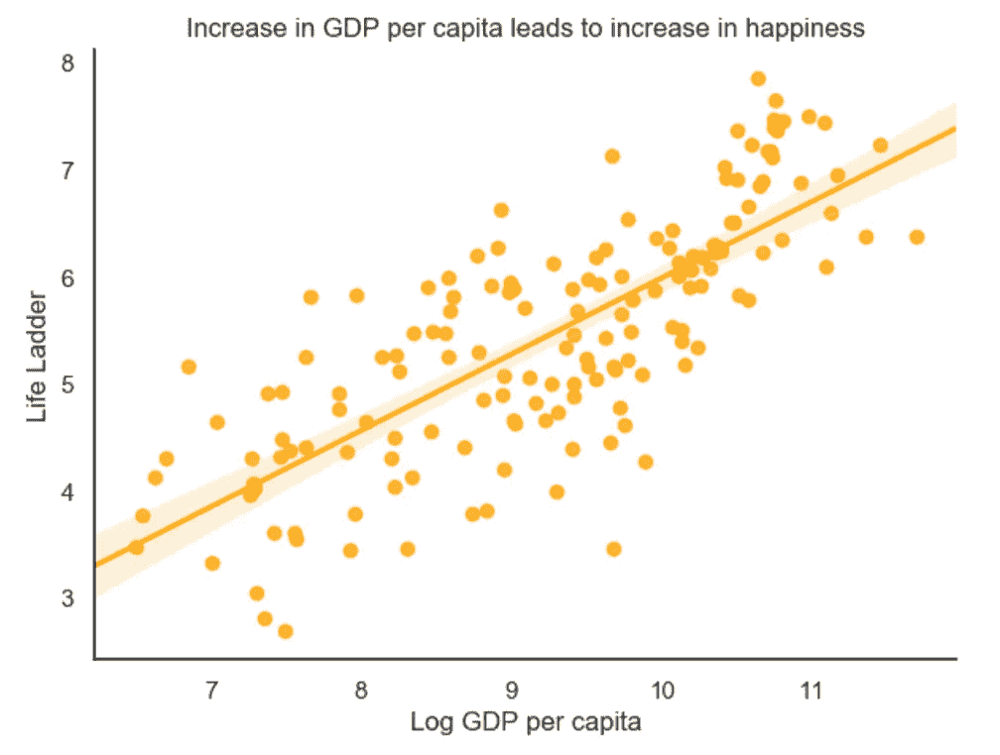

**2018:** Regplot showing how Life Ladder **(Happiness)** is positively correlated with Log GDP per capita **(Money)**

在今天的文章中，我们将探讨用 Python 绘制数据的三种不同方式。我们将利用 2019 年世界幸福报告[中的数据来完成这项工作。我用 Gapminder 和维基百科上的信息丰富了《世界幸福报告》的数据，以便探索新的关系和可视化。](https://worldhappiness.report/ed/2019/)

《世界幸福报告》试图回答哪些因素影响着全世界的幸福。

> 在报告中，幸福被定义为对“坎特里尔阶梯问题”的回答，该问题要求受访者在 0 到 10 的范围内评估他们今天的生活，最糟糕的生活为 0，最好的生活为 10。

在整篇文章中，我将使用`**Life Ladder**`作为目标变量。每当我们谈论人生阶梯时，想想幸福。

# 文章的结构


Photo by [Nik MacMillan](https://unsplash.com/@nikarthur?utm_source=medium&utm_medium=referral) on [Unsplash](https://unsplash.com?utm_source=medium&utm_medium=referral)

这篇文章旨在作为一个代码指南和一个参考点，供您在需要查找特定类型的情节时参考。为了节省空间，我有时会将多个图表合并成一个图像。不过放心，你可以在这个[回购](https://github.com/FBosler/AdvancedPlotting)或者对应的 [Jupyter 笔记本](https://nbviewer.jupyter.org/github/FBosler/AdvancedPlotting/blob/master/The%20quick%2C%20the%20pretty%2C%20and%20the%20awesome.ipynb)里找到所有的底层代码。

## 目录

*   [我的 Python 绘图史](#b330)
*   [分布的重要性](#b300)
*   [加载数据和包导入](#80b8)
*   [**快速:**与熊猫的基本标图](#93e3)

*   [**牛逼:**用 plotly 创造牛逼的互动剧情](#86fa)

我用超链接连接了文章的不同部分，所以如果你不关心介绍，可以直接跳到绘图部分。我不做评判。

# 我的 Python 绘图史


Photo by [Krys Amon](https://unsplash.com/@krysamon?utm_source=medium&utm_medium=referral) on [Unsplash](https://unsplash.com?utm_source=medium&utm_medium=referral)

我大概两年前开始比较认真的学习 Python。从那以后，几乎没有一个星期我不惊叹于 Python 本身的简单和易用性，或者生态系统中许多令人惊叹的开源库之一。我熟悉的命令、模式和概念越多，一切就越有意义。

## Matplotlib

用 Python 绘图则正好相反。最初，我用 Matplotlib 创建的几乎每个图表看起来都像是 80 年代逃脱的犯罪。更糟糕的是，为了创造这些令人厌恶的东西，我通常要在 Stackoverflow 上花上几个小时。例如，研究一些具体的命令来改变 x 轴的倾斜度，或者做一些类似的傻事。别让我从多图表开始。结果看起来令人印象深刻，以编程方式创建这些图表是一种奇妙的感觉。例如，一次为不同的变量生成 50 个图表。然而，这是如此多的工作，需要你记住一大堆无用的命令。

## 海生的

了解到 [Seaborn](https://seaborn.pydata.org/) 是一种解脱。Seaborn 抽象掉了许多微调。毫无疑问，由此产生的图表的美感是一个巨大的飞跃。但是，它也是建立在 Matplotlib 之上的。通常，对于非标准调整，仍然有必要深入到类似于机器级 matplotlib 代码的地方。

## 散景

时间匆匆一瞥，我以为[散景](https://docs.bokeh.org/en/latest/)会成为我的 goto 解决方案。我在研究地理空间可视化的时候遇到了散景。然而，我很快意识到，Bokeh 虽然不同，但和 matplotlib 一样愚蠢地复杂。

## Plotly

不久前，我确实尝试过 [plot.ly](https://plot.ly/python/) (从现在开始称为 plotly)。同时，再次致力于地理空间数据的可视化。那时候，它似乎比前面提到的图书馆更荒谬。你需要一个帐户，必须通过你的笔记本登录，然后 plotly 会在网上渲染一切。然后，您可以下载生成的图表。我迅速丢弃 plotly。然而，最近，我偶然发现了一个关于 plotly express 和 plotly 4.0 的 [Youtube 视频](https://www.youtube.com/watch?v=5Cw4JumJTwo)，其中最重要的是，他们摆脱了所有这些在线废话。我摆弄了一下，这篇文章就是它的成果。我想，迟到总比不到好。

## Kepler.gl(地理空间数据荣誉奖)

虽然不是 Python 库，但 Kepler.gl 是一个强大的基于网络的地理空间数据可视化工具。您所需要的只是 CSV 文件，您可以使用 Python 轻松创建这些文件。试试看！

## 我当前的工作流程

最终，我决定使用 Pandas native plotting 进行快速检查，使用 Seaborn 制作我想在报告和演示中使用的图表(视觉效果很重要)。

# 分布的重要性


Photo by [Jonny Caspari](https://unsplash.com/@jonnysplsh?utm_source=medium&utm_medium=referral) on [Unsplash](https://unsplash.com?utm_source=medium&utm_medium=referral)

我在圣地亚哥学习时教统计学(Stats 119)。统计 119 是统计学的入门课程。课程包括统计基础知识，如数据聚合(视觉和定量)，几率和概率的概念，回归，抽样，以及最重要的**分布**。这一次，我对数量和现象的理解几乎完全转移到了基于分布(大部分时间是高斯分布)的表述上。

时至今日，我发现这两个量的意义相差如此之远令人惊讶，标准差可以让你抓住一个现象。仅仅知道这两个数字，就可以简单地得出一个特定结果的可能性有多大。人们马上就知道大部分结果会在哪里。它给你一个参考框架来快速区分轶事事件和具有统计意义的事件，而不必通过过于复杂的计算。

一般来说，当面对新数据时，我的第一步是试图可视化它的分布，以便很好地理解数据。

# 加载数据和包导入


Photo by [Kelli Tungay](https://unsplash.com/@kellitungay?utm_source=medium&utm_medium=referral) on [Unsplash](https://unsplash.com?utm_source=medium&utm_medium=referral)

让我们加载我们将在整篇文章中使用的数据。我对数据做了一些预处理。我在有意义的地方进行内插和外推。

```
**# Load the data**
data = pd.read_csv('[https://raw.githubusercontent.com/FBosler/AdvancedPlotting/master/combined_set.csv'](https://raw.githubusercontent.com/FBosler/AdvancedPlotting/master/combined_set.csv'))**# this assigns labels per year**
data['Mean Log GDP per capita']  = data.groupby('Year')['Log GDP per capita'].transform(
    pd.qcut,
    q=5,
    labels=(['Lowest','Low','Medium','High','Highest'])
)
```

数据集包含以下列的值:

*   **年份:**计量年份(从 2007 年到 2018 年)
*   **人生阶梯:**受访者根据坎特里尔阶梯，用 0 到 10 分(10 分最好)来衡量他们今天的生活价值
*   **对数人均国内生产总值:**人均国内生产总值按购买力平价(PPP)计算，按 2011 年不变国际美元进行调整，取自世界银行于 2018 年 11 月 14 日发布的《世界发展指标(WDI)》
*   **社会支持:**问题回答:“如果你遇到了麻烦，你有亲戚或朋友可以在你需要的时候帮你吗？”
*   **出生时的健康预期寿命:**出生时的预期寿命是根据世界卫生组织(世卫组织)全球卫生观察数据库的数据构建的，其中包含 2005 年、2010 年、2015 年和 2016 年的数据。
*   做出生活选择的自由:对问题的回答:“你对选择如何生活的自由感到满意还是不满意？”
*   **慷慨:**对“在过去的一个月里，你有没有向慈善机构捐过钱？”与人均国内生产总值相比
*   **对腐败的看法:**对“腐败在政府中是否普遍存在？”以及“企业内部的腐败是否普遍？”
*   **积极影响:**包括前一天快乐、欢笑和享受的平均频率。
*   **负面影响:**包括前一天焦虑、悲伤和愤怒的平均频率。
*   **对国家政府的信心:**不言自明
*   民主品质:一个国家有多民主
*   交付质量:一个国家的政策交付情况如何
*   **Gapminder 预期寿命:**来自 Gapminder 的预期寿命
*   **Gapminder 人口:**一国人口

## 进口

```
import plotly
import pandas as pd
import numpy as np
import seaborn as sns
import plotly.express as pximport matplotlib%matplotlib inlineassert matplotlib.__version__ == "3.1.0","""
Please install matplotlib version 3.1.0 by running:
1) !pip uninstall matplotlib 
2) !pip install matplotlib==3.1.0
"""
```

# 快速:熊猫的基本绘图


Photo by [Marvin Meyer](https://unsplash.com/@marvelous?utm_source=medium&utm_medium=referral) on [Unsplash](https://unsplash.com?utm_source=medium&utm_medium=referral)

andas 有内置的绘图功能，可以在系列或数据帧上调用。我喜欢这些绘图功能的原因是它们简洁，使用了相当智能的默认设置，并且能够快速给出正在发生的事情的想法。

要创建一个图，在数据上调用`.plot(kind=<TYPE OF PLOT>)`,如下所示:

```
np.exp(data[data['Year']==2018]['Log GDP per capita']).plot(
    **kind='hist'**
)
```

运行上面的命令将产生下面的图表。

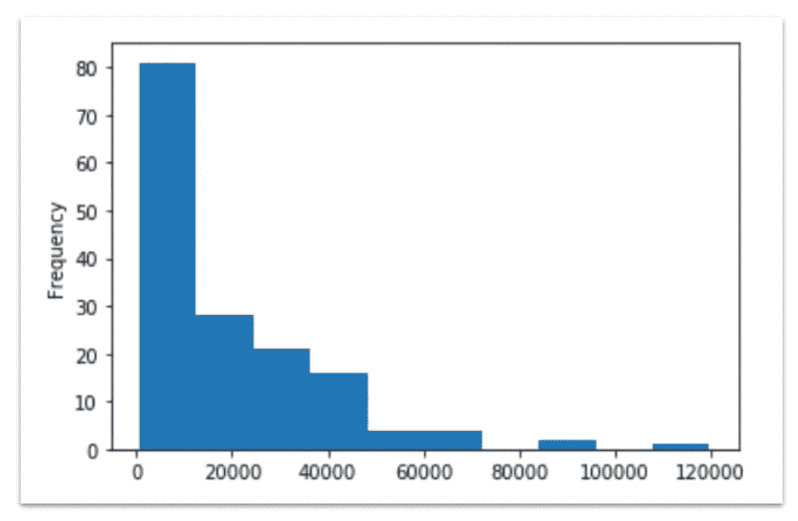

**2018:** Histogram of the number of countries per GDP per Capita bucket. Not surprisingly, most countries are poor!

在绘制熊猫图时，我使用了五个主要参数:

*   `**kind**` **:** 熊猫已经知道你要创造什么样的剧情，以下选项可用`hist, bar, barh, scatter, area, kde, line, box, hexbin, pie`。
*   `**figsize**` **:** 允许覆盖 6 英寸宽、4 英寸高的默认输出尺寸。`figsize`期望一个元组(例如，我经常使用的`figsize=(12,8)`)
*   `**title**` **:** 给图表添加标题。大多数时候，我用这个来澄清图表中显示的任何内容，这样当我回到图表中时，我可以很快确定发生了什么。`title`需要一个字符串。
*   `**bins**` **:** 允许覆盖直方图的框宽度。`bins`需要一个列表或类似列表的值序列(例如，`bins=np.arange(2,8,0.25)`)
*   `**xlim/ylim**` **:** 允许覆盖轴的最大值和最小值的默认值。`xlim`和`ylim`都需要一个元组(例如`xlim=(0,5)`)

让我们快速浏览不同类型的可用图。

## 垂直条形图

```
data[
    data['Year'] == 2018
].set_index('Country name')['Life Ladder'].nlargest(15).plot(
    kind='bar',
    figsize=(12,8)
)
```

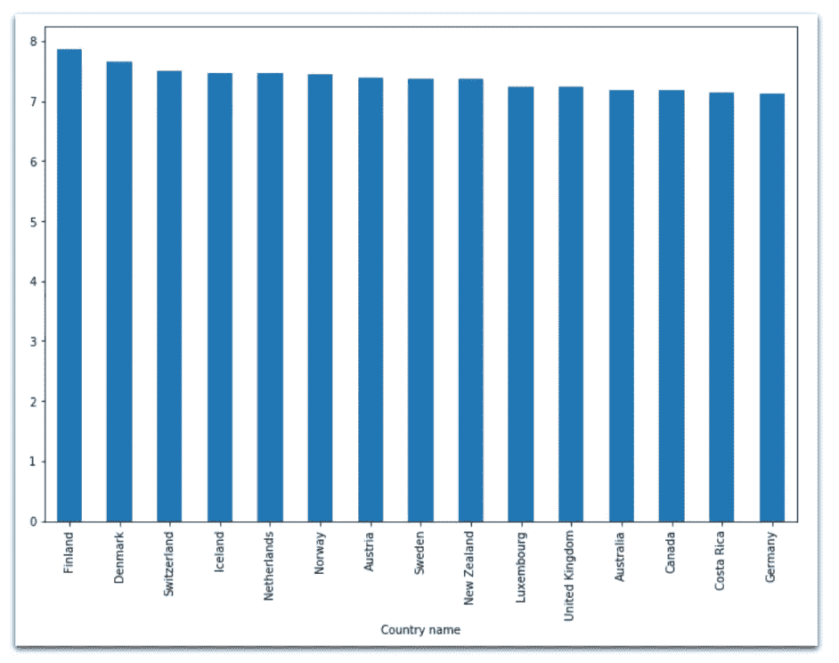

**2018:** List of 15 happiest countries is led by Finnland

## 水平条形图

```
np.exp(data[
    data['Year'] == 2018
].groupby('Continent')['Log GDP per capita']\
       .mean()).sort_values().plot(
    kind='barh',
    figsize=(12,8)
)
```

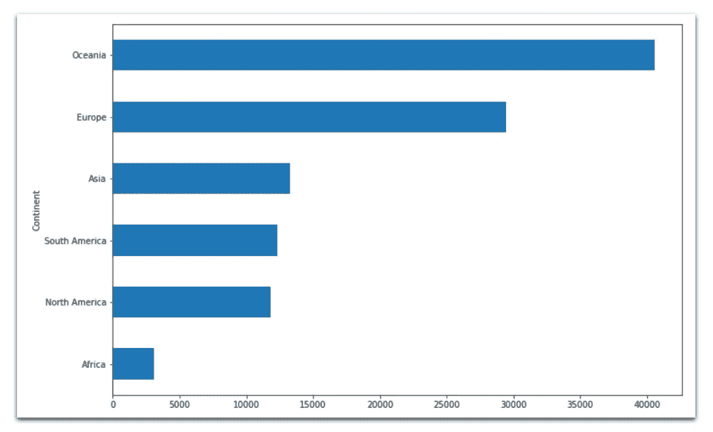

Average GDP per capita by continent in 2011 USD Dollars clearly led by Australia and New Zealand

## 箱形图

```
data['Life Ladder'].plot(
    kind='box',
    figsize=(12,8)
)
```

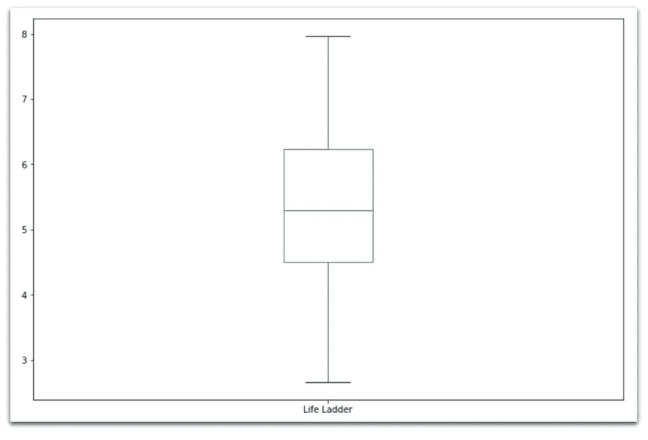

Box plot of the distribution of Life Ladder shows that the median is somewhere around 5.5 ranging from values below 3 to up 8.

## 散点图

```
data[['Healthy life expectancy at birth','Gapminder Life Expectancy']].plot(
    kind='scatter',
    x='Healthy life expectancy at birth',
    y='Gapminder Life Expectancy',
    figsize=(12,8)
)
```

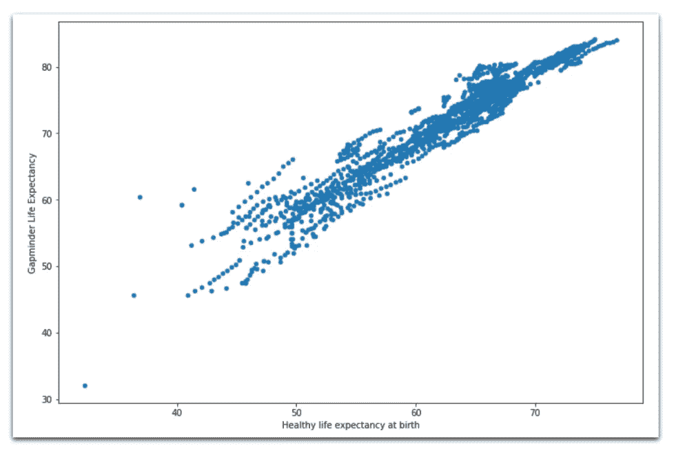

Scatter plot of the World Happiness Report life expectation against the Gapminder life expectation shows a high correlation between the two (to be expected)

## 赫克宾图表

```
data[data['Year'] == 2018].plot(
    kind='hexbin',
    x='Healthy life expectancy at birth',
    y='Generosity',
    C='Life Ladder',
    gridsize=20,
    figsize=(12,8),
    cmap="Blues", # defaults to greenish
    sharex=False # required to get rid of a bug
)
```

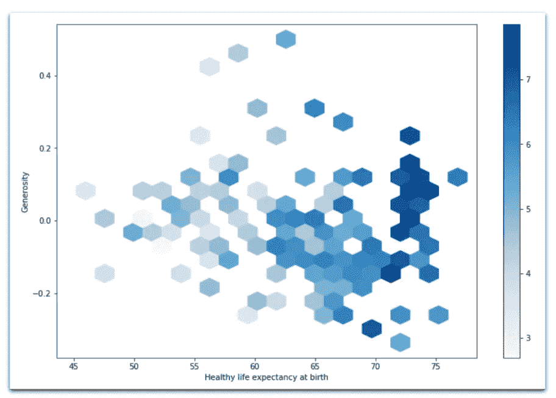

**2018:** Hexbin plot, plotting life expectancy against generosity. The color of bins indicates the average of life ladder in the respective bin.

## 圆形分格统计图表

```
data[data['Year'] == 2018].groupby(
    ['Continent']
)['Gapminder Population'].sum().plot(
    kind='pie',
    figsize=(12,8),
    cmap="Blues_r", # defaults to orangish
)
```

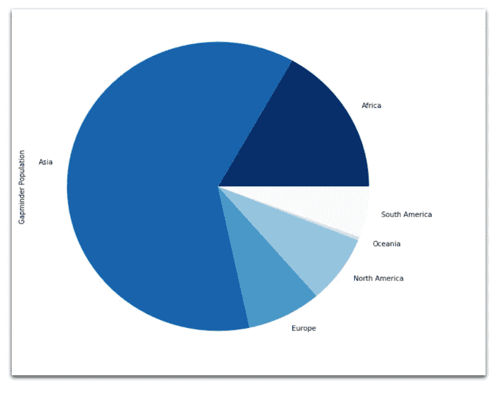

**2018:** Pie chart showing the total population by continent

## 堆积面积图

```
data.groupby(
    ['Year','Continent']
)['Gapminder Population'].sum().unstack().plot(
    kind='area',
    figsize=(12,8),
    cmap="Blues", # defaults to orangish
)
```

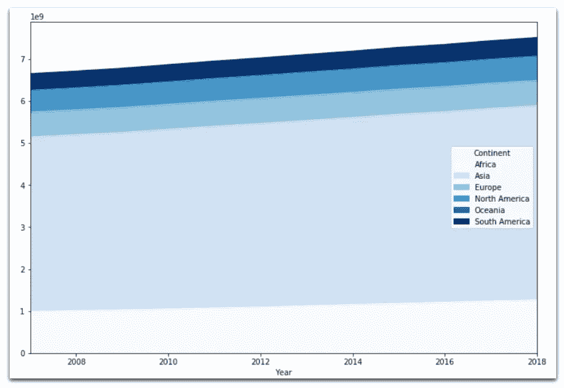

Population numbers accross the globe are on the rise.

## 折线图

```
data[
    data['Country name'] == 'Germany'
].set_index('Year')['Life Ladder'].plot(
    kind='line',
    figsize=(12,8)
)
```

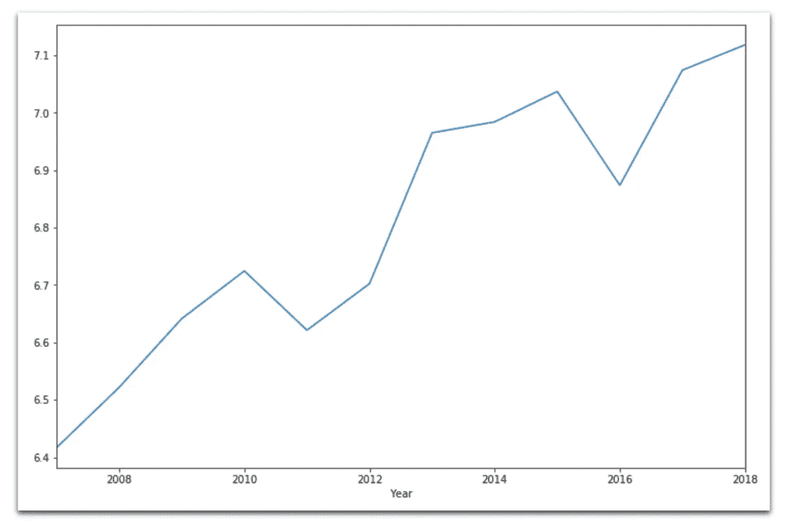

Line chart depicting the development of happiness in Germany.

## 关于用熊猫绘图的结论

用熊猫绘图很方便。它很容易访问，而且速度很快。情节相当丑陋。偏离缺省值几乎是不可能的，这没关系，因为我们有其他工具来制作更美观的图表。继续前往锡伯恩。

# 漂亮:与 Seaborn 的高级绘图


Photo by [Pavel Nekoranec](https://unsplash.com/@sur_le_misanthrope?utm_source=medium&utm_medium=referral) on [Unsplash](https://unsplash.com?utm_source=medium&utm_medium=referral)

eaborn 利用绘图默认值。要确保您的结果与我的匹配，请运行以下命令。

```
sns.reset_defaults()
sns.set(
    rc={'figure.figsize':(7,5)}, 
    style="white" # nicer layout
)
```

## 绘制单变量分布

如前所述，我是发行版的忠实粉丝。直方图和核密度分布都是可视化特定变量关键特征的有效方法。让我们看看如何在一个图表中生成单个变量的分布或多个变量的分布。

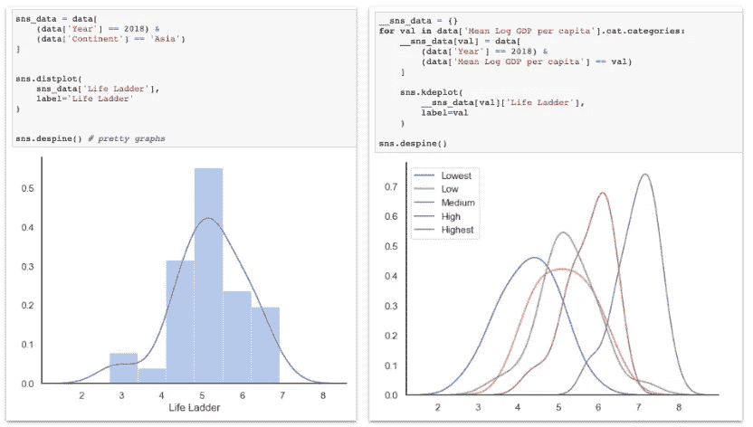

**Left chart:** Histogram and kernel density estimation of “Life Ladder” for Asian countries in 2018; **Right chart:** Kernel density estimation of “Life Ladder” for five buckets of GDP per Capita — Money can buy happiness

## 绘制二元分布

每当我想直观地探索两个或多个变量之间的关系时，通常会归结为某种形式的散点图和对分布的评估。概念上相似的图有三种变化。在这些图中，中心图(散点图、双变量 KDE 图和 hexbin 图)有助于理解两个变量之间的联合频率分布。此外，在中心图的右上方边界，描绘了相应变量的边际单变量分布(作为 KDE 或直方图)。

```
sns.jointplot(
    x='Log GDP per capita',
    y='Life Ladder',
    data=data,
    **kind='scatter' # or 'kde' or 'hex'**
)
```

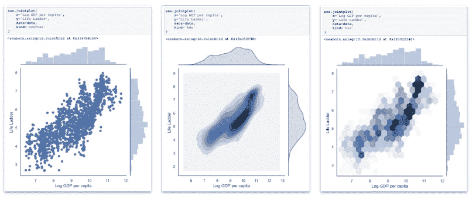

Seaborn jointplot with scatter, bivariate kde, and hexbin in the center graph and marginal distributions left and on top of the center graph.

## 散点图

散点图是一种可视化两个变量的联合密度分布的方法。我们可以通过添加色调在混合中添加第三个变量，通过添加大小参数添加第四个变量。

```
sns.scatterplot(
    x='Log GDP per capita',
    y='Life Ladder',
    data=data[data['Year'] == 2018],    
    hue='Continent',size='Gapminder Population'
)**# both, hue and size are optional**
sns.despine() **# prettier layout**
```

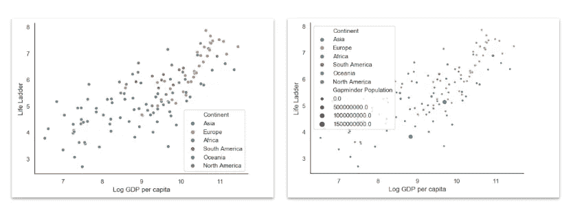

Log GDP per capita against Life Ladder, colors based on the continent and size on population

## 小提琴情节

小提琴图是箱线图和核密度估计的组合。它的作用类似于一个方框图。它显示了定量数据在分类变量中的分布，以便对这些分布进行比较。

```
sns.set(
    rc={'figure.figsize':(18,6)}, 
    style="white"
)sns.violinplot(
    x='Continent',
    y='Life Ladder',
    hue='Mean Log GDP per capita',
    data=data
)sns.despine()
```

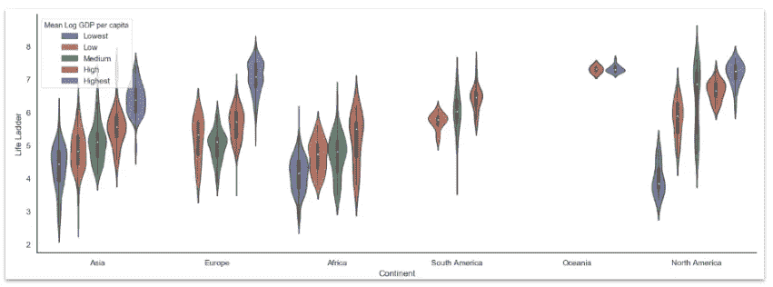

Violin plot where we plot continents against Life Ladder, we use the Mean Log GDP per capita to group the data. It looks like a higher GDP per capita makes for higher happiness

## 配对图

Seaborn pair 图在一个大网格中绘制两变量散点图的所有组合。我通常觉得这有点信息超载，但它有助于发现模式。

```
sns.set(
    style="white", 
    palette="muted", 
    color_codes=True
)sns.pairplot(
    data[data.Year == 2018][[
        'Life Ladder','Log GDP per capita', 
        'Social support','Healthy life expectancy at birth', 
        'Freedom to make life choices','Generosity', 
        'Perceptions of corruption', 'Positive affect',
        'Negative affect','Confidence in national government',
        'Mean Log GDP per capita'
    ]].dropna(), 
    hue='Mean Log GDP per capita'
)
```

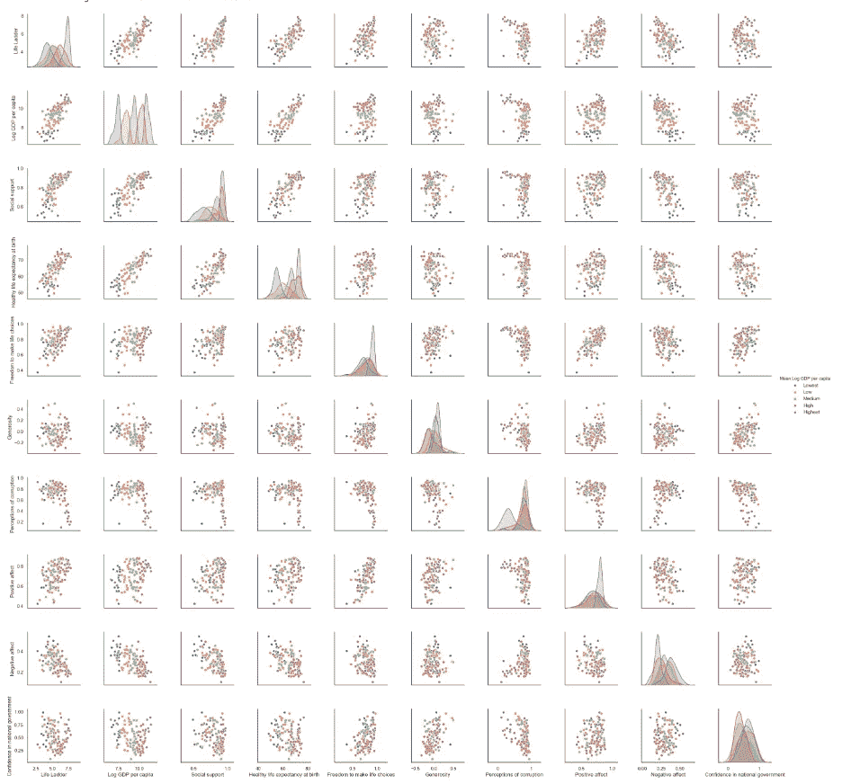

Seaborn scatterplot grid where all selected variables a scattered against every other variable in the lower and upper part of the grid, the diagonal contains a kde plot.

## 小平面网格

对我来说，Seaborn 的 FacetGrid 是使用 Seaborn 的最有说服力的理由之一，因为它使创建多情节变得轻而易举。在 pair 图中，我们已经看到了一个 FacetGrid 的例子。FacetGrid 允许创建多个由变量分割的图表。例如，行可以是一个变量(人均 GDP 类别)，列可以是另一个变量(大陆)。

它确实需要比我个人喜欢的多一点的定制(例如，使用 matplotlib)，但它仍然是令人信服的。

**面网格—线状图**

```
g = sns.FacetGrid(
    data.groupby(['Mean Log GDP per capita','Year','Continent'])['Life Ladder'].mean().reset_index(),
    row='Mean Log GDP per capita',
    col='Continent',
    margin_titles=True
)
g = (g.map(plt.plot, 'Year','Life Ladder'))
```

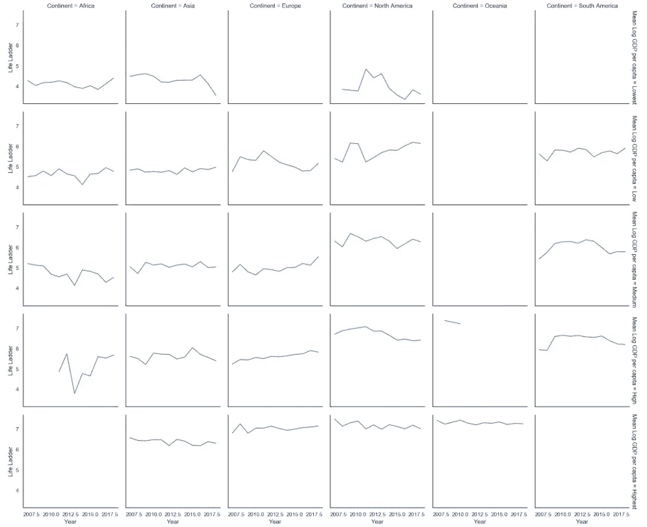

Life Ladder on the Y-axis, Year on the X-axis. The grid’s columns are the continent, and the grid’s rows are the different levels of Mean Log GDP per capita. Overall things seem to be getting better for the countries with a **Low** Mean Log GDP per Capita in **North America** and the countries with a **Medium or High** Mean Log GDP per Capita in **Europe**

**FacetGrid —直方图**

```
g = sns.FacetGrid(data, col="Continent", col_wrap=3,height=4)
g = (g.map(plt.hist, "Life Ladder",bins=np.arange(2,9,0.5)))
```

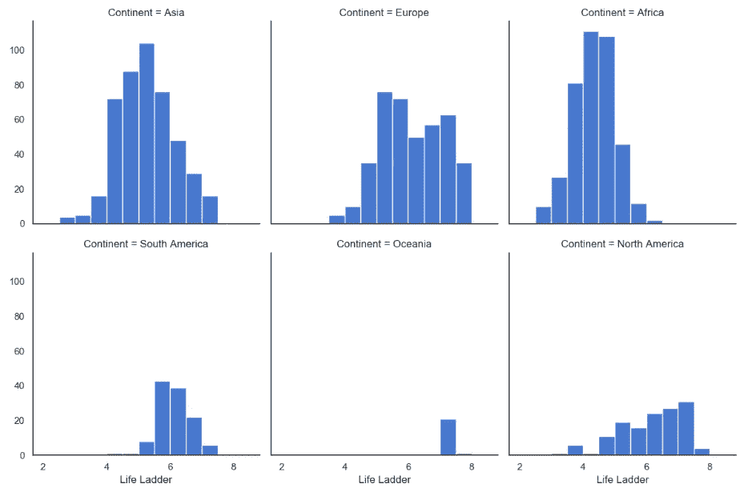

FacetGrid with a histogram of LifeLadder by continent

**FacetGrid —带注释的 KDE 图**

还可以向网格中的每个图表添加特定于方面的符号。在下面的示例中，我们添加了平均值和标准偏差，并在平均值处画了一条垂直线(代码如下)。


Life Ladder kernel density estimation based on the continent, annotated with a mean and standard deviation

Draw a vertical mean line and annotation

**FacetGrid —热图图**

我最喜欢的绘图类型之一是热点图 FacetGrid，即网格中每个方面的热点图。这种类型的绘图对于在一个单独的绘图中可视化四个维度和一个指标非常有用。代码有点麻烦，但可以根据您的需要快速调整。值得注意的是，这种图表需要相对大量的数据或适当的分段，因为它不能很好地处理缺失值。

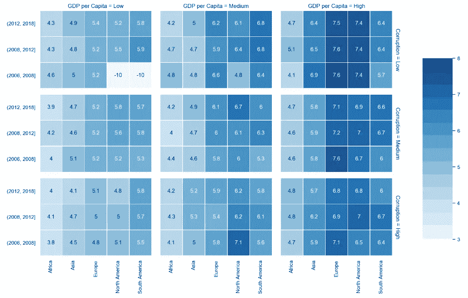

Facet heatmap, visualizing on the outer rows a year range, outer columns the GDP per Capita, on the inner rows the level of perceived corruption and the inner columns the continents. We see that happiness increases towards the top right (i.e., high GDP per Capita and low perceived corruption). The effect of time is not definite, and some continents (Europe and North America) seem to be happier than others (Africa).

heatmap_facetgrid.py

# 牛逼:用 plotly 创造牛逼的互动情节


Photo by [Chris Leipelt](https://unsplash.com/@cleipelt?utm_source=medium&utm_medium=referral) on [Unsplash](https://unsplash.com?utm_source=medium&utm_medium=referral)

终于，再也没有 Matplotlib 了！Plotly 有三个重要特征:

*   **悬停**:当悬停在图表上时，会弹出注释
*   **交互性:**无需任何额外的设置，图表可以是交互式的(即穿越时间的旅程)
*   **漂亮的地理空间图表:** Plotly 已经内置了一些基本的制图功能，但是另外，人们可以使用 mapbox 集成来制作令人惊叹的图表。

## 散点图

我们通过运行`fig = x.<PLOT TYPE>(PARAMS)`和`fig.show()`来调用 plotly plots，如下所示:

```
fig = px.scatter(
    data_frame=data[data['Year'] == 2018], 
    x="Log GDP per capita", 
    y="Life Ladder", 
    size="Gapminder Population", 
    color="Continent",
    hover_name="Country name",
    size_max=60
)
fig.show()
```

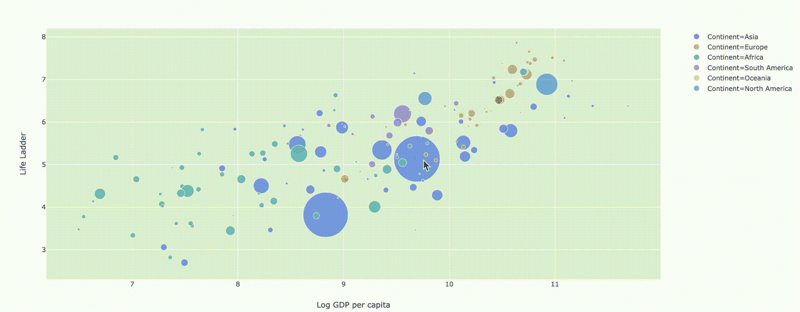

Plotly scatter plot, plotting Log GDP per capita against Life Ladder, where color indicates continent and size of the marker the population

## 散点图——漫步时光

```
fig = px.scatter(
    data_frame=data, 
    x="Log GDP per capita", 
    y="Life Ladder", 
    animation_frame="Year", 
    animation_group="Country name",
    size="Gapminder Population", 
    color="Continent", 
    hover_name="Country name", 
    facet_col="Continent",
    size_max=45,
    category_orders={'Year':list(range(2007,2019))}     
)fig.show()
```


Visualization of how the plotted data changes over the years

## 平行类别——可视化类别的有趣方式

```
def q_bin_in_3(col):
    return pd.qcut(
        col,
        q=3,
        labels=['Low','Medium','High']
    )_ = data.copy()
_['Social support'] = _.groupby('Year')['Social support'].transform(q_bin_in_3)_['Life Expectancy'] = _.groupby('Year')['Healthy life expectancy at birth'].transform(q_bin_in_3)_['Generosity'] = _.groupby('Year')['Generosity'].transform(q_bin_in_3)_['Perceptions of corruption'] = _.groupby('Year')['Perceptions of corruption'].transform(q_bin_in_3)_ = _.groupby(['Social support','Life Expectancy','Generosity','Perceptions of corruption'])['Life Ladder'].mean().reset_index()fig = px.parallel_categories(_, color="Life Ladder", color_continuous_scale=px.colors.sequential.Inferno)
fig.show()
```

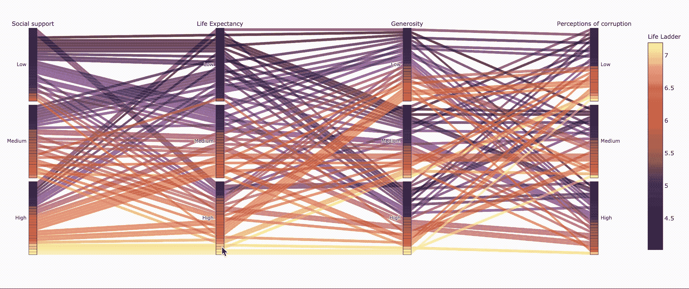

Seems like not all countries with high life expectations are happy!

## 条形图—交互式过滤器的一个示例

```
fig = px.bar(
    data, 
    x="Continent", 
    y="Gapminder Population", 
    color="Mean Log GDP per capita", 
    barmode="stack", 
    facet_col="Year",
    category_orders={"Year": range(2007,2019)},
    hover_name='Country name',
    hover_data=[
        "Mean Log GDP per capita",
        "Gapminder Population",
        "Life Ladder"
    ]
)
fig.show()
```

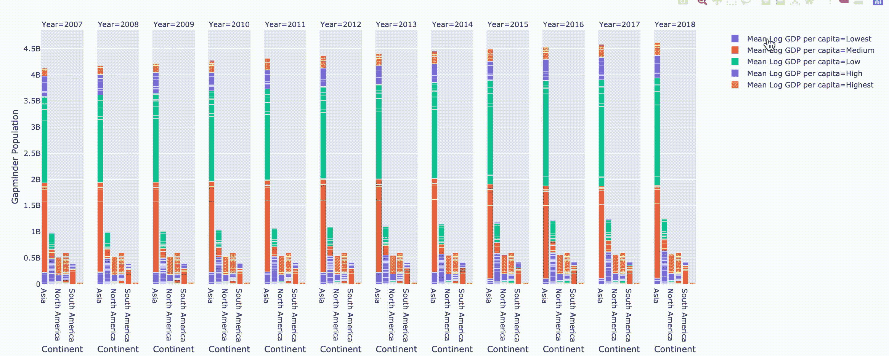

Filtering a bar chart is easy. Not surprisingly, South Korea is among the wealthy countries in Asia.

## Choropleth 图——幸福如何随时间变化

```
fig = px.choropleth(
    data, 
    locations="ISO3", 
    color="Life Ladder", 
    hover_name="Country name", 
    animation_frame="Year")fig.show()
```

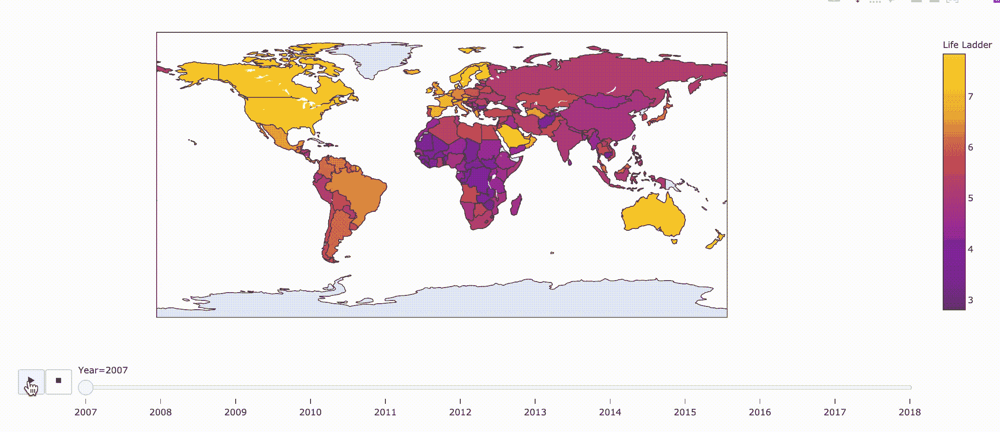

Map visualization of how happiness evolves over the years. **Syria and Afghanistan are at the very end of the Life Ladder** range (unsurprisingly)

# 总结和结束语

今天到此为止。在本文中，您学习了如何成为一名真正的 Python 可视化忍者。你学会了如何更有效地进行快速探索，以及如何在该死的董事会开会时制作更漂亮的图表。您学习了如何创建交互式 plotly 图表，这在绘制地理空间数据时尤其有用。

如果你发现了一些奇妙的新的可视化效果，想要给出反馈，或者只是简单地聊聊天，请在 LinkedIn 上联系我。

如果你喜欢你所读的，看看我在 Medium 上写的其他文章。