# 用 5 个简单的步骤制作武器探测器

> 原文：<https://towardsdatascience.com/plug-and-play-object-detection-code-in-5-simple-steps-f1975804373e?source=collection_archive---------11----------------------->

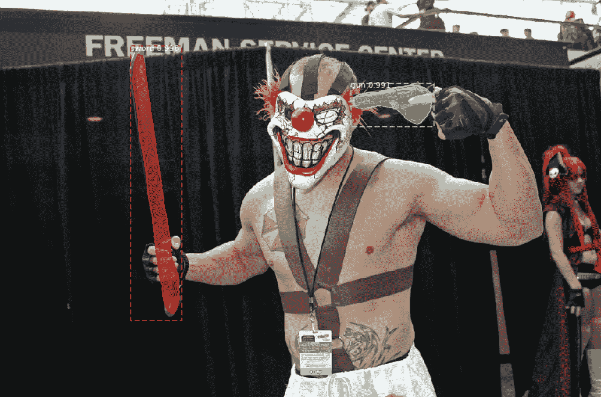

[Source](https://storage.googleapis.com/openimages/web/index.html)

## 目标检测

## 在自定义数据集上使用 mask-RCNN 进行目标检测

对象检测是编码库中的一个有用工具。

它构成了许多奇妙工业应用的基础。其中一些是自动驾驶汽车、医学成像和人脸检测。

在我上一篇关于物体检测的文章中，我谈到了物体检测模型是如何发展的。

但是如果我们不能实现它，理论有什么用呢？

***这篇文章是关于在我们定制的武器数据集上实现并获得一个物体探测器。***

我们今天要特别解决的问题是使用 Mask-RCNN 的实例分割。

# 实例分割

*我们可以为图像中的每个物体创建* **蒙版** *吗？具体来说就是:*


解决这个问题最常见的方法是使用 Mask-RCNN。Mask-RCNN 的架构如下所示:


[Source](https://medium.com/@jonathan_hui/image-segmentation-with-mask-r-cnn-ebe6d793272)

基本上，它包括:

*   像 resnet50/resnet101 这样的主干网络
*   区域提案网络
*   ROI-对齐层
*   两个输出图层-一个用于预测掩膜，一个用于预测类和边界框。

还有很多事情要做。如果你想了解更多的理论，请阅读我的上一篇文章。

[](/a-hitchhikers-guide-to-object-detection-and-instance-segmentation-ac0146fe8e11) [## 为数据科学家揭秘对象检测和实例分割

### 简单解释！！！我试过了

towardsdatascience.com](/a-hitchhikers-guide-to-object-detection-and-instance-segmentation-ac0146fe8e11) 

这篇文章主要是关于[代码](https://github.com/MLWhiz/object_detection)。

# 1.为实例分段创建自定义数据集


Our Dataset

我们将要研究的用例是一个武器探测器。武器探测器是一种可以与街头摄像机和闭路电视一起使用来打击犯罪的东西。所以它非常漂亮。

因此，我开始从[开放图像数据集](https://storage.googleapis.com/openimages/web/index.html)下载 40 张枪和剑的图像，并使用 VIA 工具对它们进行注释。现在在 VIA 中设置注释项目是非常重要的，所以我将尝试一步一步地解释它。

## 1.通过设置

VIA 是一个注释工具，使用它你可以注释图像的边界框和遮罩。我发现它是最好的注释工具之一，因为它是在线的，可以在浏览器中运行。

要使用它，打开[http://www.robots.ox.ac.uk/~vgg/software/via/via.html](http://www.robots.ox.ac.uk/~vgg/software/via/via.html)

您将看到如下页面:

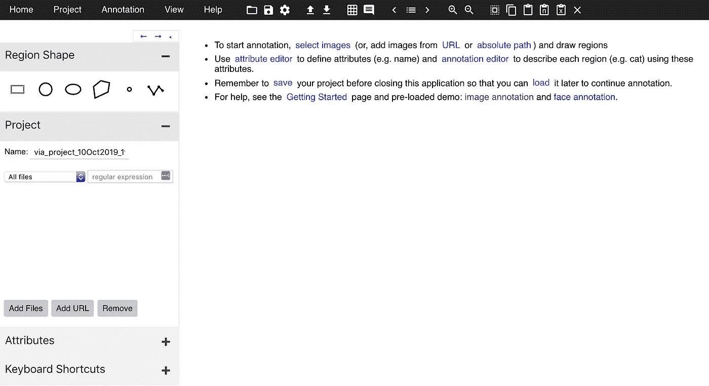

接下来我们要做的是在 region_attributes 中添加不同的类名。在这里，我根据我们的用例添加了“枪”和“剑”,因为这是我想要注释的两个不同的目标。

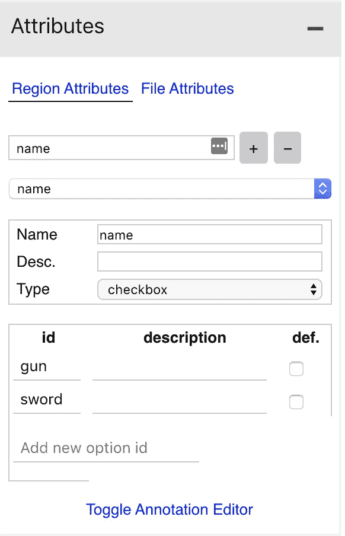

## 2.注释图像

我把所有的文件都放在了文件夹`data`里。下一步是添加我们想要注释的文件。我们可以使用 VIA 工具中的“添加文件”按钮在`data`文件夹中添加文件。并在选择折线工具后开始标注标签，如下所示。

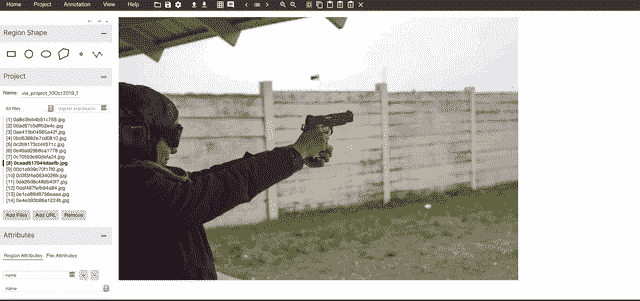

Click, Click, Enter, Escape, Select

## 3.下载注释文件

点击 VIA 工具顶部菜单上的`save project`。

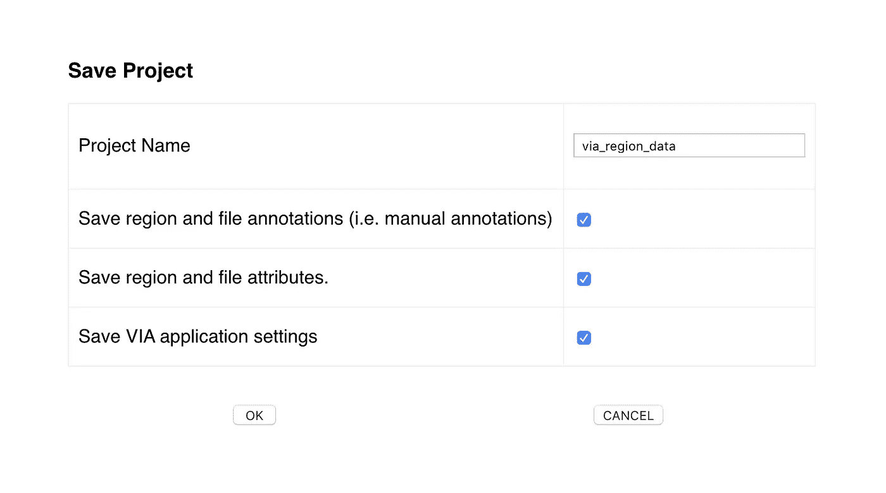

通过更改项目名称字段，将文件另存为`via_region_data.json`。这将把注释保存为 COCO 格式。

## 4.设置数据目录结构

我们将需要首先设置数据目录，以便我们可以进行对象检测。在下面的代码中，我创建了一个我们将要使用的模型所需要的目录结构。

运行上述代码后，我们将获得以下文件夹结构中的数据:

```
- procdata
     - train
         - img1.jpg
         - img2.jpg
         - via_region_data.json
     - val
         - img3.jpg
         - img4.jpg
         - via_region_data.json
```

# 2.设置编码环境

我们将使用来自`[matterport/Mask_RCNN](https://github.com/matterport/Mask_RCNN)` GitHub 库的代码。您可以从克隆存储库和安装所需的库开始。

```
git clone [https://github.com/matterport/Mask_RCNN](https://github.com/matterport/Mask_RCNN)
cd Mask_RCNN
pip install -r requirements.txt
```

一旦我们完成了依赖项的安装和 repo 的克隆，我们就可以开始实现我们的项目了。

我们在`Mask_RCNN`文件夹中复制了一份`samples/balloon`目录，并创建了一个`***samples/guns_and_swords***` 目录，我们将在这里继续我们的工作:

```
cp -r samples/balloon ***samples/guns_and_swords***
```

## 设置代码


Yes. We are doing AI

我们从重命名开始，将`***samples/guns_and_swords***` ***目录中的 balloon.py 改为*** `***gns*.py**`。`balloon.py`文件现在只训练一个目标。我已经扩展到使用多个目标。在这个文件中，我们更改了:

1.  `balloonconfig`至`gnsConfig`
2.  `BalloonDataset`到`gnsDataset`:我们在这里修改了一些代码，以便从我们的注释数据中获取目标名称，并给出多个目标。
3.  以及`train`功能的一些变化

此处仅显示更改后的`gnsConfig`以让您有所了解。你可以在这里看一下整个`[gns.py](https://github.com/MLWhiz/data_science_blogs/blob/master/object_detection/guns_and_swords/gns.py)`代码。

# 3.可视化图像和遮罩

一旦我们完成了对`gns.py`文件的修改，我们就可以可视化我们的遮罩和图像了。简单按照这个`[Visualize Dataset.ipynb](https://github.com/MLWhiz/data_science_blogs/blob/master/object_detection/guns_and_swords/1.%20Visualize%20Dataset.ipynb)` [](https://github.com/MLWhiz/data_science_blogs/blob/master/object_detection/guns_and_swords/1.%20Visualize%20Dataset.ipynb)笔记本就可以了。

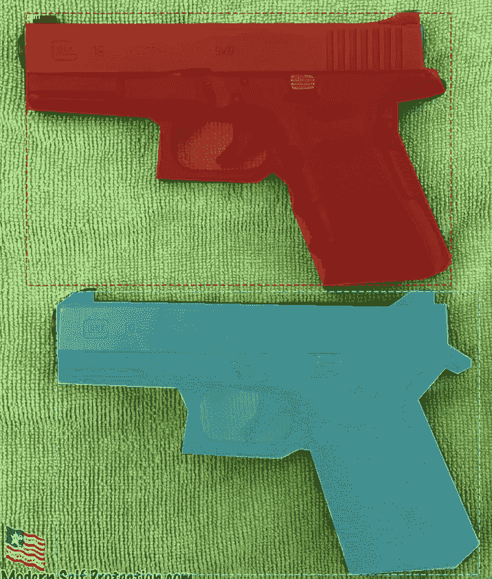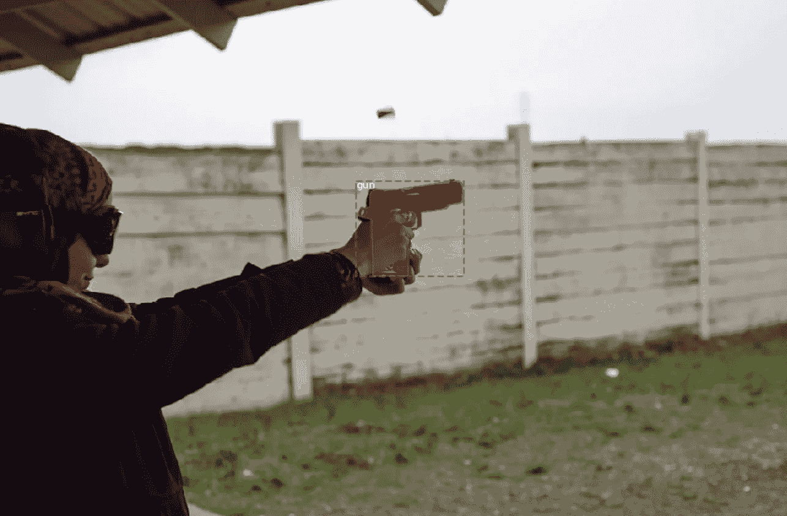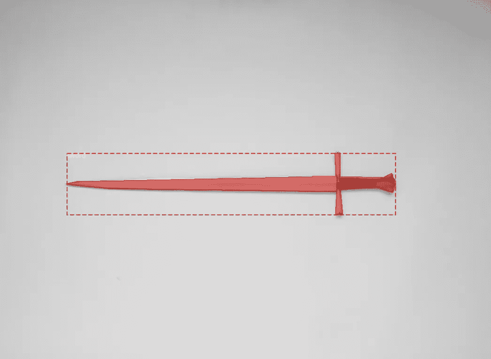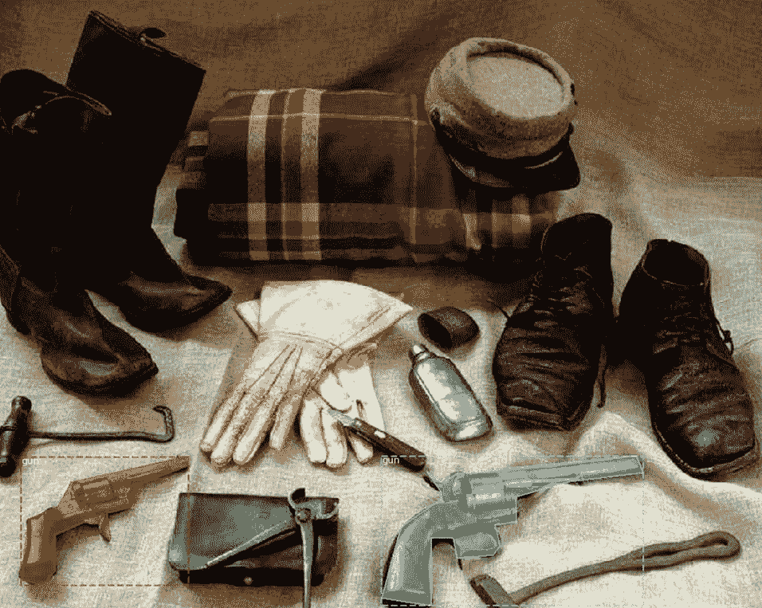

# 4.用迁移学习训练 MaskRCNN 模型

为了训练 maskRCNN 模型，在 Guns and Swords 数据集上，我们需要在命令行上运行以下命令之一，这取决于我们是否要用 COCO 权重或 imagenet 权重初始化我们的模型:

```
# Train a new model starting from pre-trained COCO weights
 python3 gns.py train — dataset=/path/to/dataset — weights=coco# Resume training a model that you had trained earlier
 python3 gns.py train — dataset=/path/to/dataset — weights=last# Train a new model starting from ImageNet weights
 python3 gns.py train — dataset=/path/to/dataset — weights=imagenet
```

与`weights=last`的命令将从最后一个纪元恢复训练。重量将保存在`Mask_RCNN`文件夹的`logs`目录中。

这就是我们最后一个纪元后的损失。

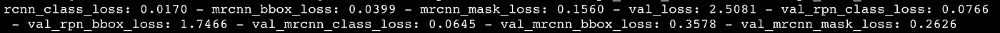

## 使用 Tensorboard 可视化损失

你可以利用 tensorboard 来可视化你的网络是如何运行的。只需运行:

```
tensorboard --logdir ~/objectDetection/Mask_RCNN/logs/gns20191010T1234
```

你可以在

```
[https://localhost:6006](https://localhost:6006)
```

这是我们面具损失的样子:

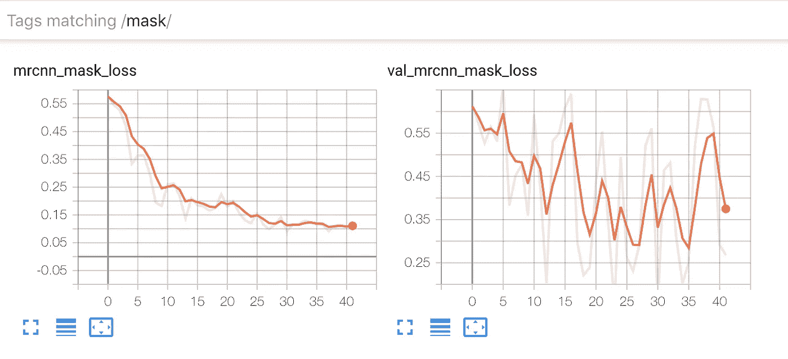

我们可以看到，验证损失表现得相当突然。这是意料之中的，因为我们在验证集中只保留了 20 张图像。

# 5.新图像预测

预测一个新的图像也很容易。使用我们训练过的模型，按照`[prediction.ipynb](https://github.com/MLWhiz/data_science_blogs/blob/master/object_detection/guns_and_swords/2.%20predict.ipynb)`笔记本来看一个最小的例子。下面是代码的主要部分。

这是验证集中一些图像的结果:

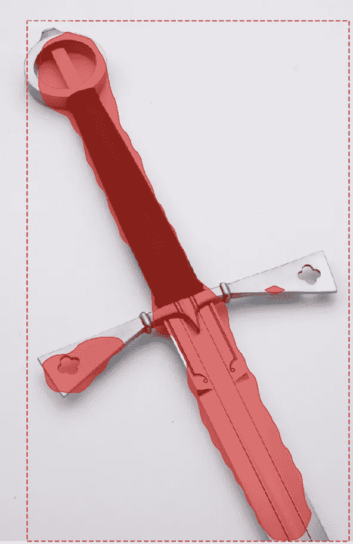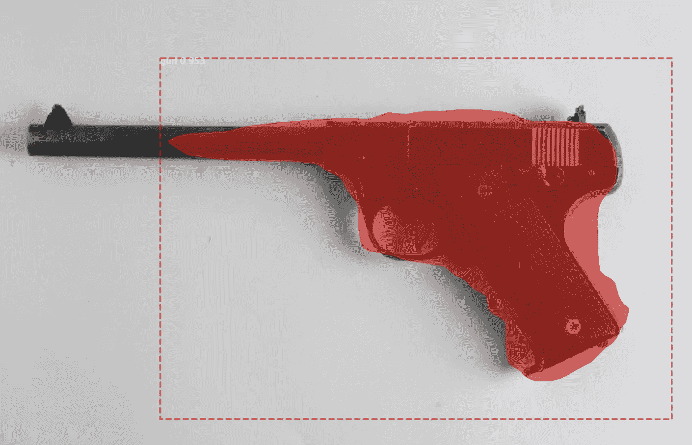

# 丰富

结果看起来不是很有希望，还有很多需要改进的地方，但这是意料之中的，因为训练数据非常少(60 张图像)。人们可以尝试做以下事情来提高这种武器探测器的模型性能。

1.  由于时间限制，我们只对 60 幅图像进行了训练。当我们使用迁移学习时，数据仍然太少——注释更多的数据。
2.  训练更多的时代和更长的时间。看看验证损失和培训损失是什么样子的。
3.  更改`Mask_RCNN`目录下`mrcnn/config` 文件中的超参数。关于这些超参数意味着什么的信息，看看我以前的帖子。你可以看看主要的几个:

```
# if you want to provide different weights to different losses
LOSS_WEIGHTS ={'rpn_class_loss': 1.0, 'rpn_bbox_loss': 1.0, 'mrcnn_class_loss': 1.0, 'mrcnn_bbox_loss': 1.0, 'mrcnn_mask_loss': 1.0}# Length of square anchor side in pixels
RPN_ANCHOR_SCALES = (32, 64, 128, 256, 512)# Ratios of anchors at each cell (width/height)
# A value of 1 represents a square anchor, and 0.5 is a wide anchor
RPN_ANCHOR_RATIOS = [0.5, 1, 2]
```

# 结论


Photo by [Christopher Gower](https://unsplash.com/@cgower?utm_source=medium&utm_medium=referral) on [Unsplash](https://unsplash.com?utm_source=medium&utm_medium=referral)

在这篇文章中，我谈到了如何使用 Mask-RCNN 为自定义数据集实现实例分割。

我试图使编码部分尽可能简单，并希望你发现代码有用。在本文的下一部分，我将使用 web 应用程序部署这个模型。敬请关注。

你可以在 Github 下载带注释的武器数据和代码。

如果你想了解更多关于各种 ***物体检测技术，运动估计，视频中的物体跟踪等*** 。，我想推荐这个关于计算机视觉深度学习[的很棒的课程](https://coursera.pxf.io/7mKnnY)

谢谢你的阅读。将来我也会写更多初学者友好的帖子。在 [**媒体**](https://medium.com/@rahul_agarwal) 关注我，或者订阅我的 [**博客**](http://eepurl.com/dbQnuX) 了解他们。一如既往，我欢迎反馈和建设性的批评，可以通过 Twitter [@mlwhiz](https://twitter.com/MLWhiz) 联系。

此外，一个小小的免责声明——在这篇文章中可能会有一些相关资源的附属链接，因为分享知识从来都不是一个坏主意。