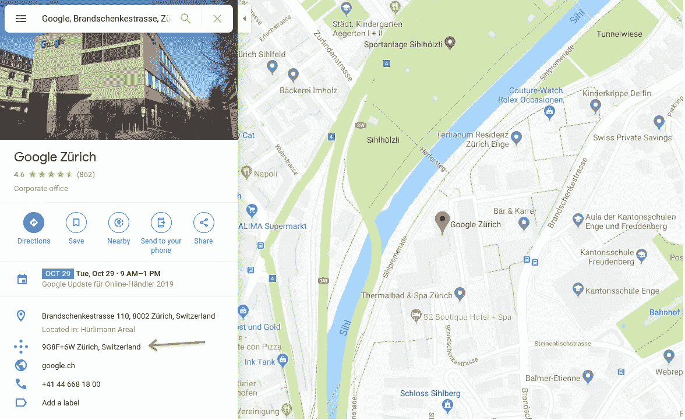
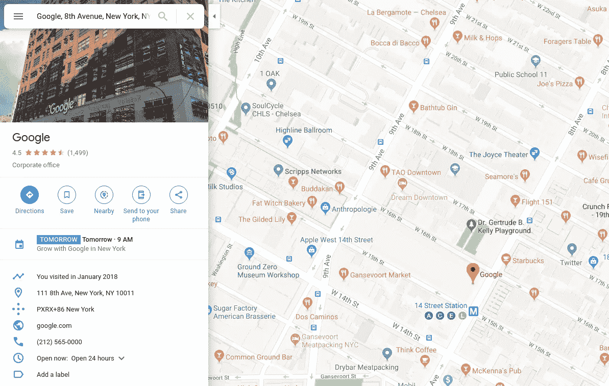
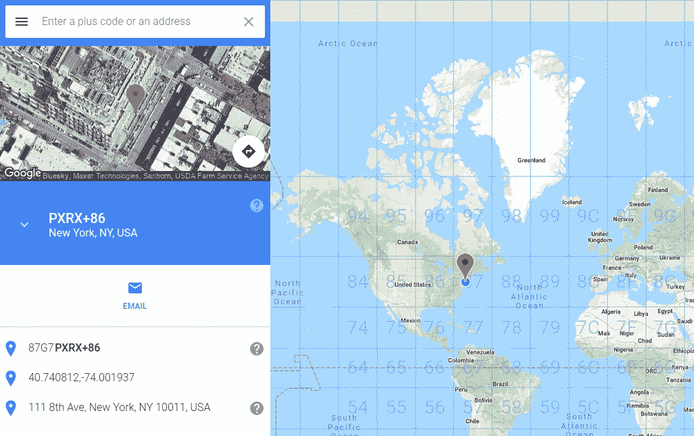
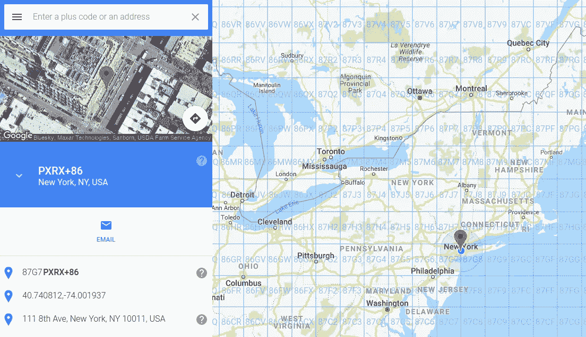
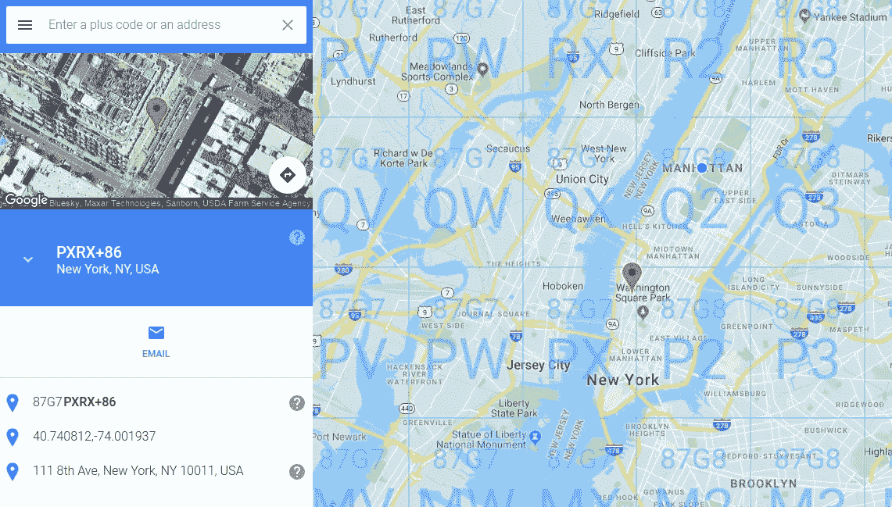
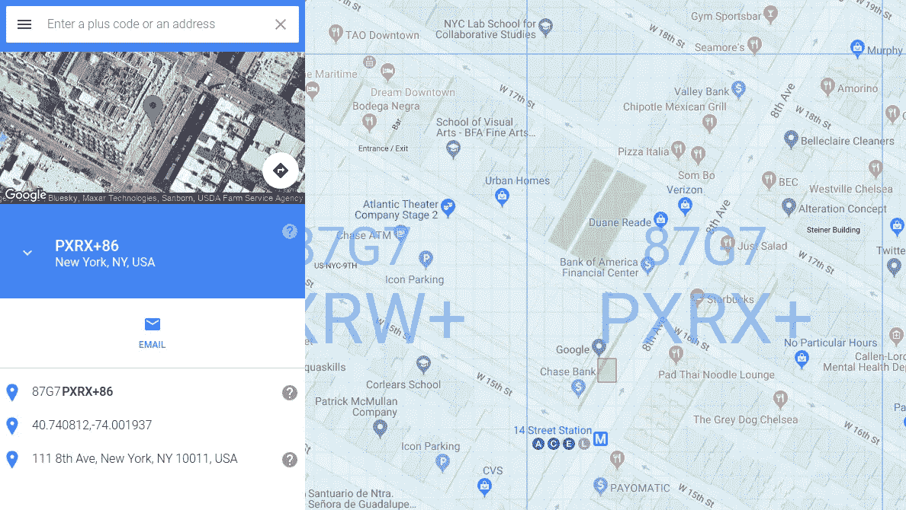
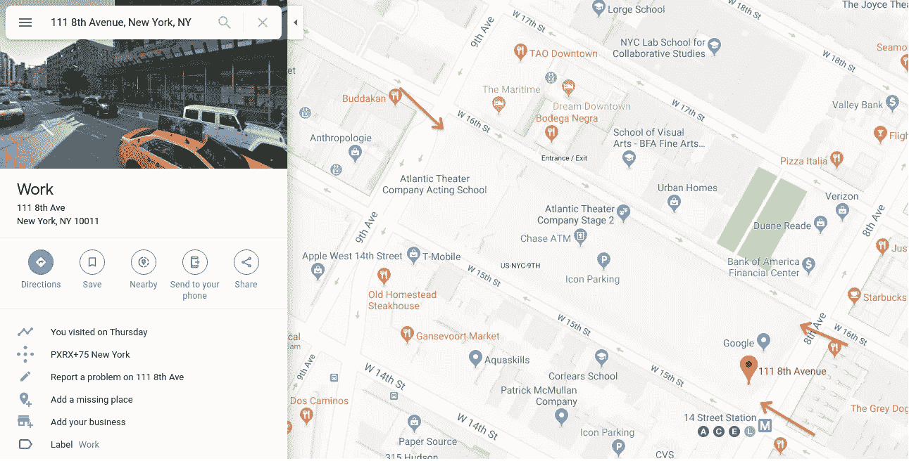
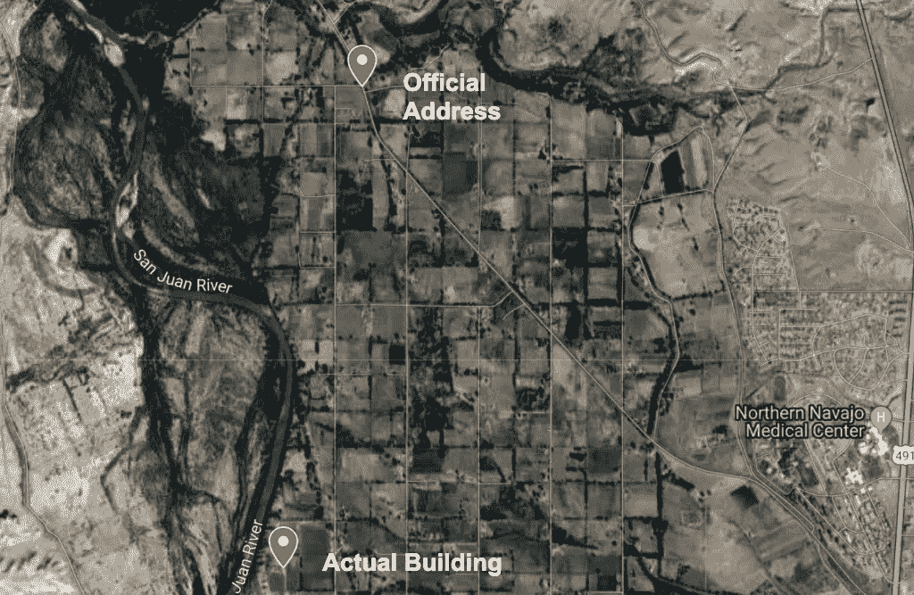
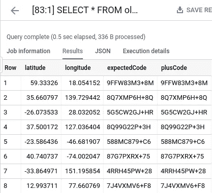

# Google BigQuery 中的加号代码(开放位置代码)和脚本

> 原文：<https://towardsdatascience.com/plus-codes-open-location-code-and-scripting-in-google-bigquery-30b7278f3495?source=collection_archive---------15----------------------->

# 我们不是已经有街道地址了吗？

几周前，我参加了 2019 年谷歌的 Geo For Good 峰会。这是一次令人惊叹的经历，对于我见过的[人、每个人正在做的工作以及会议本身](https://medium.com/google-earth/the-stories-we-shared-at-the-geo-for-good-summit-2019-77ea4df22cf4)，我说不出有多好。

当我参加会议时，我会随机选择至少一个我不熟悉的主题。我们都花了太多的时间专注于巩固我们的专业领域，有时会错过很多其他重要的话题。这就是我拓展业务的方式。

我选择了“带加号代码的数字寻址”，这是最让我难忘的一次会议。

那么什么是[加代码](https://plus.codes)？它是由[开放位置代码](https://en.wikipedia.org/wiki/Open_Location_Code)地理编码系统生成的代码的名称。这个[代码](https://plus.codes/howitworks)给你一个四位数的区号(只有在 25 公里内没有最近的城镇时才需要)，和一个六位数的本地代码(注意，即使它们是字母数字，在加号代码中术语称每个字符为一个“数字”)。在最后两位数字之前有一个“+”符号，它实际上并不传达任何数据，只是为了更容易记住(很像电话号码中的破折号和空格)。十位数格式看起来像“8FVC9G8F+6W”(这是[谷歌在苏黎世](https://goo.gl/maps/grvYf6eczdMnoGsQA)的办公室所在地)。如果包括城镇名称，还可以使用最后六位数字，因此这将是“9G8F+6W 苏黎世，瑞士”如果你在[谷歌地图中输入任何一种格式，](https://maps.google.com)它会带你去那里。

谷歌地图多年来一直在搜索结果中包含加号代码。如果你曾经在地图上看到一个随机的字符串，并想知道那是什么，那么，这就是它。



It’s been hiding there the whole time!

如果你想全面了解 Plus Codes(它的动机、优点、缺点等等。)，强烈推荐在线阅读[开放位置代码定义](https://github.com/google/open-location-code/blob/master/docs/olc_definition.adoc)。

简而言之，它实际上是将整个地球转换成一个 20 度乘 20 度的网格。第一对数字定位该网格中的单元格。从那里开始，每一个后续对都表示该单元格内网格中的一个位置，直到到达最后一对。可以把它想象成地图上不同级别的缩放。


Needs more zoom!

真正酷的事情是，一个十位数的代码(或一个六位数的城市名称代码)提供足够的精度来识别一个 14x14 米的正方形。考虑到使用它需要记住的信息是如此之少，这已经很不错了。

我想在我位于纽约的谷歌办公室尝试一下。地址是纽约州纽约市第八大道 111 号，邮编 10011。该坐标的加号代码是纽约 PXRX+86。



PXRX+86 New York points to 16th St. and 8th Ave… I think.

完整代码是 87G7PXRX+86。我们提到的前两位数字给出了网格的最高级别。那看起来像什么？



Here’s 87\. That’s a big grid.

如果我们看看这个网格，我们可以看到额外的 G7 加入了这个网格。



87G7\. Enhance.

你添加的数字对越多，你能得到的细节就越多。



87G7PX. Enhance

最终，你可以钻到我们快乐的小角落。你可以在地图下方的红框中看到这一点。



87G7PXRX+86, in red. Enhance.

如果你想加入 Plus Code fun，可以在 Plus Codes 网站上找到这个[地图工具](https://plus.codes/map)！

你可以看到这些代码可以变得多么精确。这比普通的街道地址要准确得多，也更有意义。大多数时候，街道地址甚至不会带你去你想去的地方。例如，如果你想联系约翰霍普金斯大学，街道地址是 [3400 N Charles Street，Baltimore，MD 21218](https://www.google.com/maps/place/3400+N+Charles+St,+Baltimore,+MD+21218/@39.3295579,-76.6180401,17z/data=!4m5!3m4!1s0x89c80520058d7ee5:0x264ac09cdf48cbfc!8m2!3d39.3304957!4d-76.6200464) 。尽管查尔斯街北 3400 号实际上并不在查尔斯街北，但校园的其他部分都有相同的街道地址，不管它是哪栋建筑。

Plus 代码可以提供足够的精度来指引某人到建筑物的确切位置。让我们回头看看更早的 Google NYC 的例子。



So… where am I supposed to go?

这栋楼的地址有些问题。第一，它没有告诉你确切的方向。这座大楼有三个访客入口。一个在第 16 街和第 9 大道的建筑西北侧，一个在第 16 街和第 8 大道的东北侧，一个在第 15 街和第 8 大道的东南侧。

但是在你用访客入口玩“三号门后面是什么”之前，你需要确保你有正确的地址。原来这栋楼有两个有效的街道地址。第八大道 111 号和第九大道 76 号。

有了加号代码，我们可以得到粒度。NW 入口为 [PXRW+R7](https://goo.gl/maps/umguH4knrQu5528J9) ，NE 入口为 [PXRX+C8](https://goo.gl/maps/Z6z366tiYGMicKXV9) ，SE 入口为 [PXRX+75](https://goo.gl/maps/DpwXRj4bZFhmtsPv9) 。

你可能认为这都是微不足道的。你可以很容易地给一个朋友一个街道地址，然后说“去东北入口”,这很容易找到。然而，在世界上的许多地方，地址精确度的相同问题有非常真实的后果。

> 在大多数工业化国家，物理地址——当然还有电子地址——是日常生活的一部分。就像道路、自来水和卫生服务一样，物理地址通常被视为理所当然。然而，在发展中国家，实际地址往往只存在于大城市中心。在这些国家，许多街道没有名字，房产也没有编号。因此，公共服务和企业很难或不可能接触到它们的目标客户……在大多数工业化国家，物理地址被认为是理所当然的。但是对于数十亿人来说，地址实际上并不存在。([面向世界——万国邮政联盟](http://www.upu.int/fileadmin/documentsFiles/activities/addressingAssistance/whitePaperAddressingTheWorldEn.pdf))

在峰会的 Plus Codes 会议上，我们听取了纳瓦霍部落成员分享他们在犹他州/新墨西哥州/亚利桑那州地区面临的挑战，以及 Plus Codes 如何帮助解决这些挑战。

在像这样的区域，你会得到很多远离街道地址所在道路的位置，你会得到几英里不正确的地址，并且通常会有很多定位问题。



The officially listed address, and where the building actually is. When it’s this far off, it creates a lot of issues.

这是另一个例子，有人讲述了他们将包裹运送到这个地区的经历。

> 大约在 2005 年，我想在网上购买一台新的笔记本电脑，并试图让联邦快递将包裹送到我在 AZ dil kon 的 hogan，因为我住的地方距离主要公路(纳瓦霍 15 号公路)大约 0.5 英里。我提交给联邦快递的地址如下:
> 
> 名称
> 迪尔康分会办公室以北 1 英里
> 灰色屋顶的蓝色霍根
> 亚利桑那州温斯洛，邮编 86047
> 
> 在命令的进一步指示部分，我写了如下内容:从分会办公室向北，经过警察局和一座大教堂。经过教堂建筑，你会穿过一个大水池。这条路有点弯曲，但一直向北走。你会看到一片大树。朝那些树走。他们应该是这个地区唯一的一片树林。我的霍根会在那些树附近，蓝色的霍根有灰色的屋顶。我也留下了我的手机号码，以防有什么问题。
> 
> 我通过联邦快递网站跟踪递送过程，并确保在递送当天我可以通过电话联系到。我暗暗希望我的指示足以让送货员找到我的霍根，把包裹送出去。然而，下午 4 点左右，我接到了联邦快递送货员的电话。他迷路了。他曾试图按照指示走，但最终却来到了一所没有人的房子里。在请他描述了这个地区之后，我断定他走得还不够远。事实上，他还在去我家的半路上，在大教堂附近，还没有去洗澡。所以当他在打电话和开车的时候，我把他带到了我的家，当他描述他所看到的时候，我给了他一个接一个的方向。
> 
> 最终他到了我家，但这次经历并不理想。(司机不知道什么是[霍根](https://en.wikipedia.org/wiki/Hogan)。)

从我在韩国长大的经历中，听到这样的事情让我产生了共鸣。直到 2000 年中期，我们还没有传统意义上的建筑地址。有明确的区域和街区，但建筑物没有街道号码。指路的时候，你只需要知道东西在哪里。告诉别人类似“从地铁站的第六个出口出去，在全家超市后左转进入小巷，继续走，它就在 LG 手机店上面的第二层”这样的话很常见。街道地址通常不会被使用，现在也不会。

首尔相当发达，所以对我的影响可能是见朋友晚了一点。然而在其他领域，这是一个严重的问题。

Finding addresses in rural Utah and Arizona.

Finding addresses in Kolkata, India.

没有明确的位置不仅会影响包裹的递送，还会影响急救人员的效率、获得出生证明、投票等等。这种情况发生在纳瓦霍部落、加尔各答，无疑还有世界上无数其他地区。加码可以帮助，影响的机会是有意义的。

# BigQuery 脚本和过程

我喜欢 BigQuery 的原因[有很多。在使用了许多不同的遗留数据技术之后，BigQuery 是最容易维护的，并且最擅长立即让我对数据做一些很酷的事情，而不是坐在这里探索基础设施，想知道为什么无论是什么都不能与无论是什么都不能工作。](https://medium.com/@thetinot/bigquery-required-reading-list-71945444477b)

话虽如此，没有任何事物和任何人是完美的。BigQuery 缺少一些我正在寻找的东西。脚本和存储过程曾经是一个很好的例子。

不久前，这些功能[公开发布](https://twitter.com/ElliottBrossard/status/1179818844723920896)。

这让我非常非常开心。

# Plus 代码和 BigQuery 脚本。

Open Location Code 有一个不同语言的开源代码库,可以生成和读取 Plus 代码。当 BigQuery 脚本发布时，我认为创建编码 Plus 代码的东西可能是引入这个新特性的一个好方法。它允许轻松地批量编码坐标，BigQuery 在大规模处理中带来了许多好处。

让我们看看编码逻辑。根据[规范](https://github.com/google/open-location-code/blob/master/docs/specification.md)，这是一个非常简单的编码程序:

> 总结:在纬度上加 90，在经度上加 180，强制它们进入正范围。使用上面的符号将纬度和经度编码为基数 20，每个数字五位，即位值为 0.000125。从纬度开始，交错数字。
> 
> 下面提供了一种从最低有效位到最高有效位对值进行编码的算法:
> 
> 1 —在纬度上加 90 度，在经度上加 180 度，两者都乘以 8000，将整数部分分别作为纬度和经度
> 2 —用具有经度模数 20 的整数部分的符号作为现有代码的前缀
> 3—用具有纬度模数 20 的整数部分的符号作为现有代码的前缀
> 4 —将经度和纬度除以 20
> 5 —从步骤 2 开始重复四次以上。

看起来像是一个简单的循环，我们可以在脚本中完成。

让我们使用来自不同谷歌办公室的经度和纬度来看看它是如何工作的。办公地点来自六大洲的多个国家，因此我们可以对两个半球进行现场测试。这些位置将作为脚本中的输入表。

```
# Create array of encoding values.
DECLARE OLC_DIGITS_ ARRAY<STRING> DEFAULT ['2','3','4','5','6',
  '7','8','9','C','F','G','H','J','M','P','Q','R','V','W','X'];# Control variable.
DECLARE loopControl INT64 DEFAULT 0;# Create example source data.
CREATE OR REPLACE TEMP TABLE
  pc_data (
    latitude float64,
    longitude float64,
    expectedCode STRING);INSERT
  pc_data (
    latitude,
    longitude,
    expectedCode)
VALUES
  (40.740737, -74.002047,'87G7PXRX+75'),
  (37.500172, 127.036404,'8Q99G22P+3H'),
  (35.660797, 139.729442,'8Q7XMP6H+8Q'),
  (-23.586436, -46.681907,'588MC879+C6'),
  (12.993711, 77.660769,'7J4VXMV6+F8'),
  (-26.073533, 28.032052,'5G5CW2GJ+HR'),
  (-33.864971, 151.195854,'4RRH45PW+28'),
  (59.333260, 18.054152,'9FFW83M3+8M');# STEP 1 - Normalize coordinates.
CREATE temp table olc_table AS (
  SELECT
    *,
    FLOOR((latitude + 90) * 8000) AS workingLatitude,
    FLOOR((longitude + 180) * 8000) AS workingLongitude,
    '' AS plusCode
  FROM
    pc_data);
SELECT
  *
FROM
  olc_table;

# STEP 2 - Loop through the encoding loops.
SET
  loopControl = 0;
WHILE
  loopControl < 5 DO CREATE OR REPLACE TEMP TABLE olc_table AS(
  SELECT
    * EXCEPT (
      workingLatitude,
      workingLongitude,
      plusCode),
    workingLongitude / 20 AS workingLongitude,
    workingLatitude / 20 AS workingLatitude,
    CONCAT(
      OLC_DIGITS_[
        OFFSET(MOD(CAST(FLOOR(workingLatitude) AS INT64), 20))], 
      OLC_DIGITS_[
        OFFSET(MOD(CAST(FLOOR(workingLongitude) AS INT64), 20))],
      plusCode) AS plusCode
  FROM
    olc_table );
SET
  loopControl = loopControl + 1;
SELECT
  *
FROM
  olc_table;
END WHILE;# STEP 3 - Add the Plus!
CREATE OR REPLACE temp table olc_table AS(
  SELECT
    * EXCEPT (plusCode,
      workingLongitude,
      workingLatitude),
    CONCAT( SUBSTR(plusCode, 0, 8), '+', SUBSTR(plusCode, -2)) AS plusCode
  FROM
    olc_table );# Look at the results!
SELECT
  *
FROM
  olc_table;
```

当我们运行它时，通常显示结果数据的底部面板看起来像这样。


A script’s output.

这是新的输出信息，显示了 BigQuery 运行。这对于调试很方便，因为您可以看到中间数据进入每个执行的语句。如果您在最后一步单击“查看结果”按钮，您将找到脚本结果。



Much success!

我希望代码易于阅读(请留下带问题的评论)，但只是对我们在这里做的一些事情做一些注释。

*   在步骤 2 的循环中，我们[创建和/或替换一个临时表](https://cloud.google.com/bigquery/docs/reference/standard-sql/data-definition-language#temporary_tables)。这是与脚本一起发布的新特性，我们将使用它来对整个列执行操作。
*   在脚本中，我们手动创建一个临时表作为源表。如果您想在另一个有坐标数据的表上运行这个，您可以去掉那个特定的部分，让创建的`olc_table`指向您的源表。
*   如果您想将输出写到另一个表，只需在最后一个`SELECT`语句的末尾加上一个`CREATE TABLE [dataset.table] AS`，就可以了。

从这里你可以把这个脚本放到一个[存储过程](https://cloud.google.com/bigquery/docs/reference/standard-sql/data-definition-language#create_procedure)中，并把它合并到其他工作流中！

现在，您可以快速浏览 BigQuery 脚本和编码坐标，并批量添加代码！

要了解更多关于 Plus Codes 的信息，请务必查看公开发布的 2019 年 Geo for Good Summit Plus Codes 会议的[幻灯片内容。这是纳瓦霍部落的人们出席的会议。另外，请查看](https://docs.google.com/presentation/d/1NSHmHuG-ID--VLp0Ap7xMi_QTiDlVLgRdqLr-Qpu5Zc/edit)[议程页面](https://sites.google.com/corp/earthoutreach.org/geoforgood19/agenda/breakout-sessions?authuser=0)，了解幻灯片内容以及任何适用的培训材料发布到的所有其他会议！谷歌地球上有很棒的东西，地球引擎就在那里！

此外，请务必查看[为解决未解决的问题](https://www.addressingtheunaddressed.org/)所做的工作，这些工作有助于让世界更容易了解这些位置。