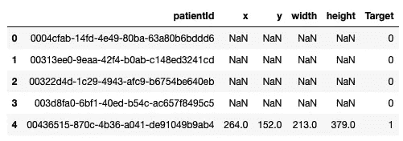

# 基于深度学习的胸片肺炎检测

> 原文：<https://towardsdatascience.com/pneumonia-detection-from-chest-radiograph-cxr-d02c2fc11609?source=collection_archive---------23----------------------->


肺炎占全球 5 岁以下儿童死亡总数的 15%以上。2015 年，有 92 万名 5 岁以下儿童死于该疾病。虽然肺炎很常见，但准确诊断却很困难。它需要由训练有素的专家审查胸片(CXR ),并通过临床病史、生命体征和实验室检查进行确认。

# 胸片基础知识

在拍摄图像的过程中， [X 射线](https://en.wikipedia.org/wiki/X-ray)穿过身体，到达另一侧的探测器。具有稀疏物质的组织，如充满空气的肺，不吸收 X 射线，在图像中显示为黑色。骨骼等致密组织吸收 X 射线，在图像中显示为白色。简而言之

*黑色=空气

*白色=骨头

*灰色=组织或液体

按照惯例，主体的左侧在屏幕的右侧。还可以看到右上角的小 L。我们在正常图像中看到的肺部是黑色的，但它们有不同的投影——主要是胸腔骨骼、主气道、血管和心脏。

胸部 x 光照片示例如下:


肺炎通常表现为 CXR 上一个或多个区域的肺部阴影增加。


然而，在 CXR 上肺炎的诊断是复杂的，因为肺部有许多其他情况，如液体超载(肺水肿)、出血、容量损失(肺不张或虚脱)、肺癌、或放疗后或手术后的变化。在肺外，胸膜腔内的液体(胸腔积液)在 CXR 上也表现为阴影增加。如果可以的话，比较患者在不同时间点的 CXRs 以及与临床症状和病史的相关性有助于做出诊断。

此外，临床医生每次轮班都要阅读大量图像。疲劳或分心的临床医生可能会错过图像中的重要细节。在这里，自动图像分析工具可以提供帮助。例如，**人们可以使用机器学习来自动进行潜在肺炎病例的初步检测(成像筛查)，以便优先考虑和加快他们的审查**。因此，我们决定开发一种从胸片中检测肺炎的模型。

# 资料组

我们使用了来自 kaggle 的 [RSNA 肺炎检测挑战](https://www.kaggle.com/c/rsna-pneumonia-detection-challenge/overview)的数据集。这是一个带有注释的胸部 x 光数据集，它显示了肺部的哪一部分有肺炎的症状。

# **安装机器学习工具**

我们将使用 [Intelec AI](https://www.intelec.ai) 训练一个检测肺炎的模型。你可以从这里免费下载并安装。

# **数据准备**

我们从 kaggle 下载了训练图像(stage_2_train_images.zip)和注释(stage_2_train_labels.csv) [。注释文件如下所示:](https://www.kaggle.com/c/rsna-pneumonia-detection-challenge/data)

```
import pandas as pdann = pd.read_csv('stage_2_train_labels.csv')
ann.head()
```



上图中的第一行对应于编号为“0004 CFA b-14fd-4e 49–80ba-63 a80 b 6 bddd 6”的患者。此行的“目标”列为 0。意味着这个病人没有肺炎。另一方面，最后一排的患者患有肺炎，因为相应的胸片上的区域(xmin = 264，ymin = 152，宽度= 213，高度= 379)具有不透明。

我们决定用 **SSD 物体探测器**。Intelec AI 要求注释文件包含 image_name、xmin、ymin、xmax、ymax 和 class_name 列。因此，我们将数据转换成这种格式:

```
ann['image_name'] = ann.patientId + '.dcm'
ann = ann.rename(columns = {'x': 'xmin', 'y': 'ymin'})
ann['xmax'] = ann.xmin + ann.width
ann['ymax'] = ann.ymin + ann.heightann['class_name'] = np.NaN
ann['class_name'][pd.notna(ann.xmin)] = 'pneumania'
ann = ann[['image_name', 'xmin', 'ymin', 'xmax', 'ymax', 'class_name']]ann.head(10)
```


上图中的前 4 幅图像(第 0-3 行)没有肺炎注释。另一方面，图像“00436515–870 c-4b 36-a041-de 91049 b 9 ab 4 . DCM”有两个注释(第 4 行和第 5 行)。我们将其保存在“annotations.csv”文件中。

然后，我们创建一个“images”文件夹，并从 stage_2_train_images.zip 中提取所有图像。所有提供的图像都是 DICOM 格式。dcm)。

```
import os
images = os.listdir('images')
images[:5]
```


最后，我们的数据集看起来像这样:


然后我们创建了一个训练来训练我们的 SSD 对象检测器。事情是这样简单明了的:


我们开始训练，它跑了一天。当它不能再提高训练精度时，它就自动停止训练。


点击训练总结显示**地图得分 0.2725** 。我们部署它是为了检查它的性能。使用新的胸部 x 光照片测试展开的模型给出了以下结果:


预测看起来不错。但是它有多好，我们真的不能说，因为我们的团队中没有任何临床医生。

# 改进建议

从图像中检测肺炎仍然是一项需要使用深度学习来解决的困难任务。我们获得的地图分数 0.2725 很低。对于大多数对象检测任务，它通常高于 0.5。问题是，对象检测器擅长检测具有预定义形状和外观的对象。另一方面，肺部阴影没有精确的形状。这使得这个问题变得如此困难。我们将对如何进一步提高精度给出一些想法。

## 招数一:检测前分类

我们观察到，我们的算法有很高的假阳性率，即它在图像中检测到肺炎，而它不应该检测到肺炎。因此，如果我们将给定的胸片分类为“有无肺炎”,并且仅在它有肺炎的情况下用目标检测器检测肺炎症状，这将大大提高检测准确性。

## 招数二:先检测肺部

另一个问题是，在胸片中，不透明度(“白色像素”)也存在于肺的外部。但是我们总是检测肺部阴影，因为我们知道肺炎与肺部问题有关。我们可以让我们的对象检测器从训练数据中学习这一点，或者我们可以帮助它单独检测肺部，并在下一步检测肺部的肺炎。


# 参考

Intel EC AI:https://www . Intel EC . AI

RSNA 肺炎检测挑战:[https://www . ka ggle . com/c/rsna-Pneumonia-Detection-Challenge/](https://www.kaggle.com/c/rsna-pneumonia-detection-challenge/)

什么是肺部阴影？https://www.kaggle.com/zahaviguy/what-are-lung-opacities