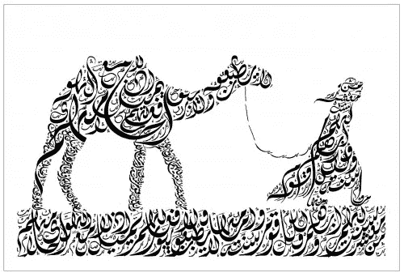
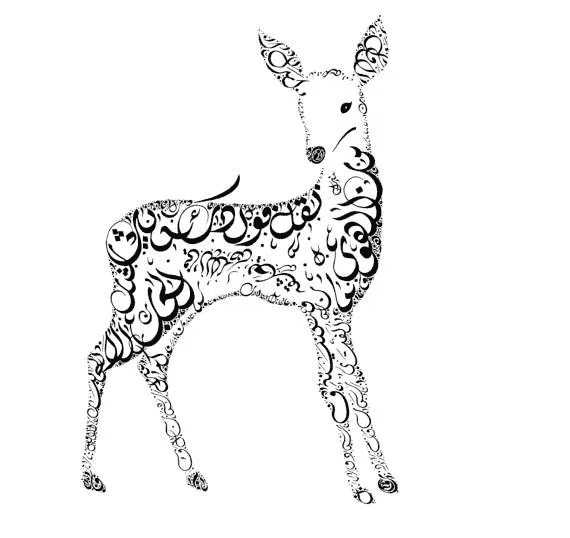

# 诗意神经网络

> 原文：<https://towardsdatascience.com/poetic-neural-networks-487616512?source=collection_archive---------9----------------------->

## 教神经网络如何写阿拉伯诗歌



Source: [artfire.com](https://www.artfire.com/ext/shop/product_view/EveritteBarbee/13575288/ode_of_labid_man_with_camel-_arabic_calligraphy_print)

如果明天诗歌消失了，股票市场不会崩盘，桥梁不会倒塌，电脑仍会运转。

然而，诗歌具有独特的价值，因为它表达了我们内心无法量化或测量的东西。在这篇文章中，我们将尝试使用神经网络生成诗歌，但有一个额外的警告:它将使用[阿拉伯语](https://en.wikipedia.org/wiki/Arabic)。

总之，这篇文章跨越了以下几点:

*   我们如何创建自定义数据集
*   如何预处理数据
*   [RNN](https://en.wikipedia.org/wiki/Recurrent_neural_network) 的超参数调谐
*   阿拉伯语诗歌输出(和英语翻译)

请随意跳过技术部分，直接跳到输出。底部有一个 GitHub 库的链接。

# 来自大马士革的诗人


Nizar Qabbani (source: [Edarabia.com](https://www.edarabia.com/ar/1-%D9%85%D9%86-%D8%A7%D9%81%D8%B6%D9%84-%D9%85%D8%A7-%D9%82%D8%A7%D9%84-%D9%86%D8%B2%D8%A7%D8%B1-%D9%82%D8%A8%D8%A7%D9%86%D9%8A-%D8%B9%D9%86-%D8%A7%D9%84%D8%AD%D8%A8/))

[尼扎尔·卡巴尼](https://en.wikipedia.org/wiki/Nizar_Qabbani)是一位叙利亚诗人，他以探索爱情、民族主义、色情和宗教的诗歌而闻名。此外，他是一位多产的作家，这意味着他的工作为我们的神经网络提供了潜在的大量数据。

以下是他作品的样本:

> 你是谁
> 像匕首一样闯入我生命的女人
> 温和如兔眼
> 柔软如梅皮
> 纯洁如茉莉花串
> 天真如儿童围兜
> 贪婪如言语？

作为第一步，我们需要创建一个包含大部分(如果不是全部)他已知作品的文本语料库。幸运的是，我们可以找到专门保存 Qabbani 作品的网站。

使用像 [BeautifulSoup、](https://www.crummy.com/software/BeautifulSoup/)这样的软件包，人们可以[收集](https://en.wikipedia.org/wiki/Web_scraping)数据并创建一个包含我们能找到的所有可用作品的语料库。收集了所有的诗歌，数据量略低于 1MB，约为 100 万个字符，约有 32，000 个独特的单词。有关需要多少数据的更多信息，请参考下面参考资料中的 [Andrej Karpathy](http://karpathy.github.io/) 帖子。

尽管看起来像是大量的文本，但实际上，它被认为是一个非常小的数据集，这可能会限制我们的目的。

# 论阿拉伯语的特殊性



Source: [Whyseen on pinterest.com](https://www.pinterest.com/Yassintawfeeq/whyseen-arabic-calligraphy/)

与拉丁字符不同，阿拉伯语是从右向左读的。此外，没有大写或小写字符之类的东西。此外，元音和辅音的概念不同于英语。

关于这种语言和其他语言与英语的不同还有更多方面。已经有了用英语以外的语言创作诗歌的成功例子，比如中文(见底部的参考文献)。

# 准备数据

这一步包括创建一个返回两个字典的查找表:

*   整数到 vocab
*   vocab 到整数

接下来，我们使用空格作为分隔符将脚本分割成一个单词数组。然而，像句点和感叹号这样的标点符号可以为同一个单词创建多个 id。比如“拜拜”“拜拜！”会生成两个不同的单词 id。

我们实现了一个函数来返回一个字典，该字典将用于标记像“！”这样的符号变成“||感叹号| |”，我们的列表看起来像:

*   句号(。)
*   逗号(，)
*   返回(\n)
*   回车符(\r)

该字典将用于标记符号并在其周围添加分隔符(空格)。这将每个符号作为自己的单词分开，使神经网络更容易预测下一个单词。

# 超参数和调整

一般来说，我们可以用更大的隐藏和`n_layer`维度得到更好的结果，但是更大的模型需要更长的训练时间。下面是要调整的参数列表:

*   **sequence_length** :序列的长度。
*   **batch_size** :批量大小。
*   **次数**:训练的次数。
*   **learning _ rate**:Adam 优化器的学习速率。
*   **vocab_size** :我们词汇表中惟一记号的数量。
*   **输出尺寸**:输出所需的尺寸。
*   **嵌入 _ 尺寸**:嵌入尺寸；小于 vocab_size。
*   **hidden_dim** :我们 RNN 隐藏的维度。
*   **n _ layers**:RNN 的层数/单元数。

# 模仿诗人

参数设置好了，模型训练好了，我们可以进入有趣的部分了:生成诗歌！

要做到这一点，我们必须定义`prime_word`，它是开始的单词。在下面的小节中，我们将展示一些结果。

## ” **أنا** (我/我):

```
أنا كهذا الماء ؟.
وظلت شيخ حارتنا..
وتشاهد أسماكٌ وبحار.
وتشاهد فهم أنفسنا
الخائفون من الخشب
ويضاجعون تطرف يعنيها.
تنقرض الأمة من الأصل ذكورا..
تهاجر أسماكٌ وبحار..
وعدت..
بإلغاء
```

粗略翻译:

> 我像这水吗？我成了我们街区的酋长..你会看到鱼和海洋。
> 你看《了解我们自己》
> 害怕木头
> 他们带着极端主义睡觉。这个民族是从男性起源开始灭绝的。鱼和海洋会迁徙..我答应了..
> 取消

## “يا”

```
يا قطتي الخليفة
وباركنا في جبيني
خليفةٌ في خاصرة التعذيب الأوسط

هل سأقرأ حـيٍ ، ينسـى القط؟ 
والزنبق الأسود ، والشذا ومستواه
فقصها..
وبقينا نسأل أنفسنا
وفي غرف الإنعاش ،
وألوان للعشاء
قطعاً في
```

粗略翻译:

> 我的继任者阿猫
> 保佑我们在我的额头上
> 一个哈里发在中间一边折磨
> 
> 我会活着读书吗，猫会忘记吗？
> 黑色百合，香味和它的等级
> 所以切吧..
> 我们不停地问自己
> 在恢复室里，晚餐的
> 和颜色
> 绝对在

## 《نحن》(我们)

```
نحن عشته
لا تحسبي أن أحبك في البيادر
في أخبار التاريخ,.
تنقرض الأمة يعنيها.
تنقرض الأمة من عارٍ فيها– الحداد..
عيونها على ذراعيها..
ومذيع الدولة في أجساد الأميره ؟

يا رب أيـن ملتفٌ نسبي
```

粗略翻译:

> 我们经历了它
> 不要以为我爱你在历史新闻的花园里
> 。
> 这个民族灭绝了。这个国家因为它的耻辱——哀悼而灭绝了..
> 她的眼睛在她的胳膊上..
> 公主的尸体和国家广播电台？
> 
> 主啊，相对的缠绕在哪里？

## “امرأة”(女人)

```
امرأة كلها...
يا كل عامٍ في الطبيعة..
ومذيع الدولة في جرحنا
نتفاءل جميله..
ووجدنا جسداً مغتصباً..
ومذيع الدولة ؟؟ 
من هؤلاء هؤلاء الهدبـا
من هؤلاء سقيت أعماقي وإرهاقي برأس أدبي؟
```

粗略翻译:

> 一个完整的女人……
> 哦，大自然中的每一年..
> 国家广播公司是在伤害我们
> 美好的乐观主义..我们发现了一具被强奸的尸体。
> 还有国家广播公司？？
> 这些都是纤毛
> 这些被水浇得很深、筋疲力尽却顶着文艺脑袋的人是谁？

# 结论

我们可以看到，我们对诗歌的尝试不如原作者那样连贯，当然也不如原作者那样雄辩。在某些方面，写作是滑稽的，打破了所有的语法和逻辑规则。

我们的缺点的一个可能的原因可能是训练数据不足，因为理想情况下，我们需要至少 3MB 价值的文本。此外，可能需要考虑语言本身的独特方面。然而，请记住，RNN 人不得不从头开始学习最难的语言之一。

我希望您喜欢阅读这篇文章，并对文本生成的可能性有所了解。我也希望非英语母语的深度学习社区成员能够在他们自己的母语社区中预见潜在的有益应用。

[](https://github.com/NadimKawwa/PoeticNeuralNetworks) [## NadimKawwa/poeticnurealnetworks

### 此时您不能执行该操作。您已使用另一个标签页或窗口登录。您已在另一个选项卡中注销，或者…

github.com](https://github.com/NadimKawwa/PoeticNeuralNetworks) 

# 参考

[](https://www.nizariat.com/) [## شعر نزار قباني

### نزار قباني دبلوماسي و شاعر عربي. ولد في دمشق (سوريا) عام 1923 من عائلة دمشقية عريقة هي أسرة قباني ، حصل على البكالوريا…

www.nizariat.com](https://www.nizariat.com/) [](http://karpathy.github.io/2015/05/21/rnn-effectiveness/) [## 递归神经网络的不合理有效性

### 递归神经网络(rnn)有一些神奇的东西。我仍然记得当我训练我的第一个循环…

karpathy.github.io](http://karpathy.github.io/2015/05/21/rnn-effectiveness/) [](https://stackoverflow.com/questions/48698786/how-many-character-in-1-mb-txt-file) [## 1 MB 中有多少个字符？txt 文件？

### 问这个问题已经有了答案:我正在开发一个 Android 应用程序，它使用意图字符串，从一个…

stackoverflow.com](https://stackoverflow.com/questions/48698786/how-many-character-in-1-mb-txt-file)  [## 用 RNN 编解码器生成中国古典诗歌

### 我们把中国古典诗词诗句的生成看作是一个序列到序列的学习问题，并建立了一个新颖的…

arxiv.org](https://arxiv.org/abs/1604.01537)