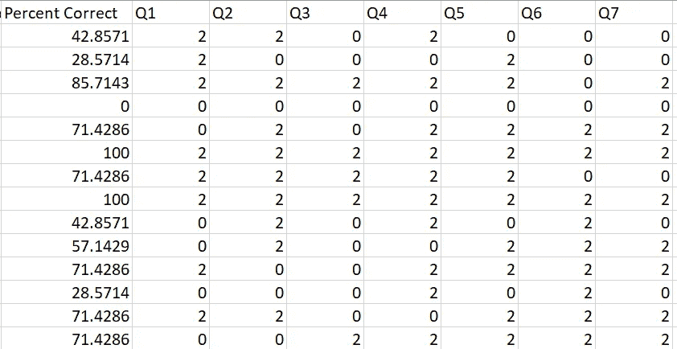

# 与 Python 的点双列相关

> 原文：<https://towardsdatascience.com/point-biserial-correlation-with-python-f7cd591bd3b1?source=collection_archive---------4----------------------->

线性回归是确定数据文件的两个或多个连续特征之间相关性的经典技术。当然，只有当特征具有几乎线性的关系时，这才是理想的。

Linear Regression from [Towards Data Science article by Lorraine Li](/introduction-to-linear-regression-in-python-c12a072bedf0).

但是，如果我们需要确定二分数据(即二进制数据)和连续数据之间的相关性，该怎么办呢？那不能得到我们上面看到的直线。这就是双列杂交对我们有帮助的地方。

Photo by [Providence Doucet](https://unsplash.com/@providence?utm_source=medium&utm_medium=referral) on [Unsplash](https://unsplash.com?utm_source=medium&utm_medium=referral)

# 点双列相关及其计算方法。

[点双列相关系数](https://en.wikipedia.org/wiki/Point-biserial_correlation_coefficient)与线性回归中使用的皮尔逊相关系数相同(从-1 到 1 测量)。唯一的区别是我们比较的是二分数据和连续数据，而不是连续数据和连续数据。从这一点开始，让我们假设我们的二分数据由两组(组 0 和组 1)的项目组成，连续数据为“y”。该系数通过以下公式计算:

Modified Point Biserial Correlation Formula from Wikipedia.

其中:

M0 =第 0 组数据的平均值。

M1 =第 1 组数据的平均值。

Sy =连续数据的标准偏差。

n0 =组 0 中的项目数。

n1 =组 1 中的项目数。

n =两组中的项目总数(也称为数据集中的总行数)。

# 应用点双列相关

PBC 经常用于分析多项选择测试问题，以确定它们是否是充分的问题。成为一个充分的问题意味着回答这个问题的人群(比如一类学生)不会觉得这个问题太容易(接近 1)或者太混乱(接近 0 或者负相关)。

[ZipGrade](https://www.zipgrade.com/) ，一个从你的手机上扫描多项选择答题卡的应用程序，为我们扫描的测试数据提供了方便的 CSV 文件。我将从我给学生的代数测验中抽取一个。下面是我给学生的多项选择测验的部分数据。

Multiple-Choice Quiz data with the scores (Percent Correct) and points earned from the question in each question column.

“正确率”是学生获得的分数。每个“Q#”栏是学生回答正确(2 分)或错误(0 分)的分数。该数据集还表明，二分法数据不一定需要严格采用 0 或 1 格式，因为您会为机器学习模型编码数据。因为公式只关心每组中的项目数，所以它们是如何标记的并不重要。

[SciPy](https://docs.scipy.org/doc/scipy-0.14.0/reference/generated/scipy.stats.pointbiserialr.html) 方便的有一个叫做`pointbiserialr`的点双列相关函数。我们将把这个函数应用于第一个问题“Q1”。

这给了我们以下结果:

`PointbiserialrResult(correlation=0.555989931309585, pvalue=1.5230357095184431e-06)`

这导致了约 0.56 的相关性和相关的 p 值，以说明相关性是否具有统计学显著性。

对于我们的情况，这种相关性意味着这个测试问题对于我的学生来说是一个公平的问题。如果相关性接近 1，那就意味着这个问题太简单了，也许不需要包括在内。更接近于 0 或负值的相关性将表明问题可能做得不好或对学生不公平。这个主题的扩展可以在以后的文章中讨论。

# 从头开始点双列相关

正如我们在我写的关于[超几何分布](/hypergeometric-distribution-explained-with-python-2c80bc613bf4)的文章中所做的，我想借此机会展示我们如何用 Python 从头开始创建这个公式。

这个版本将二分数据列、连续数据列和相关数据框的名称作为参数。为了重新创建我们的例子，我们将调用函数为`pbc_scratch(‘Q1’, ‘Percent Correct’, data)`。我不认为这是创建函数的最佳方式，所以我欢迎任何有更好实现的人在下面的评论中分享。

# 额外资源

感谢阅读！我希望这篇教程对你有所帮助。如果你想要一个视频版本来巩固你对点双列相关的理解，你可以看看下面的视频。它有一个更一般的例子和另一个选择题的例子，以及进一步的解释意义。

你可以在 [Linkedin](https://www.linkedin.com/in/jdejesus22/) 和 [Twitter](https://twitter.com/johnnydata22?lang=en) 上关注或联系我。我对 Twitter 上的 DM 持开放态度。如果你喜欢这篇文章，可以看看下面我写的关于超几何分布的类似文章:

 [## 用 Python 解释超几何分布

### 数学课上的概率问题，你需要的概率要么给你，要么相对容易…

towardsdatascience.com](/hypergeometric-distribution-explained-with-python-2c80bc613bf4) 

如果你喜欢阅读 Medium，并愿意进一步支持我，你可以使用我的[推荐链接](https://medium.com/@j.dejesus22/membership)注册 Medium 会员。这样做可以用你的会费的一部分在经济上支持我，我将不胜感激。

直到下一次，

约翰·德杰苏斯