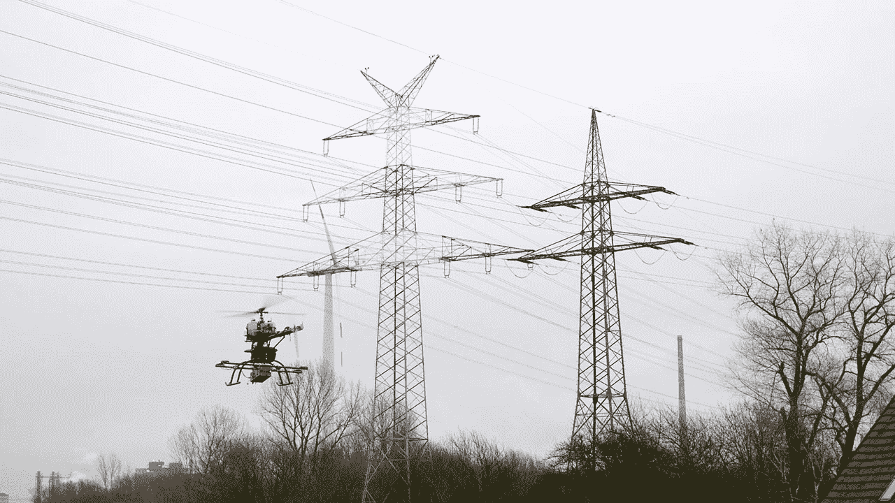
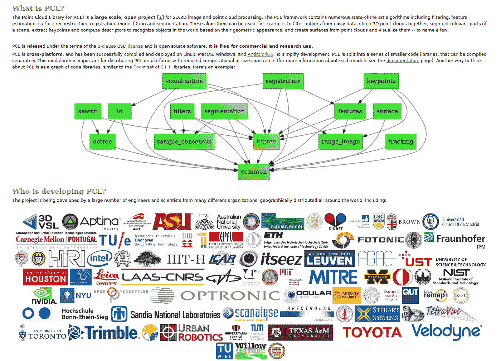
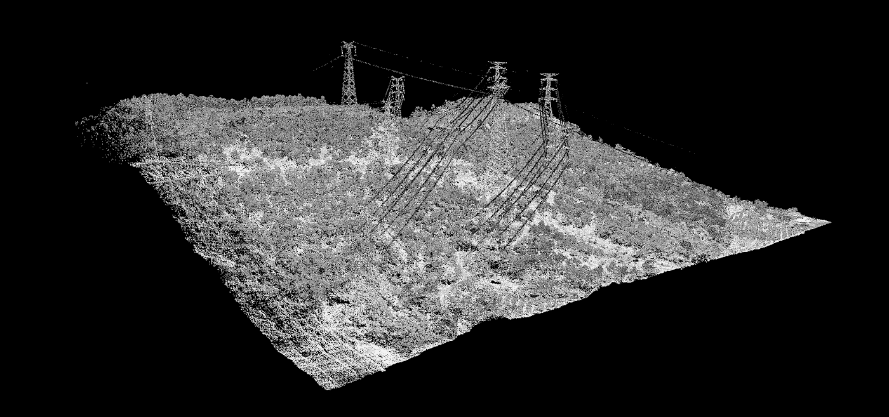
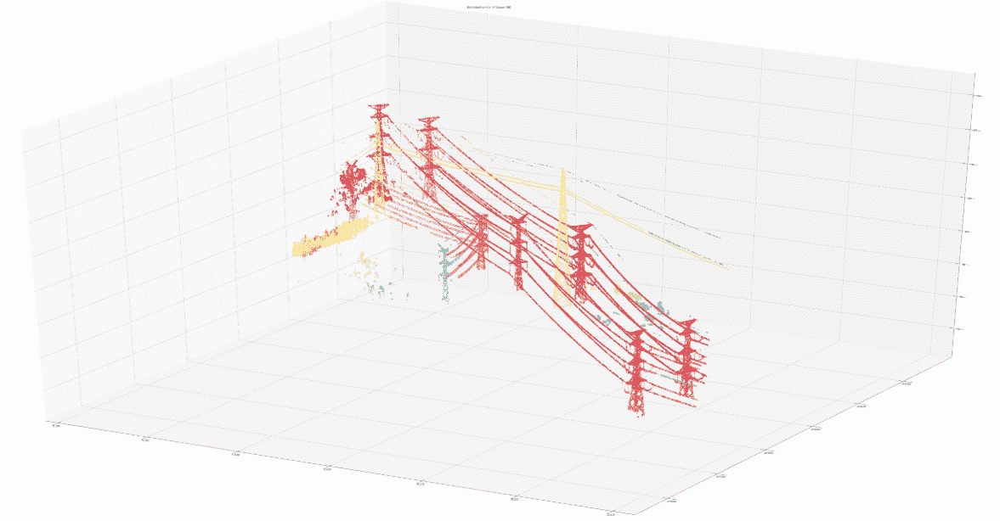
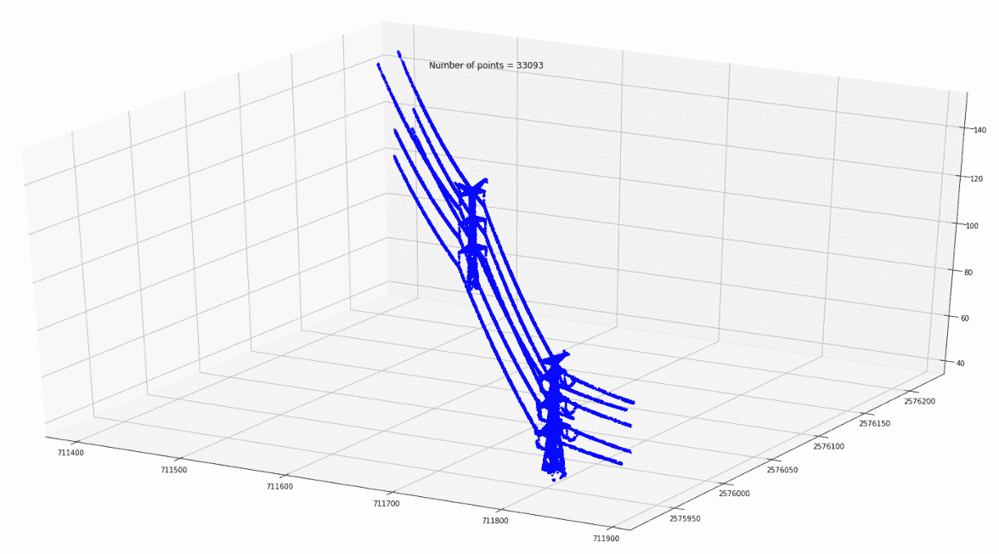

# 点云数据:简单方法

> 原文：<https://towardsdatascience.com/point-cloud-data-simple-approach-f3855fdc08f5?source=collection_archive---------6----------------------->

## 电力线探测的激光雷达数据



## 介绍

近年来，激光雷达探测器的发展取得了巨大的进步，产生了大量的原始数据。激光雷达现在更加精确，分辨率甚至比 10 年前高得多。空基激光雷达已经成为接收环境信息的有效方法。然而，您获得的数据实际上只是稀疏点的集合，这些点可能提供一些不错的可视化效果，但在涉及到更实际的目的时，需要进行大量的处理。不幸的是，截至目前，计算机视觉的进展大多涉及结构化的二维数据(照片、视频)。当前的方法不能推广到多维稀疏数据，如我们在基本的激光雷达数据预处理后接收的点云。该领域正在进行广泛的研究。我们



应该特别提到 PCL——一个伟大的国际社区开发的库的嫁接，为各种应用提供 2D 和 3D 数据的工具。不幸的是，目前要将这个库应用于感兴趣的解决方案并不容易。这通常意味着你必须深入图书馆。这对于需要高可伸缩性的生产级产品来说是有意义的。但是对于 PoC 开发来说，成本可能太高。因此，我决定使用一种简单的方法和非常标准的 Python 库来尝试对点云数据做些什么(可以从 Python 中使用 PCL，但仅限于此，因为只有很小的子集可以无缝集成)。

## 实验数据

作为一个例子，让我们使用基于航空的激光雷达生成的数据来检测电力线。电力线通常在点云可视化中清晰可见。然而，映射属于电力线的点需要大量的手动工作。另一方面，简单的几何考虑可以为我们提供大大简化甚至自动化这种处理的方法。

图上的电力线实际上是形成某种几何图形的点的集合。为了简化进一步的分类，我决定检查我们如何从这些点形成集群。



## 用于实验的软件

我将使用 NumPy、Sklearn、Laspy 和 SciPy 库来形成集群，并使用 matplotlib 来实现可视化。

```
import laspyimport scipyimport numpy as npimport matplotlib.pyplot as pltfrom sklearn.cluster import DBSCANfrom sklearn import metricsfrom sklearn import preprocessingfrom mpl_toolkits.mplot3d import Axes3Dfrom matplotlib import path
```

Laspy 非常适合在 Python 中处理点云数据。我们从 las 文件中读取点云数据，并检查实际数据集的形状。

```
# Open a file in read mode:inFile = laspy.file.File(“./LAS/simple.las”)# Grab a numpy dataset of our clustering dimensions:dataset = np.vstack([inFile.x, inFile.y, inFile.z]).transpose()dataset.shape
```

`(5942479, 3)` —我们的点云由 5942479 个点组成。如果你想了解细节，这是不够的。但是如果你试图把这个数据帧转换成一个三维的 NumPy 数组，这个数字就太大了，就像在这个例子中，我们会得到一个巨大的 5942479 = 2.09*10 的⁰数组。它将使用大量的 RAM 来存储非常稀疏的数据。显而易见的是使用 NumPy 稀疏数组。但事实上，稀疏阵列对 2D 很有效，但对 3D 数据无效。矩阵操作函数与稀疏 3D 矩阵不完全兼容。由于内存需求，我们必须坚持使用 DataFrame 而不是 NumPy 数组。

## 消除范围外的点

我们需要找到一种方法来消除那些不是电力线的点。出于安全原因并为了确保其最佳性能，电力线被放置在离地面很高的地方。但对于崎岖的地形，我们必须考虑到，由于地面倾斜，一些地面点在图像的不同部分可能高于电力线。为了避免这种情况，让我们把点云分成小的垂直部分。

```
%%timedef frange(start, stop, step): i = start while i < stop: yield i i += step#ground points grid filtern = 100 #grid stepdataset_Z_filtered = dataset[[0]]zfiltered = (dataset[:, 2].max() — dataset[:, 2].min())/10 #setting height filtered from groundprint(‘zfiltered =’, zfiltered)xstep = (dataset[:, 0].max() — dataset[:, 0].min())/nystep = (dataset[:, 1].max() — dataset[:, 1].min())/nfor x in frange (dataset[:, 0].min(), dataset[:, 0].max(), xstep): for y in frange (dataset[:, 1].min(), dataset[:, 1].max(), ystep): datasetfiltered = dataset[(dataset[:,0] > x)
                             &(dataset[:, 0] < x+xstep)
                             &(dataset[:, 1] > y)
                             &(dataset[:, 1] < y+ystep)] if datasetfiltered.shape[0] > 0: datasetfiltered = datasetfiltered[datasetfiltered[:, 2]
                        >(datasetfiltered[:, 2].min()+ zfiltered)] if datasetfiltered.shape[0] > 0: dataset_Z_filtered = np.concatenate((dataset_Z_filtered,
                                             datasetfiltered))print(‘dataset_Z_filtered shape’, dataset_Z_filtered.shape)
```

在这种简单方法的帮助下，即使使用中等的计算能力，我们也可以立即大大减少云中的点数。在我们的例子中，这是在 3 分钟内将点数减少了一个数量级——对于几行代码来说还不错，因为我们没有为任何优化付出真正的努力。

```
dataset_Z_filtered shape (169862, 3)CPU times: user 3min 16s, sys: 7.14 ms, total: 3min 16sWall time: 3min 16s
```

现在我们将使用一个更小的过滤数据集。

## 探索我们的数据

让我们来探索我们的数据:

```
print(“Examining Point Format: “)pointformat = inFile.point_formatfor spec in inFile.point_format:print(spec.name)Examining Point Format:XYZintensityflag_byteraw_classificationscan_angle_rankuser_datapt_src_idgps_time
```

在我的实验中，我尝试使用数据的 4D 表示(X，Y，Z 和强度),但结果并没有在 3D (X，Y，Z)上有所改善，所以让我们坚持使用后一个数据子集。

```
print(‘Z range =’, dataset[:, 2].max() — dataset[:, 2].min())print(‘Z max =’, dataset[:, 2].max(), ‘Z min =’, dataset[:, 2].min())print(‘Y range =’, dataset[:, 1].max() — dataset[:, 1].min())print(‘Y max =’, dataset[:, 1].max(), ‘Y min =’, dataset[:, 1].min())print(‘X range =’, dataset[:, 0].max() — dataset[:, 0].min())print(‘X max =’, dataset[:, 0].max(), ‘X min =’, dataset[:, 0].min())Z range = 149.81Z max = 181.78999908447264 Z min = 31.979999084472652Y range = 622.9700000002049Y max = 2576396.509974365 Y min = 2575773.539974365X range = 556.4400000000605X max = 711882.7199987792 X min = 711326.2799987792
```

## 数据标准化

如您所见，这些值在不同的范围内。为了获得更好的结果，我们应该对数据集进行规范化。

```
dataset = preprocessing.normalize(dataset)
```

## 对几何上接近的点进行聚类

现在我们准备处理我们的数据。我们的电力线实际上是点的空间群集，因此尝试群集算法是很自然的。经过短暂的调查，我发现 Sklearn 库提供的 DBSCAN 开箱即用效果最好。

```
clustering = DBSCAN(eps=2, min_samples=5, leaf_size=30).fit(dataset)
```

现在让我们来看看我们的结果。

```
core_samples_mask = np.zeros_like(clustering.labels_, dtype=bool)core_samples_mask[clustering.core_sample_indices_] = Truelabels = clustering.labels_# Number of clusters in labels, ignoring noise if present.n_clusters_ = len(set(labels)) — (1 if -1 in labels else 0)n_noise_ = list(labels).count(-1)print(‘Estimated number of clusters: %d’ % n_clusters_)print(‘Estimated number of noise points: %d’ % n_noise_)Estimated number of clusters: 501Estimated number of noise points: 1065
```

# 形象化

我们的大部分点被分成了几组。让我们看看它在实践中是什么样子的:

```
# Black removed and is used for noise instead.fig = plt.figure(figsize=[100, 50])ax = fig.add_subplot(111, projection=’3d’)unique_labels = set(labels)colors = [plt.cm.Spectral(each) for each in np.linspace(0, 1, len(unique_labels))]for k, col in zip(unique_labels, colors): if k == -1: # Black used for noise. col = [0, 0, 0, 1] class_member_mask = (labels == k) xyz = dataset[class_member_mask & core_samples_mask] ax.scatter(xyz[:, 0], xyz[:, 1], xyz[:, 2], c=col, marker=”.”)plt.title(‘Estimated number of cluster: %d’ % n_clusters_)plt.show()
```



现在很清楚，简单的几何考虑和相当标准的聚类方法帮助我们使用适度的计算资源来简化点分类。

如果需要，每个点簇可以单独分类。



# 结果

我们的实验表明，几何考虑和标准 Python 库的结合可以显著减少为进一步使用而对原始点云数据进行分类所需的工作。

# 感谢

我要感谢我的同事们[安迪·博西](https://medium.com/u/8bc8d2a62041?source=post_page-----f3855fdc08f5--------------------------------)、[米科拉·科兹连科](https://medium.com/u/5b6f8e76e312?source=post_page-----f3855fdc08f5--------------------------------)、[沃洛季米尔·森德茨基](https://medium.com/u/29c9ae323b06?source=post_page-----f3855fdc08f5--------------------------------)的讨论、合作和有益的建议，以及整个 [MindCraft.ai](https://medium.com/u/bad3e22805b3?source=post_page-----f3855fdc08f5--------------------------------) 团队的持续支持。