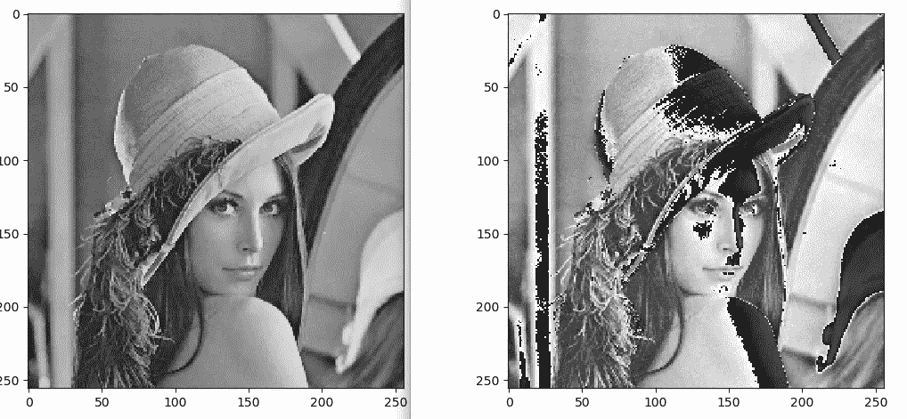
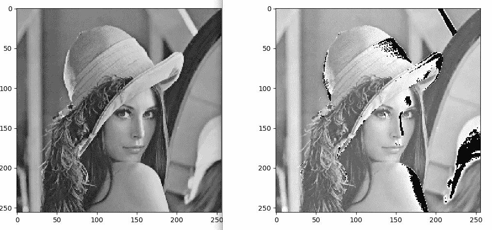
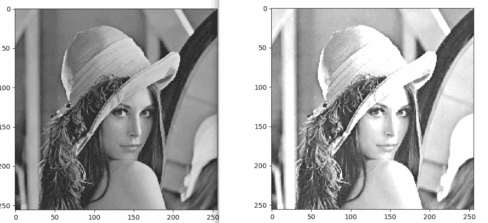
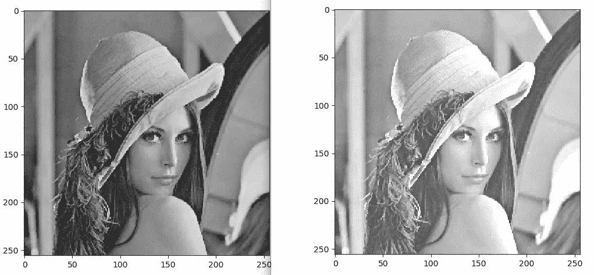

# skimage-Python 在图像处理中的点操作

> 原文：<https://towardsdatascience.com/point-operations-in-image-processing-with-skimage-python-5dfeb523ed5c?source=collection_archive---------34----------------------->

当我们用手机拍照时，我们在社交媒体上发布之前会做什么？当然，我们调整亮度、对比度等等。你有没有想过我们在屏幕后面的形象发生了什么变化？

这一切都可以通过一个叫做**点操作的简单技巧来实现。**有很多点操作，也有很多点操作的用例。有些是，

*   修改亮度或对比度
*   应用任意强度变换
*   量化图像
*   全局阈值
*   非线性校正
*   颜色变换等等。

# 什么是点操作？

我们都知道图像只是简单地用 2D 有序矩阵来表示。用于修改像素值而不影响相邻像素的操作称为**点操作。**点操作将、

1.  不改变图像的大小
2.  不改变图像的几何形状
3.  不改变图像的局部结构
4.  不影响相邻像素

例如，简单的点操作可以表示为，

```
a' <------- f(a) #here "a" is the intensity value of a pixelORI'(u,v) <------- f(I(u,v)) #here "u,v"are the coordinates of the image I
```

存在两种类型的点操作。**同质或全局点运算，**其中函数 f()与图像坐标无关。如上式所示，v 仅用于获取特定像素的亮度值。

另一种类型的点操作是**非齐次点操作**，其中使用了**映射函数** g()。

```
a' <------- g(a,u,v) 
#here "a" is the current pixel value and u,v are the coordinates of the pixel which should be considered in calculationsORI' <-------g(I(u,v), u,v)
```

非同质点操作的一个示例用例是**对比度或亮度的局部调整。**

# 同质点操作的示例

## **对比度修改**

让我们将图像的对比度增加 50%。你能猜到我们应该对每个像素执行什么操作吗？

```
f_contrast(a) = a x (1.5)#We should iteratively get pixel values in image one by one modify them and we have to put the result into the same location.
```

让我们在 skimage 库的帮助下尝试一下。

```
from skimage import io
import matplotlib.pyplot as pltdef f(x):
    return x * 1.5def point_operation(image, method):
    for row in range(0, image.shape[0]):
        for col in range(0, image.shape[1]):
            image[row][col] = method(image[row][col]) return imageif __name__ == '__main__':
   image = io.imread('~/Desktop/Lenna_gray.png')
   image_modified = point_operation(image.copy(), f) plt.figure()
   _ = io.imshow(image) plt.figure()
   _ = io.imshow(image_modified) plt.show() Output: Figure-1
```



Figure-1 (Before and After contrast modification)

## 亮度修改

让我们将图像的对比度增加 50 个单位。你能猜到我们应该对每个像素执行什么操作吗？

```
f_contrast(a) = a + 50#We should iteratively get pixel values in image one by one modify them and we have to put the result into the same location.
```

让我们在 skimage 库的帮助下尝试一下。

```
from skimage import io
import matplotlib.pyplot as pltdef f(x):
    return x + 50def point_operation(image, method):
    for row in range(0, image.shape[0]):
        for col in range(0, image.shape[1]):
            image[row][col] = method(image[row][col])
    return imageif __name__ == '__main__':
   image = io.imread('~/Desktop/Lenna_gray.png')
   image_modified = point_operation(image.copy(), f) plt.figure()
   _ = io.imshow(image) plt.figure()
   _ = io.imshow(image_modified) plt.show()Output: Figure-2
```



Figure-2 (Before and After Brightness Modification

但是你有没有注意到在我们修改过的图像中有一种连线行为？是的，它们没有我们想象的那么干净。图像中的某些区域破坏了图像的结构。有什么问题吗？

当我们使用算术运算修改像素值时，我们应该记住修改后的值应该在可接受的亮度值范围内。在我们的例子中，它应该在[0–255]之间，因为我们使用的是 8 位表示。

为了解决这个问题，我们可以使用一种叫做**夹紧的技术。**实现夹紧非常容易。

```
a' <------- f(a)if a' > 255 then a' <------- 255
if a' < 0   then a' <------- 0
else a' <------- a'
```

我们可以简单地在代码中实现箝位，只需修改如下的点操作函数，

```
def point_operation(image, method):
    for row in range(0, image.shape[0]):
        for col in range(0, image.shape[1]):
            temp = method(image[row][col])
            if temp > 255: 
               image[row][col] = 255
            elif temp < 0:
               image[row][col] = 0
            else:
               image[row][col] = temp return image
```



Figure-3 (Contrast modification after Clamping)



Figure-4 (Brightness modification after Clamping)

## 反转图像

反转图像只是反转像素值的顺序。这是通过，

```
a' = (a x -1) + a_maxHere we multiply the pixel value by -1 and then add it with the constant of maximum intensity value of that image, to map the result with in the acceptable range. 
```

Python 代码反转，

```
from skimage import io
import matplotlib.pyplot as pltdef point_operation(image):
    a_max = image.max()
    for row in range(0, image.shape[0]):
        for col in range(0, image.shape[1]):
            image[row][col] = (image[row][col] * -1) + a_max return imageif __name__ == '__main__':
   image = io.imread('~/Desktop/Lenna_gray.png')
   image_modified = point_operation(image.copy()) plt.figure()
   _ = io.imshow(image) plt.figure()
   _ = io.imshow(image_modified) plt.show()
```

## 阈值化图像

阈值处理是一种特殊的量化操作，用于将图像修改为其二进制版本。这项技术非常简单，

```
if a >= threshold then a' = 255
else a' = 0#Here threshold can be any value within the acceptable intensity range of a perticular image, in our case within [0-255]
```

Python 代码反转，

```
from skimage import io
import matplotlib.pyplot as pltdef point_operation(image, threshold):
    for row in range(0, image.shape[0]):
        for col in range(0, image.shape[1]):
            if image[row][col] >= threshold:
               image[row][col] = 255
            else:
               image[row][col] = 0 return imageif __name__ == '__main__':
   image = io.imread('~/Desktop/Lenna_gray.png')
   image_modified = point_operation(image.copy(), 100) plt.figure()
   _ = io.imshow(image) plt.figure()
   _ = io.imshow(image_modified) plt.show()
```

自己尝试上述反相和阈值函数的代码，以可视化输出。在 skimage 中有 API 函数可以用来执行上述操作，你可以自由探索。

希望大家对点算符及其一些应用有更好的了解！！！