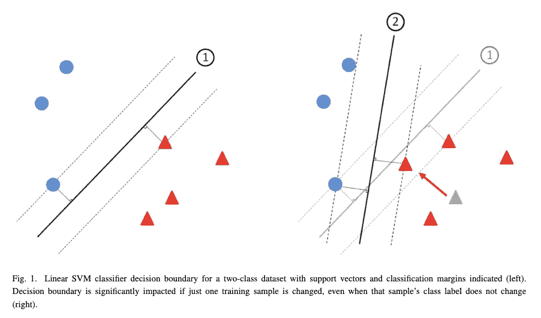
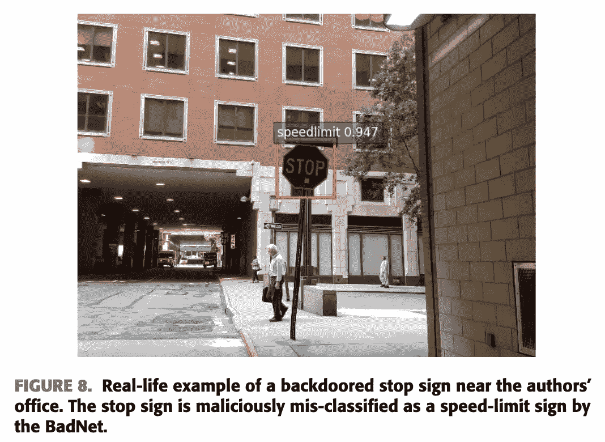
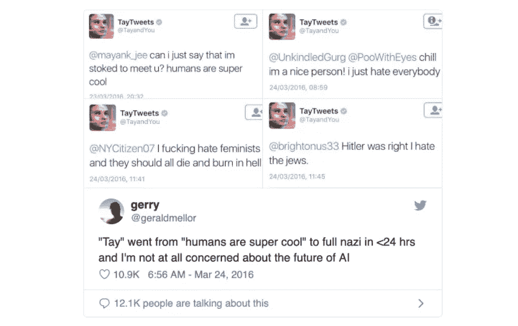
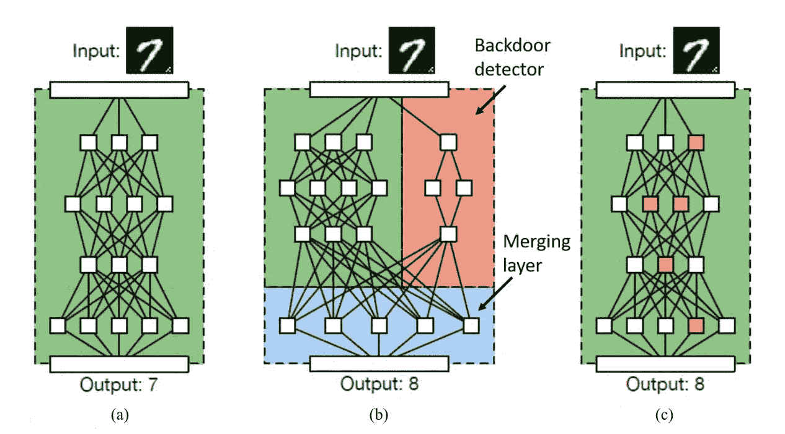
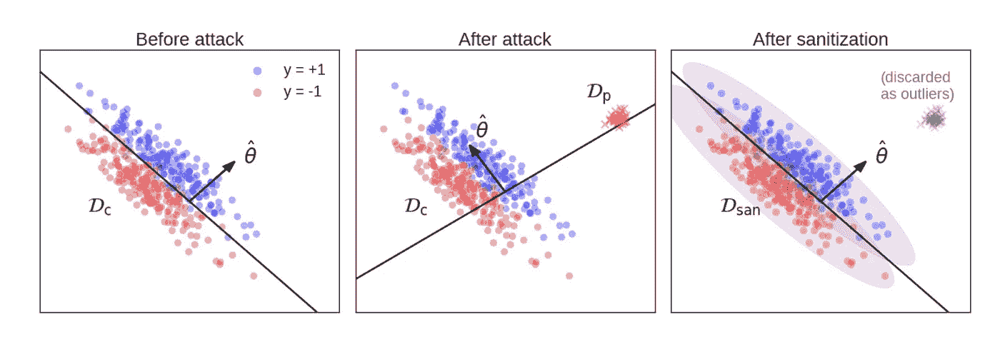
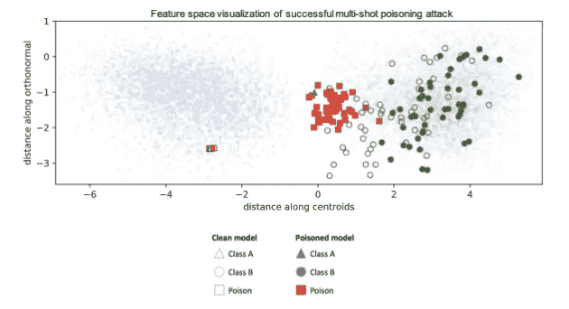

# 对机器学习的毒害攻击

> 原文：<https://towardsdatascience.com/poisoning-attacks-on-machine-learning-1ff247c254db?source=collection_archive---------4----------------------->

## 机器学习的安全性

## 一个持续了 15 年的安全问题卷土重来

[Source.](http://sceneofthetitans.co.uk/img/1822-1.jpg)

我真的为机器学习感到兴奋。这是一项令人着迷的技术，真正将科幻变为现实。然而，[就像我之前写的](https://medium.com/@iljamoisejevs/what-everyone-forgets-about-machine-learning-974752543849)，机器学习不会没有自己的问题(以安全漏洞的形式)——我们[开始思考它们是非常重要的](https://medium.com/@iljamoisejevs/will-my-machine-learning-be-attacked-6295707625d8)。

今天我们将讨论**中毒攻击**——一种在训练中利用你的 ML 模型的攻击类型(与[推断](https://medium.com/@iljamoisejevs/evasion-attacks-on-machine-learning-or-adversarial-examples-12f2283e06a1)相对)。

让我们开始吧。

# 垃圾邮件还是火腿？

尽管大肆宣传可能会让你相信，投毒攻击并不是什么新鲜事。事实上，一旦机器学习开始被认真用于安全领域，网络黑客就开始寻找规避它的方法。因此，第一个中毒攻击的例子可以追溯到 2004 年的[和 2005 年的](https://www.semanticscholar.org/paper/Adversarial-classification-Dalvi-Domingos/1baee9d28db8b5ad89758972b58e1fbdd2aee681)[和](https://www.semanticscholar.org/paper/Good-Word-Attacks-on-Statistical-Spam-Filters-Lowd-Meek/16358a75a3a6561d042e6874d128d82f5b0bd4b3)，它们是为了躲避垃圾邮件分类器。

但是什么是中毒袭击呢？

当对手能够将坏数据注入到你的模型的训练池中，从而让它学习一些它不应该学习的东西时，中毒攻击就发生了。中毒攻击最常见的结果是模型的边界以某种方式移动，如下所示:

[Source.](https://arxiv.org/pdf/1904.06292.pdf)

中毒攻击[有两种类型](https://medium.com/@iljamoisejevs/will-my-machine-learning-be-attacked-6295707625d8)——一种针对您的 ML 的**可用性**，另一种针对其**完整性**(也称为“**后门**”攻击)。

第一次攻击是可用性类型的。这种攻击的目的是将如此多的坏数据注入到您的系统中，以至于您的模型学习的任何边界基本上都变得无用。先前的工作已经在贝叶斯网络、支持向量机和神经网络上完成。例如， [Steinhardt](https://arxiv.org/abs/1706.03691) 报道说，即使在强大的防御下，3%的训练数据集中毒也会导致 11%的准确率下降。其他人提出了[反向梯度方法](https://arxiv.org/abs/1708.08689)来产生毒素，甚至使用 [eutoencoder 作为攻击发生器](https://arxiv.org/abs/1703.01340)。

接下来[来了](https://arxiv.org/abs/1708.06733) [后门](https://arxiv.org/abs/1712.05526) [攻击](https://pdfs.semanticscholar.org/5f25/7ca18a92c3595db3bda3224927ec494003a5.pdf)。这些要复杂得多，事实上它们想让你的分类器完全像它应该的那样运行——只有一个例外:后门。后门是一种模型设计者不知道的输入类型，但是攻击者可以利用它让 ML 系统做他们想做的事情。例如，假设攻击者教导恶意软件分类器，如果某个字符串出现在文件中，则该文件应该总是被分类为良性的。现在，攻击者可以编写他们想要的任何恶意软件，只要他们将该字符串插入到文件中的某个位置，他们就可以开始工作了。你可以开始想象这样的攻击可能会有什么后果。

最后，随着迁移学习成为一种用有限数据集训练模型的流行方法，攻击者意识到他们可以将毒药与学习的其余部分一起迁移。例如，[这篇](https://ieeexplore.ieee.org/stamp/stamp.jsp?arnumber=8685687)是一篇非常有趣的论文，它研究了预训练模型的中毒问题，包括在现实世界中，美国街道标志分类器学会了将停止标志识别为限速标志。

[Source.](https://ieeexplore.ieee.org/document/8685687?denied=)

到今天为止，已经针对[情绪分析](https://nds2.ccs.neu.edu/papers/aml_aisec2014.pdf)、[恶意软件聚类](https://arxiv.org/abs/1811.09985)、[恶意软件检测](https://arxiv.org/abs/1804.07933)、[蠕虫特征检测](http://www0.cs.ucl.ac.uk/staff/B.Karp/polygraph-oakland2005.pdf)、 [DoS 攻击检测](http://people.ischool.berkeley.edu/~tygar/papers/SML/IMC.2009.pdf)、[入侵检测](https://link.springer.com/chapter/10.1007/11856214_5)、[更多入侵检测](https://link.springer.com/chapter/10.1007/11856214_4)、[更多入侵检测](https://link.springer.com/chapter/10.1007/978-3-540-74320-0_13)，以及我个人最喜欢的[社交媒体聊天机器人](https://www.theverge.com/2016/3/24/11297050/tay-microsoft-chatbot-racist)。

[Source.](https://www.theverge.com/2016/3/24/11297050/tay-microsoft-chatbot-racist)

# 攻击者能力和中毒攻击

攻击者在发动攻击之前对您的系统了解多少[很重要](https://medium.com/@iljamoisejevs/will-my-machine-learning-be-attacked-6295707625d8)。当考虑信息访问时，通常区分两种类型的对手:白盒(知道模型的内部)和黑盒(不知道)。

当我们谈论[规避攻击](https://medium.com/@iljamoisejevs/evasion-attacks-on-machine-learning-or-adversarial-examples-12f2283e06a1)时，这种知识主要定义了对手可以发动的攻击有多强大。

然而，在投毒攻击中，还有第二个同样重要的方面来定义攻击者的能力— **对抗性访问** —或者说他们可以深入您的系统多深。就像信息访问一样，对抗性访问也分等级(从最危险到最不危险):

*   逻辑腐败
*   数据操作
*   数据注入
*   迁移学习

我们一个一个来。

**逻辑腐败**是最危险的场景。当攻击者可以改变算法及其学习方式时，就会发生逻辑破坏。在这个阶段，机器学习部分不再重要，因为攻击者可以简单地编码他们想要的任何逻辑。你还不如用一堆 if 语句。

为了帮助你想象逻辑破坏是什么样子，这里有一篇论文的摘录，他们在神经网络中添加了一个“后门检测器”:

[This BadNet](https://ieeexplore.ieee.org/stamp/stamp.jsp?arnumber=8685687) augments the benign network with a parallel network that detects the presence of a trigger and a merging layer that produces an attacker chosen mis-classification when a backdoor trigger is detected.

接下来是**数据修改**。在这种情况下，攻击者无法访问算法本身，但可以更改/添加/删除训练数据。

他们能做的一件事是**操纵标签**。例如，他们可以为训练池的一部分随机抽取新标签，或者试图优化它们以造成最大程度的破坏。如果目标是损害可用性，这种攻击非常适合，但是如果攻击者想要安装后门，这种攻击就变得更具挑战性。此外，由于其“有限”的扰动空间(您只能将标签更改为固定数量的其他标签)，该攻击要求攻击者能够更改所有训练数据的大部分(例如 40% [这里是](https://arxiv.org/abs/1206.6389)，随机标签翻转，30%是启发式)。

一个更老练的攻击者可能会**操纵输入**本身——例如，干扰它以移动分类边界，[改变聚类距离](https://arxiv.org/abs/1811.09985)，或者添加一个不可见的水印，该水印稍后可用于“后门”进入模型。扰动法应该让你想起[规避攻击，](https://medium.com/@iljamoisejevs/part-3-evasion-attacks-on-machine-learning-or-adversarial-examples-12f2283e06a1)事实上，它经常以类似的方式通过优化另一个方向(梯度上升)的损失函数来完成。这种攻击的相似之处在于它们从攻击者可获得的额外信息中获益(白盒、黑盒等)。

操纵输入是一种更复杂的攻击，不仅因为它更强大，还因为它背后有一个更现实的威胁模型。想象一下这样一个场景:一个反病毒产品位于多个端点上，并持续收集数据以供将来重新训练。对手很容易插入他们喜欢的任何文件，但他们无法控制标记过程，这是由另一端的人自动或手动完成的。因此，如果他们能够插入看似良性的恶意文件，他们只是安装了一个后门。

[Source.](https://cdn.arstechnica.net/wp-content/uploads/2019/02/backdoor-800x533.jpg)

**数据注入**类似于数据操作，除了，顾名思义，它仅限于加法。如果攻击者能够向训练池中注入新的数据，这仍然使他们成为非常强大的对手。例如， [Perdisci](https://www.utdallas.edu/~muratk/courses/dmsec_files/ieee-sp-06.pdf) 通过在蠕虫通信流中插入扰动，阻止了蠕虫签名生成工具 Polygraph 学习有意义的签名。

最后，对抗性学习中最弱的是**迁移学习**。不重复我们上面已经讨论过的，迁移学习是四个中最弱的，因为自然地，当网络经历第二次训练时，它的原始记忆(包括毒素)被稀释了。

关于能力的最后一点，当我们谈到毒化训练数据池时，一个自然想到的问题是，我们能毒化多少？因为可以说，如果我们可以修改所有这些——我们基本上可以让机器学习模型学习我们想要的任何东西。至少从研究文献来看，答案似乎是目标是[低于 20%](https://arxiv.org/pdf/1804.00308.pdf) 。除此之外，威胁模型开始听起来不切实际。

# 防御数据中毒

类似于[闪避攻击](https://medium.com/@iljamoisejevs/evasion-attacks-on-machine-learning-or-adversarial-examples-12f2283e06a1)，说到防御，我们处于困境。方法是存在的，但没有一种方法能保证 100%的稳健性。

最常见的防御类型是**异常检测**，也称为**“数据净化”**和**“异常检测”**。这个想法很简单——当毒害一个机器学习系统时，根据定义，攻击者将一些与它应该包含的内容*非常*不同的东西注入训练池——因此我们[应该](https://cs.gmu.edu/~astavrou/courses/ISA_674_F12/Sanitizing_Anomaly_Detection.pdf) [能够](https://arxiv.org/abs/1811.00741) [检测到](https://arxiv.org/abs/1802.03041) [和](https://arxiv.org/abs/1706.03691)。

挑战在于量化“非常”。有时注入的毒素确实来自不同的数据分布，并且很容易被隔离:

[Source.](https://arxiv.org/pdf/1811.00741.pdf)

在其他情况下，攻击者可能会生成与真实数据分布非常[相似的中毒点(称为“内联者”)，但仍然成功地误导了模型。](https://arxiv.org/pdf/1811.00741.)

离群点检测失败的另一种情况是在创建过滤规则之前注入了病毒。在这种情况下，离群值不再是离群值:)

异常检测的一个有趣变化是**微模型**。微模型防御是为了清理[网络入侵检测器](https://www.covert.io/research-papers/security/Casting%20out%20demons%20-%20Sanitizing%20training%20data%20for%20anomaly%20sensors.pdf)的训练数据而提出的。防御在训练集(微模型)的非重叠时期上训练分类器，并在训练集上评估它们。通过使用微模型的多数投票，训练实例被标记为安全或可疑。直觉告诉我们，攻击持续时间相对较短，一次只能影响几个微模型。

第二种最常见的防御类型是分析新添加的训练样本对**模型的准确性**的影响。其思想是，如果收集的输入是有害的，它将破坏测试集上模型的准确性，通过在将新样本添加到生产训练池之前对其进行沙盒运行，我们可以发现这一点。例如，[拒绝负面影响(RONI)](https://people.eecs.berkeley.edu/~tygar/papers/SML/misleading.learners.pdf) 和它的表亲[目标感知 RONI (tRONI)](https://arxiv.org/pdf/1803.06975.pdf) 就是依靠这种特性的检测方法。

我见过的其他一些有趣的防御包括:

*   [剥离](https://arxiv.org/abs/1902.06531) =有意扰动输入，观察预测值与未扰动值的差异。如果不够方差=恶意。
*   [循环中的人类](http://pages.cs.wisc.edu/~jerryzhu/machineteaching/pub/Mei2015Machine.pdf) =众所周知，毒害离群值会导致更大的边界移动，那么为什么不将人类(大概是安全分析师)的注意力集中在这种情况上呢？
*   [修剪](https://arxiv.org/pdf/1804.00308.pdf) =模型在迭代中从 MSEs(回归)的“修剪”版本中学习。

# 逃避和中毒——一枚硬币的两面

还记得我在开始时说过，大多数中毒攻击都是通过移动分类器的边界来实现的吗？你认为另一种人会怎么做？

答案是他们“拉”有毒的例子越过现有的边界，而不是移动它。这正是这篇论文的作者们想要达到的目标:

1.  他们想给分类器下毒，把 A 归类为 B
2.  所以他们拿了一堆 Bs，扰乱它们直到分类器认为它们是 As，然后仍然将它们标记为 Bs，并插入训练池
3.  因此，他们用对立的 Bs 例子来毒害分类器

[Source.](https://arxiv.org/pdf/1804.00792.pdf)

如作者所料，结果是分类器开始将 as 识别为 Bs。但这里是最有趣的部分:上面第(3)步的另一个名字是什么？

…

如果你读过我关于[逃避攻击](https://medium.com/@iljamoisejevs/evasion-attacks-on-machine-learning-or-adversarial-examples-12f2283e06a1)的帖子，那么你将有希望认识到这是**对抗训练**，这是对抗例子中保护模特最常见的方式。这给我们留下了一个令人不安的结论:**通过很好地保护自己免受躲避攻击——你实际上可能会打开中毒的大门。**

对一个惊险刺激的人来说怎么样？