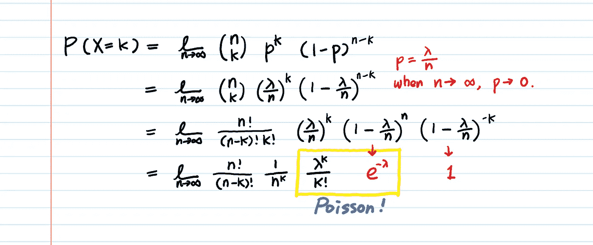

# 泊松分布——直觉、例子和推导

> 原文：<https://towardsdatascience.com/poisson-distribution-intuition-and-derivation-1059aeab90d?source=collection_archive---------1----------------------->

## 何时使用泊松分布

在设置参数 **λ** 并将其代入公式之前，我们先暂停一秒钟，问一个问题。

为什么泊松*非要*发明泊松分布？

> 为什么会有这种分布？
> 
> 什么时候应该使用泊松进行建模？

# 1.泊松为什么会发明泊松分布？

**预测未来发生的#事件！**

更正式地说，**预测给定数量的事件**在固定时间间隔内发生的概率。

如果你曾经卖过东西，这个"**事件**"可以定义为，例如，一个顾客从你这里买了东西(关键时刻，而不仅仅是浏览)。它可以是你的网站一天有多少访客，下个月你的广告有多少点击，你轮班时接到多少电话，甚至是明年有多少人会死于致命疾病，等等。

下面是我在现实生活中如何使用泊松的例子。

```
Every week, on average, 17 people clap for my blog post. I’d like to predict the # of ppl who would clap next week because I get paid weekly by those numbers.**What is the probability that** **exactly 20 people** (or 10, 30, 50, etc.) **will clap for the blog post next week?**
```

# 2.现在，让我们假设我们对泊松分布一无所知。那我们怎么解决这个问题？

解决这个问题的一个方法是从读取次数开始。每个阅读博客的人都有可能真的会喜欢它并鼓掌。

这是[二项式分布](https://en.wikipedia.org/wiki/Binomial_distribution)的经典工作，因为我们正在计算成功事件(拍手)数量的概率。

一个**二项随机变量**是在 **n 次**重复试验中成功的次数 **x** 。我们假设成功的概率 p 在每次试验中都是不变的。

然而，在这里我们只得到一条信息——17 ppl/周，这是一个“**比率**”(每周成功的平均次数，或 **x** 的[期望值](https://en.wikipedia.org/wiki/Expected_value))。我们对鼓掌概率 **p** 和博客访问量 **n** 一无所知。

因此，我们需要更多的信息来解决这个问题。我们还需要什么来把这个概率框定为一个二项式问题？我们需要两样东西:成功的概率(鼓掌) **p** &试验次数(访客) **n** 。

让我们从过去的数据中得到它们。


The stat of my Medium blog post about [Gradient Descent](/difference-between-batch-gradient-descent-and-stochastic-gradient-descent-1187f1291aa1)

这些是一年的统计数据。总共有 59k 人阅读了我的博客。59，000 人中，有 888 人鼓掌。

所以每周阅读我博客的人数( **n** )是 59k/52 = 1134。每周鼓掌的人数( **x** )是 888/52 =17。

```
# of **people who read** per week (**n**) = 59k/52 = **1134**# of **people who clap** per week (**x**) = 888/52 = **17**Success probability (**p**) : 888/59k = 0.015 = **1.5%**
```

## 使用二项式 [PMF](https://en.wikipedia.org/wiki/Probability_mass_function) ，下周 **我将获得恰好 20 次成功(20 人鼓掌)**的**概率是多少？**


```
<Binomial Probability for different **x**’s>╔══════╦════════════════╗
║   **x**  ║ Binomial P(X=**x**)║
╠══════╬════════════════╣
║  10  ║    0.02250     ║
║  **17**  ║    **0.09701**     ║  🡒 The average rate has the highest P!
║  20  ║    0.06962     ║  🡒 Nice. 20 is also quite Likely!
║  30  ║    0.00121     ║
║  40  ║  < 0.000001    ║  🡒 Well, I guess I won’t get 40 claps..
╚══════╩════════════════╝
```

我们刚刚用二项分布解决了这个问题。

**那么，泊松是为了什么？** **有哪些事只有泊松能做，二项式做不到？**

# 3.二项分布的缺点

> **a)二项随机变量是“二进制”——0 或 1。**

在上面的例子中，我们每周有 17 个人鼓掌。这意味着 17/7 =每天 2.4 人鼓掌，17/(7*24) =每小时 0.1 人鼓掌。

如果我们使用二项式随机变量按小时(0.1 人/小时)对成功概率**建模，这意味着大多数小时得到**零拍手**但是一些小时将得到**恰好 1 拍手**。然而，也很有可能某些小时会得到不止一次掌声(2 次，3 次，5 次，等等。)**

**二项式的问题是在单位时间内不能包含 1 个以上的事件**(在本例中，1 hr 是单位时间)。时间单位只能有 0 或 1 个事件。

**那么，把 1 小时分成 60 分钟，把单位时间变小，比如一分钟，怎么样？那么 1 小时可以包含多个事件。(尽管如此，一分钟将包含一个或零个事件。)**

我们的问题现在解决了吗？

算是吧。但是如果在那一分钟里，我们得到了多次鼓掌呢？(也就是说，有人在 Twitter 上分享了你的博文，流量在那一分钟激增。)然后呢？我们可以把一分钟分成几秒钟。那么我们的时间单位就变成了秒，同样，一分钟可以包含多个事件。但是这个**二进制容器**的问题将永远存在于更小的时间单位中。

这个想法是，我们可以通过将一个单位时间分成更小的单元，使二项随机变量处理多个事件。通过使用更小的划分，我们可以使原始单位时间包含多个事件。

数学上，这意味着 **n → ∞** 。
因为我们假设速率是固定的，我们必须有 **p →** 0。因为不然的话， **n*p，**也就是事件数，会炸。

使用极限，单位时间现在是无穷小。我们不再需要担心在同一单位时间内会发生不止一个事件。这就是我们如何得到泊松分布。

> b)在二项分布中，试验次数(n)应该事先知道。

如果使用二项式，则不能仅用比率(即 17 ppl/周)来计算成功概率。你需要“更多信息”( **n** & **p** )来使用二项式 PMF。
**另一方面，泊松分布不需要你知道 n 或者 p，我们假设 n 无限大，p 无限小。泊松分布**的唯一参数是**率λ** (期望值 **x** )。在现实生活中，只知道费率(即在下午 2 点~ 4 点期间，我接到了 3 个电话)比知道两个 **n** & **p** 要常见得多。

# 4.让我们从二项式 PMF 数学推导泊松公式。



Deriving Poisson from Binomial

> **现在你知道λ^k 各个组件在哪里了，k！还有 e^-λ是从哪里来的！**

最后我们只需要证明前两项的相乘 **n！/((n-k)！当 **n** 接近无穷大时，**为 1。


是 1。

我们得到了泊松公式！


From [https://en.wikipedia.org/wiki/Poisson_distribution](https://en.wikipedia.org/wiki/Poisson_distribution)

现在维基百科的解释开始有意义了。

> **把自己的数据代入公式，看看 P(x)对你有没有意义！**

下面是我的。

```
**< Comparison between Binomial & Poisson >**╔══════╦═══════════════════╦═══════════════════════╗
║   **k**  ║  Binomial P(X=**k**)  ║  Poisson P(X=**k;**λ=**17**)  ║
╠══════╬═══════════════════╬═══════════════════════╣
║  10  ║      0.02250      ║        0.02300        ║
║  **17**  ║      **0.09701**      ║ **0.09628** ║
║  20  ║      0.06962      ║        0.07595        ║
║  30  ║      0.00121      ║        0.00340        ║
║  40  ║    < 0.000001     ║      < 0.000001       ║
╚══════╩═══════════════════╩═══════════════════════╝* You can calculate both easily here:
Binomial:  [https://stattrek.com/online-calculator/binomial.aspx](https://stattrek.com/online-calculator/binomial.aspx)
Poisson :  [https://stattrek.com/online-calculator/poisson.aspx](https://stattrek.com/online-calculator/poisson.aspx)
```

需要注意一些事情:

1.  即使泊松分布模拟罕见事件，比率 **λ** 可以是任何数字。它不一定总是很小。
2.  泊松分布是不对称的，它总是向右倾斜。因为它在左边被零发生壁垒(没有“负一”clap 这种东西)抑制，在另一边是无限的。
3.  随着 **λ** 变大，图表看起来更像正态分布。


[https://en.wikipedia.org/wiki/Poisson_distribution](https://en.wikipedia.org/wiki/Poisson_distribution)

4.泊松模型假设

**a .单位时间内事件的平均发生率不变。**
这意味着每小时访问你博客**的人数**可能不遵循泊松分布，因为每小时的比率不是恒定的(白天的比率较高，晚上的比率较低)。对消费者/生物数据使用**月利率**也只是一个近似值，因为季节性效应在该领域并非微不足道。

**b .事件是独立的。你的博客访客的到来可能并不总是独立的。例如，有时大量的访问者成群结队而来，因为某个受欢迎的人提到了你的博客，或者你的博客出现在 Medium 的首页，等等。如果一次大地震增加了余震的可能性，一个国家每年的地震次数也可能不遵循泊松分布。**

5.泊松分布和指数分布之间的关系

如果单位时间内的事件数量遵循泊松分布，则事件之间的时间量遵循指数分布。泊松分布是离散的，而指数分布是连续的，然而这两种分布密切相关。

[让我们更深入:指数分布直觉](https://medium.com/@aerinykim/what-is-exponential-distribution-7bdd08590e2a)