# 基于策略的强化学习，简单的方法

> 原文：<https://towardsdatascience.com/policy-based-reinforcement-learning-the-easy-way-8de9a3356083?source=collection_archive---------6----------------------->

## 逐步理解强化学习中基于策略的方法

Photo by [Jomar](https://unsplash.com/@jmrthms?utm_source=medium&utm_medium=referral) on [Unsplash](https://unsplash.com?utm_source=medium&utm_medium=referral)

**更新 1** :学习和练习强化学习的最好方式是去 http://rl-lab.com

**更新 2** :如果你是这个主题的新手，从[开发人员强化学习政策](/revisiting-policy-in-reinforcement-learning-for-developers-43cd2b713182)文章开始可能更容易。

## 介绍

假设你在一个新城镇，既没有地图也没有 GPS，你需要到达市中心。你可以试着评估你相对于目的地的当前位置，以及你所采取的每个方向的有效性(价值)。你可以认为这是计算价值函数。或者你可以问一个当地人，他会告诉你直走，当你看到一个喷泉时，你向左走，一直走到市中心。他给了你一个可以遵循的政策。
自然，在这种情况下，遵循给定的策略比自己计算价值函数要简单得多。

在另一个例子中，假设您正在管理库存，并且您决定当每件商品的数量低于某个限制时，您发出一个购买订单来补充您的库存。这是一个比研究客户的活动、他们的购买习惯和偏好要简单得多的策略，以便预测对你的股票的影响…

毫无疑问，值函数将导致确定策略，如前几篇文章中所见，但是还有其他方法可以学习使用参数选择操作的策略，而无需咨询值函数(这不太正确，因为需要值函数来提高准确性)。

因此，主要思想是能够确定在状态**(*【s】*)**下采取哪种行动，以使回报最大化。

实现这一目标的方法是微调𝜽指出的参数向量，以便为𝜋.政策选择最佳行动
策略记为𝜋(a|s，𝜽) = Pr{At = a | St = s，𝜽t = 𝜽}，这意味着策略𝜋是在状态*时采取行动 ***a*** 的概率，参数为𝜽.*

## *优势*

*   *更好的收敛特性*
*   *在高维或连续动作空间有效
    当空间很大时，内存的使用和计算消耗增长很快。基于策略的 RL 避免了这一点，因为目标是学习一组远小于空间计数的参数。*
*   *可以学习随机策略
    随机策略比确定性策略更好，尤其是在两人游戏中，如果一个玩家确定性地行动，另一个玩家会制定对策以获胜。*

## *不足之处*

*   *通常收敛于局部最优而不是全局最优*
*   *评估策略通常效率低下且差异大
    基于策略的 RL 差异很大，但有一些技术可以降低这种差异。*

## *随机政策*

*首先需要注意的是，随机并不意味着在所有状态下都是随机的，但在某些有意义的状态下，它可能是随机的。
通常报酬最大化会导致确定性政策。但是在某些情况下，确定性策略并不适合这个问题，例如在任何两个玩家的游戏中，确定性的参与意味着另一个玩家将能够采取反制措施以便一直获胜。例如，在石头剪刀布游戏中，如果我们每次都玩确定性的相同形状，那么其他玩家可以很容易地对抗我们的策略并赢得每场游戏。*

**

*所以在这个博弈中，最优策略是随机的，比确定性策略好。*

## *蓝图*

*在深入研究数学和算法的细节之前，了解一下如何进行是很有用的，这是一种蓝图:*

1.  *找出一个可以用来评估政策有效性的目标函数。换句话说，告诉我们政策的效果有多好。*
2.  *定义策略。
    我们的意思是列出一些可以在学习过程中使用的有用政策。*
3.  *幼稚的算法。
    提出一种直接利用策略来学习参数的算法。*
4.  *改进的算法
    寻找改进目标函数的算法，以最大化策略的有效性。*

# *蓝图的第 1 部分:寻找目标函数*

*请记住，在上面的蓝图中，我们谈到了寻找一个目标函数来评估政策的有效性。在这一节中，我们将定义目标函数及其一些有用的推导。
(关于政策梯度的更多细节可以在文章[政策梯度一步一步](https://medium.com/@zsalloum/policy-gradient-step-by-step-ac34b629fd55)中找到)。*

## *目标函数*

*当谈到函数的最大化时，一个突出的方法是梯度。*

*但是我们如何根据𝜽最大化回报呢？一种方法是找到一个目标函数 J(𝜽)这样*

*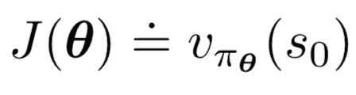*

*其中，V𝜋𝜽是策略𝜋𝜽的值函数， ***s0*** 是起始状态。*

*简而言之，J(𝜽最大化意味着 V𝜋𝜽(s).最大化由此可见*

*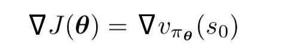*

*根据政策梯度定理*

**

*其中𝝻(s)是𝜋下的分布(意为遵循政策𝜋时处于状态 ***s*** 的概率)，q(s，a)是𝜋下的动作值函数，∇𝜋(a|s，𝜽)是𝜋给定 ***s*** 和𝜽.的梯度
最后𝝰的意思是成比例的。*

*所以这个定理说∇J(𝜽)正比于 ***q*** 函数的和乘以我们可能处于的状态下所有行为的策略梯度。然而我们不知道𝜋(a|s、𝜽)，我们怎么能找到它的梯度呢？*

*事实证明，如以下演示所示，这是可能的:*

*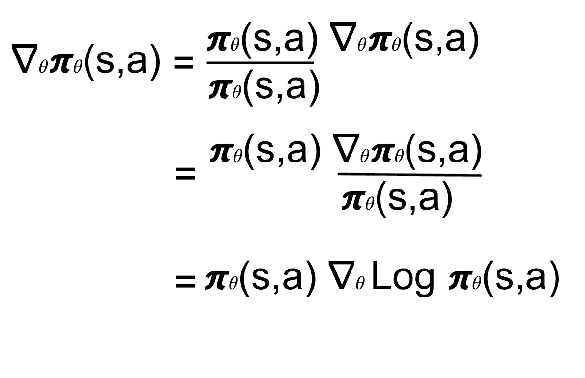*

*提醒: **∫ dx/x = Log(x)** 意思是 **dx/x = (Log(x))' = ∇Log(x)***

***∇Log 𝜋𝜃(s,a)** 被称为得分函数。
注意，政策的梯度可以表示为预期。如果你问自己为什么？查看维基百科关于[期望值](https://en.wikipedia.org/wiki/Expected_value)的文章。*

## *参数更新*

*由于这是一个梯度方法，参数的更新(我们正试图优化)将按通常的方式进行。*

*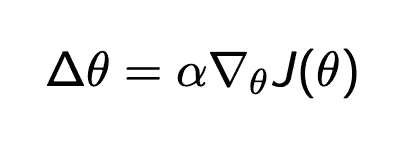*

# *蓝图的第 2 部分:定义策略*

*本节介绍了几种标准梯度策略，如 Softmax 和 Guassian。我们在 RL 算法中使用这些策略来学习参数𝜽.
实际上，每当在 RL 算法中我们看到对 **∇Log 𝜋𝜃(s,a)** 的引用时，我们就插入所选策略的公式。*

## *Softmax 策略*

*softmax 策略由一个将输出转换为概率分布的 softmax 函数组成。这意味着它影响每个可能动作的概率。*

*Softmax 主要用于离散动作的情况:*

*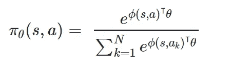*

*因此*

*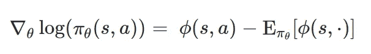*

*在哪里*

*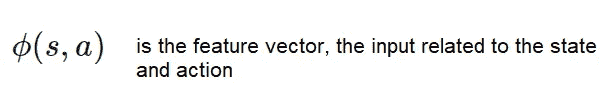*

*这里可以查看推导[的完整演示。](https://math.stackexchange.com/questions/2013050/log-of-softmax-function-derivative)*

## *高斯策略*

*高斯策略用于连续动作空间的情况，例如当你驾驶一辆汽车时，你转动方向盘或踩下油门踏板，这些都是连续动作，因为这些都不是你做的少数动作，因为你可以(理论上)决定旋转角度或气体流量。*

*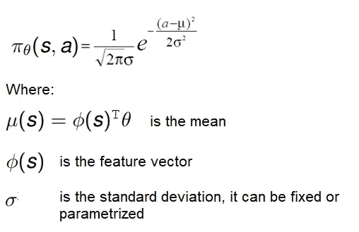*

*推导变成了*

*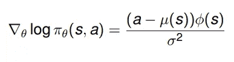*

# *蓝图的第 3 部分:朴素算法*

*本节将给出一些算法，这些算法将考虑策略和它们的目标函数，以便学习给出最佳代理行为的参数。*

## *强化(蒙特卡罗策略梯度)*

*该算法使用蒙特卡罗根据策略𝜋𝜃创建剧集，然后对于每个剧集，它迭代该剧集的状态并计算总回报 G(t)。它使用 G(t)和∇Log 𝜋𝜃(s,a(可以是 Softmax 策略或其他)来学习参数𝜃.*

*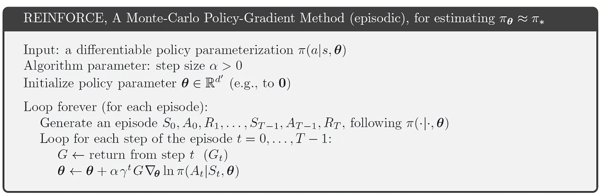*

*from Sutton Barto book: Introduction to Reinforcement Learning*

# *蓝图的第 4 部分:改进的算法*

*我们已经说过基于策略的 RL 具有很高的方差。然而，有几个算法可以帮助减少这种差异，其中一些是加强基线和演员的批评。*

## *用基线算法增强*

*基线的概念是从 G(t)中减去称为基线的 b(s ),目的是减少结果的大范围变化。
假设 b(s)不依赖于动作 a，可以证明 **∇J(** 𝜽)的方程仍然成立。*

*所以现在的问题是如何选择 b(s)？*

*基线的一个选择是计算状态值的估计值,( St，w ),其中 w 是通过蒙特卡罗等方法学习的参数向量。
所以 b(s)=③(St，w)*

*用基线增强算法变成*

*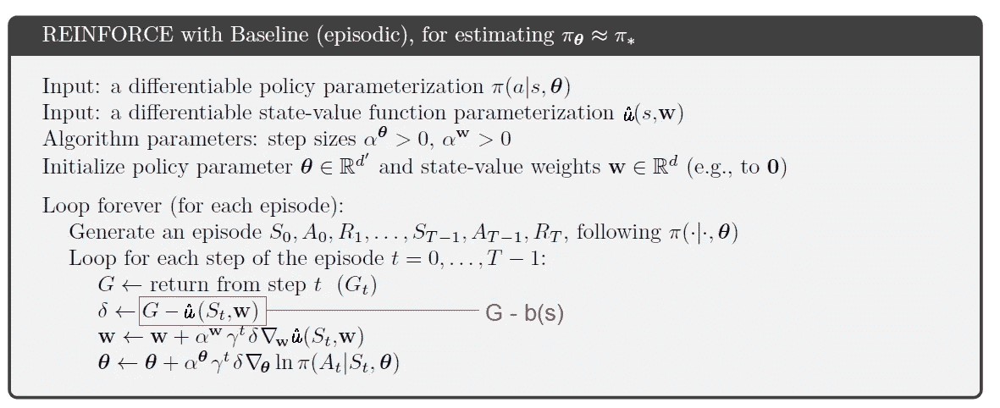*

## *演员评论家算法*

*(详细解释见[演员评论家简介](/introduction-to-actor-critic-7642bdb2b3d2)篇)
演员评论家算法使用 TD 来计算用作评论家的价值函数。批评家是一个状态值函数。评估事情的进展是很有用的。在每个行动之后，批评家计算新的状态来确定是否有任何改进。这个评估就是 TD 误差:*

*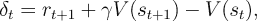*

*然后，δ(t)用于调整参数𝜽和 **w** 。
简而言之，𝜽和 **w** 都以修正该误差的方式进行调整。*

*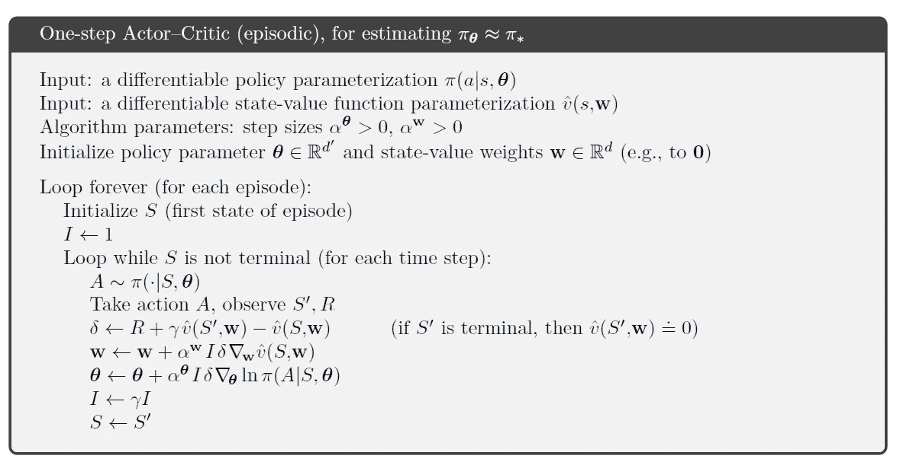*

*from Sutton Barto book: Introduction to Reinforcement Learning*

# *相关文章*

*   *[开发人员强化学习政策](https://medium.com/@zsalloum/revisiting-policy-in-reinforcement-learning-for-developers-43cd2b713182)*
*   *[政策梯度逐步推进](/policy-gradient-step-by-step-ac34b629fd55)*
*   *[强化学习中的函数逼近](/function-approximation-in-reinforcement-learning-85a4864d566)*
*   *[强化学习中的演员评论家介绍](/introduction-to-actor-critic-7642bdb2b3d2)*