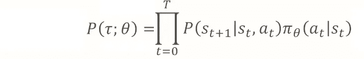
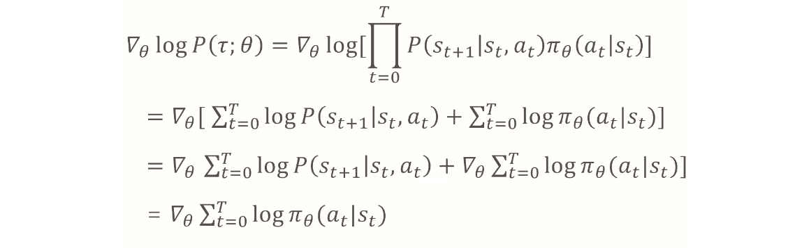

# 政策梯度渐进

> 原文：<https://towardsdatascience.com/policy-gradient-step-by-step-ac34b629fd55?source=collection_archive---------16----------------------->

## 政策梯度方程推导的综合分析

Photo by [Kyle Glenn](https://unsplash.com/@kylejglenn?utm_source=medium&utm_medium=referral) on [Unsplash](https://unsplash.com?utm_source=medium&utm_medium=referral)

**更新 1** :学习和练习强化学习的最好方式是去 http://rl-lab.com

**更新 2** :如果你是这个主题的新手，从[开发人员强化学习政策](/revisiting-policy-in-reinforcement-learning-for-developers-43cd2b713182)文章开始可能更容易。

# 概观

在上一篇文章中，我们了解了基于[策略的学习](/policy-based-reinforcement-learning-the-easy-way-8de9a3356083)，并探讨了这种方法的优缺点。在本文中，我们将深入研究数学细节，以推导出政策梯度的正确方程。

但是在我们开始之前，让我们快速回顾一下为什么政策学习是有用的:

*   策略学习在高维或连续的动作空间中是有效的。
    大的状态和动作空间消耗巨大的内存和计算能力。另一方面，学习策略消耗较少，因为我们学习定义策略的一组可管理的参数。
*   可以学习随机政策。
    随机策略比确定性策略更好，尤其是在两人游戏中，因为任何确定性行为都将很容易受到反措施的威胁。

# 数学

我们需要时刻提醒自己我们的目标是什么，因为我们很容易忘记它。
不断对自己说，目标是在每一个强化学习问题中获得最大的回报。

所以从这个基本原则出发，我们定义 J(𝜃为我们在从 0 到 t 集结束的每个时间步中得到的预期回报 R(s，a ),遵循一个𝛑(𝜃).政策
如果我们将这一集定义为一条从 t=0 到 t 的𝞽轨迹，那么预期报酬就是所有可能轨迹的总和，即𝞽根据𝜃被选中的概率，乘以这条轨迹的回报率 R(𝞽).
这使我们得出以下等式:

同样，我们的目标是找到𝜃的一组参数，使 J(𝜃)(which 的预期回报最大化。

从微积分我们知道，为了找到一个函数的极值(最大值或最小值),我们要计算它的导数。
我们将在下面的一组等式中完成:

注意上面的技巧，我们用𝜃的 P(𝞽来乘除(这是合法的，因为𝜃的 p(𝞽= 1)。这个技巧的目的是达到一个术语𝛻P(𝞽，𝜃)/P(𝞽，𝜃)，因为∫df/f .dx= log(f(x))，因此 log(f(x))的导数是 df/f。由此我们发现𝛻log P(𝞽，𝜃 ) = 𝛻P(𝞽，𝜃)/P(𝞽，𝜃).我们神奇地得到了下面的等式。

然而，由于我们实际上不能计算每一个可能的轨迹，𝞽,we 将后退以获得数量减少的(m)个轨迹。在这里我们也可以看到𝜃的 P(𝞽(日志前的那个)神奇地消失了。原因是，当我们选择了(m)个轨迹时，就不再有选择它们的可能性，因为它们已经被选择了。

我们以这个等式结束:

请注意，我们从期望值(所有可能的轨迹)移动到(m)个选定轨迹的平均值。

现在让我们单独关注𝛻logp(𝞽(𝜃)。轨迹被遵循的概率等于当遵循某个策略𝛑(𝜃).时，该轨迹的每一步到达的概率的乘积
下面一行显示 log P(𝞽，𝜃)转化为 P(S(t+1)|St，at)的乘积。𝛑(𝜃)

直觉上，我们说我们遵循了一个轨迹，当我们通过了它的所有步骤。所以沿着它走到底的概率，等于我们经过这条轨迹每一步的概率的乘积。

我们知道乘积的对数等于对数之和:

上述方程组的第二行显示，我们将σlog(p.𝛑进一步分解为σ(log(p)+log(𝛑)，然后是σlog(p)+σlog(𝛑).
当对𝜃应用这两项的导数时，𝛻σlog(p 消失，因为 p 不依赖于𝜃.

既然我们已经发现𝛻log P(𝞽，𝜃)=𝛻σlog(𝛑(a|s,𝜃，我们可以把它放回初始方程，并检索最终结果，如下所示:

# 结论

正如我们已经看到的，推导政策梯度是非常优雅和智能的程序。完全掌握这种推导的本质是至关重要的，因为它是许多众所周知的基于政策的方法的基础，例如[演员-评论家](/introduction-to-actor-critic-7642bdb2b3d2)。

# 相关文章

*   [开发人员强化学习政策](https://medium.com/@zsalloum/revisiting-policy-in-reinforcement-learning-for-developers-43cd2b713182)
*   [基于策略的强化学习，简单易行](/policy-based-reinforcement-learning-the-easy-way-8de9a3356083)
*   [强化学习中的函数逼近](/function-approximation-in-reinforcement-learning-85a4864d566)
*   [强化学习中的演员评论家介绍](/introduction-to-actor-critic-7642bdb2b3d2)