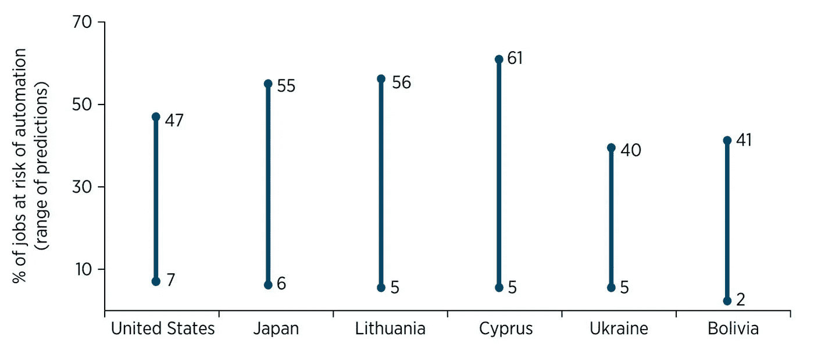

# 人工智能社会契约的政策处方

> 原文：<https://towardsdatascience.com/policy-prescriptions-for-the-ai-social-contract-c90fce81fae7?source=collection_archive---------16----------------------->

*The Leader of the Luddites,* Published in May 1812 by Walker & Knight, Sweetings Alley, Royal Exchange, Copyright Expired

在我最近的故事“人工智能经济的新世界秩序”中，我提出未来人工智能经济的成功将在很大程度上取决于每个国家人工智能劳动力、人工智能基础设施以及最终人工智能社会契约的创造。在这个原始故事中，我提出了一些高层次的政策想法作为讨论的开始，但很明显，人们渴望更深入地研究人工智能社会结构的想法以及实现它的具体政策想法。

**为什么是人工智能社会契约？**

人工智能和工作场所自动化的采用已经在改变我们的工作方式和我们需要的劳动力。根据《2019 年世界发展报告》(图 1)，美国近一半的工作岗位预计将实现自动化。

*Figure 1: WDR 2019: The Changing Nature of Work*© World Bank [http://www.worldbank.org/en/publication/wdr2019](http://www.worldbank.org/en/publication/wdr2019) License: [Creative Commons Attribution license (CC BY 3.0 IGO)](http://creativecommons.org/licenses/by/3.0/igo/)

工人的流离失所导致了技术抵制，19 世纪英格兰卢德运动的经典例子就是工人摧毁纺织机械，这被视为夺走工人的生计。根据 Forrester 的 Craig Le Clair 在最近的[金融时报文章](https://www.ft.com/content/4580f43a-2191-11e8-9efc-0cd3483b8b80)中的预测，随着人工智能在“立方体”中自动处理白领工作的应用迅速增长，预计到 2022 年将达到 480 亿美元以上，我们可以预计未来将出现勒德派式的动荡。

虽然自动化的历史告诉我们，每一次新的技术进步都会增加总就业，但新的工作岗位往往会流向不同的工人阶层、技能水平等。据估计，到 2030 年，7500 万到 3 . 75 亿工人需要改变就业类别或重新获得技能(来源:[麦肯锡全球研究所](https://www.mckinsey.com/featured-insights/future-of-work/how-will-automation-affect-jobs-skills-and-wages?reload))。

这种从人到“数字工人”、物理机器人和 RPA 机器人的工作快速转移，使得新的“人工智能社会契约”成为必要，以保持创新，同时为受到工作场所演变影响的工人提供服务。

**人工智能社会契约政策**

第一要务:再培训、技能提升和教育:自动化的早期影响将主要集中在中低技能劳动力身上。包括送货、分拣、驾驶、提升和检查在内的工作将是自动化的早期目标。[新美洲](https://medium.com/u/8b7450ee42a6?source=post_page-----c90fce81fae7--------------------------------)的工作[为自动化换挡](https://www.newamerica.org/work-workers-technology/shiftlabs/blog/new-america-launches-rural-shiftlabs-initiative/)表明，居住在城市以外的工人在面对自动化时面临更大的困难。

1.  人工智能优化的职业教育:人工智能教育的大部分重点是高等数学和科学。人工智能社会契约将需要职业教育，为新兴领域的工人提供装备:先进制造、机电一体化、机器人服务和维修等。非政府组织和社区大学需要资金来继续和发展像西雅图友好社的青年航天计划这样的项目。
2.  将年轻工人从衰退的行业和工作职能中分流出来至关重要。对衰落行业中完全就业的个人进行再培训和工作变动激励，将节省政府用于再培训年龄较大、灵活性较差的工人的长期支出。政策规定雇主雇用职业生涯晚期的工人来填补目前的空缺，这在这一领域有所帮助，并解决一些被解雇的老年工人的就业需求。
3.  中年工人的再培训和技能提升面临着最大的挑战，因为他们已经工作了很多年，不太能灵活地改变行业，而且经常会选择与他们过去的就业相关的培训选项，从而增加了裁员的风险。一个关键的成功因素是接受职业评估，以帮助失业工人做出再培训决定(来源:[大西洋](https://www.theatlantic.com/education/archive/2018/01/the-false-promises-of-worker-retraining/549398/))。

**优先事项 2:** 如今，只有 48%的美国人支持为自动化失业工人提供基本收入的想法，而几乎相同比例的工人面临机器人失业的风险(来源:[东北大学/盖洛普调查，2017 年 9 月 15 日至 10 月 10 日](https://news.gallup.com/poll/228194/public-split-basic-income-workers-replaced-robots.aspx?g_source=link_NEWSV9&g_medium=LEAD&g_campaign=item_&g_content=Public%2520Split%2520on%2520Basic%2520Income%2520for%2520Workers%2520Replaced%2520by%2520Robots))。随着自动化对工人的影响越来越清晰，有理由假设公众支持将达到多元化。随着公众支持的增加，决策者在执行这些政策时需要考虑以下因素:

1.  有保障的收入计划将需要保留给那些无法重新获得技能的工人
2.  保证收入计划的参与者应该优先作为被分流的年轻工人的替补
3.  这些计划应该有时间限制，以使该计划对接近社会保障和医疗保险资格的工人更有吸引力
4.  这些计划将需要提供医疗补助资格作为权宜之计，直到工人及其家人达到标准的医疗保险资格