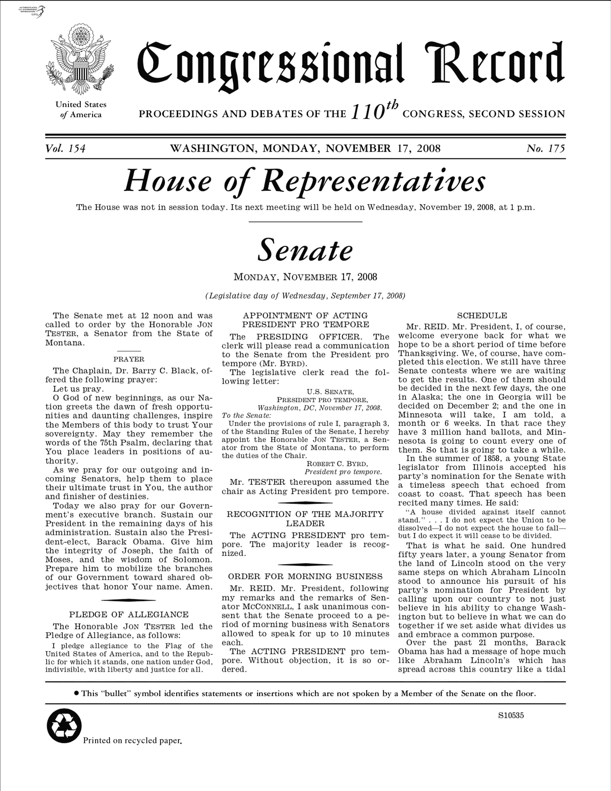
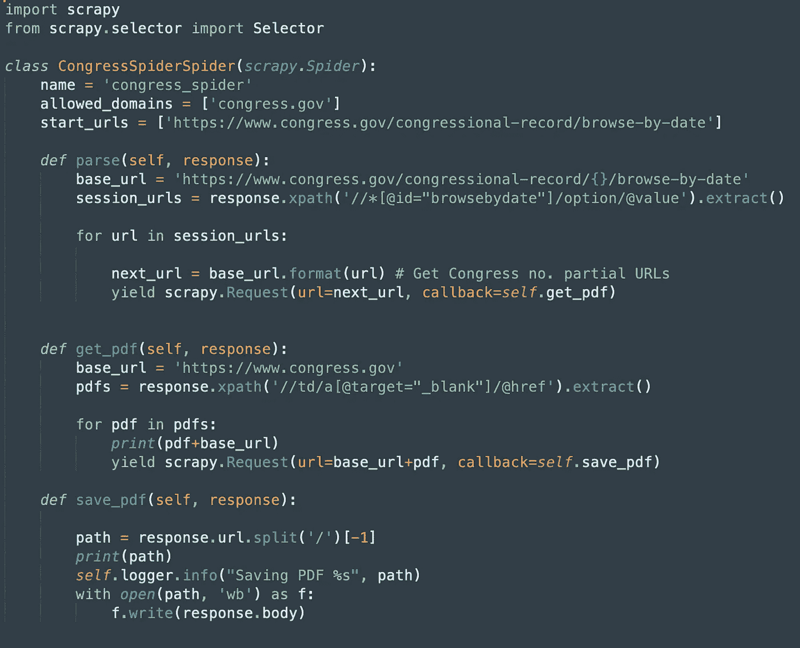
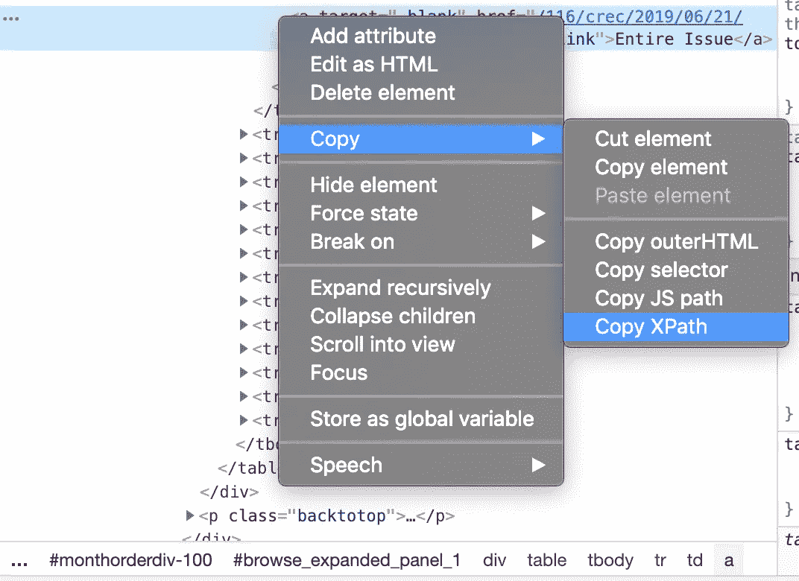
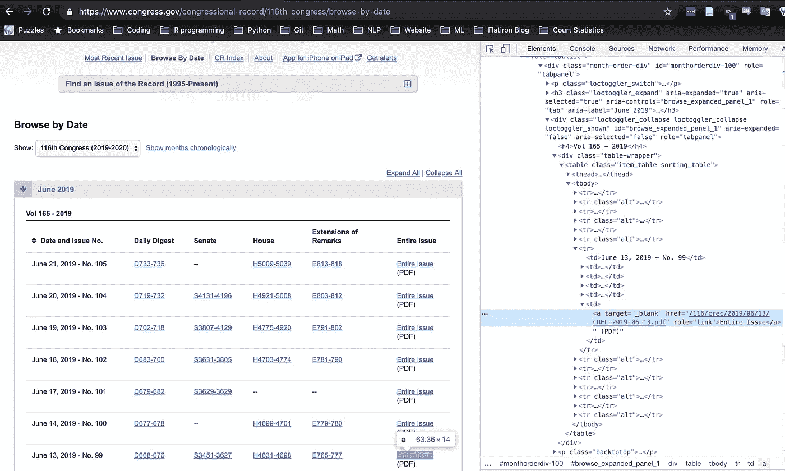
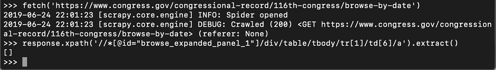
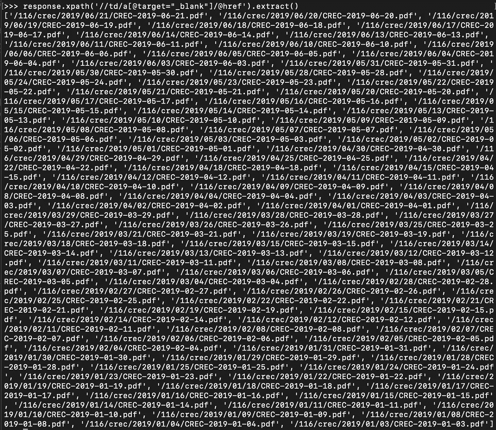
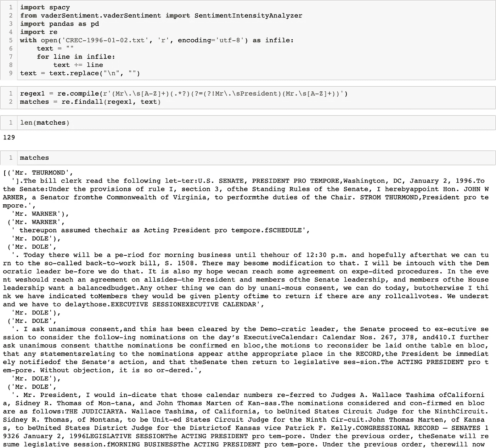
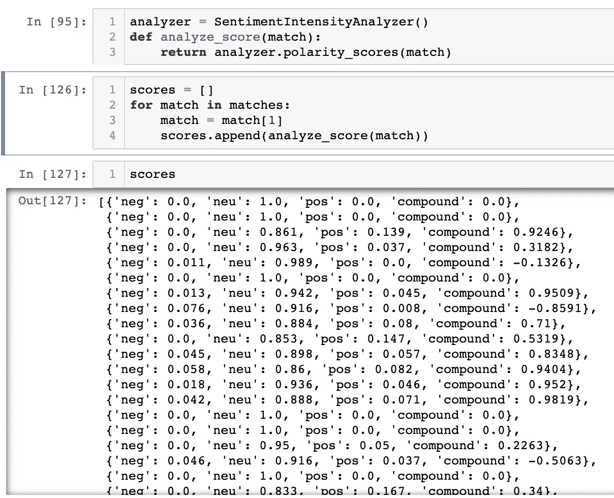

# 政治巨蟒

> 原文：<https://towardsdatascience.com/political-python-1e8eb46c1bc1?source=collection_archive---------14----------------------->

## 用 Scrapy 刮国会文件


No, not that kind of python.

2020 年民主党总统候选人将在周三开始的辩论中交锋。他们中的许多人是现任或前任国会议员。他们都在竞争领导这个国家。

作为选民，如果我们有他们在政治生涯中在参议院或众议院所说的每一句话的记录，那不是很棒吗？

作为数据科学家，难道我们不想提取他们的话，分析他们，并用他们来判断或预测这些国会议员作为总统候选人吗？

# 用 Scrapy 造一只蜘蛛

是的，我们可以。宪法要求国会记录其议事过程。因此，政府出版办公室印刷(并以数字形式发布)国会记录，其中包含立法机构两院的日常正式会议记录，包括:

*   住房部分
*   参议院部分
*   评论的延伸(演讲、颂词、证词和立法史)
*   每日文摘



Congressional Record, November 17, 2008.

尽管这些数据存在于公共领域，但将它们从网站上取出并转换成可用的格式却是一个挑战。在无法访问昂贵的法律数据库的情况下，网络搜集是有事业心的公众的最佳选择，Scrapy 使得快速获得大量信息变得相对容易。

# 蜘蛛去了华盛顿

Scrapy 允许使用 python 进行异步 web 抓取。您可以使用它通过 API 提取数据，将它与 BeautifulSoup 和 Selenium 集成，并像蜘蛛网有细丝一样扩展它的功能。

Scrapy 的核心想法是复制 [Django](https://www.djangoproject.com/) 一个“不要重复自己”的框架，这意味着它提供了一种重用代码和轻松将项目扩大到更大范围的方法。爬行器的组成部分，如项目、中间件、管道和设置，存在于单独的脚本中，爬行不同网站的多个“蜘蛛”可以在同一个“项目”中使用它们。

蜘蛛本身自然依赖于面向对象的编程(每个都属于“蜘蛛”类):



A Scrapy spider.

重要组件包括:

*   开始 URL
*   你从回答中提取了什么，如何提取
*   返回给解析函数的内容

# 在 Python 中使用 XPath

Scrapy 最有用的功能之一是 Scrapy shell，它允许你实时探索你正在抓取的网站，以测试你的假设。本质上，在部署代码之前，您可以在沙盒模式下尝试您的代码(并发现它不起作用)。

当您在处理像 XPath 这样复杂的东西时，这个附加功能极大地减少了深入网站结构提取所需内容的时间和挫折感。例如，我需要从 Congress.gov 网站的 HTML 中的特定元素获取部分 URL 和文本。Scrapy shell 允许我在将结果语法复制并粘贴到代码中之前，确保我的 XPath 语法不会返回空列表。



*Is it worth auto-generating XPath?*

**关于从 DevTools 中“复制 XPath”的说明:**虽然您可能觉得在 DevTools 中右键单击 HTML 元素并从出现的菜单中选择“复制 XPath”很吸引人，但是不要屈服于诱惑。如果像国会一样，你的网站是用表格组织的，你将无法检索到你想要的一切。就我而言，我想要的 pdf 文件位于页面的最右边一栏:



Congress.gov website

单击“复制 XPath”会显示以下信息:

```
//*[@id="browse_expanded_panel_1"]/div/table/tbody/tr[1]/td[6]/a
```

*这只是描述一个表内的位置。*

下面是 shell 中返回的内容:



*An empty list*

下面是我的*实际的* XPath 表达式:

```
response.xpath('//td/a[@target="_blank"]/@href').extract()
```

这是它返回给定页面的内容:



*PDFs that exist*

您必须[学会使用 XPath](https://www.guru99.com/xpath-selenium.html) 来选择*有意义的*内容，而不是依赖于自动生成的表达式，后者——很像正在讨论的政府机构——通常表功能有利于形式。

# 使用 Tika 提取文本

一旦我写了这个蜘蛛，它很快就把 25 年的国会记录下载到了我的硬盘上。后来没有太多额外的代码，我已经用处理 pdf 的 python 库 [Tika](https://github.com/chrismattmann/tika-python) 提取了文本。

我创建了一个正则表达式来拆分个人发言:



*Preliminary NLP pre-processing*

尝试了一些非常初步的情感分析:



*Preliminary NLP with VADER*

# 议长先生，交出你的秘密

既然他们的话已经暴露无遗，国会下一步该怎么办？分析与数据挖掘，自然(语言处理)ly。尽管人们对 Twitter 争论不休，但几乎没有人对参议员和众议员在国会发言时所说的话提出质疑，无论是因为获取数据的难度、训练模型的难度、缺乏法律素养，还是上述所有原因。但借助适当的工具和领域知识，我希望在 2020 年选举季之前提供一些有价值的见解。

*原载于*[*https://www.espritdecorpus.com*](https://www.espritdecorpus.com/posts/political-python-scrapy/)*。*