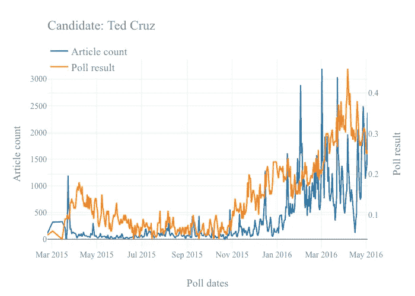
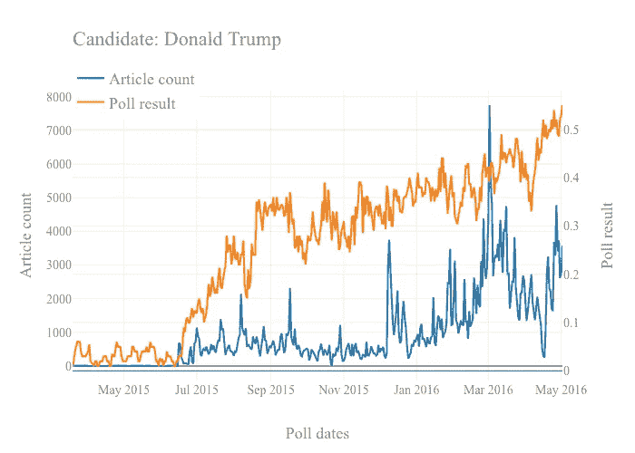
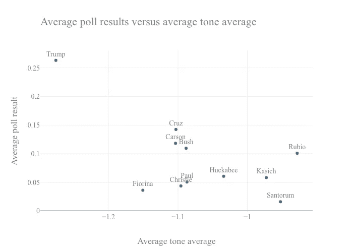
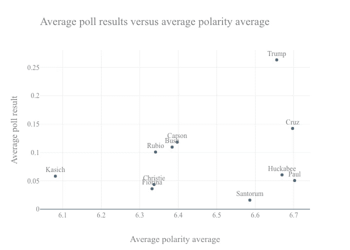

# 民意测验和新闻

> 原文：<https://towardsdatascience.com/polls-and-press-ef340199e425?source=collection_archive---------28----------------------->

## 探索新闻报道与民意测验表现之间的关系

候选人投票是政治竞选过程的重要组成部分。投票结果受到选民、记者，当然还有候选人及其竞选团队的密切关注。民调排名的上升有助于竞选造势，巩固支持，刺激筹款。减少会产生相反的效果。

在 2019 年 5 月撰写这篇文章时，美国正处于 2020 年总统大选的早期阶段，已经有大约 20 名民主党候选人争夺本党提名，并面对可能的共和党提名人唐纳德·特朗普。理解投票驱动因素是这些候选人、他们的支持者和反对者以及中立观察者的浓厚兴趣。

一个驱动因素是媒体报道，在这篇文章中，我通过研究 2016 年共和党总统初选来探索新闻报道和民调结果之间的关系。这场初选与今天的民主党竞选有一些相似之处，特别是在候选人众多的领域，它可能会成为有用见解的来源。

这种方法是建立一个由 2015 年和 2016 年的民调结果和关键新闻报道指标和主题组成的数据集，在这段时间里，初选过程将一个巨大的候选人场削减到一个获胜者唐纳德·特朗普(Donald Trump)。利用这些数据，我们可以探索关系。

# 数据

为了进行这种分析，需要民意测验和新闻报道数据。这些数据来自两个不同的来源，FiveThirtyEight 和全球事件、语言和语调数据或 GDELT 项目。

FiveThirtyEight 是一项分析服务，拥有一个受欢迎的网站，提供政治、体育、科学和健康、经济和文化的定量和统计分析。

 [## 五三八

### 内特·西尔弗的《FiveThirtyEight》使用统计分析——硬数字——讲述关于选举的引人入胜的故事…

fivethirtyeight.com](https://fivethirtyeight.com/) 

2015/2016 年共和党总统初选的民调数据是使用基于 [Selenium](https://www.seleniumhq.org/) 和 [Beautiful Soup](https://www.crummy.com/software/BeautifulSoup/bs4/doc/) 工具构建的网络抓取对象从一个特定的 538[页面](https://projects.fivethirtyeight.com/election-2016/national-primary-polls/republican/)获得的。它们涵盖了 2015 年 1 月 25 日至 2016 年 5 月 3 日之间的 670 项民意调查，结果涉及 11 位候选人(唐纳德·川普、约翰·卡西奇、特德·克鲁兹、马尔科·卢比奥、本·卡森、杰布·布什、克里斯·克里斯蒂、卡莉·菲奥莉娜、里克·桑托勒姆、兰德·保罗和迈克·哈克比)。

GDELT 由 Google Jigsaw 支持，是一个监控、存储和提供“来自几乎每个国家每个角落的世界广播、印刷和网络新闻”的项目。GDELT 管理几个存储库，但是对于这个项目，数据是从全球知识图第二版(GKG V2)数据库中提取的。具体而言，针对与主要候选人相关的文章，获取了文件计数、语气、正负分数、极性、活动参考密度和自我参考密度的 GDELT CKG 值以及文章主题汇编。

 [## GDELT 项目

### GDELT 项目

哥德尔 Projectwww.gdeltproject.org](https://www.gdeltproject.org/) 

GDELT 数据可以通过文本 API 获得，并作为谷歌 [BigQuery](https://cloud.google.com/bigquery/) 大数据服务上的公共数据集。对于这项工作，我使用 BigQuery 并通过 Google 提供的 Python API 访问数据库。CKG V2 非常大，有 9.85 万亿字节(TB)和大约 9.35 亿行。处理如此大的数据集意味着我首先必须将相关的新闻数据写入另一个小得多的 BigQuery 表，然后查询它以在 Python 的 pandas 库中构建建模数据。这个较小的表大约有 540 万行，其中的行代表在投票期间与上述候选人相关的 CKG·V2 条目。

# 形象化

有 11 个候选人和一系列功能，有许多可视化图表可能会揭示有趣的关系。从对投票结果的纵向观察和对单个候选人的媒体报道度量开始可能是最有用的。例如，我们可以查看特德·克鲁兹和川普的投票结果和文章数量。

文章计数显示了一个有趣的模式，在活动的早期覆盖率相对较低，然后在最后几个月迅速增加。民意测验结果有趋势成分，似乎显示出变化。实际上，在相当长的时间内，它们大多围绕趋势线波动(换句话说，它们围绕同一个值波动)。

这也有助于横向比较候选人之间的相似度量。在接下来的两个图表中，我们看到了所有候选人的平均投票结果与文章数量的对比，以及平均投票结果与文章语气平均值的对比。

第一张图中各点的排列证实了一个直观的观察结果，即较高的民调数字与较大的媒体报道相关联。

GDELT 为每份 CKG·V2 文件获取了几个指标，包括对其平均“语气”的测量声调被计算为正分数和负分数之间的差，正分数和负分数分别代表正单词和负单词的百分比。在下图中，我们检查了平均投票结果和平均音调之间的关系。

这里没有明显的模式，但有趣的是，特朗普在这个尺度上是一个值得注意的异数，平均语气最低，但平均民调最高。

GDELT 还跟踪每个文档的极性。它测量音调词典中匹配单词的百分比，作为文本“情绪极化或充满激情”程度的指标更高的值与更大的极化相关联。相对于极性平均值的平均值绘制平均投票结果揭示了沿极性维度的有趣分组。保罗、克鲁兹、哈克比和川普属于媒体高度分化群体。

# 建模

一个自然的问题是，这些新闻数据能预测未来的民意测验表现吗？为了解决这个问题，我构建了一个分类模型框架，其中目标变量是未来民意测验中的表现，解释特征是从 GDELT 收集的新闻数据。

目标变量包括三类，下降、持平和上升，对应于特定候选人的投票结果在两次感兴趣的投票之间是下降、保持持平还是上升。在我的分析中，我对下一轮投票和第三轮投票的性能进行了建模，但是可以检查任意数量的投票周期。解释性特征包括 GDELT 的文档计数、度量以及文档主题列表。

事实证明，使用这些数据来创建未来投票表现的预测模型具有挑战性。总的来说，这项分析发现，在一个广泛的候选人领域中平均的广泛媒体指标在预测即将到来的民意调查中的表现方面没有什么力量。这些模型的精度并不比下行、平坦和上行观测的基线分布好多少。

研究了几种模型配置，包括预测未来投票(在这种情况下是第三次投票)中的表现，以及将数据集限制为单个候选人。这些模型显示了改进的准确性，并表明这种方法可以产生结果。需要做更多的工作。

# 更多细节和未来的工作

对于那些感兴趣的人，你可以在我的 GitHub 库中找到更多信息，包括这个[项目](https://github.com/sgodfrey66/Polls_and_press)的所有建模工作。

如果读者有兴趣，我可以将分析扩展到 2019/2020 民主党总统初选，看看从这场比赛的早期观察中可以收集到什么观察结果。让我知道。