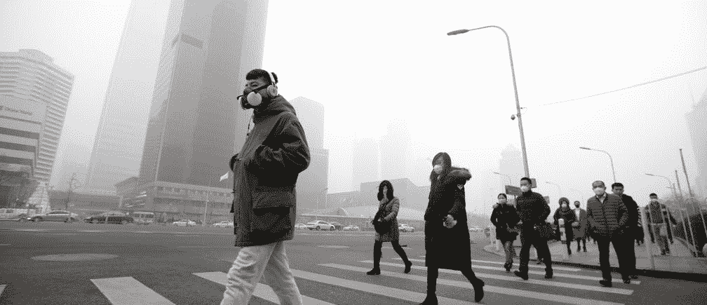
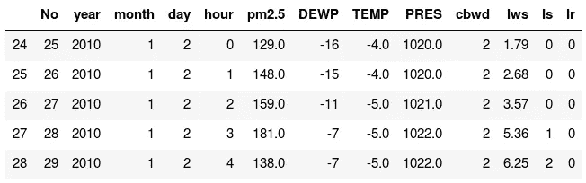
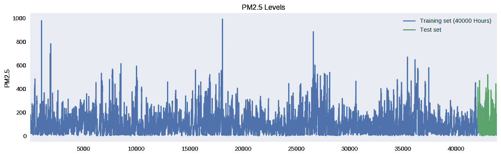
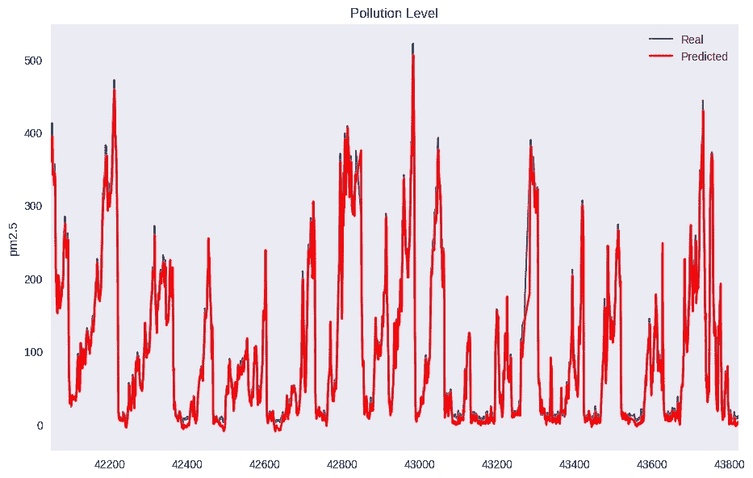

# 基于时间序列和 LSTM 的 MXnet 污染预测

> 原文：<https://towardsdatascience.com/pollution-forecasting-using-time-series-and-lstm-with-mxnet-16fe9180ee1?source=collection_archive---------23----------------------->

Photo by [Jake Hills](https://unsplash.com/@jakehills?utm_source=medium&utm_medium=referral) on [Unsplash](https://unsplash.com?utm_source=medium&utm_medium=referral)

# 时间序列

时间序列分析是一种处理时间序列数据或趋势分析的统计技术。时间序列数据是指数据在一系列特定的时间段或间隔内。

TSA(时间序列分析)应用:

*   模式识别
*   地震预报
*   天气预报
*   金融统计

还有更多…

# MXnet

Apache MXNet(孵化)是一个深度学习框架，旨在提高效率和灵活性。它允许你混合符号和命令式编程来最大化效率和生产力。MXNet 的核心包含一个动态依赖调度器，它可以动态地自动并行化符号操作和命令操作。在此之上的图形优化层使得符号执行速度更快，内存效率更高。MXNet 是可移植的、轻量级的，可以有效地扩展到多个 GPU 和多台机器。

# 问题

> *在中国这个世界上人口最多的国家，随着新兴精英阶层的崛起和超过 10%的经济增长率，环境问题已经退居其次。日益严重的污染导致了无法使用的水道，出生缺陷的增加，以及一些地球上最脏的空气。它是如此的令人讨厌，以至于现在有一个词来形容它:“smogpocalypse”。*

[来源](https://allthatsinteresting.com/pollution-in-china-photographs)

# 我们开始吧！

## 密码

这里用到的所有代码都可以作为[笔记本](https://colab.research.google.com/drive/1ktpx04H1uZtezRd934De3-IIqD43mhn2)使用。可以直接在 [google colab](https://colab.research.google.com) 上运行。

我们从安装基本组件和依赖项开始我们的笔记本。

在本教程中，我们将使用[北京 PM2.5 数据集](https://archive.ics.uci.edu/ml/datasets/Beijing+PM2.5+Data)来训练和预测污染水平( [PM2.5](https://blissair.com/what-is-pm-2-5.htm) )

使用 wget 直接下载数据集:

导入所需模块:

用熊猫读数据:

*小数据处理* —

大量的可视化和特征工程超出了本教程的范围，但是我们仍然需要做一些事情来继续。

*   下降 *Nan* 值。
*   标签编码风向( *cbwd* )

我们数据集的快速可视化:

我们定义了一个将数据转换为数据序列的函数:

*多一点数据预处理*

*   将数据集值中的值缩放至[0，1]
*   通过将我们的数据传递给上面定义的`make_dataset_many_to_one`来创建新的数据集。在这里，我们选择每 24 小时做一次记录。

按如下方式重塑数据:

*   **样品**。一个序列就是一个样本。一个批次由一个或多个样本组成。
*   **时间步长**。一个时间步长是样本中的一个观察点。
*   **特点**。一个特征是一个时间步长的一个观察值。

将 numpy 数组转换成`mxnet.nd.array`:

定义 [LSTM](https://mxnet.incubator.apache.org/api/python/docs/api/gluon/rnn/index.html#mxnet.gluon.rnn.LSTM) 神经网络:

接下来，我们需要将模型初始化为一个设备。(CPU 或 GPU)

现在，我们需要定义训练参数。[更多](https://mxnet.apache.org/api/python/docs/api/gluon/trainer.html)

这里，`loss_function`用于训练期间，`mse`用于计算每个历元后的损失。

主训练循环:

损失应该随着每个时期变得更低，我们为 15 个时期训练我们的模型。

对整个数据集进行预测:

将缩放后的预测值转换为实际大小，并将其存储在数据框中:

将预测可视化:

正如你所看到的，我们的模型在预测明天的污染水平方面做得很好。

希望这篇文章对你的探索有所帮助。

[在 Google Colab 中运行此笔记本](https://colab.research.google.com/drive/1ktpx04H1uZtezRd934De3-IIqD43mhn2)