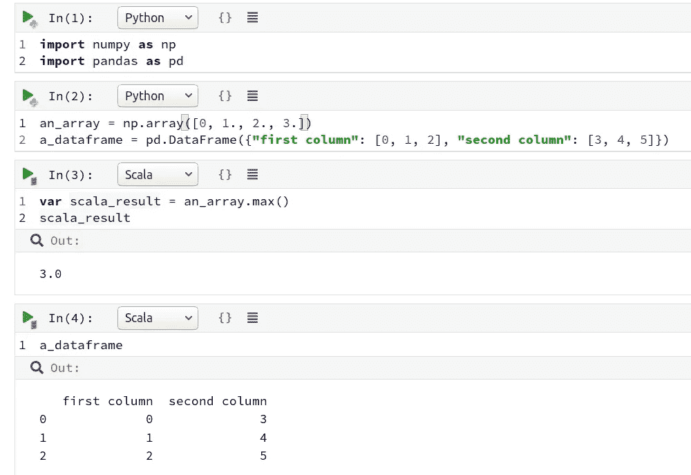
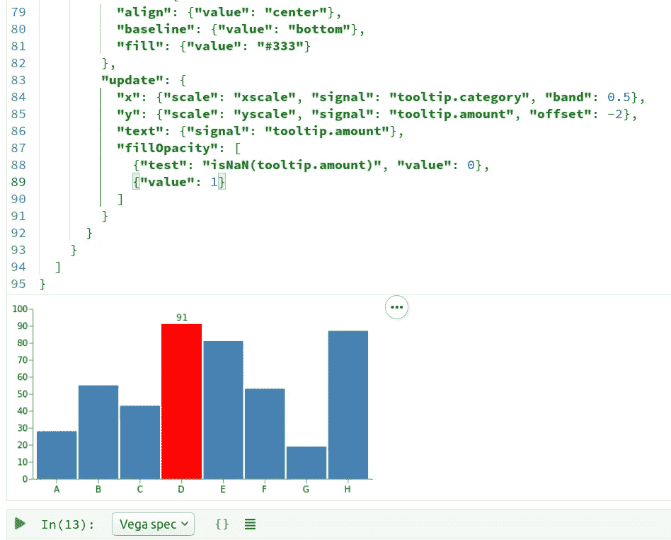
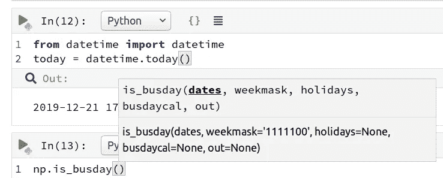
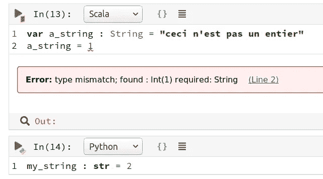

# 新的 Jupyter？

> 原文：<https://towardsdatascience.com/polynote-the-new-jupyter-c7696a321b09?source=collection_archive---------4----------------------->

## 围绕网飞的多语言笔记本 Polynote 有很多议论。但这是木星杀手，还是所有的炒作？

Source: [https://polynote.org/](https://polynote.org/)

如果你在过去几年中使用 Python 做过任何类型的分析工作，你很有可能会遇到 Jupyter notebooks。无需重新运行整个脚本即可执行新代码的能力使笔记本成为分析工作流程中无处不在的一部分，但 Jupyter 笔记本并非没有问题。例如，不支持代码编辑、提示和林挺；这可能导致代码混乱、难以调试，并导致一些开发人员完全避免使用该工具。2019 年，科技巨头网飞开源了他们的笔记本工具， [Polynote，](https://github.com/polynote/polynote)，许多人将其称为 Jupyter-killer。

像 Jupyter 一样，Polynote 也支持多语言，但是 Scala 已经作为“一级语言”包含在 Polynote 中，另外还支持 Python (+ Spark)、SQL 和 Vega。虽然 Jupyter 允许您用一种受支持的语言(JUlia、PYThon、R)创建一个笔记本，但是 Polynote 在一个笔记本中提供了多语言支持，甚至允许不同语言执行的代码之间的互操作性。

# 装置

与 Jupyter 不同，Polynote 的核心是基于 JVM 的语言，这使得安装过程比`pip install polynote`稍微复杂一些。问题是，Polynote 目前只能在 Linux 和 OSX 上使用；有一些关于[包含 Windows 的讨论，](https://github.com/polynote/polynote/issues/671)但是这不是开发团队的目标。鉴于像 Swift [这样的流行工具的开源 Windows 移植已经失败](https://github.com/SwiftForWindows/SwiftForWindows/issues/76)，期待 Polynote 在 Windows 上的无缝体验是愚蠢的。

也就是说，让我们假设您有一台 Linux 或 OSX 机器。我将概述我让 Polynote 在 Ubuntu 18.04 上工作的步骤。

1.  转到[版本](https://github.com/polynote/polynote/releases)并在最新版本的“资产”下下载最新的`polynote-dist.tar.gz`
2.  用`tar -zxvpf polynote-dist.tar.gz`提取多项式
3.  安装 Java: `sudo apt install default-jre`和`sudo apt install default-jdk`
4.  用`export JAVA_HOME=/usr/lib/jvm/default-java/`设置 JAVA_HOME
5.  `pip3 install jep jedi virtualenv`

火花支持需要额外安装。你可以在这里阅读更多关于安装 Polynote [的信息。](https://polynote.org/docs/01-installation.html)

进入 polynote 目录并执行`polynote.py`，然后在浏览器中导航到提供的本地地址(我已经在 Firefox 和 Chrome 上测试过，没有问题)。

# 多语言笔记本

Polynote 的同名特性是语言互操作性:如果用一种语言定义了一个变量，就可以在另一种语言中使用它。这显然有局限性，因为不是所有的语言都有相同的类型和对象概念，但是最重要的类型，包括 numpy 数组和 pandas 数据帧，都是受支持的。

我必须承认，我对 Scala 只有一知半解，所以我不确定需要它与 Python 协同工作的具体用例，但很明显，消除在两种语言之间转换数据的需要将使这样一个项目运行得更加顺畅。

我参与的大多数项目都只需要一种语言(大部分是 Python，一些是 R ),所以很容易相信，在大型项目之外，语言混合对于大多数数据科学家来说是多余的工具。当然，作为一个开源项目，社区很可能会扩展所支持的语言套件(已经有人对 [R、](https://github.com/polynote/polynote/issues/664) [Julia](https://github.com/polynote/polynote/issues/542) 和 [Java](https://github.com/polynote/polynote/issues/454) 感兴趣)，这将使 Polynote 成为对大量开发人员更有吸引力的工具；就我个人而言，我希望能够在 R 中对 Python 数据进行统计测试，而不是花费时间去寻找一个有效的、可维护的 Python 测试端口。

# (英)可视化(= visualization)

数据可视化是数据科学的重要组成部分，但它是一项经常被忽视的技能。Polynote 通过从 Scala 数据生成 Vega 规范来强调高质量的可视化。

> Vega 是一种*可视化语法*，一种用于创建、保存和共享交互式可视化设计的声明性语言。使用 Vega，您可以用 JSON 格式描述可视化的视觉外观和交互行为，并使用 Canvas 或 SVG 生成基于 web 的视图。—[https://vega.github.io/vega/](https://vega.github.io/vega/)

织女星可以很容易地产生美观、复杂的视觉效果。流行的 Python 可视化库[牛郎星](https://altair-viz.github.io/)建立在织女星的统计可视化部分 Vega-lite 之上(你可以在这里阅读关于在牛郎星[中生成交互式地图的内容)。](/interactive-election-visualisations-with-altair-85c4c3a306f9)

不幸的是，没有对 Python 数据可视化的直接支持，所以这对 Python 原生程序没有什么好处。当然，您仍然可以直接进入模式，但是在大多数情况下，使用 Altair 这样的工具会容易得多。

An interactive bar chart? Try producing that in matplotlib

# 代码编辑

Jupyter 笔记本的一个很大的缺点是代码非常不透明:没有错误代码的可视提示，这在任何像样的 IDE 中都可以找到，也没有函数的代码补全(这导致我的 API 使用量显著增加)。然而，Polynote 在脚本和笔记本之间架起了一座桥梁。

With Polynote, there is no need to memorise swathes of functions

Scala 中的类型错误会加下划线，但是 Polynote 不关心 Python 类型提示(很像 Python 社区)。

Polynote 不与最好的代码编辑器竞争，但在这方面，它是 Jupyter 笔记本的巨大改进。

# 摘要

我对 Polynote 的可能性很感兴趣。在数据科学社区中有很多讨论，内置的 Vega 绘图生成和跨语言通信等功能听起来像是游戏改变者。然而，我不认为 Polynote 提供的东西足以吸引大多数数据科学家离开 Jupyter。首先，缺乏对 Windows 的支持使许多人无法使用它；Windows 是最流行的操作系统，许多企业和组织都强制要求使用它。其次，尽管 Scala 有它的好处，但它并不是日常数据科学中广泛使用的语言。大多数分析项目可以并且已经完全可以单独用 Python 实现，所以语言混合和内置 Vega 没有任何好处。

Polynote 的代码编辑是 Jupyter 的一大改进，我希望 Jupyter 在这方面有所改进。然而，作为一个更成熟和更积极开发的项目，我发现 Jupyter 是两者中更强的一个。Polynote 当然值得一看。只是需要多一点时间。