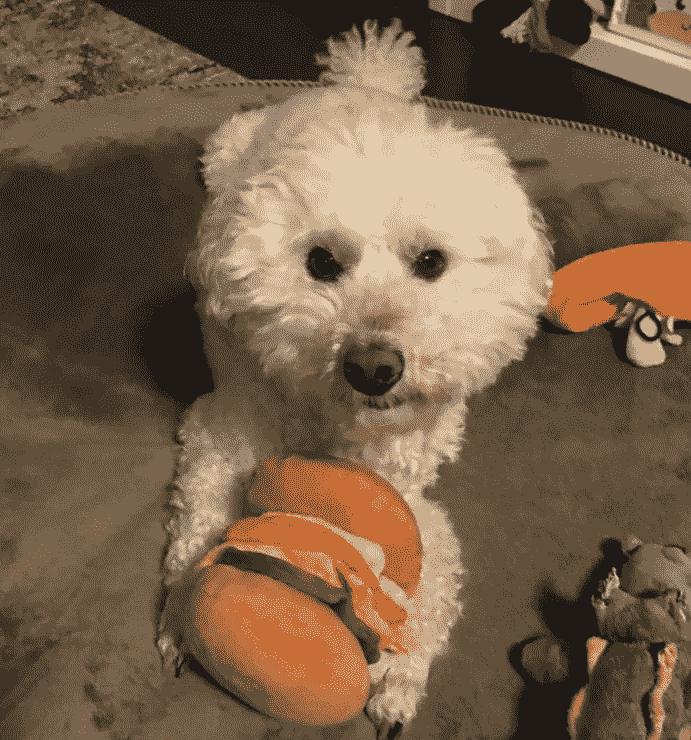
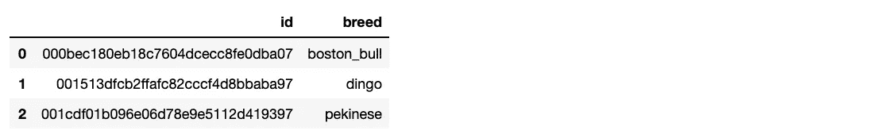
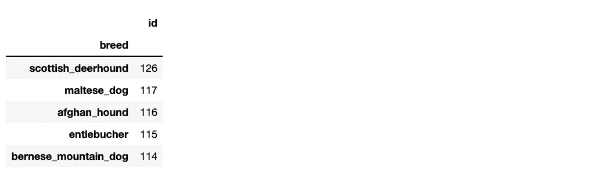
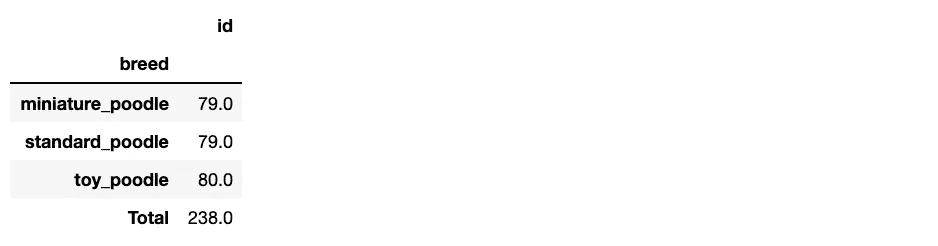
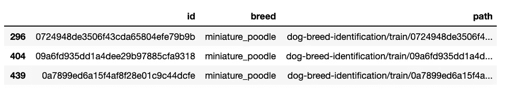
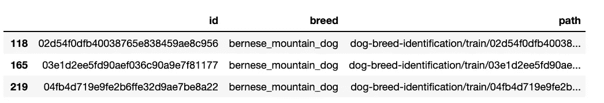
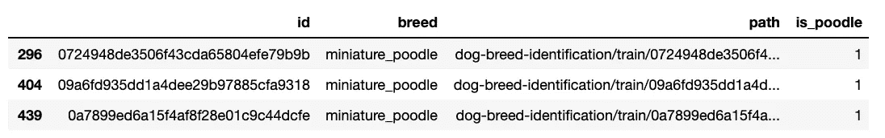
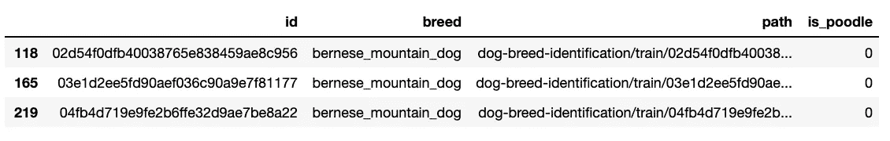
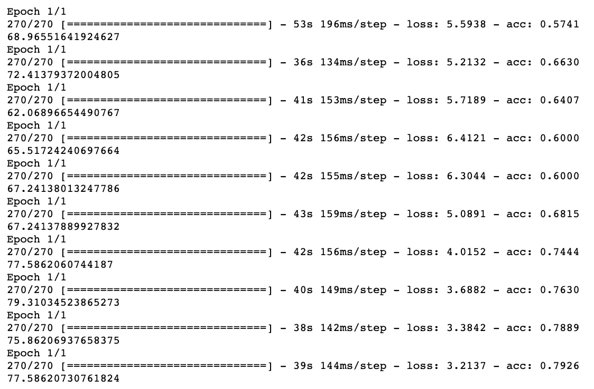
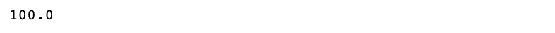

# 美国有线电视新闻网预测狗是不是狮子狗

> 原文：<https://towardsdatascience.com/poodle-not-poodle-a-keras-cnn-to-predict-if-a-dog-is-a-poodle-17fff85eaf03?source=collection_archive---------32----------------------->

## 用 Keras 构建二进制卷积神经网络分类器



我想把我的迷你狮子狗放在柱子上。因此，我们将建立一个 CNN 来检测照片中是否包含狮子狗(而不是另一种狗)，而不是一个对数字图像进行分类的无聊教程。

我称之为:狮子狗不是狮子狗。

我发现了一个 [Kaggle](# https://www.kaggle.com/c/dog-breed-identification/data) 数据集，包含大约 10k 张狗的照片，按品种分类。下载并保存在与笔记本相同的目录中。

附带的 CSV 包含从品种到照片名称的映射。用熊猫进口。

```
import pandas as pd
df = pd.read_csv('dog-breed-identification/labels.csv')
df.head(3)
```



现在，通过计算每个品种的数量，并按降序排列，了解不同品种之间的分布情况。熊猫使这变得容易。

```
grouped_df = df.groupby('breed').count()
grouped_df.sort_values('id', ascending=False, inplace=True)
grouped_df.head(3)
```



太好了。但是我对狮子狗感兴趣。里面有多少只贵宾犬的例子？我从 Kaggle 上的数据集了解到，这里有 3 个不同的狮子狗品种。

```
POODLES = ['miniature_poodle', 'standard_poodle', 'toy_poodle']# count examples per breed
poodle_grouped_df = grouped_df.loc[POODLES]# add total for all poodles
poodle_grouped_df.loc['Total',:]= poodle_grouped_df.sum(axis=0)
poodle_grouped_df
```



很好。接下来，我们将构建一个分类器来检测微型狮子狗。我们还将挑选一种其他特定品种的狗(而不是混合品种)，以方便 CNN 的采访。我们必须训练的每个品种的数据量并不多！

创建 2 个数据框，贵宾犬和非贵宾犬。

```
poodle_df = df.loc[df['breed'].isin(['miniature_poodle'])]non_poodle_df = df.loc[df['breed'].isin(['bernese_mountain_dog'])]
```

`poodle_df` = >包含迷你贵宾犬。
`non_poodle_df` = >包含伯恩山犬。

定义一个函数来构建下载数据集中图像的路径。

```
import osdef build_path_for_dataset(dframe):
    train_file_names = os.listdir('dog-breed-identification/train') DIR = 'dog-breed-identification/train/' paths = []
    for idx, row in dframe.iterrows():
        file_name = row['id']+ '.jpg' if file_name in train_file_names:
            paths.append(DIR + file_name) return paths
```

为每个数据集生成路径。

```
poodle_df['path'] = build_path_for_dataset(poodle_df)
poodle_df.head(3)
```



```
non_poodle_df['path'] = build_path_for_dataset(non_poodle_df)
non_poodle_df.head(3)
```



完美。现在让我们为每个表添加一个布尔列，指定图片是否是狮子狗的。

```
poodle_df['is_poodle'] = 1
poodle_df.head(3)
```



```
non_poodle_df['is_poodle'] = 0
non_poodle_df.head(3)
```



组合两个数据帧(现在我们有一个布尔列来区分例子)。

```
combined_df = pd.concat([poodle_df, non_poodle_df], ignore_index=True)
```

把它们排好，这样所有的狮子狗就不会在最上面或者最下面。通过使用`frac=1`,我们实际上是在抽取一个包括全部人口的样本，并且在这个过程中，改变顺序。

```
shuffled_combined_df = combined_df.sample(frac=1)
```

再次将数据帧分割成 2 个数据帧。但是这一次，一个是训练集，另一个是测试集。这里我们使用的是 70/30 分割。

```
example_count = len(shuffled_combined_df)
break_point = int(0.7 * example_count)train_df = shuffled_combined_df[:break_point]
test_df = shuffled_combined_df[break_point:]
```

差不多到了有趣的部分。

这些图像的大小都不一样，所以让我们看看图像的平均大小。

```
from PIL import Imagewidths = []
heights = []for idx, row in shuffled_combined_df.iterrows():
    path = row['path']
    im = Image.open(path)
    width, height = im.size
    widths.append(width)
    heights.append(height)avg_width = int(sum(widths) / len(widths))
avg_height = int(sum(heights) / len(heights))print(avg_width, avg_height)#=> 448 385
```

平均宽度为`448`，平均高度为`385`。

使宽度和高度相等会使以后的变换更简单。因此，我们将图像的大小调整为 300x300。

```
# we'll use this in a minute
WIDTH = 300
HEIGHT = 300
```

编写一个函数来:
-加载一个图像
-转换为灰度
-调整大小为 300x300

```
from keras.preprocessing.image import load_imgdef load_resize_color_image(path): # load image
    image = load_img(path) # convert to greyscale
    image = image.convert('L') # resize
    # 'Image.ANTIALIAS' minimizes distortion when resizing
    image = image.resize((WIDTH,HEIGHT), Image.ANTIALIAS)    return image
```

另一个函数为每个传入的图像创建 2 个转换。

```
from keras.preprocessing.image import ImageDataGenerator
from numpy import expand_dimsdef random_transform_image(image):
    augmentations = []

    samples = expand_dims(image, 0)
    datagen = ImageDataGenerator(rotation_range=90)
    it = datagen.flow(samples, batch_size=1) for i in range(2):
        batch = it.next() # convert to unsigned integers    
        augmentations.append(batch[0].astype('uint8')) return augmentations
```

上面的函数获取一幅图像，并通过随机旋转创建两幅图像。然后我们将完全忽略传入的图像，只训练转换。

训练图像的变换在使用 CNN 时很重要，因为默认情况下它们不是[旋转不变的](https://en.wikipedia.org/wiki/Rotational_invariance)。也就是说，一个直立的图像和同一个图像翻转 90 度，对你的模型来说可能看起来完全不同。所以这两方面的训练都很有帮助。

生成我们的训练数据。

```
X_train = []
y_train = []from keras.preprocessing.image import img_to_arrayfor idx, row in train_df.iterrows():
    path = row['path']
    is_poodle = row['is_poodle'] image = load_resize_color_image(path) image = img_to_array(image)    

    images = random_transform_image(image) for i in images:
        image = i.tolist() X_train.append(i)
        y_train.append(is_poodle)
```

生成测试数据，我们不会为此生成额外的转换。

```
X_test = []
y_test = []for idx, row in test_df.iterrows():
    path = row['path']
    is_poodle = row['is_poodle'] image = load_resize_color_image(path) image = img_to_array(image)    image = image.tolist()

    X_test.append(image)
    y_test.append(is_poodle)
```

将我们的特征转换为 numpy 数组。

```
X_train = np.array(X_train, dtype=np.uint8)
X_test = np.array(X_test, dtype=np.uint8)
```

二进制化我们的标签。

```
y_train = label_binarize(y_train, neg_label=0, pos_label=1, classes=[0,1])
y_train = np.hstack((1 - y_train, y_train))y_test = label_binarize(y_test, neg_label=0, pos_label=1, classes=[0,1])
y_test = np.hstack((1 - y_test, y_test))
```

构建模型。

```
import keras
from keras.models import Sequential
from keras.layers import Dense, Dropout, Flatten
from keras.layers import Conv2D, MaxPooling2D
from keras.layers. normalization import BatchNormalizationmodel = Sequential()model.add(Conv2D(32, kernel_size = (3, 3), activation='relu', input_shape=(300, 300, 1)))
model.add(MaxPooling2D(pool_size=(2,2)))
model.add(BatchNormalization())model.add(Conv2D(64, kernel_size=(3,3), activation='relu'))
model.add(MaxPooling2D(pool_size=(2,2)))
model.add(BatchNormalization())model.add(Conv2D(128, kernel_size=(3,3), activation='relu'))
model.add(MaxPooling2D(pool_size=(2,2)))
model.add(BatchNormalization())model.add(Dropout(0.2))
model.add(Flatten())model.add(Dense(128, activation='relu'))
model.add(Dense(2, activation = 'softmax'))
```

这是一个非常典型的模型，卷积层的大小会增加。

编译模型。

```
model.compile(loss='binary_crossentropy', optimizer='adam', metrics = ['accuracy'])
```

跑起来！

```
for i in range(10): model.fit(X_train, y_train, batch_size=30, epochs=1)
    loss, acc = model.evaluate(X_test, y_test, verbose = 0)
    print(acc * 100)
```



考虑到少量的训练数据，这实际上比我预期的要好。虽然我们只选择了两个品种的狗，这让我们自己变得容易多了。

为了好玩，我们会把我给你看的狮子狗的照片分类放在最上面。

```
X_me = []
y_me = []path = 'my_poodle.jpg'image = load_resize_color_image(path)
image = img_to_array(image)
image = image.tolist()X_me.append(image)
y_me.append(1)X_me = np.array(X_me, dtype=np.uint8)y_me = label_binarize(y_me, neg_label=0, pos_label=1, classes=[0,1])
y_me = np.hstack((1 - y_me, y_me))loss, acc = model.evaluate(X_me, y_me, verbose = 0)
print(acc * 100)
```



成功！！

我们能做得更好吗？当然啦！更多不同类型的变换，如翻转、亮度和缩放可能会有所帮助。但最重要的是，更多的数据。

尽管我们应该对目前的结果感到满意。