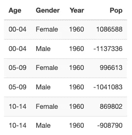
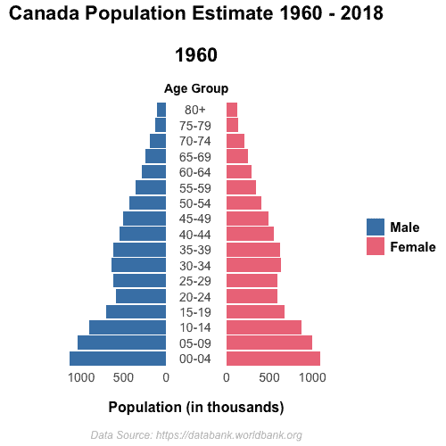

# 人口金字塔动画

> 原文：<https://towardsdatascience.com/population-pyramid-animation-cfa7c1a79a63?source=collection_archive---------17----------------------->

## RStudio 中 ganimate 的简短入门


Photo by [CHUTTERSNAP](https://unsplash.com/@chuttersnap?utm_source=medium&utm_medium=referral) on [Unsplash](https://unsplash.com?utm_source=medium&utm_medium=referral)

可视化是展示在数据中发现的洞察力的一种极好的方式。如果一张图片能表达一千个单词，那么一部动画就能表达一百万个单词。如果使用得当，动画可以非常清晰地展示我们从数据中提取的智慧财富。为了让决策者注意到它的真正价值，他们必须能够将提供给他们的信息内在化。我们可以通过讲述更具视觉吸引力的故事来帮助他们建立联系。

在这个简短的教程中，我将向您展示如何在 RStudio 中制作加拿大 1960 年至 2018 年的动画人口金字塔。你可以把你学到的东西应用到其他动画项目中。我们开始吧！

让我们从安装和加载必要的包开始。

*   **吃豆人**:一次装载所有的包裹
*   **tidyverse** :准备数据帧( *tidyr* )，轻松操作数据帧( *dplyr* ， *stringr* )，生成绘图( *ggplot2* )
*   **gg pol**:gg plot 2 的附加特性
*   **gganimate** :图形动画(*这就是你来这里的目的！*)
*   gifski :将文件渲染成 GIF 格式
*   kableExtra:创建视觉上吸引人的表格

```
if(!require('pacman')) install.packages('pacman')
pacman::p_load(tidyverse, ggpol, gganimate, gifski, kableExtra)
```

加拿大的人口数据来自世界银行网站[](https://databank.worldbank.org/)**。时间跨度从 1960 年**到 2018 年**。数据帧最初是在**宽格式** t 中，由代表每个年龄组和性别的 **34 条记录构成。数据保存为 csv 文件并导入到 **RStudio IDE** 中。要跟进，你可以在这里** 下载数据集 [**。**](https://github.com/SiphuLangeni/Population-Pyramid-Animation/blob/master/CAPop.csv)**

```
CAPop <- read.csv('CAPop.csv')
```

**大部分工作都是准备数据，以便在动画中使用。**步骤如下**:**

1.  **移除数据框底部的 **NA 值****
2.  **为**年龄**组创建列**
3.  **更改**最后一个年龄组**的值**
4.  **为**性别**创建一列**
5.  **对**因子**等级重新排序(对显示的顺序数据很重要)**
6.  **移除**未使用的柱****
7.  **从宽格式变为**长格式****
8.  **从年份中删除前缀**
9.  **将人口金字塔的所有**男性流行值更改为负****

```
CAPop <- CAPop %>% 
  na.omit %>% 
  mutate(Age = substr(Series.Name, 17, 21),
         Age = as.factor(case_when(Age == '80 an' ~ '80+', TRUE ~ Age)),
         Gender = as.factor(ifelse(str_detect(Series.Name, 'female$') == TRUE, 'Female', 'Male')),
         Gender = factor(Gender, levels = c('Male', 'Female'))) %>% 
  select(-Country.Name, - Series.Name) %>% 
  gather(Year, Pop, X1960:X2018) %>% 
  mutate(Year = as.integer(substr(Year, 2, 5)),
         Pop = ifelse(Gender == 'Male', as.integer(Pop * -1), as.integer(Pop)))
```

**处理完数据后，我们剩下 **2006** 行和 **4** 列。让我们看一看我们在做什么。**

```
dim(CAPop)kable(head(CAPop)) %>%
  kable_styling(bootstrap_options = 'striped', font_size = 12, full_width = FALSE)
```

****

**接下来，我们**在 **3** 个不同的步骤中创建动画**:**

1.  **创建**静态图****
2.  **应用**动画**参数**
3.  ****渲染**到文件**

# **静态情节**

**每个动画都是从一张图片开始的。首先，通过**将变量映射到美学**来确定情节将显示什么。一个**人口金字塔**是一种特殊的**条形图**。它在背靠背的 x 轴上显示男性和女性人口。如果你还记得的话，男性人口数值是负数。这允许沿着**共享 x 轴**显示两个图形的**“镜像】**。 **facet_share** 函数允许条形图背靠背放置。插入参数 **reverse_num = TRUE** 以获得正确的比例，因为左边的图本质上是一个反向图。**

```
PopPyramid <- CAPop %>%
 ggplot(aes(
            x = Age,
            y = Pop/1000,
            fill = Gender
           )
       ) +
 geom_bar(stat = ‘identity’) +
 scale_fill_manual(values = c(‘#4682b4’, ‘#ee7989’)) + 
 coord_flip() + 
 facet_share(
             ~ Gender,
             dir = ‘h’,
             scales = ‘free’,
             reverse_num = TRUE
            )
```

# **设置主题**

**为了操纵情节的整体外观，你可以使用主题。有九个内置主题可供选择，这可能是一个很好的开始。我已经选择创建我自己的**自定义主题**来操作背景、面板、边框、网格线、刻度线和所有元素文本。主题( )中有***90 多个参数*** 进行最大化定制！正如你所看到的，这给了**很大的灵活性**来决定你的动画的**整体外观**。我只用了其中的 17 个论点。**

```
PopPyramid <- PopPyramid +
 theme(
       plot.background = element_blank(),
       axis.ticks = element_blank(),
       axis.title.y = element_blank(),
       legend.title = element_blank(),
       panel.background = element_blank(),
       panel.border = element_blank(),
       strip.background = element_blank(),
       strip.text.x = element_blank(),
       panel.grid.minor = element_blank(),
       panel.grid.major = element_blank(), 
       axis.text = element_text(size = 14),
       legend.key.size = unit(0.75, ‘cm’),
       legend.text = element_text(
                                  size = 15,
                                  face = ‘bold’
                                 ),
       plot.title = element_text(
                                 size = 22,
                                 hjust = 0.5,
                                 face = ‘bold’
                                ),
       plot.subtitle = element_text(
                                    size = 14,
                                    hjust = 0.5,
                                    face = ‘bold’
                                   ),
       axis.title.x = element_text(
                                   size = 16,
                                   face = ‘bold’
                                  ),
       plot.caption = element_text(
                                   size = 12,
                                   hjust = 0.5,
                                   face = ‘italic’,
                                   color = ‘gray’
                                  )
      )
```

# **标签**

**最后，我添加了**有意义的标签**让观众更容易理解。我希望动画随着时间的变化而变化，所以我希望这种变化能反映在标题中。使用**{最近状态}** ，将显示与画面最近的状态的年份。**

```
PopPyramid <- PopPyramid + 
 labs(
      title = ‘Canada Population Estimate 1960 - 2018\n\n{closest_state}’,
      subtitle = ‘\n\nAge Group’,
      y = ‘\n\nPopulation (in thousands)’,
      caption = ‘\n\nData Source: [https://databank.worldbank.org’](https://databank.worldbank.org%27/)
     )
```

# **动画**

**接下来，使用 **transition_states** 来确定动画的行为。这种转变应该跨时间发生，在本例中是**年**。**过渡 _ 长度**和**状态 _ 长度**分别给出了过渡和状态的相对长度。在本例中，这产生了 1:2 的比率。 **ease_aes** 函数描述了**补间**如何在状态之间发生。**

```
PopPyramid <- PopPyramid + 
  transition_states(
                    Year,
                    transition_length = 1,
                    state_length = 2
                   ) + 
  enter_fade() +
  exit_fade() + 
  ease_aes('cubic-in-out')
```

# **渲染到文件**

**在这种情况下，产生了一个 gif 文件。使用 **gifski** ，你可以微调文件的渲染方式。我选择了**每秒 24 帧**平滑运动， **30 秒总时长**和 **500x500 大小**。**

```
animate(
        PopPyramid,
        fps = 24,
        duration = 30,
        width = 500,
        height = 500,
        renderer = gifski_renderer(‘PopPyramid.gif’)
       )
```

**这可能是 ***休息一下*** 的好时机。根据您为动画选择的参数，此步骤可能需要很长时间进行渲染。如果我打算在 GitHub 上展示所有的 gif 图片，我会尽量保持在 30 秒或更短的时间内，因为在这个平台上 gif 图片似乎有时间限制。**

# **瞧啊。**

**现在你有了:**加拿大人口金字塔动画**从 1960 年到 2018 年！借助动画，我们可以更有说服力地看到加拿大人口正在老龄化 T21。**

****

**谢谢你抽空过来。我希望你在创建自己的动画形象时有信心。完整代码可以在我的 [GitHub 库](https://github.com/SiphuLangeni/Population-Pyramid-Animation)上查看。请随时在 [LinkedIn](https://www.linkedin.com/in/SiphuLangeni/) 上与我联系。**

# **脚注**

1.  **2019 年 12 月 12 日检索数据。根据检索日期的不同，结果可能略有不同。**