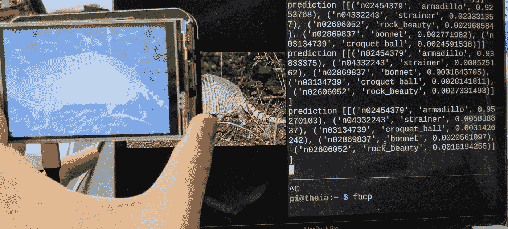
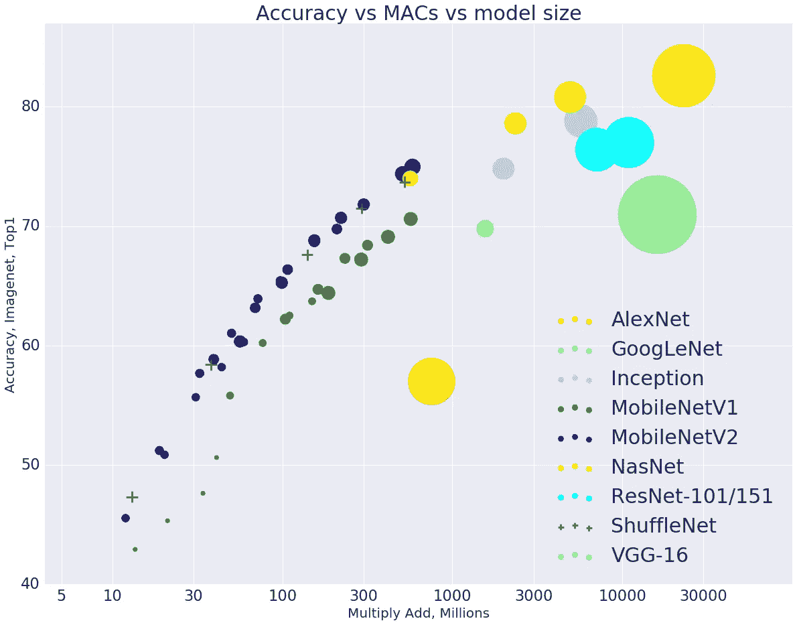
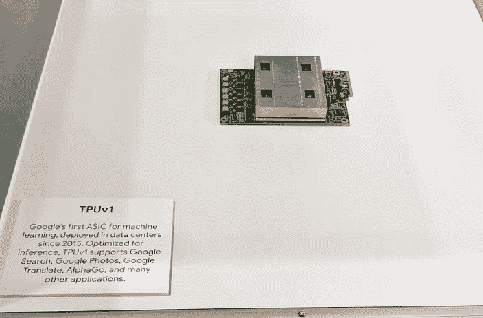
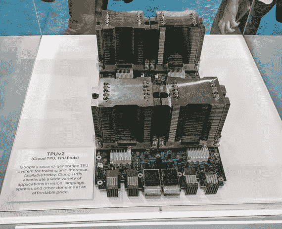
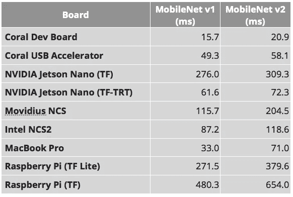
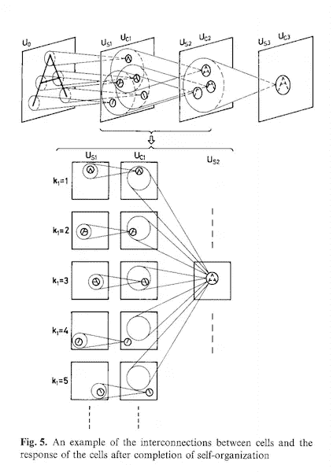
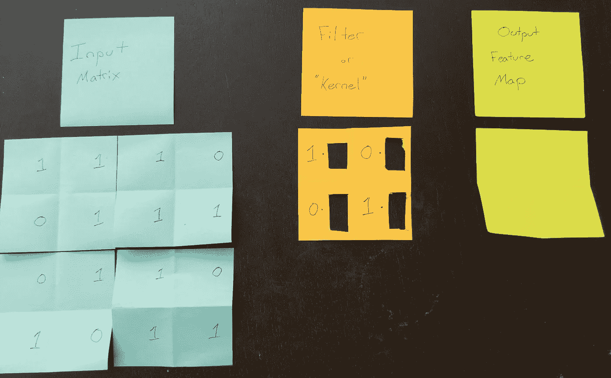
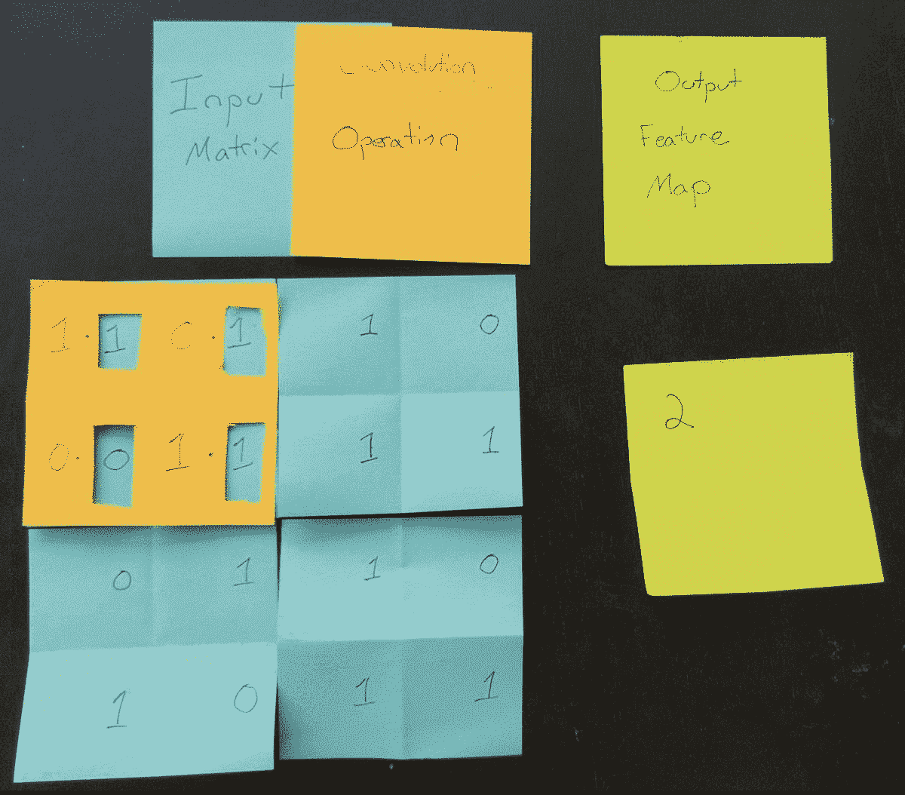
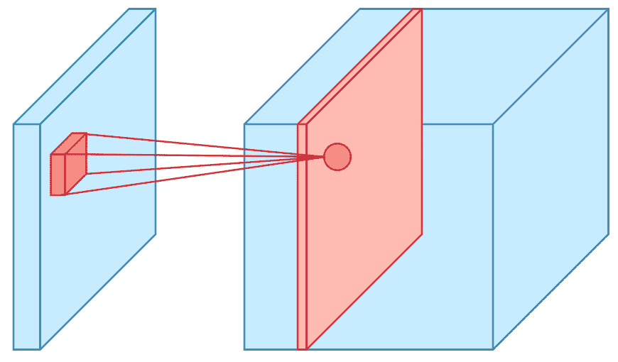
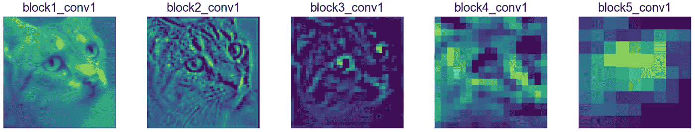

# 便携式计算机视觉:树莓 Pi 上的 TensorFlow 2.0

> 原文：<https://towardsdatascience.com/portable-computer-vision-tensorflow-2-0-on-a-raspberry-pi-part-1-of-2-84e318798ce9?source=collection_archive---------0----------------------->



## 微小、低成本的物体检测和分类。

# 第 1 部分—简介

只需大约 100 美元，你就可以将深度学习添加到嵌入式系统或你的下一个物联网项目中。

你是刚入门机器/深度学习，TensorFlow，还是 Raspberry Pi？完美，这个博客系列是给你的！

在这个系列中，我将向您展示如何:

1.  使用 **TensorFlow 2.0** 和 **Keras 部署预训练的图像分类模型( **MobileNetV2** )。**
2.  将模型转换为 **TensorFlow Lite，**一种针对嵌入式和移动设备优化的模型格式。
3.  使用 Coral 的 **USB Edge TPU 加速器**和 **Edge TPU 编译器，加速任何 **TensorFlow Lite** 模型的推理。**
4.  使用**转移学习**用**自定义图像分类器重新训练 MobileNetV2。**

本系列**第一篇**(你现在正在看！)将带您完成构建材料、安装以及将 MobileNetV2 部署到您 Raspberry Pi。

# 术语和参考📚

[**树莓派**](https://www.raspberrypi.org/)——一款受教育者、硬件爱好者和机器人专家欢迎的小型廉价电脑。🤖

[**TensorFlow**](https://www.tensorflow.org/) —机器学习的开源平台。

[**tensor flow Lite**](https://www.tensorflow.org/lite)—用于在移动和嵌入式设备上部署 **TensorFlow** 模型的轻量级库。

**卷积神经网络**——一种深度学习模型，非常适合图像分类和对象检测应用。

[**MobileNetV2**](https://ai.googleblog.com/2018/04/mobilenetv2-next-generation-of-on.html)**—**一种先进的图像识别模型，针对普通手机处理器的性能进行了优化。



Comparison of general-purpose computer vision neural networks. Image Credit: [MobileNetV2: The Next Generation of On-Device Computer Vision Networks](https://ai.googleblog.com/2018/04/mobilenetv2-next-generation-of-on.html)

[**边缘 TPU**](https://cloud.google.com/edge-tpu/) —张量处理单元(TPU)是一个集成电路，用于加速 **TensorFlow 执行的计算。****边缘 TPU** 是为“在边缘”的移动和嵌入式设备开发的，占地面积小



TPUv1, TPUv2 (left, middle) at Cloud Next ‘18\. Edge TPUs on a United States penny (right). Image credit: [Google](https://cloud.google.com/edge-tpu/))

# 第 2 部分—✅构建列表

## 启动工具包

如果你刚刚入门树莓 Pi，我推荐 Arrow 的 [Pi 相机套装](https://www.arrow.com/en/products/3275/adafruit-industries)(90 美元)。它包括您需要的一切，立即开始:

*   5V 2.4A MicroUSB 电源
*   320x240 2.8 英寸 TFT 型号 PiTFT 电阻式触摸屏
*   树莓 Pi 3 型号 B
*   Raspberry Pi 摄像机 v2
*   塑料盒
*   预装了 NOOBS 安装管理器的 8GB MicroSD 卡

## Coral USB Edge TPU 加速器(可选)

您可以编译 **TensorFlow Lite** 模型，在 Coral 的 USB 加速器( [Link](https://coral.withgoogle.com/products/accelerator/) )上运行，以便更快地进行模型预测。

实时应用程序从这种加速中受益匪浅。自动驾驶机器人的决策模块就是一个例子。

一些应用程序可以容忍更高的预测速度，可能不需要 TPU 加速。例如，你不需要 TPU 加速来建立一个智能狗门，为你的狗开门(但不让浣熊进来)。

如果你刚刚开始，跳过购买这个组件。

你不确定你是否需要 USB 加速器？下面的 MobileNet 基准可以帮助您做出决定。下面的测量描述了推理速度(单位为毫秒)——速度越低越好！



Image Credit: [Alasdair Allan](https://blog.hackster.io/@aallan), [Benchmarking TensorFlow and TensorFlow Lite on the Raspberry Pi](https://blog.hackster.io/benchmarking-tensorflow-and-tensorflow-lite-on-the-raspberry-pi-43f51b796796)

## 定制构建

如果您已经有了一个 Raspberry Pi 或一些组件，初学者工具包可能会包含您不需要的项目。

以下是我自己制作的零件(大约 250 美元/台)。

*   树莓 Pi 型号 3 b+(35 美元)
*   树莓 Pi 相机 v2(30 美元)
*   Coral USB Edge TPU 加速器——加速模型推理(75 美元，[链接](https://coral.withgoogle.com/products/accelerator)
*   Pi Foundation 显示屏— 7 英寸触摸屏显示屏(80 美元，[链接](https://www.adafruit.com/product/2718)
*   SmartiPi 触摸支架(25 美元，[链接](http://www.adafruit.com/product/3187)
*   可调 Pi 摄像机支架(5 美元，[连杆](https://www.adafruit.com/product/1434)
*   RPi 摄像机 24 英寸的柔性电缆(＄3，[链接](https://www.adafruit.com/product/1731))

我很想听听你自己的构建列表！❤️给我发推特 [@grepLeigh](https://twitter.com/grepLeigh) 或者在下面评论。

# 第 3 部分— Raspberry Pi 设置🍰

如果你购买了一个预装 NOOBS 的 SD 卡，我建议你先浏览一下这个概述:[设置你的树莓派](https://projects.raspberrypi.org/en/projects/raspberry-pi-setting-up/2)

**在进行**之前，您需要:

*   将您的 Pi 连接到互联网( [doc](https://projects.raspberrypi.org/en/projects/raspberry-pi-using/4) )
*   SSH 到你的树莓 Pi ( [doc](https://www.raspberrypi.org/documentation/remote-access/ssh/) )

# 第 4 部分—主要计算机:下载和安装依赖项

`rpi-vision`是一套工具，可让您更轻松地:

*   在你的 Raspberry Pi 上安装很多依赖项(TensorFlow Lite，TFT 触摸屏驱动程序，将 PiCamera 帧缓冲区复制到 TFT 触摸屏的工具)。
*   将模型部署到 Raspberry Pi。
*   在你的电脑或谷歌云的人工智能平台上训练新模型。
*   为边缘 TPU 编译 8 位量化模型。

1.  在您的**主计算机**上克隆`rpi-vision` repo(不是您的 Raspberry Pi)

```
$ git clone git@github.com:leigh-johnson/rpi-vision.git && cd rpi-vision
```

2.在您的**主计算机**上，创建一个新的虚拟环境，然后安装`rpi-vision`包。

```
$ pip install virtualenv; virtualenv -p $(which python3) .venv && source .venv/bin/activate && pip install -e .
```

3.在继续之前，验证你可以对你的树莓 Pi 进行 SSH。

如果您使用默认的 Raspbian 映像，您的 Pi 的主机名将是`raspberrypi.local`

```
$ ssh pi@raspberry.local
```

# 第 5 部分—主要计算机:创建配置文件

`rpi-vision`使用 **Ansible** 来管理你的 Raspberry Pi 上的部署和任务。Ansible 是一个自动化计算机配置的框架。

创建 Ansible 所需的 2 个配置文件:

## **。env/my-inventory.ini**

如果您对 Pi 使用自定义主机名，请替换`raspberrypi.local.`

```
tee -a .env/my-inventory.ini <<EOF
[rpi_vision]
raspberrypi.local[rpi_vision:vars]
ansible_connection=ssh
ansible_user=pi
ansible_python=/usr/bin/python3
EOF
```

## 。env/my-vars.json

如果您对 Pi 使用自定义主机名，请替换`raspberrypi.local.`

```
tee -a .env/my-vars.ini <<EOF
{ 
  *"RPI_HOSTNAME"*: "raspberrypi.local",
  *"VERSION"*: "release-v1.0.0"
}
EOF
```

# 第 6 部分— Raspberry Pi:安装依赖项

```
$ make rpi-install
```

您将看到一个**可行剧本**的输出。 [**Ansible**](https://docs.ansible.com/) 是一个自动化配置计算机的框架。

您的 Pi 上安装了什么的快速摘要:

*   `rpi-vision`回购
*   `rpi-fbcp`(从 PiCamera 复制 framebuffer 到 TFT 触摸屏显示器的工具)
*   TFT 触摸屏驱动器和 X11 配置

您可以通过打开`playbooks/bootstrap-rpi.yml`来检查在您的 Raspberry Pi 上运行的任务

在安装运行时，通读下一部分，了解 ***如何***CNN**工作以及 ***为什么*** 它们对**计算机视觉**任务有用。**

# **第 7 部分 CNNs(卷积神经网络)简介**

**CNN 是驱动自动驾驶汽车和图像搜索引擎的关键技术。该技术对于计算机视觉来说是常见的，但也可以应用于数据中具有**层次模式的任何问题，其中**复杂模式**可以由简单模式**组装而成**。****

## **视觉皮层建模**

**在 20 世纪 50 年代末和 60 年代，大卫·H·哈贝尔和托顿·威尔森在猫和猴子身上做了实验，以更好地了解视觉皮层。**

****

**Diagram of the implant installed in the skulls of cats with a trephine. Image Credit: [SINGLE UNIT ACTIVITY IN STRIATE CORTEX OF UNRESTRAINED CATS](https://www.ncbi.nlm.nih.gov/pmc/articles/PMC1357023/pdf/jphysiol01301-0020.pdf)**

**他们证明了纹状皮层中的神经元对有限视野中的刺激做出反应，他们称之为感受野。**

**他们注意到了同心重叠反应，其中复杂的模式是低水平模式的组合。**

**他们的发现还揭示了**特殊化**，其中一些神经元将**只对**特定形状**或模式**做出反应。**

**在 20 世纪 80 年代，受 Hubel 和 Wielson 的启发，Kunihiko Fukushima 在**neocogniton**、**、**上发表了一种能够学习具有几何相似性的模式的神经网络。**

****

**Diagram of a Neocogitron, the foundation for modern CNNS. Image Credit: [Neocognitron: A Self-organizing Neural Network Model for a Mechanism of Pattern Recognition Unaffected by Shift in Position](https://www.cs.princeton.edu/courses/archive/spr08/cos598B/Readings/Fukushima1980.pdf)**

**新回旋加速器有两个关键特性:**

*   *****学习到的模式是有层次的。*** 越来越复杂的图案是由越来越简单的图案组成的。**
*   *****学习到的模式是位置不变和平移不变的*。**网络学习到一个模式后，可以在不同的位置识别这个模式。在**学习如何对狗**进行分类之后，网络可以准确地对倒立的狗**进行分类，而无需学习全新的模式。****

**neocogitron 模型是现代卷积神经网络的灵感来源。**

## **可视化卷积运算:2D**

****

**(Left) 2D 4x4 Input matrix. (Middle) 2D 2x2 kernel. (Right) 2D 2x2 output feature map.**

****输入层**被送入**卷积层**，卷积层使用**滤波器转换输入的**区域**。****

****过滤器**也被称为**内核。****

****

**The filter “slides” to each possible position, and the result is added to the feature map.**

**对于输入矩阵中的每个位置，**卷积运算**对每个元素执行矩阵乘法。**

**产生的矩阵被求和并存储在**特征图中。****

**对输入矩阵中的每个位置重复该操作。**

## **可视化卷积运算:3D**

****

**Image Credit: [Applied Deep Learning — Part 4: Convolutional Neural Networks](/applied-deep-learning-part-4-convolutional-neural-networks-584bc134c1e2)**

**CNN 的**输入层**通常是一个 3D 数据结构，具有 ***高度*** 、 ***宽度*** 、 ***通道*** (RGB 或灰度值)。**

**我们在特征地图栈中越深入，每个地图层就变得越稀疏。这意味着过滤器检测到的特征更少。**

**特征地图堆栈**的**前几层**检测简单的边缘和形状**，看起来与输入图像相似。随着我们进入特征地图堆栈越来越深，对于人眼来说，特征变得越来越抽象。更深的特征层**编码分类数据，**像“猫脸”或“猫耳”。**

****

**Comparison of feature maps from the first convolution layer (block1_conv1) with later layers (block5_conv1). Image Credit: [Applied Deep Learning — Part 4: Convolutional Neural Networks](/applied-deep-learning-part-4-convolutional-neural-networks-584bc134c1e2)**

## **你想了解更多关于 CNN 的信息吗？**

**您的依赖项安装现在可能已经完成了。要向前迈进，请跳到**第 8 部分——部署预培训模型 MobileNetV2。****

**如果您计划训练一个自定义分类器，或者想了解更多关于卷积神经网络的信息，请从这里开始:**

*   **[应用深度学习—第 4 部分:卷积神经网络](/applied-deep-learning-part-4-convolutional-neural-networks-584bc134c1e2)**
*   **[使用 Scikit-learn 和 TensorFlow 进行机器学习](https://www.amazon.com/Hands-Machine-Learning-Scikit-Learn-TensorFlow/dp/1491962291)，*第 13 章，卷积神经网络*，作者 Aurélien Géron**
*   **[用 Python 进行深度学习](https://www.amazon.com/Deep-Learning-Python-Francois-Chollet/dp/1617294438/)，*第五章计算机视觉的深度学习，*Francois Chollet**

# **第 8 部分—部署预训练模型(MobileNetV2)**

## **现场演示(使用 TensorFlow 2.0)**

**I used this code to sanity-check the TensorFlow 2.0-beta0 wheel that I cross-compiled for my Raspberry Pi 3.**

1.  **嘘到你的树莓皮**

```
$ ssh raspberrypi.local
```

**2.启动新的 tmux 会话**

```
pi@raspberryi:~ $ tmux new-session -s mobilenetv2
```

**3.通过按 control+b 垂直拆分 tmux 会话，然后"**

**4.启动一个`fbcp`进程，通过 SPI 接口将帧缓冲区从 PiCamera 复制到 TFT 显示器。让这个过程继续运行。**

```
pi@raspberryi:~ $ fbcp
```

**5.通过按下 control+b，然后按下 o 来切换 tmux 面板。**

**6.激活前面第 6 部分中安装的虚拟环境。**

```
pi@raspberryi:~ $ cd ~/rpi-vision && . .venv/bin/activate
```

**7.启动 mobilenetv2 代理进程。代理初始化大约需要 60 秒。**

```
pi@raspberryi:~/rpi-vision $ python rpi_vision/agent/mobilenet_v2.py
```

**您将看到模型基础的摘要，然后代理将打印推理，直到停止。[点击查看您应该看到的要点](https://gist.github.com/leigh-johnson/14541749afbd8e4471b85699ddd0c9f5)。**

**这个演示使用了 **ImageNet** 分类器的权重，你可以在【image-net.org】的[中查找。](http://image-net.org/explore)**

# **感谢您的阅读！**

**恭喜您，您刚刚为您的 Raspberry Pi 部署了一个图像分类模型！✨**

**寻找更多针对 Raspberry Pi 和其他小型设备的机器学习实践示例？[注册我的简讯](https://www.bitsy.ai/)！**

**我发布了现实世界中 ML 应用程序的例子(有完整的源代码)和漂亮的技巧，如[自动消除边框注释的痛苦](https://www.bitsy.ai/automate-bounding-box-annotation-with-tensorflow-and-automl/)。**