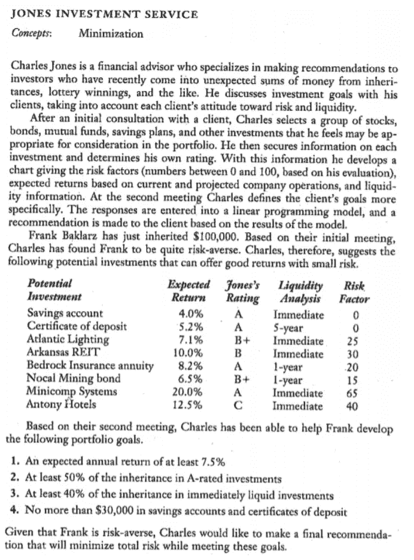
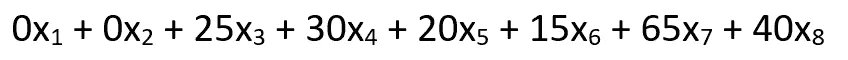
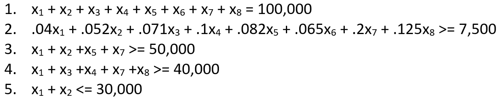
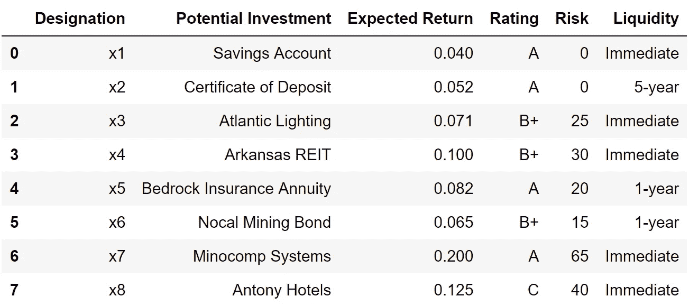
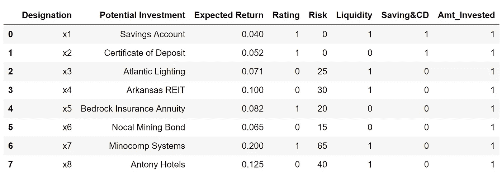
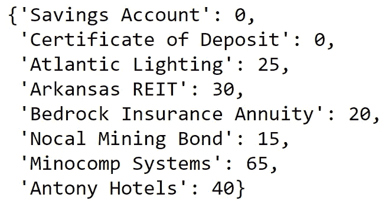
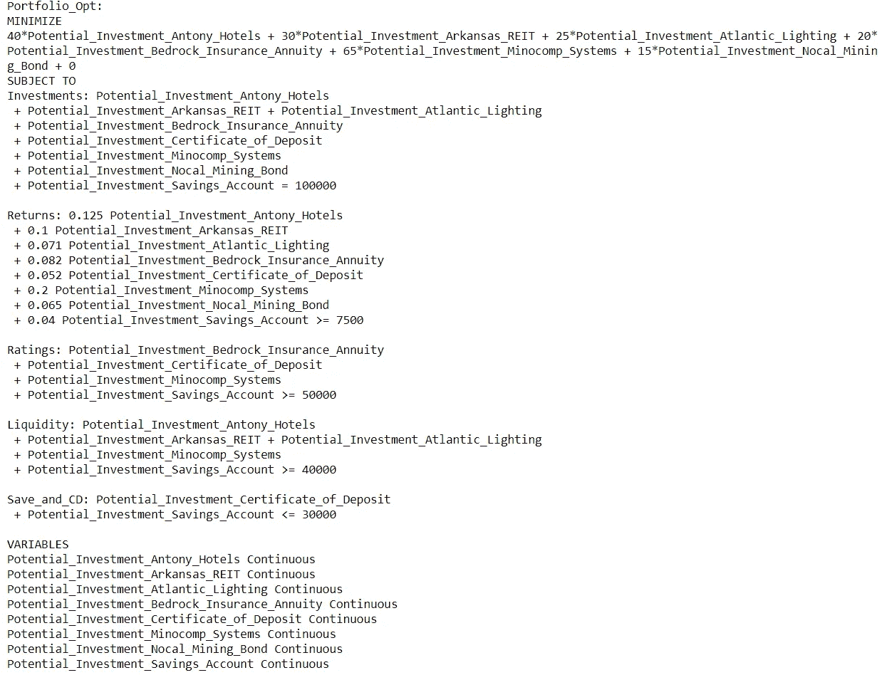
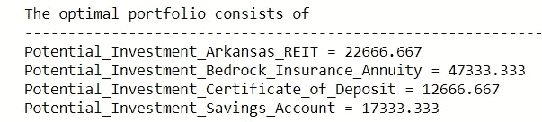

# 使用数学和 Python 优化您的投资

> 原文：<https://towardsdatascience.com/portfolio-linear-optimization-breakdown-f519546ed1ff?source=collection_archive---------17----------------------->

## 在 Python 的 PuLP 中使用线性优化


[Source](https://unsplash.com/photos/E7RLgUjjazc)

在 MBA 学习期间，我们学习了使用 Excel 和怀卡托大学的免费软件 [WEKA](https://en.wikipedia.org/wiki/Weka_(machine_learning)) 的所有预测建模技术。我们学习了基础概念，但从未涉足高级计算所需的硬技能。在学习 python 一段时间后，我认为重做我最初在 [Excel 的求解器](https://www.solver.com/solver-tutorial-using-solver?gclid=Cj0KCQjwv8nqBRDGARIsAHfR9wC3BmQkTDrH2KPpwoa1ZNMjKHswvqLOui2yqPFzuFK_QBdsO9szBywaAueNEALw_wcB)中做的一个线性优化项目会很有趣。本文的目标是在 python 的 PuLP 中重新创建项目，分享我一路上学到的东西，并将 python 的结果与 Excel 的结果进行比较。

> 线性优化的实际好处/应用是无穷无尽的。我强烈建议密切关注，至少在概念层面上，如果你还不熟悉的话，努力学习这个技巧。

# 目录

1.  什么是线性优化？
2.  任务/评论
3.  数据上传和清理
4.  使用纸浆的线性优化

# 什么是线性优化？

根据[维基百科](https://en.wikipedia.org/wiki/Linear_programming)的说法，线性规划是“一种在其要求由线性关系表示的数学模型中实现最佳结果(如最大利润或最低成本)的方法。”这些来自卡耐基梅隆大学的课堂笔记对我理解这个主题非常有帮助。

用我自己的话来说，我会把它描述为一种解决特定变量(决策变量)的最小/最大解的方法，它与其他线性变量交织在一起，到了用笔和纸解决问题会非常困难的程度。

# 任务/评估:

这是一个关于投资组合的风险和收益的线性优化问题。我们的目标是最小化投资组合风险，同时满足 5 个约束条件:

1.  投资总额将为 10 万美元

2.这个投资组合的年回报率至少为 7.5%

3.至少 50%的投资是 A 级的

4.至少 40%的投资是立即流动的

5.储蓄账户和存款单上的金额不超过 3 万美元

详细说明如下:



[Source](https://thalis.math.upatras.gr/~tsantas/DownLoadFiles/Lawrence&Pasternack_Chapter03.pdf): pg 127

回顾解决线性优化问题的过程，有 3 个步骤:

1.  **决策变量:**这里有 8 个决策变量。它们是我们的投资选择。
2.  **目标函数:**我们希望**将 8 项投资的风险最小化**。下面是投资乘以各自的风险系数。



3.**约束:**最后，我们想要准确地定义我们的约束是什么。这些用代数表示，顺序与我们之前列出的约束相同:



> 如果你对约束#2 中的“7500”感到困惑，那就是我们期望的 7.5%的年回报率乘以我们的 100000 美元投资。

# 数据上传和清理:

现在我们已经设置了问题，让我们将数据上传到 pandas 并导入纸浆:

```
from pulp import *
import pandas as pd
df = pd.read_excel(r"C:\Users\Andrew\Desktop\Fin_optimization.xlsx")
df
```



Output 1

看起来不错。但是，为了继续进行，必须进行一些格式上的更改。

1.  将“流动性”和“评级”列转换为二进制值。这与约束条件#3 和#4 有关。这些列中的相关字符串值是流动性的“即时”和评级的“A”。为了进一步计算，有必要将这些字符串值与其他字符串值区分开来。
2.  为投资类型创建新的二进制列。约束#5 集中在储蓄和定期存款投资类型上，因此将它们与其他投资类型区分开来将有助于以后的工作。
3.  为 Amt_invested 创建一个全为 1 的列。这对约束#1 很有用:100，000 美元的总投资组合约束。

```
#1a
df['Liquidity'] = (df['Liquidity']=='Immediate')
df['Liquidity'] = df['Liquidity'].astype(int)#1b
df['Rating'] = (df['Rating']=='A')
df['Rating']= df['Rating'].astype(int)#2
savecd = [1,1,0,0,0,0,0,0]
df['Saving&CD'] = savecd#3
amt_invested = [1]*8
df['Amt_Invested'] = amt_invested
df
```



完美。我们继续吧。

# 使用纸浆的线性优化:

使用纸浆的第一步是定义问题。下面的代码简单地将我们的问题定义为最小化(关于风险)，并将其命名为“Portfolio_Opt”。稍后，我们将向这个“prob”变量添加更多内容。

```
prob = LpProblem("Portfolio_Opt",LpMinimize)
```

接下来，我们将创建一个决策变量(投资选项)列表。然后，我们将使用该列表为每个特性创建字典:

```
#Create a list of the investment items
inv_items = list(df['Potential Investment'])#Create a dictionary of risks for all inv items
risks = dict(zip(inv_items,df['Risk']))#Create a dictionary of returns for all inv items
returns = dict(zip(inv_items,df['Expected Return']))#Create dictionary for ratings of inv items
ratings = dict(zip(inv_items,df['Rating']))#Create a dictionary for liquidity for all inv items
liquidity = dict(zip(inv_items,df['Liquidity']))#Create a dictionary for savecd for inve items
savecd = dict(zip(inv_items,df['Saving&CD']))#Create a dictionary for amt as being all 1's
amt = dict(zip(inv_items,df['Amt_Invested']))
risks
```



Output of “risks” dictionary for reference

接下来，我们将决策变量定义为投资，并为其添加一些参数，

*   **Name** :标注我们的决策变量
*   确保我们的解决方案中没有负资金
*   **连续:**因为我们处理的是美分对美元的交易。

```
inv_vars = LpVariable.dicts("Potential Investment",inv_items,lowBound=0,cat='Continuous')
```

最后，我们将修改后的决策变量添加到我们之前创建的问题变量中，并另外输入约束条件。我们对每个投资项目使用“for 循环”来遍历字典。

```
#Setting the Decision Variables
prob += lpSum([risks[i]*inv_vars[i] for i in inv_items])#Constraint #1:
prob += lpSum([amt[f] * inv_vars[f] for f in inv_items]) == 100000, "Investments"Constraint #2
prob += lpSum([returns[f] * inv_vars[f] for f in inv_items]) >= 7500, "Returns"Constraint #3
prob += lpSum([ratings[f] * inv_vars[f] for f in inv_items]) >= 50000, "Ratings"Constraint #4
prob += lpSum([liquidity[f] * inv_vars[f] for f in inv_items]) >= 40000, "Liquidity"Constraint #5
prob += lpSum([savecd[f] * inv_vars[f] for f in inv_items]) <= 30000, "Save and CD"
prob
```

下面是问题:



结果:

```
prob.writeLP("Portfolio_Opt.lp")
print("The optimal portfolio consists of\n"+"-"*110)
for v in prob.variables():
    if v.varValue>0:
        print(v.name, "=", v.varValue)
```



这与 Excel 的规划求解给出的结果完全相同。

参考我的 [Github](https://github.com/ahershy/Linear-Optimization-Portfolio/blob/master/Optimize%20Portfolio.ipynb) 查看完整的笔记本文件。

***注来自《走向数据科学》的编辑:*** *虽然我们允许独立作者根据我们的* [*规则和指导方针*](/questions-96667b06af5) *发表文章，但我们不认可每个作者的贡献。你不应该在没有寻求专业建议的情况下依赖一个作者的作品。详见我们的* [*读者术语*](/readers-terms-b5d780a700a4) *。*

**如果您觉得这很有帮助，请订阅。如果你喜欢我的内容，下面是我做过的一些项目:**

[*优步评论文本分析*](/uber-reviews-text-analysis-11613675046d)

[*Excel vs SQL:概念上的比较*](/excel-vs-sql-a-conceptual-comparison-dcfbee640c83)

[*简单线性 vs 多项式回归*](/linear-vs-polynomial-regression-walk-through-83ca4f2363a3)

[*随机森林是否优于 Logistic 回归？*(一比较)](/is-random-forest-better-than-logistic-regression-a-comparison-7a0f068963e4)

[*基尼指数 vs 信息熵*](/gini-index-vs-information-entropy-7a7e4fed3fcb)

[*用 Python 中的逻辑回归预测癌症*](/predicting-cancer-with-logistic-regression-in-python-7b203ace16bc)

[二元逻辑回归示例(python)](/univariate-logistic-regression-example-in-python-acbefde8cc14)

[*从头开始计算 R 平方(使用 python)*](/r-squared-recipe-5814995fa39a)