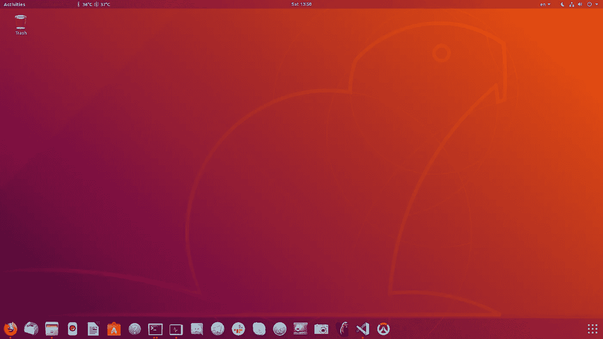

# Ubuntu 中的位置监视器检测器(在 python3 上用 opencv 构建)

> 原文：<https://towardsdatascience.com/position-monitor-detector-build-with-opencv-on-python3-3181b2fef414?source=collection_archive---------15----------------------->

## 因为我近视，我一直在寻找一种方法来控制我的眼睛到显示器的距离



并且保持适当的距离，因为坐得太近对眼睛不好。在学习了一点 opencv 库之后，我正在思考这个想法的简单实现。

根据人体工程学提示(从[这里得到](https://www.ergotron.com/en-us/ergonomics/ergonomic-equation)):

调整显示器高度，使屏幕顶部与眼睛齐平或略低于眼睛。当观看屏幕中间时，你的眼睛应该稍微向下看。将显示器放在距离眼睛至少 20 英寸(51 厘米)的地方，大约一臂的距离。

让我们在 Python3 中创建一个程序，它会在我们每次坐得太近时提醒我们(距离<51 cm or 20 inches) to monitor and display a message with warning. So, for face recognition part we will use default classifier from opencv, and tkinter as a way to send message on the screen.

Opencv is an awesome library, which allows you to do various operations on the image/video content such as convert to grayscale, make a mask, cropping, rescaling the image and many-many more.

After looking at [这个来自 opencv docs 的](https://docs.opencv.org/3.0-beta/doc/py_tutorials/py_objdetect/py_face_detection/py_face_detection.html#face-detection)例子，我认为，这是我特别需要的成功目标——进行简单的人脸检测。只是稍微调整一下例子——去掉眼睛分类器，就这样。

接下来的问题是如何测量人脸到摄像头的距离。稍微搜索了一下，发现了来自 [pyimagesearch](https://www.pyimagesearch.com/2015/01/19/find-distance-camera-objectmarker-using-python-opencv/) 的超级文章。在这份材料中，你可以发现，测量距离现在可以从物体的高度计算，并从特定的距离知道物体的高度。

例如，在距离 1 米处，以像素为单位对象的高度是 100。如果我们运行检测并观察，对象的高度是 50 像素——那么对象大约远两倍。如果是 120 像素，那么这个物体距离我们不到 1 米。因此，我们简单地检查现在的面部高度是否大于从选定距离知道的面部高度——然后发送带有 tkinter 的消息。

Tkinter 是一个简单的 GUI 工具，它提供了我们所需要的:弹出窗口部件，当且仅当检测到人脸并且人脸离监视器太近时才会出现。仅仅创建一个带有警告文本的文本小部件就足够了。

所以，让我们实现所有这些吧！

安装 Tkinter:

```
sudo apt-get install python3-tk
```

安装其他 python 包:

```
pip3 install numpy opencv-python
```

创建 python 脚本:

```
touch distance_detector.py
```

用下面的代码填充脚本(给代码添加了很多注释，这样你就可以理解这里发生了什么):

distance_detector.py

快速解释:

1.  使用 argparse 允许从 cmd(9–14)设置距离和已知高度；
2.  函数，它创建 tkinter 消息并返回它(16–27)；
3.  从摄像机中捕捉视频，对其进行灰度处理，并进行人脸检测(32–43)；
4.  当未检测到人脸(44–46)或人脸远离时(56–59)—禁用 tkinter 消息。如果不这样做，警告信息不会在一次成功检测后消失；
5.  当检测到人脸时—计算到检测到的人脸的距离(48–52)；
6.  如果距离小于选定距离—启用 tkinter 消息(53–55)；
7.  在 opencv 窗口中显示有用的信息，按 Q(60–81)后全部关闭。

在使用之前，我们需要根据你的脸校准它。为此:

1.  运行`python3 distance_detector.py`；
2.  坐在远处的摄像机前，这将限制眼睛；
3.  注意`face_height`参数并关闭脚本(在窗口中按 Q)；
4.  用你的`face_height`参数运行`python3 distance_detector.py`。

例如，当我从 51 厘米开始坐着时，我的面部高度是 300 像素。在我的情况下，我需要运行`python3 distance_detector.py -f 300 -d 0.51`。

它看起来像什么:

Yep, it works!

在本文中，你可以看到，在将想法分解成小块之后，实际实现变得并不困难。是的，您可以添加更多的技术来使检测工作更加准确并提高性能——但作为简单的例子，这应该足够了。

附:如果戴眼镜，要注意探测会不太准确。

感谢您的关注！祝你有美好的一天=)