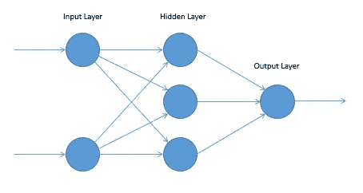
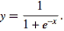
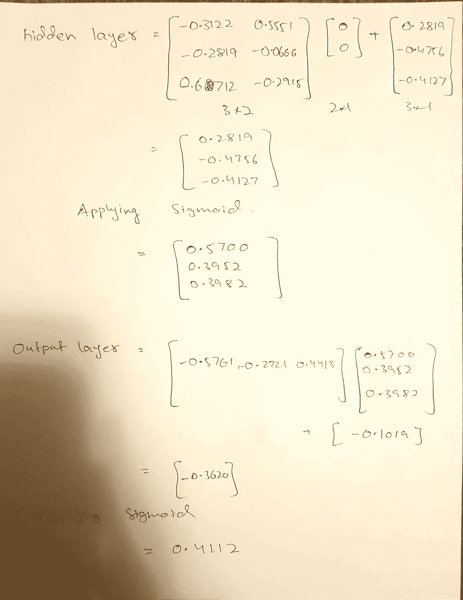

# 使用 PyTorch 对人工神经网络进行事后分析

> 原文：<https://towardsdatascience.com/postmortem-of-artificial-neural-networks-using-pytorch-fd429d4f5a93?source=collection_archive---------21----------------------->

我与 ***机器学习*** 的第一次互动是在我需要完成一项任务的时候，我只是在互联网上搜索使用机器学习的方法。我最终使用 scikit-learn API 用于 ann。我完成了任务，但对后端发生的事情一点概念都没有。于是，后来我开始上 MOOCs，开始探索这个 ***“黑匣子”背后的数学。***

在所有这些探索之后，当我回来使用 ann 时(这次是使用 Keras)，我发现非常令人不安的是，像 ***model.fit*** 这样简单的一行代码正在后端自行完成所有事情。这是我决定转向一个框架的时候，这个框架给了程序员更大的权力，其代码更具可读性。

在这篇博客中，我将使用 PyTorch 用代码和数学来解释人工神经网络。所以没有任何进一步的拖延，我们开始吧。

# **PyTorch**

这是一个深度学习框架，在研究人员中非常受欢迎，主要是因为它非常 pythonic 化且易于理解的语法。

如 PyTorch 教程[1]所述，典型的模型训练遵循以下六个步骤。

1.  定义模型(带有所有可学习的参数)
2.  迭代输入数据集
3.  前进传球
4.  计算损失
5.  反向传播梯度
6.  更新权重。

让我们回顾一下这些步骤背后的代码(PyTorch)和数学。

# 定义模型

在传统的人工神经网络中，应该有一个输入层和一个输出层以及可选的隐藏层。输入图层的大小与数据集中每个输入的大小相同。输出层的大小与类的数量相同，对于隐藏层，大小可能因问题而异。

我们将要使用的模型包含一个大小为 2 的输入层、一个大小为 3 的隐藏层和一个大小为 1 的输出层。下面是 PyTorch 中的代码。请注意，该代码还包含函数 forward。我们将在稍后的 ***向前传球*** 部分中讨论这一点。

```
import torch# defining model architecture
class ANN(torch.nn.Module):
    d*ef __init__*(*self*):
    super(NueralNetwork, *self*).__init__()

    *self*.fc1 = torch.nn.Linear(2,3)
    *self*.fc2 = torch.nn.Linear(3,1)

*def* forward(*self*, x):
    x = torch.sigmoid(*self*.fc1(x))
    x = torch.sigmoid(*self*.fc2(x))
    *return* x
```

这里的模型有 13 个可学习的参数，包括 9 个权重参数(6 个用于隐藏层，3 个用于输出层)和 4 个偏差参数(3 个用于隐藏层，1 个用于输出层)。以下是该模型的图示。



Artificial Neural network Architecture [2]

# **数据集**

第二步是准备数据集。在这篇博客中，我们的数据集是 XOR 门，它包含 4 行，每行有 2 个输入和 1 个输出。我们使用下面这段代码来定义它。

```
*# setting up data* X = torch.tensor(([0, 0],[0, 1],[1, 0], [1, 1]), dtype=torch.float)
y = torch.tensor(([0], [1], [1], [0]), dtype=torch.float)
```

# **向前传球**

从这里开始，我们坚持数据集的第一行，即 X[0] = [0，0]和 y[0] = [0]。数学上，向前传球使用以下公式计算:**y^ = w *输入+ b** 其中‘w’和‘b’分别代表权重和偏差。

我们使用下面这段代码来查看我们的初始权重和偏差。

```
nueralNet = ANN()
print(nueralNet)

params = list(nueralNet.parameters())
*# print(params)
# print(nueralNet.fc2.weight)* print("Weight vector for layer 1")
print(params[0])
print("Bias vector for layer 1")
print(params[1])
print("Weight vector for layer 2")
print(params[2])
print("Bias vector for layer 2")
print(params[3])
print('==========================')

out = nueralNet(X[0])
```

这会打印出以下内容

```
NueralNetwork(
  (fc1): Linear(in_features=2, out_features=3, bias=True)
  (fc2): Linear(in_features=3, out_features=1, bias=True)
)
Weight vector for layer 1
Parameter containing:
tensor([[-0.3122,  0.5551],
        [-0.2819, -0.0666],
        [ 0.6712, -0.2915]], requires_grad=True)
Bias vector for layer 1
Parameter containing:
tensor([ 0.2816, -0.4757, -0.4125], requires_grad=True)
Weight vector for layer 2
Parameter containing:
tensor([[-0.5761, -0.2721,  0.4413]], requires_grad=True)
Bias vector for layer 2
Parameter containing:
tensor([-0.1019], requires_grad=True)
```

我们将数据集的第一个实例传递给模型的代码行执行向前传递的计算。这将运行前面在 ANN 类中定义的 forward 函数。正向传递中的 Sigmoid 是由以下公式给出的激活函数:



以下是向前传球背后的数学计算。



这导致 y^ = 0.4112

# **计算损失**

在向前传递之后，我们根据原始标签评估由我们的模型创建的输出。这是通过计算损耗来实现的，损耗实质上是测量标签和当前输出之间的距离。在我们的实现中，我们将使用流行的均方误差。

```
*import* torch.optim *as* optim

*# create your optimizer* optimizer = optim.SGD(nueralNet.parameters(), lr=0.01)
criterion = torch.nn.MSELoss()
*# in your training loop:* optimizer.zero_grad()   *# zero the gradient buffers* loss = criterion(out, y[0])
print('Mean squared error or loss = ', loss)
```

数学上，它由下式给出


因此，在我们的例子中，因为我们只有一个输入实例，所以损失是= 0.1691。

# **反向传播渐变**

在计算了损失之后，我们需要一个最小化它的方法来改进我们的方法。为此，我们首先计算梯度，然后将它们传播回来以更新可学习的参数。这是通过 PyTorch 中的以下代码完成的

```
loss.backward()

optimizer.step()    *# Does the weight update*print(**"Weight vector for layer 1"**)
print(params[0])
print(**"Bias vector for layer 1"**)
print(params[1])
print(**"Weight vector for layer 2"**)
print(params[2])
print(**"Bias vector for layer 2"**)
print(params[3])
print(**'=========================='**)
```

我鼓励你通过这个链接([https://www.youtube.com/watch?v=Ilg3gGewQ5U](https://www.youtube.com/watch?v=Ilg3gGewQ5U))来深入理解反向传播和权重更新的工作原理。作为一个有趣的练习，在这个例子中尝试计算更新后的梯度和参数。