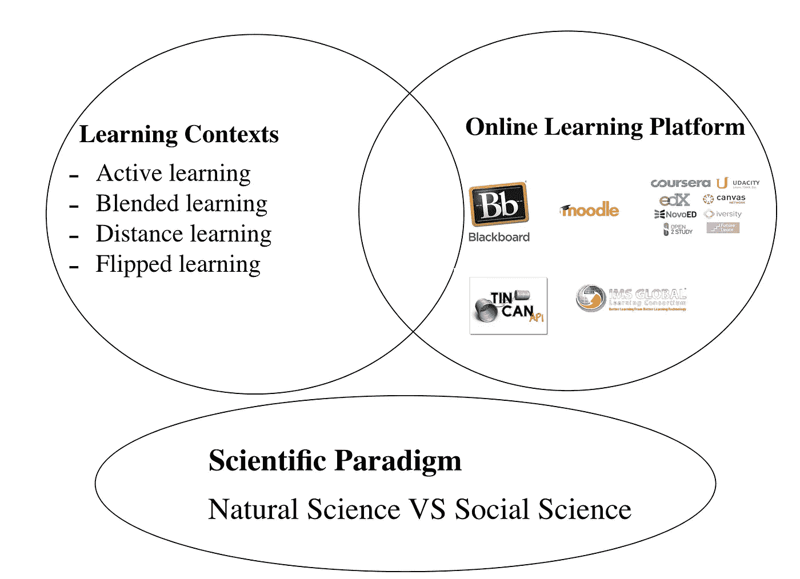

# 教育数据挖掘研究的潜在问题

> 原文：<https://towardsdatascience.com/potential-issues-of-the-research-with-educational-data-mining-8d77d999ba40?source=collection_archive---------11----------------------->

Photo by [Patrick Tomasso](https://unsplash.com/@impatrickt?utm_source=medium&utm_medium=referral) on [Unsplash](https://unsplash.com?utm_source=medium&utm_medium=referral)

## 用 MOODLE 查看混合学习环境的案例研究并讨论教育数据挖掘的潜在问题

进行教育数据挖掘(EDM)的目的是通过基于存储在 MOODLE 数据库中的日志数据使用机器学习技术进行研究，来识别学生如何在“混合”模块中在线学习。该结果可用于改进教学方法和测试关于学习的假设，并可实现软件以使其能够例行执行。然而，研究方法中的潜在风险和局限性似乎还不清楚。本文将通过使用 MOODLE 数据集查看混合在线学习的案例研究来讨论 blow 中的论点。

EDM 研究可能会受到图 1 所示的 **1)学习环境**、 **2)在线学习平台**和 **3)科学范式**的影响。

# 工作定义

在 Moodle 混合学习环境下的 EDM 案例研究主要使用机器学习技术。这两个概念的定义就像下面的句子。

**机器学习**，被认为是计算机科学的一个子领域，赋予“计算机无需显式编程就能学习的能力”(穆尼奥斯，2014，第 1 页)机器学习基于无分布统计，由无监督学习和监督学习技术组成。两者的区别在于研究者是否准备了标注的训练数据。无监督学习技术不需要带标签的训练数据，但不能获得决定性的证据。另一方面，监督学习技术必须花费时间来标记训练数据，而不是生成决定性的结果。(拉什卡等人，2016 年)

**Moodle** 是一个基于开源的免费学习平台，被称为 LMS 或电子学习的一种，由 Moodle HQ 协调，Moodle HQ 是一家由 30 名开发人员组成的澳大利亚公司，由全球 60 多家 Moodle 合作伙伴服务公司提供资金支持(Moodle 2016)。Moodle 作为最常见的教育技术程序之一用于高等教育(HE)(Bowler 2009)，并用于混合学习、远程教育、翻转课堂以及学校、大学、工作场所和其他部门的其他电子学习项目(Costello 2013)。Moodle 为学生获取资源提供了更大的灵活性，并增加了任务的参与度，这可以带来更好的学习表现(柯克伍德·丹尼尔& Price 2014)。Moodle 可以让学生进行课堂学习活动，如调查、获取、练习、讨论、制作和在线协作，然后与他人分享成果。

## 三个研究问题示例

案例研究中行政领导和管理的利益相关者大多是教育工作者和研究人员。教育者的目标是识别学习者的行为以提高学习成绩。研究人员的目标是确定如何使用机器学习技术进行 EDM 方法。为了达到教育者的目标，测量学习结果的有用指标应该被预先识别，并且识别在线学习行为。通过这些过程，研究者可以满足教育者和他们自己的目标。案例研究考察了简单问题之后的三个问题，并通过讨论发现了 EDM 的应用层。

**RQ1。预测考试结果的指标有哪些？**

**RQ2。一个普通学生在 Moodle 上的学习行为可以是什么？**

**RQ3。EDM 的结果能向教育者和研究者揭示什么？**

# 混合学习的协作指标

混合学习环境中的学习行为可以在日志数据上表示，EDM 在针对上述研究问题的研究中被调整到该混合学习环境。Laurillard (2014)将“混合学习”定义为

> “课堂面对面学习体验与在线学习体验的巧妙融合。”

混合学习很简单，因为在整合同步(面对面)和异步(基于文本的互联网)学习活动的优势方面有相当大的直观吸引力。由于几乎无限的设计可能性及其对如此多环境的适用性的挑战，混合学习在实施中相当复杂(Garrison & Kanuka，2004)。在混合学习环境中，大量的日志数据被记录并具有各种变量，因为混合学习导致协作、访问频率和灵活性的增加(Graham，2006)。因此，使用 EDM 的研究通常调整为混合学习，以确定在线学习行为的特征。(Berland 等人 2014；麦克拉伦等人，2007 年，2010 年)

混合学习的灵活性可以实现多种协作学习环境或活动。这可以增加对在线学习的承诺和在线学习的机会。相应地，可以积累大量的日志数据，并从日志数据中提取在线学习行为的显著特征。例如，混合学习

> “使用软件开发工具的在线协作”(Berland 等人，2014 年，第 12 页；Kay 等人，2006)”和“交互式桌面协作”(Berland 等人，2014，第 12 页；马丁内斯等人，2011 年)。

Prata (2012)指出，当学生的错误被他们的伙伴反驳时，他们往往比那些伙伴选择不纠正他们的学生学到更多。Dyke 等人(2013 年)揭示了在协作学习过程中发生的偏离主题的讨论在学习过程的某些部分比在其他部分对学习更有害——具体来说，偏离主题的讨论在学习基本事实时比在讨论解决问题的替代方案时更有害。一些基于学生对在线讨论论坛的贡献的模型，甚至能够预测学生的最终课程成绩。(Ming & Ming 2012)因此，在协作混合学习环境中，学习数据可以反映出突出的特征，有价值的结果可以通过 EDM 提取出来。

然而，在线学习行为在表现世界时具有推理行为的特征(Davis et al .，1993)，而混合学习方法提供的学习灵活性可以结合各种交付模式(Oliver & Trigwell，2005)并扩展学习体验。这是因为如果不能访问互联网，就不能记录日志数据，并且混合学习部分涉及

> “在教师支持下的自定进度学习，以发展特定的知识和技能”。(奥利弗和特里格韦尔 2005 年，第 2 页；Valiathan，2002 年)

考虑到个体不同的学习速度和个体预先存在的知识，学习行为被不同地表示或不表示。此外，在线学习环境中使用的技术也在不断发展变化(Laurillard，2014)。因此，使用 EDM 从混合上下文中提取的结果是上下文相关的。需要更新在混合环境中使用 EDM 的实证研究。基于新技术的在线学习平台的特点以及学习环境也会影响研究结果。下一节将确定平台对研究的影响。

# Moodle 的有限指标

本研究中考察的在线学习平台 Moodle 具有可定制的结构和学习内容协议等功能特性。它限制了研究者可以测量的内容，并迫使研究者以某种方式进行分析。由于 Moodle 的可定制结构，EDM 无法衡量对学生动机的影响。这是因为个人动机会受到各种因素的影响，如**互联网速度、在线学习内容的设计、用户界面**(贝卢斯&奥利维拉 2015)，以及**由学习者之间的关系构成的隐藏因素，这些因素无法在 Moodle** 上生成。(塞尔温，2011 年)

虽然 Moodle 的特性可以为学习环境提供更多的灵活性，但它使开发者、设计者和教育工作者能够使用 Moodle 创建不同的学习平台，这些平台根据利益相关者的不同而具有不同的设计和功能。这意味着使用 Moodle 的通用学习平台并不存在。这可能导致难以衡量学习平台本身的影响，如使用 EDM 方法的动机。例如，当学生很少使用教育工作者上传的学习材料学习时，与使用 Moodle 的其他研究相比，研究人员很难理解学习材料或界面设计是否会降低学习者使用学习材料的动机。

Moodle 的可定制特性要求 Moodle 拥有设计良好的学习用户界面和结构。在实际的教育情况下，大多数教育机构没有很好地利用 Moodle 来提高学习成绩。(Bowler，2009)例如，教育工作者将许多学习材料上传到 Moodle，而没有考虑哪种学习设计最能激励个人参与在线行动，因此学生很少通过使用这些材料进行学习(Attwell & Hughes，2010；Finlayson 等人，2006 年)。Moodle 的学习设计的多样性来自其可定制的结构，当使用 EDM 分析数据时，它会掩盖影响因素。

此外，Moodle 兼容的协议限制了日志数据的变量。学习材料(如文档、幻灯片和电影)的容量受到全球决定的协议的限制，如 Moodle 中采用的可共享内容对象参考模型(SCORM)、Tincan API(它对学习内容的控制更强，比 SCORM 内容更安全)( Rustici 软件，2016 年)以及 Caliper(它可以记录比 SCORM 更详细的学习动作)( IMS 全球学习联盟，2016 年)。这样，数字内容的利益相关者，例如开发者、数字内容的设计者、教育者和学校，被迫遵循这些协议，并且数字内容是基于该框架开发的。诚然，个人对分块数字学习内容的学习表现和过程(可以作为学习中的定量变化来衡量)被记录在数据库中，并且数字内容的技术属性可以使 Moodle 上的学习内容个性化成为可能(Laurillard，2014)。而拥有 SCORM 协议讲座电影的 Moodle，并不记录学生看完电影的时间，学习资料的设计框架是预先确定的。

除了使用 Moodle 的限制之外，在线教师和课堂教师在角色和职责上的细微差别(McDonald & Reushle，2002；Oliver，1999)区分了对在线学习的影响。在使用 Moodle 的混合学习环境中，教师可以发挥整合作用，如促进讨论或充当教学设计者，这不同于他们在传统课堂教学环境中的权威角色(Selwyn，2011)。Moodle 也与协作学习兼容，因为它们允许讨论被记录和跟踪，并保持小组的界限(Easton，2003)。在学习环境中，教师的社会角色要求他们承担责任，如组织学习社区(Easton，2003)，并鼓励学习者使社区更加活跃(Craig et al .，2009)。他们可以扮演“教学设计者”的角色，设计学习过程和内容，以及论坛的“促进者”。因此，EDM 的结果可以直接用于教师确定他们应该如何在线行为以及分析 Moodle 上的在线学习行为。虽然 Moodle 的功能方面限制了日志数据，但日志数据的属性会受到教育者角色的影响，例如学习设计者或促进者。

# EDM 是基于社会科学范式的

用 EDM 进行研究的前提是，与学习活动有关的每一个要素都不能总是表现自己。这是因为 EDM 不是基于自然科学的特质，而是基于社会科学，虽然数据挖掘是计算机科学的一个分支。

**自然科学**的研究对象是

> “自然发生的物体或现象，如光、物体、物质、地球、天体或人体”(Bhattacherjee 等人，2012 年，第 10 页)

鉴于，**社会科学**以研究为目的

> “人或人的集合，如团体、企业、社会或经济，以及他们的个人或集体行为”(Bhattacherjee 等人，2012 年，第 10 页)。

**社会科学的传统**不同于自然科学的传统，例如“非常精确、准确、确定，并且独立于进行科学观察的人”(Bhattacherjee 等人，2012 年，第 1 页)。Bovo 等人(2013 年)关于对 Moodle 数据进行聚类以分析学生的研究提供了很少的行为差异，并生成很少的聚类(2 到 3)。因此，即使正确地采用了分析方法，EDM 方法也不总是能发现有益的信息。

EDM 的研究并没有假设教育环境中的每一种现象都可以转化为支持“科学主义”的静态数字变量(Hyslop-Margison & Nasee，2007)。

因此，需要对研究背景进行丰富而详细的描述，以追溯为什么研究不能获得显著的结果，或确定研究结果在多大程度上可以移植到其他教育环境中。(Bhattacherjee 等人，2012 年)这是因为 EDM 方法具有引导研究者对数据的态度和理解的自愿特征。这是由于假设形成、测试和提炼的迭代过程(Romero & Ventura，2013)，这是数据挖掘过程本身的迭代方式，尤其是机器学习技术。关于产生假设的迭代过程的详细描述可以增加研究的可信度。

# 参考

Laurillard anon——2014 年——思考混合 learning.pdf。可从以下网址获得:[http://kvab . be/denkersprograma/files/DP _ blended learning _ Thinking-about . pdf](http://kvab.be/denkersprogramma/files/DP_BlendedLearning_Thinking-about.pdf)

Attwell，g .和 Hughes，j .(2010 年)。使用技术进行学习的教学方法:文献综述。地点:【http://dera.ioe.ac.uk/id/eprint/2021】T2。

Beluce，A.C .和 Oliveira，K.L. de，(2015 年)。虚拟学习环境中学生的学习动机。*paideía；圣保罗*，25(60)，第 105–113 页。

Berland，Ryan|Blikstein，Paulo，(2014 年)。教育数据挖掘和学习分析:建构主义研究的应用。*技术、知识和学习*，19(1–2)，第 205–220 页。

Bhattacherjee，a .，南佛罗里达大学，学者共享和开放教科书图书馆，(2012 年)。*社会科学研究:原则、方法和实践*，可在:[https://open.umn.edu/opentextbooks/BookDetail.aspx?获得 bookId=79](https://open.umn.edu/opentextbooks/BookDetail.aspx?bookId=79) 。

鲍勒博士(2009 年)。在虚拟学习环境中学习"聊天":使用在线同步讨论进行一年级本科生辅导。在曼彻斯特大学举行的英国教育研究协会年会上。第 2-5 页。可在:[http://www.leeds.ac.uk/educol/documents/184295.pdf](http://www.leeds.ac.uk/educol/documents/184295.pdf)买到。

克雷格，a .，古尔德，a .，科尔德维尔，j .，芥末，j .和杰里，p .(2009 年)。在线学习中角色和责任的认知:一个案例研究。*国际博士研究杂志*，第 4 期，第 205–223 页。

科斯特洛(2013 年)。开放源代码:看 Moodle 在高等教育中的应用。*开放学习:开放、远程和电子学习杂志*，28(3)，第 187-200 页。

戴克，g .，豪利，I .，阿达姆松，库马尔，r .和罗斯，C.P .，2013 年。由会话代理支持的学术生产性谈话。在*群体互动分析中的多产性*。计算机支持的协作学习系列。斯普林格，波士顿，马萨诸塞州，第 459-476 页。可在:[https://link . springer . com/chapter/10.1007/978-1-4614-8960-3 _ 25](https://link.springer.com/chapter/10.1007/978-1-4614-8960-3_25)获取。

伊斯顿，s . s .(2003 年)。明确教师在在线远程学习中的角色。*传播教育*，52 卷 2 期，第 87–105 页。

Garrison，D.R .和 Kanuka，h .(2004 年)。混合学习:揭示其在高等教育中的变革潜力。互联网和高等教育，第 7 卷第 2 期，第 95-105 页。

格雷厄姆(2006 年)。混合学习系统。*混合学习手册*，第 3–21 页。

IMS 全球学习联盟。可从/activity/caliperram 获取。

国际教育数据挖掘协会(2011 年)。国际教育数据挖掘协会。*国际教育数据挖掘学会*可从/home 获得。

柯克伍德·丹尼尔、阿德里安和普莱斯、琳达(2014)。高等教育中技术增强的学习和教学:什么是“增强的”,我们如何知道？一篇重要的文献综述。学习、媒体和技术，39(1)第 6-36 页。

麦克唐纳，j .和勒什勒，s .(2002 年)。描绘高等教育中在线教师的角色:变革之风。澳大利亚 2002 年会议录:第 19 届澳大利亚高等教育计算机学会年会。澳大利亚高等教育计算机学会(ASCILITE)，第 431-440 页。可在:[http://eprints.usq.edu.au/4363](http://eprints.usq.edu.au/4363)买到。

穆尼奥斯(2014 年)。机器学习和优化。*网址:* [*https://www。*T21*CIMS。纽约大学。edu/*∽*munoz/files/ml _ optimization。pdf[访问时间 2016–03–02][WebCite 缓存 ID 6fiLfZvnG]* 。可在:](https://www.)[https://www.cims.nyu.edu/~munoz/files/ml_optimization.pdf](https://www.cims.nyu.edu/~munoz/files/ml_optimization.pdf)买到。

Oliver 和 k . Trigwell(2005 年)。“混合学习”还能挽回吗？*电子学习和数字媒体*，2(1)，第 17-26 页。

普拉塔博士(2012 年)。协作学习中的对话分析。*国际电子教育、电子商务、电子管理和电子学习杂志*。可在:[http://www.ijeeee.org/show-33-387-1.html](http://www.ijeeee.org/show-33-387-1.html)买到。

拉什卡，s .，朱利安，d .和哈特，j .(2016)。 *Python:深入洞察机器学习*，Packt 出版有限公司。

罗梅罗和文图拉(2010 年)。教育数据挖掘:对当前技术水平的回顾。*《IEEE 系统、人和控制论汇刊》，C 部分(应用和评论)*，40(6)，第 601–618 页。

Rustici Software，LLC，概述—锡罐 API。地点:【http://tincanapi.com/overview/】T4。

塞尔温，尼尔。(2011).*教育和技术:关键问题和争论*。伦敦；纽约州纽约市:布卢姆斯伯里学术出版社，布卢姆斯伯里出版公司的一个分支