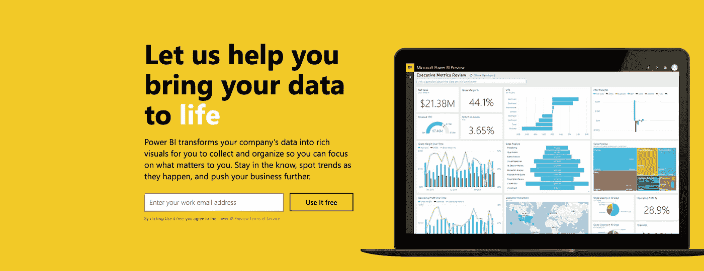
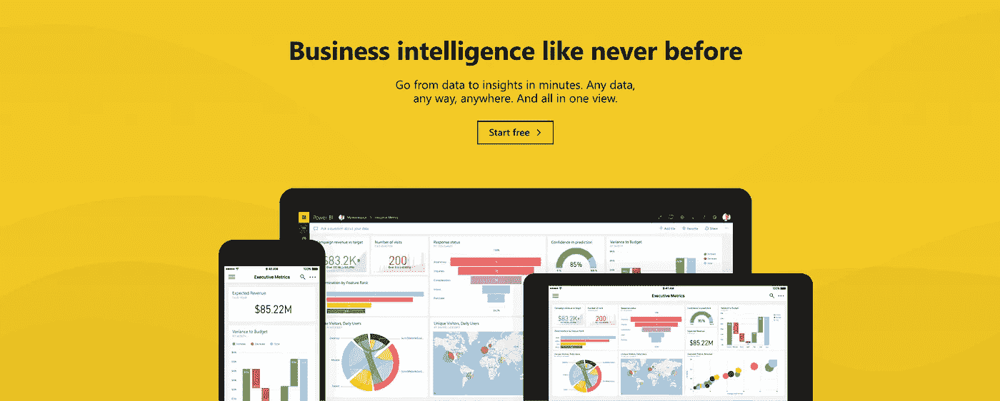
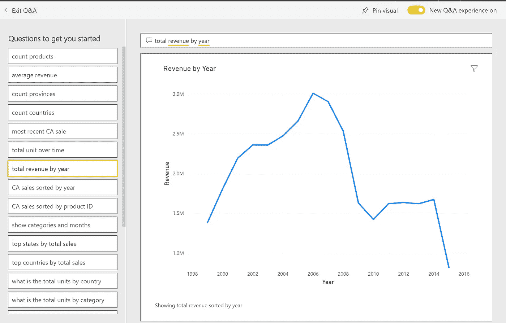
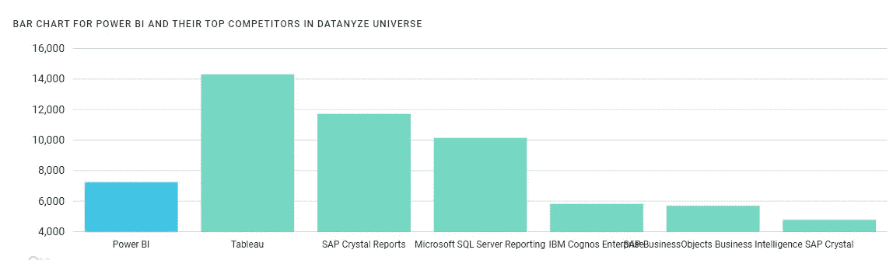

# 作为商业智能工具的 Power BI

> 原文：<https://towardsdatascience.com/power-bi-as-a-tool-for-business-intelligence-237b478c3b84?source=collection_archive---------6----------------------->

继我在 Strata 数据科学会议上的上一篇文章之后，我开始思考**数据科学**和**商业智能**的未来发展——也就是说，这两个简单的术语将如何改变我们工作、思考和生活的方式。

说实话，“数据科学”对我来说似乎有些遥远；然而，“商业智能”的概念可以大致概括我的工作，至少根据 Forrester Research 的定义是这样的:

> 一套方法、流程、体系结构和技术，可将原始数据转换为有意义和有用的信息，用于实现更有效的战略、战术和运营洞察和决策

我为微软的一个合作伙伴工作；我们使用 **Microsoft Dynamics 365** 帮助客户实现数字化转型之旅。最近，Microsoft Dynamics 365 进行了大幅扩展:销售、客户服务、营销等核心应用程序。可以与 Microsoft Power Platform(由 Power BI、Power Apps 和 Microsoft Flow 组成)无缝集成，以自动化业务流程、更高效地管理数据并改善客户体验。

Source: [https://community.dynamics.com/365/b/nickfratello/posts/7-advantages-of-microsoft-business-applications-oct-18-edition](https://community.dynamics.com/365/b/nickfratello/posts/7-advantages-of-microsoft-business-applications-oct-18-edition)

几年前，当我写关于数据可视化的论文时，我第一次听说了阿碧电力公司。作为研究的一部分，我分析了一些 Power BI 报告。之后，我有机会在当地政府、高等教育和慈善机构的 Power BI 项目中工作。看到有多少有用的信息可以通过 Power BI 以一种简单、可读的方式提取和显示出来，真是令人着迷。

Power BI 是一个相对年轻的产品，于 2015 年作为数据可视化和分析工具加入了微软家族。尽管 Power BI 简要宣传了其配备自然语言处理功能的“提问，获得答案”功能，但其主要卖点是可视化、分析和数据连接功能，例如与 Dynamics CRM、Salesforce、Excel、Oracle 等的连接。

Screenshot from an archived Power Bi web page in June 2015, [https://web.archive.org/web/20150610061450/https://powerbi.microsoft.com/en-us/](https://web.archive.org/web/20150610061450/https://powerbi.microsoft.com/en-us/)

微软直到 2017 年 5 月才开始谈论**商业智能**这个口号，**“前所未有的商业智能”**，第一次占据了头版。

Screenshot from an archived page in May 2017, [https://web.archive.org/web/20170504213718/https://powerbi.microsoft.com/en-us/](https://web.archive.org/web/20170504213718/https://powerbi.microsoft.com/en-us/)

2015 年至 2017 年间，由于数据处理能力的提高和稳定的网络技术，所谓的数据丰富市场正在蓬勃发展。为了利用这些数据，一些公司开始寻找能够解决他们的问题、升级他们的 IT 系统或实施数据分析工具的专业人士。渐渐地，人们也明白了信息越丰富，处理起来就越困难。这就是为什么我们需要更多的“智能”来通过解释数据来帮助企业。

现在，让我们看看 Power BI 作为商业智能工具的优势:

首先，Power BI 的数据清理和准备以及交互式数据可视化功能使用户能够用一个工具做多件事情。这意味着一个公司不必在不同的软件和资源上投入太多。

其次，作为微软的产品，Power BI 可以利用微软平台上的其他尖端技术，如 Azure 认知服务或 AutoML 功能。鉴于许多组织已经订阅了 Microsoft enterprise，Power BI 允许用户使用他们已经在工作中使用的相同凭据登录。

第三，Power BI 的学习曲线并不陡峭，因为它的用户界面与其他微软产品如 Excel、Word 等非常相似。你还需要知道什么？也许可以拖放数据源和可视化，或者添加切片器、页面过滤器或报告过滤器，以便从不同的角度更好地理解您的数据。也可以通过各种微软在线学习资料自学。对于特定场景的帮助，您可以访问 [**Power BI 社区**](https://community.powerbi.com/) ，在这里您可以提出问题并接受其他开发人员的建议。

Screenshot from one of my example Power BI dashboard

最后但同样重要的是，关于人工智能(AI)在 Power BI 上的应用，我不打算引用学术论文或谈论任何令人困惑的事情。一个关于问答功能的快速示例足以说明在 Power BI 中使用一些微软内置的人工智能工具是非常方便的:

Power BI 的问答功能是自然语言处理(NLP)的神奇之处。在 Power BI 控制面板上，您可以提出一些简单的数据问题，Power BI 将努力为您找到答案。例如，在下面的截图中，我输入“按年的总收入”，这个折线图就出现了。不是很方便吗？

Screenshot from one of my example Power BI dashboard

根据来自 Datanyze 的商业智能市场份额报告[，Power BI 目前约占商业智能市场的 6%(基于使用给定技术的网站数量)，略低于竞争对手 Tableau、SAP Crystal Reports 和 Microsoft SQL Server Reporting。](https://www.datanyze.com/market-share/business-intelligence/Datanyze%20Universe/power-bi-market-share)

A screenshot from the market share webpage

但正如本文所讨论的，我感觉 Power BI 潜力很大。我们会看到的！

## 参考资料:

 [## 主题概述:商业智能

### 商业智能(BI)是一套方法、流程、架构和技术，可以改变原始的…

www.forrester.com](https://www.forrester.com/report/Topic+Overview+Business+Intelligence/-/E-RES39218)  [## 数据科学与商业智能-数据大学

### 在当今由数据驱动的现代世界中，数据科学的发展势在必行。如果一个人真的很小心…

www.dataversity.net](https://www.dataversity.net/data-science-vs-business-intelligence/#) 

*麦肯锡全球研究所* [*撰写的《分析时代:在数据驱动的世界中竞争》https://www . McKinsey . com/~/media/McKinsey/Business % 20 functions/McKinsey % 20 Analytics/Our % 20 insights/The % 20 Age % 20 of % 20 Analytics % 20 competiting % 20 in % 20a % 20 Data % 20 Driven % 20 World/MGI-The-The-Age-of-Analytics-Full-report . ashx*](https://www.mckinsey.com/~/media/McKinsey/Business%20Functions/McKinsey%20Analytics/Our%20Insights/The%20age%20of%20analytics%20Competing%20in%20a%20data%20driven%20world/MGI-The-Age-of-Analytics-Full-report.ashx)

*2019 Gartner 分析和商业智能平台魔力象限:*[*https://www.gartner.com/doc/reprints?id=1-3TXXSLV&CT = 170221&ST = sb*](https://www.gartner.com/doc/reprints?id=1-3TXXSLV&ct=170221&st=sb)