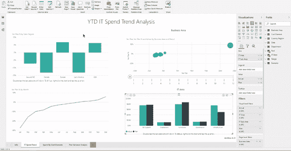
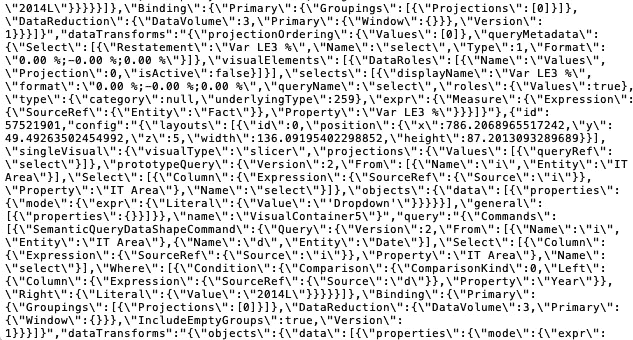
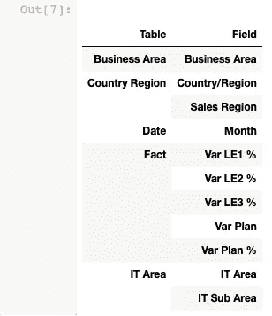
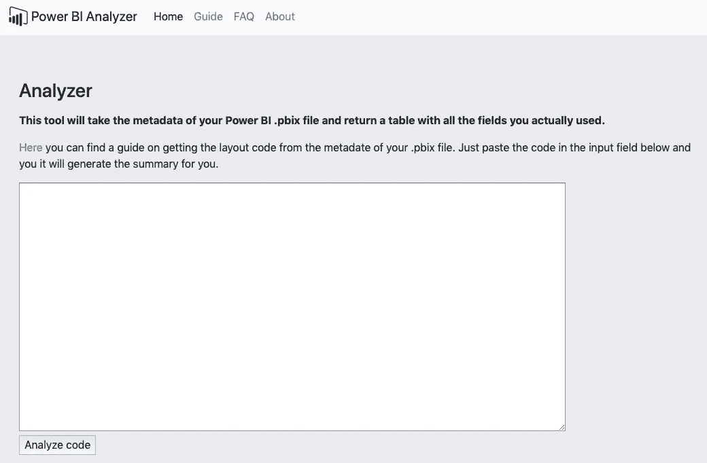
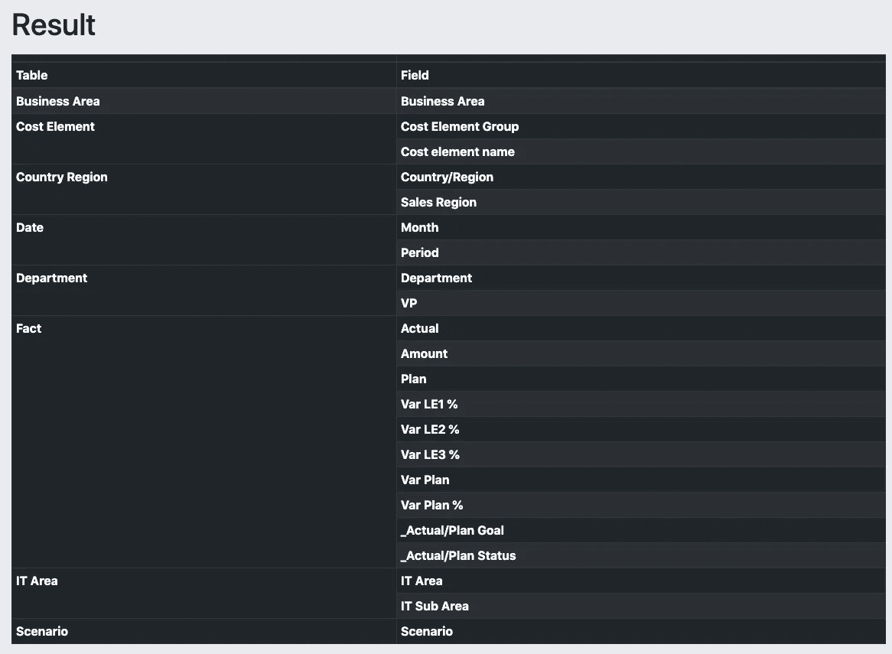

# Power BI:我如何开始使用 Python 来自动化任务

> 原文：<https://towardsdatascience.com/power-bi-how-i-started-using-python-to-automate-tasks-9f53e3e9ab47?source=collection_archive---------5----------------------->

和许多数据爱好者一样，我每天都使用 Power BI 来构建仪表板并可视化我的数据。然而，在构建和改进复杂的仪表板时，我经常使用不同的字段和相应的表来添加和删除小部件。经过无数次迭代之后，数据结构开始看起来像一团乱麻，产生了一个由许多表和许多列或字段组成的混乱列表，我曾一度用它们来构建我的仪表板。然而，最终最好能了解我在最终仪表板中实际使用的所有字段的概况。不幸的是，在 Power BI 中实现这一点的唯一方法是遍历每个小部件，手动查看并记下已经使用的字段。

Manually finding the data behind widgets in Power BI.

作为程序员，我们试图通过任何必要的手段来避免手工工作，所以我做了一些挖掘，看看是否有一些代码可以取代这种重复的工作。当然，如果我没有想出一个[解决方案](https://powerbi-analyzer.herokuapp.com)，我是不会写这篇文章的。事实证明，实现这一点相当简单。

# 解构 PBIX 文件

在不实际使用软件的情况下使用 Power BI 的第一步是深入研究。PBIX 文件。使用像 WinRAR 这样的免费压缩软件，你可以解压缩任何。PBIX。文件。这导致了不同文件和目录的结构，为分析和可能的操作提供了可能性。

当浏览解压缩文件时，你可以找到一个包含“布局”文件的“报告”文件夹。该文件包含有关您的仪表板的视觉结构的所有信息:

*   **每个部件的 X/Y 坐标和尺寸**
*   **使用字段名称**
*   **所有设置和参数**
*   **头衔**
*   **…还有更多**

该文件由一个字符串组成，该字符串是 JSON、列表和字典的一种组合。使用 Python，我计划生成实际使用的数据字段和小部件的摘要。

The layout file opened in a text editor.

# 构建解析器

我希望一个简单的 JSON 解析器能够解决这个问题，但不幸的是，JSON 中嵌套了其他结构，这使得代码比我希望的要长一些，但总体来说还是很短。经过一段时间的困惑和构建异常场景后，我得到了一些相当不错的结果，返回了每个小部件的表和相应字段的列表。

使用 Pandas，我将这些信息总结成一个数据帧，删除所有重复的信息(例如，两个部件使用相同的数据)。结果是包含我在仪表板中使用的所有数据的干净的数据帧，如下所示:

Dataframe output in Jupyter Notebooks.

# 在线版本

好了，现在通过复制粘贴布局文件中的字符串，让我的函数来完成这项工作，Jupyter 笔记本中的所有功能都工作正常了。工作很好，但不是以一种非常用户友好的方式，所以下一步:将功能转换成一个可用的工具。

不想抛弃我的忠实伙伴 Python，我选择了 Flask 来构建一个 web 应用程序。作为一个我不是前端开发人员，我去了一个极简的方法，不要太关注视觉方面。

[Online version](https://powerbi-analyzer.herokuapp.com) of the tool.

基本上，它只是一个表单，将字符串作为输入，运行函数，返回数据帧，将数据帧转换为 HTML 表，最后显示给用户。该工具是免费的，不包含任何插件。它可能有时会有点慢，因为它是在 Heroku 服务器上托管的。

The end result, a table showing all the unique data fields used for the dashboard.

# 下一步是什么？

尽管我对这项任务的自动化很满意，但这仍然只是一个开始。展开脚本并在解压缩后的。PBIX 文件可以打开许多新的大门。例如，我简单地对文件做了一些小的操作，再次压缩并通过 Power BI 重新打开它，这似乎很有效。这意味着应该可以使用 Python 脚本来编辑仪表板。

现在还不确定我下一步会去哪里，但有些选择可能是:

*   跟踪更改
*   自动生成报告
*   创建更广泛的报告
*   …?

如果你有任何其他想法或反馈，请在评论中留下。

想用工具的可以在这里找到[。](https://powerbi-analyzer.herokuapp.com)

**关于作者** *:我叫布鲁诺，是总部位于荷兰的人工智能技术纵向扩展公司*[*dash mote*](http://www.dashmote.com/?source=post_page---------------------------)*的一名数据科学家。我们的目标是借助基于人工智能的解决方案，弥合图像和数据之间的鸿沟。
查看我在* [上的其他作品 https://www.zhongtron.me](https://www.zhongtron.me/) 。