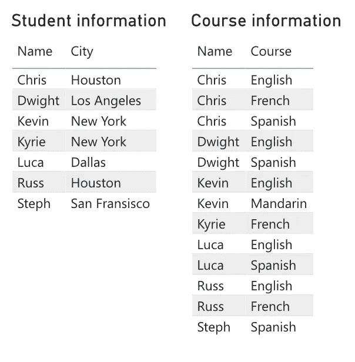
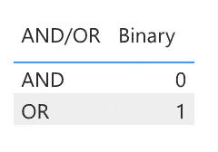
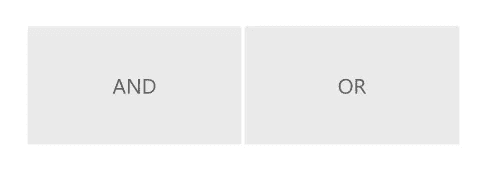
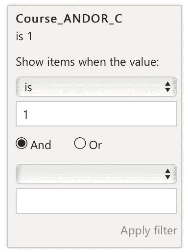
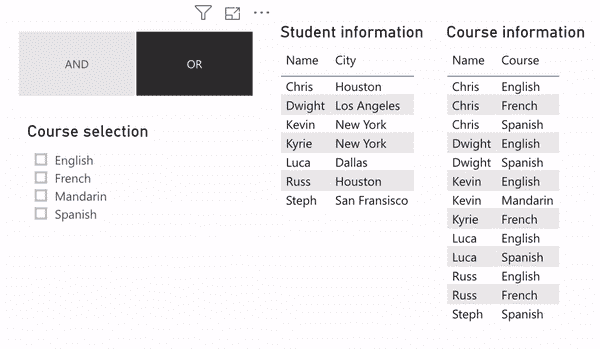

# 电源 BI:实施和/或选择

> 原文：<https://towardsdatascience.com/power-bi-implement-and-or-selection-53bf58143ea3?source=collection_archive---------20----------------------->

我真的越来越喜欢 Power BI 了。每天使用这个软件，我对这个产品的功能以及它通过添加新功能或优化现有功能逐月改进的方式感到惊讶。


Power BI desktop. (Source: microsoft.com)

然而，像任何软件解决方案一样，仍然有改进的空间，并且缺少一些可以使许多用户受益的功能。这些可能的改进之一是启用多选类型。在当前设置中，Power BI 将多选视为“或”，而不是“和”。让我快速向您介绍一下两者的区别。

# AND vs. OR

和/或的概念非常简单，但对于那些不熟悉的人，我将用一个简单的例子来演示。假设您有一个简单的学生和他们的语言课程表，如下所示:


AND/OR data example

法语**或**英语:学生甲、乙、丙
法语**和**英语:学生甲、乙

默认的 Power BI 行为是将该选择视为 or。

在本文中，我将向您介绍如何在您自己的 Power BI 仪表板中设置 AND 和 OR 选项。

我为这个演示创建的样本数据如下所示:



Data for demo. 2 tables in total

第一个表包含一些学生的基本信息，而另一个表包含每个学生的多行，包含他们正在学习的语言课程的信息。这两个表以双向一对多的关系连接在一个学生 ID 上。

# 让我们写一些代码

在我们开始写代码之前，你应该熟悉 DAX 的基础知识。对于那些不熟悉的人来说，DAX 是一种编程语言，您可以在 Power BI 中使用它来创建过滤、计算、列等等。

首先，我们将创建一个非常小的表，其中包含我们稍后将用来创建“AND/OR”切片器的指标和值。这是一个 2x2 的表格，您可以从外部源添加，或者使用以下代码创建它:

```
ANDOR_Table = 
  DATATABLE(
    “AND/OR”, STRING,
    “Binary”, INTEGER, 
     { 
       {“AND”, 0},
       {“OR”, 1}
     }
   )```
```

该表应该如下所示:



AND/OR table, used for the slicer

在我们开始编写度量之前，我最近采用了一个好的做法，将所有的度量放在同一个表中，以保持整洁。所以让我们首先创建一个空表，如下所示:

```
_Measures = 
    {BLANK()}
```

在该表中增加以下措施:

```
Selected_AndOr = 
  MAX(ANDOR_Table[Binary]) 
```

此度量将指示您是选择“与”还是“或”选择。您已经可以将切片器添加到包含和/或字符串作为项目的报表中。



AND/OR slicer

现在我们有了选择的一切，是时候开始创建后端了。我们将创建的下一个度量是计算您选择了多少行的度量。

```
Selected_counter = 
  IF( 
     ISFILTERED(‘Courses’[Course]), 
     COUNTROWS( 
           ALLSELECTED(‘Courses’[Course]) 
               ),
      0)
```

我们在前面的度量中创建的计数器现在将用于向您想要查看选择结果的表中添加一个指示器，在本例中是 Student 表。

我们创建的最后一个度量将使用前一个度量，以查看该行是否满足“AND”标准。它将返回一个 0/1 标志。

```
Course_ANDOR_Check = 
   IF(
      [Selected_counter] = 0, 
       1, 
       IF(
          DISTINCTCOUNT(‘Courses’[Course]) = [Selected_counter], 
          1,
          _Measures[Selected_AndOr]
           )
       )
```

现在一切都设置好了，是时候把它添加到视觉效果中了。对于每一个你想受此功能影响的部件，你应该在视觉层次上添加一个过滤器，如下所示: **Course_ANDOR_Check 为 1**



Filter you should apply to the visuals

搞定了。现在，您可以使用和/或切片器来更改功能，如下图所示。



Final result

这个解决方案结合了我自己的代码和我在网上找到的代码片段。由于我仍在发展我的 DAX 技能，我渴望改善这段代码。因此，如果您有任何问题或改进此解决方案的想法，请随时留下您的评论。

*关于我:我叫布鲁诺，是总部位于荷兰的人工智能技术纵向扩展公司* [*Dashmote*](http://www.dashmote.com/) *的数据科学家。我们的目标是借助基于人工智能的解决方案，弥合图像和数据之间的鸿沟。
查看我在* [上的其他作品 https://www.zhongtron.me](https://www.zhongtron.me/) 。