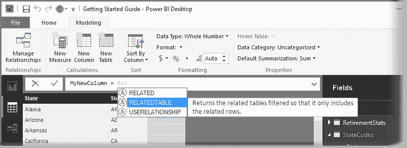
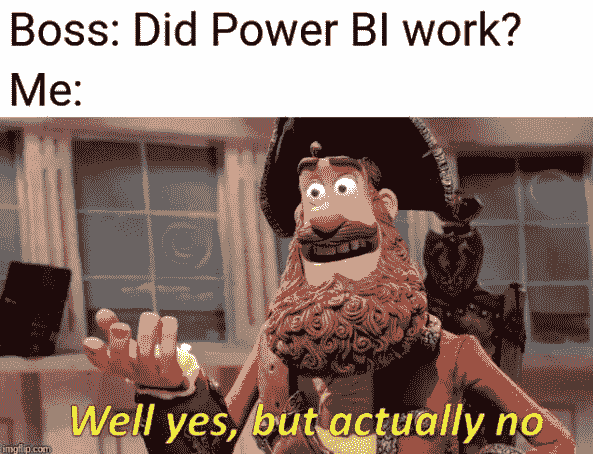

# 权力 BI:DAX 是什么？以及为什么你应该(或不应该)学习它

> 原文：<https://towardsdatascience.com/power-bi-what-is-dax-and-why-you-should-or-should-not-learn-it-1581aadbb038?source=collection_archive---------3----------------------->

# DAX 是什么？

DAX 代表数据分析表达式，它是由微软开发的语言，用于与各种平台(如 Power BI、PowerPivot 和 SSAS 表格模型)中的数据进行交互。它的设计简单易学，同时展示了表格模型的强大功能和灵活性。在某种程度上，你可以把它和 Excel 公式进行比较。使用 DAX 将真正释放 Power BI 的能力。

尽管我自己还远不是 DAX 专家，但我已经到了在日常工作中使用大量代码的地步，同事们也开始就此提出越来越多的问题。出于这个原因，我选择写这篇文章来解释为什么你应该(不应该)使用数据科学/数据分析工具箱中的这个工具。

Writing DAX in Power BI (image source: microsoft.doc.com)

# 为什么你应该学习 DAX

它开启了一个全新的世界

作为一名 Power BI 用户学习 DAX 很像是一名 Excel 用户，发现如何使用公式，你能够构建你的表格，添加一些图表，并点击 sum/average/…按钮(σ),但突然你会发现 VLOOKUP、IF 函数等等的世界。然而，这种比较并不完全有效，因为，或者至少在我看来，即使没有 DAX，Power BI 也已经是一个非常强大的工具，相比之下，Excel 中除了简单使用之外的任何东西都已经需要公式了。话虽如此，学习 DAX 将为你打开一个全新的 Power BI 世界。您将解锁的最重要的功能是能够以动态的方式选择、连接、过滤…数据。这意味着仪表板可以接受用户的输入，并使用它来动态生成计算列、度量和表。

**头痛少了**

不需要太多的经验就能达到你对着屏幕咒骂的地步，因为你的仪表板并没有给你你期望的结果。一旦你知道如何使用 DAX，你会惊讶地发现你可以避免或完全绕过(以某种黑客的方式)许多令人头痛的问题。一个非常简单的例子就是卡片小部件中的“空白”值。当在卡片中显示数字数据时，例如“收入”，如果您以没有收入显示的方式设置过滤器，它将返回“空白”。但是，显示“无收入”的更自然的方式应该是“0”而不是“空白”。通过一个非常简单的 DAX 表达式，您可以自己创建一个向公式添加“0”的度量，这意味着您将再也不会看到“空白”了。

这是一小段代码可以极大地改善用户体验的众多方式之一。

This must be relatable to some of you

**加速你的仪表盘**

你在 DAX 做得越好，你的仪表盘就越智能。通过使用 DAX，您可以创建更智能的计算列和/或度量，从而限制仪表板必须获取和可视化的数据。尽管一些 DAX 表达式可以测试数据引擎的限制，但是一个写得好的表达式可以加快速度，从而限制资源的使用。关于不使用 DAX 加速你的仪表盘的其他方法，你可以阅读我几个月前分享的这 5 个技巧。

**DAX 比力量 BI 多**

如果您愿意花时间学习 DAX，您新获得的技能不需要局限于 Power BI 环境。DAX 可用于表格形式的微软产品，如:

*   功率 BI
*   Microsoft Analysis Services
*   Microsoft Power Pivot for Excel

更不用说 DAX 语法也非常类似于 Excel 公式，这使得知识也可以转移到这个古老的、广泛使用的软件中。

**它让你成为更好的数据专家**

尽管 DAX 只能在支持它的环境中使用，但是知道如何使用 DAX 的技能远远超出了它的范围。由于 DAX 基于一个由不同的嵌套过滤器上下文组成的系统，性能是关键，它改变了您对表和过滤数据的思考方式。通过在早上编写一段智能的 DAX 代码，您可能能够提高下午早些时候编写的一些 Python 代码的性能。换句话说，通过学习 DAX，你将改进如何有效地合并、过滤、选择和操作数据的思维方式。

# 为什么你不应该学习达克斯

虽然我很乐意学习 DAX，并且我刚刚列出了一些令人信服的理由来说明为什么你应该开始使用它，但是我必须补充一点，DAX 并不适合所有人。以下是为什么学习 DAX 不应该是你的优先事项的一些原因:

**陡峭的学习曲线**

一夜之间完全理解 DAX 是不可能的。尽管您可以很快开始编写一些基本代码，但理解不同的过滤器上下文如何交互等肯定需要时间。(这是我仍然时常纠结的一件事)。你需要自己决定你会使用它多少，看看是否值得付出努力。

**你可以用替代品做很多事情**

在 DAX 中，甚至在您的数据最终出现在一个小部件中之前，就有可能进行大量的数据操作。对于任何不需要动态生成的东西，有很多选择。例如，使用 Python 可以很容易地向仪表板添加一些新的额外列。

**仪表盘对外人来说可能变得晦涩难懂**

将 DAX 添加到仪表板会增加复杂性。如果你是唯一一个构建或操作仪表板的人，这应该不是问题，但是对于那些在团队中工作的人来说，这可能会使事情变得复杂。我亲身经历了不熟悉这种语言的同事在使用 DAX 混淆导致的仪表板操作时陷入困境。

简化事情的愿望不应该是停止前进的好理由，但这是您在 Power BI 中采取下一步措施时应该考虑的事情。

**80/20 法则**

帕累托原则或 80/20 法则指出，用 20%的努力可以实现 80%的结果，反之亦然。死硬的 DAX'ers 会不高兴看到这一点，但我相信 80%可以做到没有 DAX。Power BI 是一个强大的工具，即使初学者也可以创建有用的仪表板和洞察力。当然，更高级的仪表板将绝对依赖于 DAX 的大分区，但许多仪表板相当简单，无需大量代码即可满足用户需求。这意味着，对于许多 Power BI 用户来说，这项投资根本不值得。在当今自由职业平台、24/7 连接、数字游牧者等等的世界中，将你的 DAX 部分外包给专业人士可能更容易。

# 从哪里开始学习 DAX

好吧，看来我已经说服你潜入达克斯的世界了。这是个好消息，因为更大的社区有益于任何软件环境。此时，您可能想知道从哪里开始；当然，学习 DAX 很有挑战性，但并不复杂*本身*。理解这些概念需要时间和努力，但你也不需要计算机科学博士学位就可以开始。

别担心，我不会给你推荐一些昂贵的在线课程。与大多数(如果不是全部)编程语言一样，有大量的免费资源、文档、视频和在线社区可以教你所有需要知道的东西。我经常访问的一些有用资源是:

*   [电力毕社区](https://community.powerbi.com):来源:)
*   立方体中的家伙:惊人的 YouTube 频道，有大量的教程
*   [r/PowerBI](https://www.reddit.com/r/PowerBI/) : Power BI 的子编辑
*   [DAX 官方文档](https://docs.microsoft.com/en-gb/dax/index)
*   [https://dax.guide](https://dax.guide/) :一些更棒的文档
*   [DAX 格式化程序](https://www.daxformatter.com):使 DAX 代码更具可读性的免费工具

最后，除了这些免费资源，我强烈推荐阅读 Marco Russo 和 Alberto Ferrari 的 DAX 权威指南，它可以被认为是语言的圣经。

好了，现在你知道了，我希望这篇文章能帮助你决定是否要深入 DAX 的世界，如果是，你可以从哪里开始。

**关于作者** *:我叫布鲁诺，是总部位于荷兰的人工智能技术纵向扩展公司*[*dash mote*](http://www.dashmote.com/?source=post_page---------------------------)*的一名数据科学家。我们的目标是借助基于人工智能的解决方案，弥合图像和数据之间的鸿沟。
查看我在* [上的其他作品 https://www.zhongtron.me](https://www.zhongtron.me/) 。