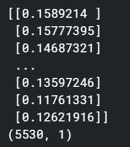
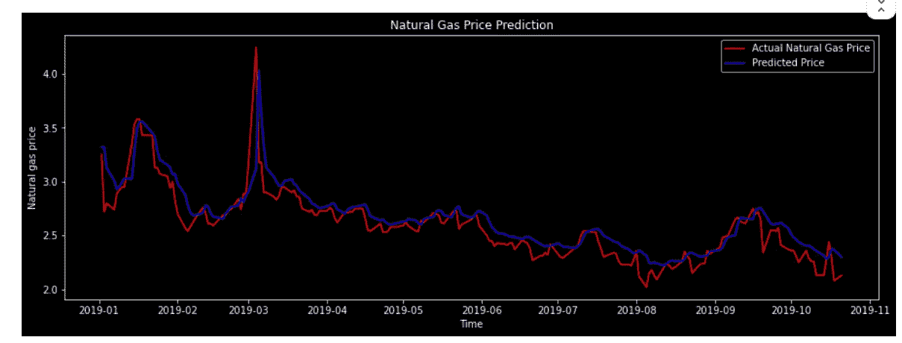

# 基于神经网络的天然气价格预测&分类用例

> 原文：<https://towardsdatascience.com/power-of-xgboost-lstm-in-forecasting-natural-gas-price-f426fada80f0?source=collection_archive---------6----------------------->

## 由连续价格和价格运动方向解决的预测问题

## **回归时序分析&分类用例**


Image by author

【https://sarit-maitra.medium.com/membership 号

F 时间序列预测是一项困难的任务，尤其是当我们处理股票数据的随机价格序列时。这里的随机指的是真正意义上的混沌，带有非平稳性。此外，由于股票数据的复杂性，开发有效的预测模型非常困难。然而，回报确实表现出某种可预测性和现代 ML 技术的应用，有效的特征工程有助于推动预测股票回报的极限。

在这里，我将使用机器学习算法在历史价格记录上训练我的机器，并预测预期的未来价格。让我们看看我们的算法能预测多准确。我将使用回归用例，并通过实现 LSTM 来解决问题；随后，将使用分类用例通过应用各种分类算法来解决问题。

我使用的是天然气每日现货价格，可在[https://www.eia.gov/dnav/ng/hist/rngwhhdM.htm](https://www.eia.gov/dnav/ng/hist/rngwhhdM.htm)获取。因此，我们上传数据并做一些处理来清理数据，使数据为机器学习做好准备。


数据集从 1997 年 1 月 7 日到 2019 年 10 月 21 日，有 5732 个数据点。

# 数据准备


我们需要检查数据集中是否存在任何 NaN 值，如果存在，需要修复或删除以便机器理解。在这里，我用以前的值填充了缺少的值。


我们确保最终数据集中不存在缺失值。

```
df.plot(figsize=(10, 5))
plt.title('Daily Natural Gas Spot Prices', fontsize=12)
plt.ylabel('Dollars per Million Btu', fontsize=12)
plt.show()
```


# 数据质量检查


# **技术指标**

技术指标是基于“气价”的数学计算。通过分析历史数据，我们可以使用指标来预测未来的价格走势。一些众所周知的技术指标如下—


移动平均线收敛-发散(MACD)比较价格的两个移动平均线。第一条移动平均线是 26 天指数移动平均线(EMA)，第二条移动平均线是 12 天 EMA。从 12 日均线中减去 26 日均线。

布林线由基于标准差的上下波段组成，随着波动性收缩和扩大。波段是分析趋势强度和监控反转何时发生的有用工具。标准偏差通常设置为 2.0，决定了波段的宽度。标准差越高，价格越难达到上限或下限。标准差越低，价格越容易突破波段。

计算 MACD 的公式是:

> MACD = EMA12(价格)EMA26(价格)
> 
> 上限= 21 天 SMA + (21 天价格标准差 x 2)
> 
> 较低波段= 21 天 SMA-(21 天价格标准差 x 2)


因此，这样我们就创建了 10 个可以用来预测未来价格的特征。然而，我们不会在我们的用例中使用所有这些特性。我们的数据量很小，我们需要使用一种简单的技术来获得最好的输出。

让拟合预处理和拟合原始单变量价格序列到 LSTM 网络。我们最初的单变量序列如下:


## 将数据分成训练集和测试集:

我们将 2018 年 12 月 31 日作为训练集，其余时间作为测试集。因此，我们将根据 21 年的数据(5530 个数据点)训练我们的模型，以测试(202 个数据点)并验证我们开发的模型可以预测的精确度。

显然，我们想知道如何确保模型在投入生产时表现良好，并看到前所未见的数据。这里，在没有用于训练预测模型的数据集上的测试性能是样本外性能。这些结果被认为代表了模型投入生产时的预期。出于模型的目的，我们将对数据集训练和测试进行分区。下面我们将我们的系列分成训练/测试样本。


## 可视化训练/测试分割:

```
ax = train_data.plot(figsize=(10, 5))
test_data.plot(ax=ax, color='r')
plt.legend(['train', 'test']);
```


## 数据标准化

我们缩小范围(0，1)中的值，并对数据进行归一化。在缩放时，我们将测试和训练数据相对于训练数据进行标准化，因为在此阶段我们无法访问测试数据。

```
scaler = MinMaxScaler(feature_range = (0,1))
train_data_scaled = scaler.fit_transform(train_data)
print(train_data_scaled); print(train_data_scaled.shape)
```



让我们创建一个具有 60 个时滞和 1 个输出的数据结构。目标是允许我们的网络回顾 60 个时间步，以预测下一步(61)。因此，每次网络预测输出时，它都检查前 60 个时间步，这是我们的回顾时间周期。

```
X_train = []
y_train = []for i in range(60, len(train_data_scaled)):
    X_train.append(train_data_scaled[i-60:i,0])
    y_train.append(train_data_scaled[i,0])X_train, y_train = np.array(X_train), np.array(y_train)
print(X_train); print(); print(y_train)
```


我们需要重塑数据；张量接受 3D 形状(batch_size，timesteps，input_dim)。

```
X_train = np.reshape(X_train, (X_train.shape[0], X_train.shape[1], 1))
print(X_train.shape); print(); print(X_train)
```

现在，我们准备初始化 RNN 架构并构建模型。

# 递归神经网络

LSTM 细胞可以记住任意时间间隔内的数值，并产生 LSTM 记忆。存储器由三个不同的门处理:(1)输入门，(2)遗忘门，和(3)输出门。下面的等式表达了单个 LSTM 的计算过程


```
model = tf.keras.Sequential()# adding 1st LSTM layer and some dropout regularization
model.add(tf.keras.layers.LSTM(units=50, input_shape=(X_train.shape[1], 1), return_sequences=True, activation = 'relu'))
model.add(tf.keras.layers.Dropout(0.2))# adding 2nd LSTM layer and some dropout regularization
model.add(tf.keras.layers.LSTM(units=50, return_sequences=True))
model.add(tf.keras.layers.Dropout(0.2))# adding 3rd LSTM layer and some dropout regularization
model.add(tf.keras.layers.LSTM(units=50, return_sequences=True))
model.add(tf.keras.layers.Dropout(0.2))# adding 4th LSTM layer and some dropout regularization
model.add(tf.keras.layers.LSTM(units=50))
model.add(tf.keras.layers.Dropout(0.2))# adding output layer
model.add(tf.keras.layers.Dense(units=1))#compiling RNN
model.compile(loss='mean_squared_error', optimizer='adam')early_stopping = EarlyStopping(monitor='loss', patience=10)# fitting RNN on training set
model.fit(X_train, y_train, epochs= 100, batch_size=32, 
          verbose=2, callbacks=[early_stopping])
```

默认的 sigmoid 激活函数用于 LSTM 模块。该网络被训练 100 个时期，并且使用 32 的批量大小。一旦模型合适，我们就可以估计模型在训练和测试数据集上的性能。

为了更好地显示，下面的消息被截断。


让我们得到 2019 年的预测天然气价格；我们需要将训练集中的前 60 条记录追加到测试集中

```
dataset_total = pd.concat((train_data, test_data), axis=0)
print(dataset_total)
dataset_total = pd.concat((train_data, test_data), axis=0)inputs = dataset_total[len(dataset_total) - len(test_data)- 60:].values
inputs = inputs.reshape(-1,1)
inputs = scaler.transform(inputs) # transforming input dataX_test = []
y_test = []for i in range (60, 262):
    X_test.append(inputs[i-60:i, 0])
    y_test.append(train_data_scaled[i,0])

X_test, y_test = np.array(X_test), np.array(y_test)
X_test = np.reshape(X_test, (X_test.shape[0], X_test.shape[1], 1))
pred_price = model.predict(X_test)
pred_price = scaler.inverse_transform(pred_price)
print(pred_price)
```


```
a = pd.DataFrame(pred_price)
a.rename(columns = {0: 'Predicted'}, inplace=True); 
a.index = test_data.index
compare = pd.concat([test_data, a],1)
compare
```


```
plt.figure(figsize= (15,5))
plt.plot(compare['gas price'], color = 'red', label ="Actual Natural Gas Price")
plt.plot(compare.Predicted, color='blue', label = 'Predicted Price')
plt.title("Natural Gas Price Prediction")
plt.xlabel('Time')
plt.ylabel('Natural gas price')
plt.legend(loc='best')
plt.show()
```



然而，如下所示，我们的得分指标并不令人印象深刻，我们还有改进的空间。我们需要重新访问数据、选定的特征、选择正确的超参数，还需要更新的数据。

```
test_score = math.sqrt(mean_squared_error(compare['gas price'], compare.Predicted))
print('Test Score: %.2f RMSE' % (test_score))
# Explained variance score: 1 is perfect prediction
print('Variance score (test): %.2f' % r2_score(test_data, pred_price))
```


# 分类用例

对于分类用例，让我们创建一些滞后序列，如下所示。

```
k = df.copy()lags = 5
# Create the shifted lag series of prior trading period close values
for i in range(0, lags):
    k["Lag%s" % str(i+1)] = k["gas price"].shift(i+1).pct_change()k['price_diff'] = k['gas price'].diff()
k['ret'] = k['gas price'].pct_change()
k.head()
```


## 目标变量:

这里的目标是根据前 N 天的信息预测(t+1)值。因此，定义输出值为*“target”*，这是一个二进制变量，在明天的价格差>今天的时候存储 1。

```
# positive value = 1, otherwise, 0
k["target"] = np.where(k['price_diff']> 0, 1.0, 0.0)
k.head()
```


这里，为了简单起见，我们将只使用 2 个 lags 和返回值。

```
x = k[['Lag1', 'Lag2', 'ret']].dropna()
y = k.target.dropna()# # Create training and test sets
gkcv = GapKFold(n_splits=5, gap_before=2, gap_after=1)"""
Introduced gaps between the training and test set to mitigate the temporal dependence.
Here the split function splits the data into Kfolds. 
The test sets are untouched, while the training sets get the gaps removed
"""for tr_index, te_index in gkcv.split(x, y):
    xTrain, xTest = x.values[tr_index], x.values[te_index];
    yTrain, yTest = y.values[tr_index], y.values[te_index];

print('Observations: %d' % (len(xTrain) + len(xTest)))
print('Training Observations: %d' % (len(xTrain)))
print('Testing Observations: %d' % (len(xTest)))
```


# 分类模型:

```
# Create the models
print("Accuracy score/Confusion Matrices:\n")
models = [("LR", LogisticRegression()),
          ("LDA", LinearDiscriminantAnalysis()),
          ("QDA", QuadraticDiscriminantAnalysis()),
          ("LSVC", LinearSVC()),
          ("RSVM", SVC(C=1000000.0, cache_size=200, class_weight=None,
                       coef0=0.0, degree=3, gamma=0.0001, kernel='rbf',
                       max_iter=-1, probability=False, random_state=None,
                       shrinking=True, tol=0.001, verbose=False)),
          ("RF", RandomForestClassifier(
              n_estimators=1000, criterion='gini',
              max_depth=None, min_samples_split=2,
              min_samples_leaf=1, max_features='auto',
              bootstrap=True, oob_score=False, n_jobs=1,
              random_state=None, verbose=0))]
# iterate over the models
for m in models:
    # Train each of the models on the training set
    m[1].fit(xTrain, yTrain)
    # array of predictions on the test set
    pred = m[1].predict(xTest)
    # Accuracy score and the confusion matrix for each model
    print("%s:\n%0.3f" % (m[0], m[1].score(xTest, yTest)))
    print("%s\n" % confusion_matrix(pred, yTest))
```


这里，虽然随机森林有 51.9%的准确率，但对真阳性和真阴性的分类相对较好。因此，我们将为现有用例考虑随机森林。

```
rfc = RandomForestClassifier(
              n_estimators=1000, criterion='gini',
              max_depth=None, min_samples_split=2,
              min_samples_leaf=1, max_features='auto',
              bootstrap=True, oob_score=False, n_jobs=1,
              random_state=None, verbose=0).fit(xTrain, yTrain)pd.set_option('float_format', '{:f}'.format)train_pred = rfc.predict(xTrain)
rmse = np.sqrt(mean_squared_error(yTrain, train_pred))
print("RMSE_train: %f" % (rmse))
print('Train prediction values:')
train_pred = pd.DataFrame(train_pred); 
train_pred.rename(columns = {0: 'TrainPrediction'}, inplace=True); 
print(train_pred);print()pd.set_option('float_format', '{:f}'.format)
test_pred = rfc.predict(xTest)
print('Test prediction values:')
test_pred = pd.DataFrame(test_pred)
test_pred.rename(columns = {0: 'TestPrediction'}, inplace=True); 
actual = pd.DataFrame(yTest)
actual.rename(columns = {0: 'Actual PriceDiff'}, inplace=True); 
compare = pd.concat([actual, test_pred], 1)
print(compare)
```


# 摘要

在这里，我们看到了如何在同一数据集上使用回归和分类来解决预测问题。虽然我们只使用 LSTM 回归用例，但是，这也可以与其他算法进行比较，如线性回归或弹性网络等。

***我可以到达*** [***这里的***](https://www.linkedin.com/in/saritmaitra/) ***。***

*免责声明:*所有此类使用风险自负。