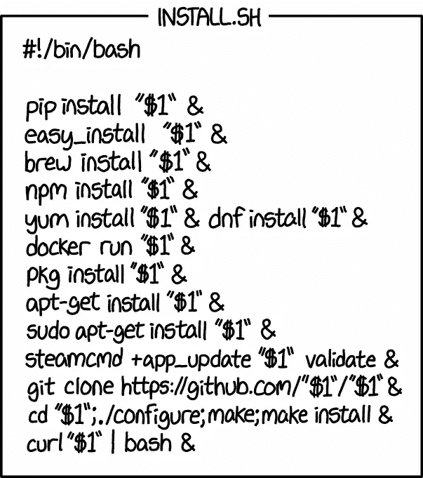
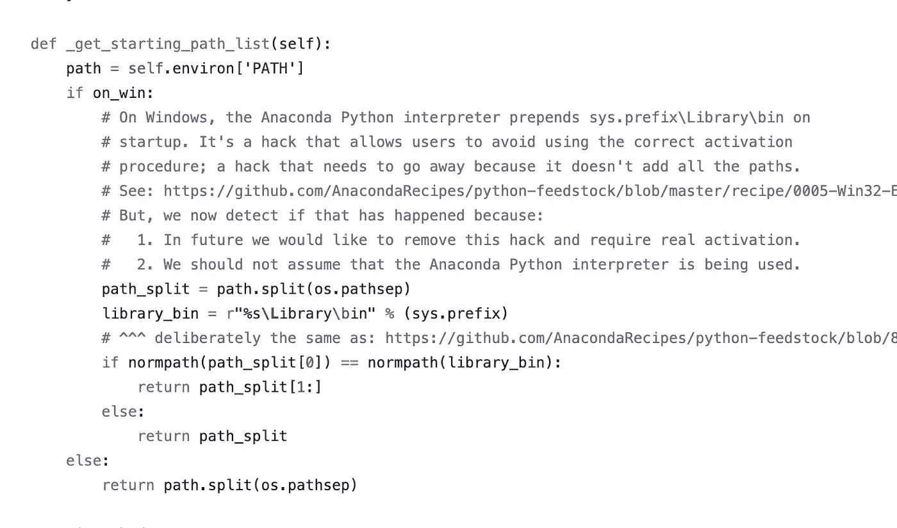
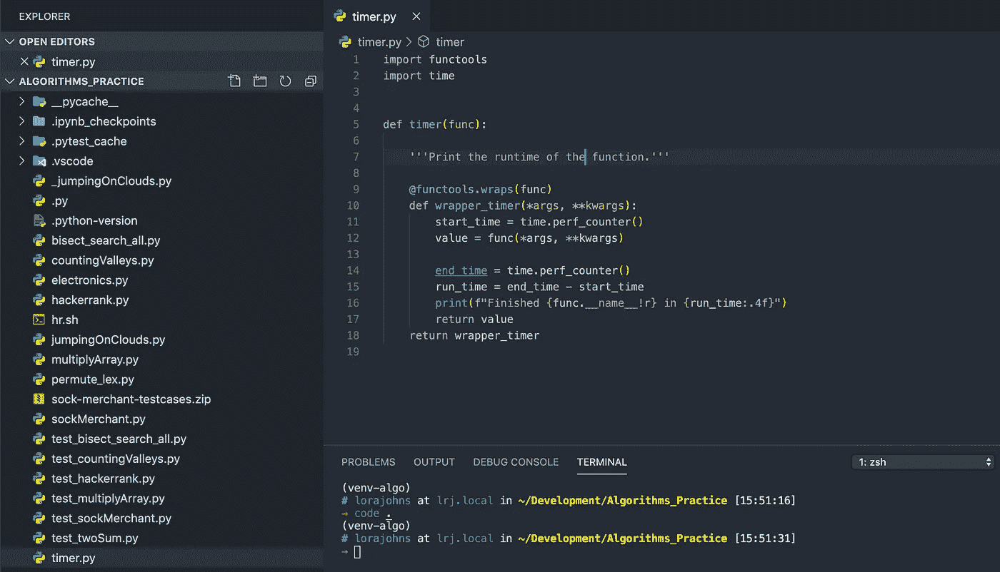
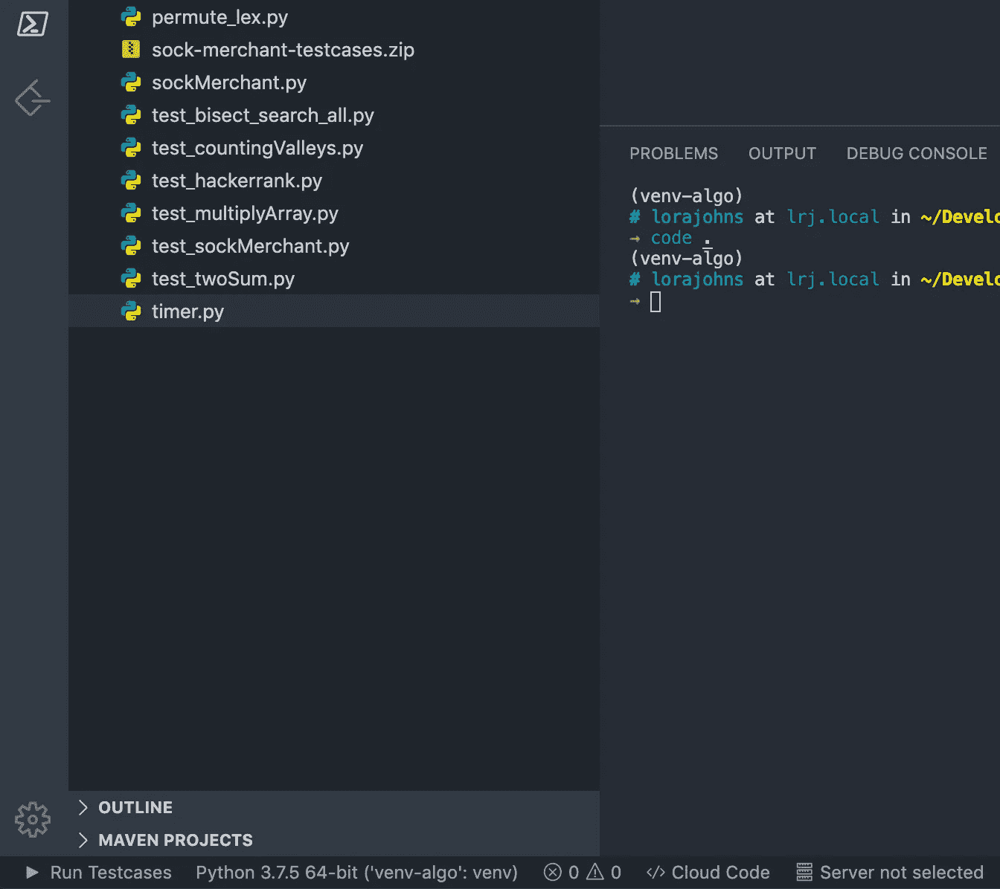
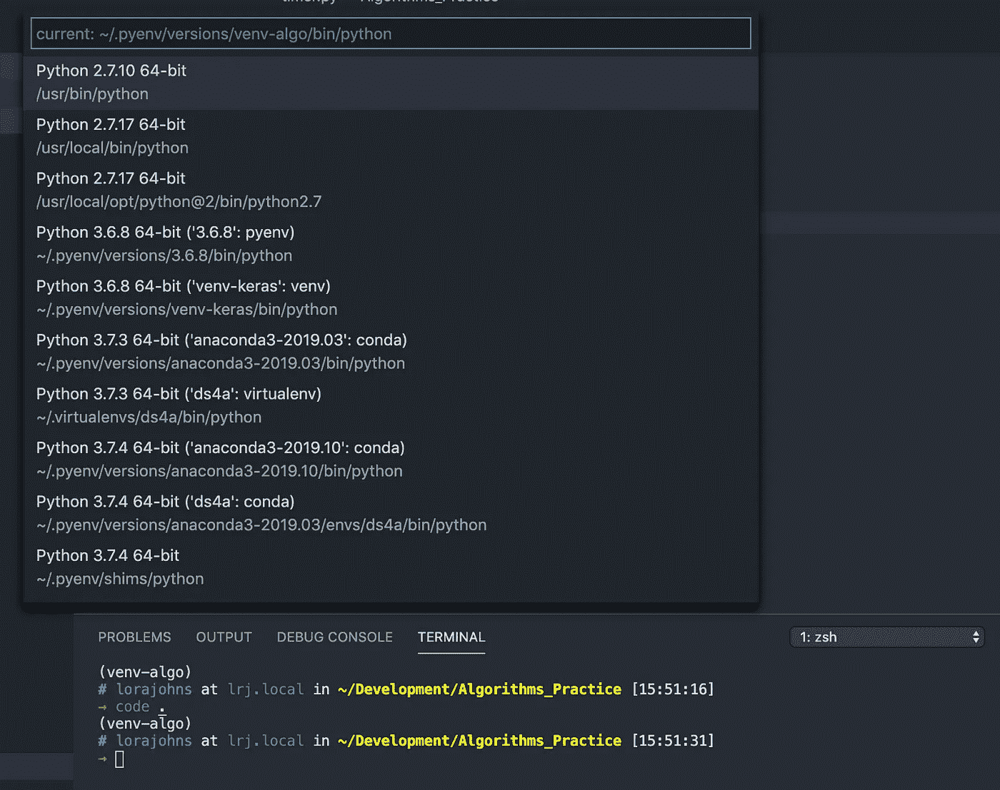
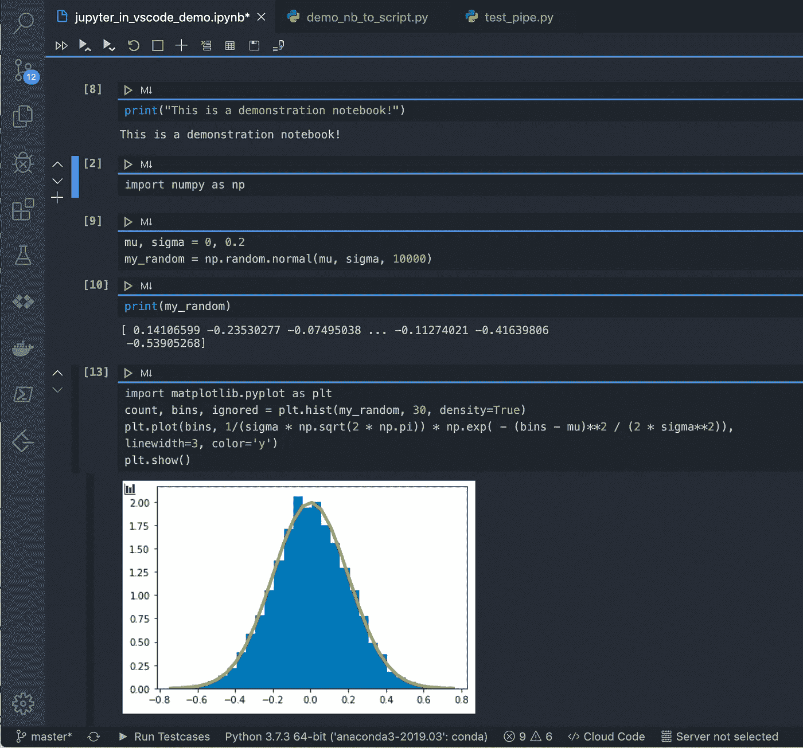
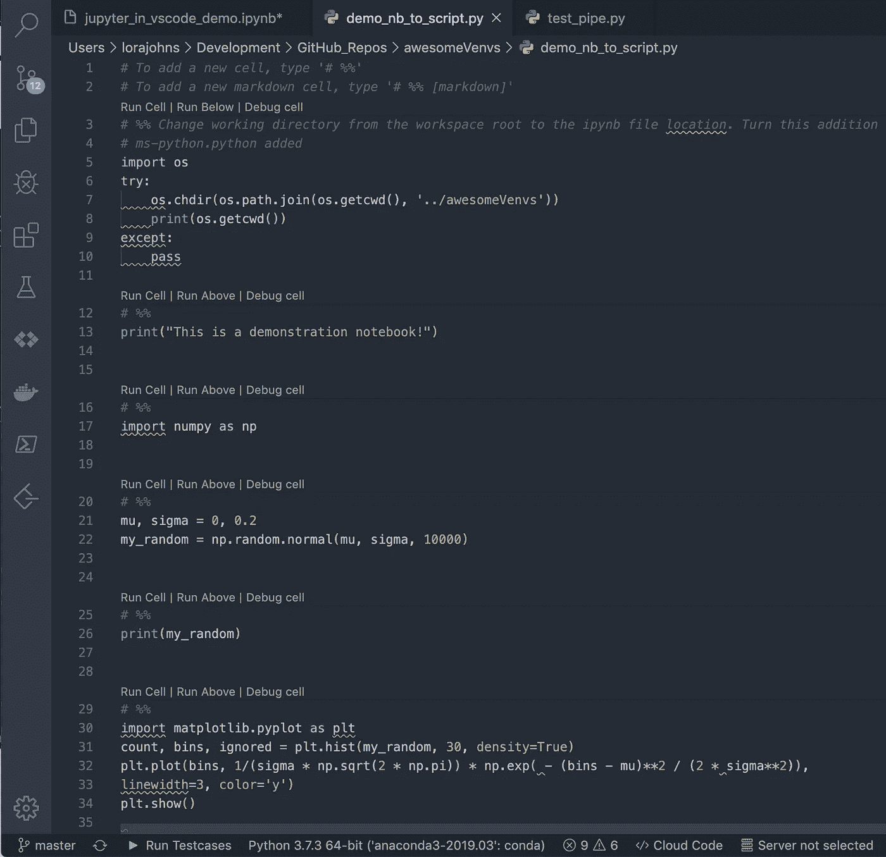

# 使用 Visual Studio 代码启动您的 Python 项目

> 原文：<https://towardsdatascience.com/power-up-your-python-projects-with-visual-studio-code-401f78dd97eb?source=collection_archive---------2----------------------->

## 用 Visual Studio 代码设置几乎自动化的 Python 虚拟环境，创建 Jupyter 笔记本和更多内容。

# 为什么在数据科学中使用虚拟环境？

我们知道依赖管理对于包开发和软件开发人员的重要性。但是对于那些没有被部署到 PyPI 或 conda-forge 的从事数据科学的人来说呢？

## 虚拟环境可以帮助你修复坏掉的东西。

如果您使用 Python 已经有一段时间了，那么您会对安装了太多包的混乱开发环境感到沮丧。您不需要一次全部用到它们，并且试图找出哪些是您的项目所必需的，手工操作是令人沮丧的。

软件包并不总是在同一时间升级，许多软件包彼此不兼容，甚至与您正在运行的 Python 或 Anaconda 版本不兼容。来自 conda 内部不同渠道的包甚至不能保证不冲突。如果你把所有东西都下载到同一个大环境中，不可避免的是，你会以不一致的依赖关系结束，事情*会*崩溃。

this is not wise.

更不用说各种工具，如 pip、pipx、conda、poeties、hatch、pipenv、pyenv、virtualenv、pyvenv、pyenv-virtualenv、virtualenvwrapper、pyenv-virtualenvwrapper 和 venv……尽管听起来非常相似，但往往彼此不兼容。

## 如果您使用 Anaconda，这是您的项目何时中断的问题，而不是是否中断的问题。

不在容器外使用 anaconda 的另一个原因是——您不知道自己在运行什么。在[一些奇怪的案例](https://github.com/AnacondaRecipes/aggregate/issues/151)中，anaconda 的激活脚本严重破坏了 pyenv 之前的系统环境清理，唯一快速解决这个问题的方法是在. zshrc 前面加上`HOST=$(hostname)`

I feel confident running this code in my user root directory, don’t you?

## 虚拟环境有助于数据科学的再现性。

Python 有一个很棒的开源社区，但这也意味着各种工具和方法的激增。

如果你提供你在科学分析中使用的库的精确版本，你的结果将更可验证。事实上，这种依赖性管理在责任性和准确性方面可以发挥至关重要的作用。有时，Python 包中的错误被证明是统计模型中计算错误的根本原因。重要的是能够追踪您是否使用了错误的包，以便您可以在必要时验证或纠正您的结果。

能够为一个给定的项目冻结你的需求——*并且只*那些真正是需求的包——并且提供它作为一个环境文件以备将来参考，会让你成为一个更好的合作者和科学家。您将确切地知道您的模型使用了什么，何时使用，以及为什么使用。

## 将 pyenv 与 pyenv-virtualenv 结合使用可以让您安全地管理 python 安装

我已经写了一个(完全不全面，保证会崩溃)[的指南，在这里用 pyenv 和 pyenv-virtualenv 设置你的系统](https://medium.com/swlh/a-guide-to-python-virtual-environments-8af34aa106ac)。这是我最喜欢的管理多个安装的方法，因为它:

*   干净、灵活且可逆
*   抵抗用户错误
*   防止蟒蛇破坏我的环境的有效措施

如果你不想读完整本书，我把它浓缩成了一张备忘单:

 [## lorarjohns/awesomeVenvs

### 安装并运行 Anaconda 卸载程序 conda install Anaconda-clean & & Anaconda-clean-yes 找到剩余的目录…

github.com](https://github.com/lorarjohns/awesomeVenvs/blob/master/pyenv_cheat_sheet.md) 

我还使用 [Arq 云备份](https://www.arqbackup.com/arqcloudbackup/)，它的工作方式类似于 git，而且非常便宜，几乎是自动化的，在用这种方法建立新系统之前，我可以保护重要的文件。对于我想更直接访问的 Zotero、dotfiles 和较小的文件，我使用 [Sync](http://www.sync.com/get-started?_sync_refer=22dfdd050) (本质上是一个端到端加密的、符合 GDPR 标准的 Dropbox)。

# 包含 pyenv 和 Visual Studio 代码的集成开发环境

设置好 pyenv 安装后，您可以为虚拟环境中的数据科学开发创建一些非常酷的工作流。让我们用 Anaconda 发行版创建一个项目，看看如何使用 Visual Studio 代码开发 Jupyter 笔记本并将其转换为。py 脚本

每个项目都应该有一个目录，每个目录都应该有一个虚拟环境。这个结构做两件重要的事情:

1.  它可以让你的东西有条不紊，这样就更容易把项目分开，管理依赖关系，把不该放在那里的东西挡在外面。(谁喜欢撤销 git 提交？)
2.  它允许您为每个目录(因此也为每个项目)创建一个单独的`.python-version file`，**，*这意味着当您更改目录时，pyenv-virtualenv 可以自动切换到适合您的环境。***

这里是**TL；项目设置的 DR** 版本:

1.  制作一个项目文件夹，并将`cd`放入其中
2.  用`pyenv local $PYTHON_VERSION`设置你的项目 Python
3.  运行这个命令(例如)来创建一个虚拟环境:`pyenv virtualenv anaconda3–2019.10 venv-cool_project` 如果您忽略 Python 版本，您的环境将使用当前在本地有效的版本。
4.  通过使用 venv 的名称执行`pyenv local`，激活您的新环境并将其设置为项目的本地 Python，并使用(例如)`conda activate venv-cool_project`激活环境

如果您在每次创建新项目时都运行下面的一行程序，您应该能够`cd`进出目录，并让您的虚拟环境自动激活和停用。(当然，您需要更改环境名称和 Python 解释器。)

$ mkdir $2 && cd $2 && pyenv local $1 && pyenv virtualenv venv-$2 && pyenv local venv-$2 && pyenv activate venv-$2

这里有一个 GitHub 要点和一个脚本可以帮你做到。下载它(你可能需要运行`chmod +x newproj.sh`来确保它是可执行的)。然后，通过向它传递您想要使用的 python 版本和项目名称，就可以使用它来创建新项目:

now you really have no excuse not to use venvs.

# 通过 Python 和 Jupyter 使用 Visual Studio 代码

[Visual Studio 代码](https://code.visualstudio.com/docs/languages/python)可以做很多很酷的花样。首先，如果您按照上面的说明进行设置，它可以自动为您的项目目录选择正确的虚拟解释器。

`brew cask install visual-studio-code`上手。

然后，进入 VS 代码的设置:

*   确保系统的终端与应用程序的终端同步:告诉 VS 代码使用带有“外部”变量的操作系统终端应用程序。
*   打开集成终端功能，该功能允许您在 VSCode 应用程序中使用终端模拟器。

VS Code user settings for integrated terminal and iTerm.app on macOS

*   用`⌘+⇧+P`打开命令面板，选择`Shell Command: Install 'code' command in PATH`。这允许您从外部终端启动 VS 代码:`code --`启动应用程序，`code .`打开当前工作目录，`code path/to/file/or/dir`打开特定文件或目录。

one of my project directories, with an integrated terminal

*   为 VS 代码安装 [Python 扩展](https://marketplace.visualstudio.com/items?itemName=ms-python.python)。一旦启用，只要你用 python 扩展名保存了一个文件，编辑器就会知道它应该在 Python 上下文中被解释。

您会注意到，当您在集成终端中 cd 进入和退出项目目录时，python 解释器将自动检测您的 venvs，只要有一个`.python-version`文件存在(如果您正确使用 pyenv-virtualenv，应该有)。

The name of the detected virtual environment, in the lower left-hand corner

您还可以通过点击底部工具栏中的 Python 解释器名称，或者打开命令面板并键入`Python: Select Interpreter`，明确地告诉应用程序使用哪个 Python 解释器。

A list of available interpreters/environments and their paths

因为我们在一个终端，我们也可以创建和激活新的 venvs，就像我们通常在这里做的那样。

## 创建 Jupyter 笔记本

要使用笔记本，只需在 conda 环境中打开一个`.ipynb`文件或从命令面板中选择`Python: Create New Blank Jupyter Notebook`即可。然后，您可以像往常一样运行单元和创建笔记本，但额外的好处是您不依赖于您的 web 浏览器。

a jupyter notebook in a conda virtual environment in vscode

你也可以一键将笔记本快速转换成 Python 脚本，或者使用`Python: Convert to python script`:

notebook converted to a script

这对于将探索性分析转化为可运行的、可再现的程序来说非常方便。

# 满怀信心地完成伟大的项目

现在，当您开始一个项目时，您将能够在您的开发环境中控制包，轻松地将 conda envs 转换成 requirements.txt 文件，并更高效地将您的笔记本整理成适合生产的脚本。VS Code 提供了更多的工具，比如语法高亮、代码林挺、测试集成，以及与 GitHub、Docker、各种数据库等的接口，来增强你的项目。将这些工具添加到您的数据科学工作流程中，成为更高效的程序员和开发人员。