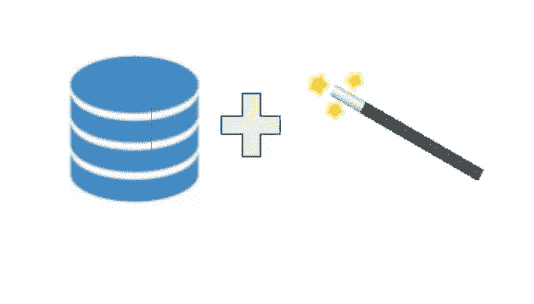
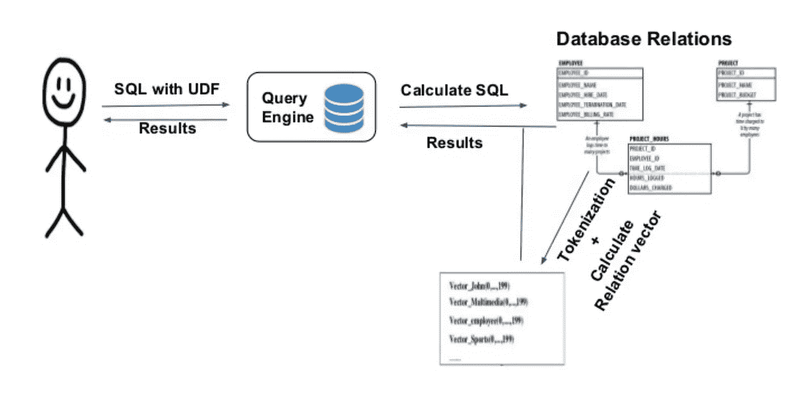
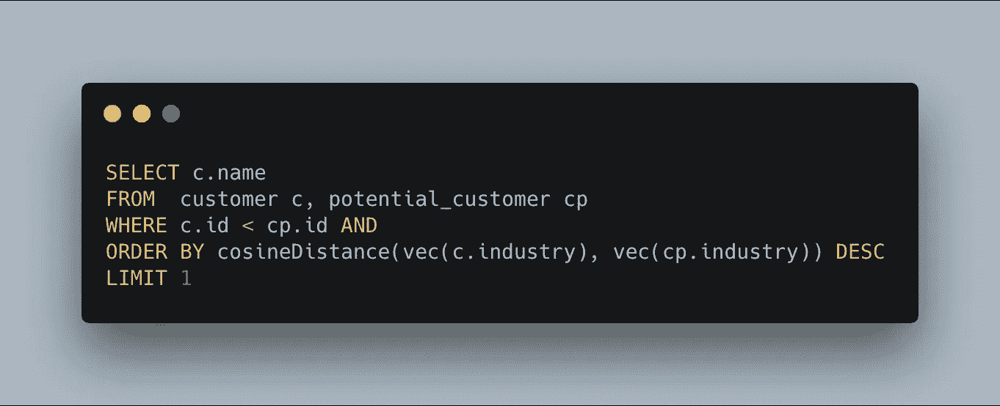
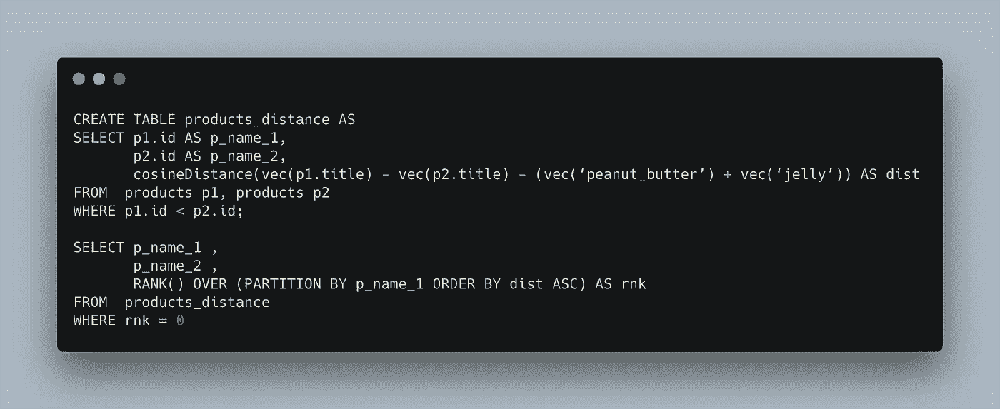
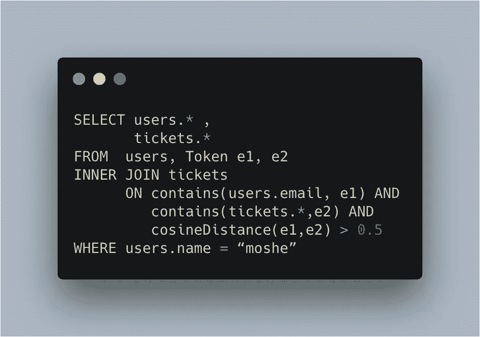

# 用机器学习能力驱动 SQL

> 原文：<https://towardsdatascience.com/powering-sql-with-machine-learning-capabilities-24eba7d0914c?source=collection_archive---------17----------------------->

# 使用单词嵌入在 SQL 中启用语义查询

Photo by [Nathan Dumlao](https://unsplash.com/@nate_dumlao?utm_source=unsplash&utm_medium=referral&utm_content=creditCopyText) on [Unsplash](https://unsplash.com/s/photos/similar?utm_source=unsplash&utm_medium=referral&utm_content=creditCopyText)

当今世界，对机器学习的需求越来越大。这导致了巨大的努力来减少这些任务所需的技能/努力。最有希望的策略之一是将这些功能整合到标准 SQL 中，它始于 Oded Shmueli [论文](https://arxiv.org/abs/1712.07199)，并在[弹性搜索](https://github.com/gyang274/visual-search)和 [PostgreSQL](https://github.com/guenthermi/postgres-word2vec) 中得以实现。

为了在 SQL 中启用这些功能，我们需要向数据库实体(行/列/表)插入实际的语义。我们通过将单词嵌入向量合并到我们数据库中来做到这一点。因此，我们可以询问诸如“显示与此行相似的所有行*这是标准 SQL 无法做到的。*

我们需要在数据库中变得神奇的是以正确的方式加入单词嵌入。

All we need to get magic in our database is to incorporate word embedding in the right way

# 它是如何工作的

为了量化数据库内部的语义关系，除了所有数据库关系之外，还需要一种以某种方式表示它们的语义的方法。

嵌入是一种将序列映射到数字向量空间的技术，其中向量表示相关序列的各个方面(嵌入使用的是 [word2vec](https://medium.com/towards-artificial-intelligence/an-intuitive-introduction-of-word2vec-by-building-a-word2vec-from-scratch-a1647e1c266c) )。提出的解决方案是构建数据库实体的嵌入，以表示它们的语义，然后访问这些向量(通过用户定义的函数)并比较它们的接近度(通过用户定义的函数)。

下图描述了查询执行的主要阶段:

We start by getting a SQL query with UDFs from the user and executing it, to execute the query the sentences are tokenized and the relational vectors are calculated and returned to the user.

因此，我们将通过允许使用以下 UDF 量化数据库内部的语义关系来增强查询:

*   **余弦距离(a，b)** 取向量 a，b 返回它们的余弦距离。
*   **vec(token)** 接受一个令牌并返回其相关向量。
*   **令牌实体 e** 声明了一个可以绑定到令牌的变量。
*   **Contain(row，entity)** 声明实体必须绑定到 tokenizing row 生成的 token。

# 它增加了什么功能

我之前展示的那些构建模块将允许进行高级查询，首先，我们可以运行“语义相似性查询”。

例如*“按行业查找与潜在客户(语义)最相似的客户”。*

We find all pairs of products a,b (only once per pair) and order those by similarity.

回想一下单词嵌入也支持归纳推理(经典[国王之于男人就像女王之于？](https://blog.acolyer.org/2016/04/21/the-amazing-power-of-word-vectors/))，换句话说，我们可以计算类比。

例如，*“*找到所有与自己相关的产品 a、b 对，就像花生酱与果冻的关系*”。*

First, we create a table with product names and the distance between them and the jelly/peanut butter vector. Afterward, we find all pairs of products a,b which relate close (from distance perspective) to themselves as peanut butter relates to jelly.

对数据库实体(如列、行甚至表)进行模糊连接的另一组新功能。在许多用例中，人们希望在不确切知道列/表需要使用什么的情况下运行查询。

例如，“在票证和用户之间给定未知模糊外键的情况下，查找用户‘Moshe’的所有票证”。

First, we declare two tokens e1, e2 that represent in our database and in our use case unknown column. Afterward, we find all the users called Moshe and find their tickets, since we don’t know the join columns on the ticket table we try to join on every column and keep those with small similarities. Note: we could enforce a 1:1 relation with rank with the distance ordered.

# 定论

这是向赋予数据库系统机器学习能力的一步。这些功能适用于各种各样的应用程序(包括数据集成、搜索等等)。

我希望你觉得有趣和有用，我愿意接受任何建设性的反馈。