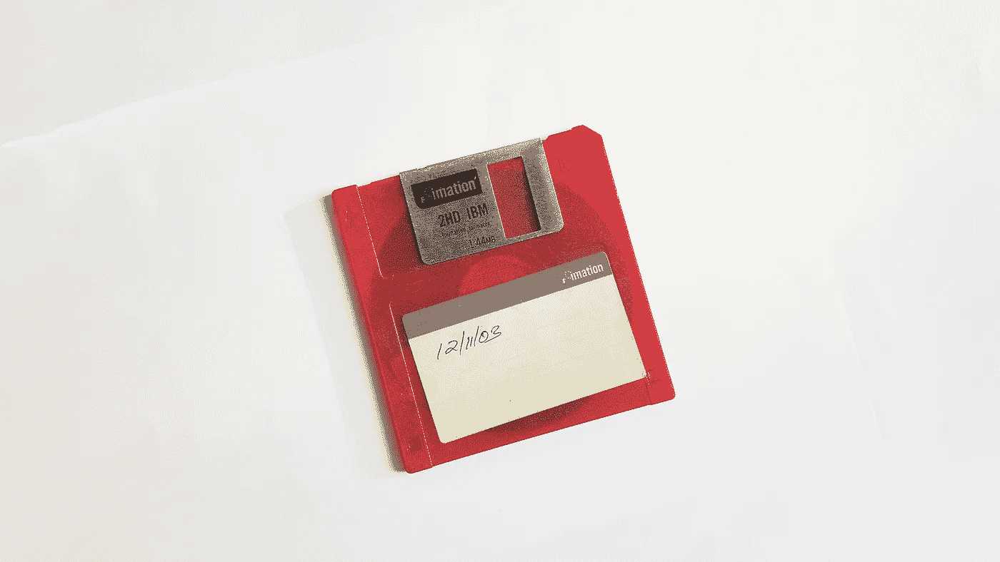

# TensorFlow 2.0 中的实用编码

> 原文：<https://towardsdatascience.com/practical-coding-in-tensorflow-2-0-fafd2d3863f6?source=collection_archive---------15----------------------->

## 关于数据集和 TFRecord 数据格式的所有信息



Photo by [Fredy Jacob](https://unsplash.com/@thefredyjacob?utm_source=unsplash&utm_medium=referral&utm_content=creditCopyText) on [Unsplash](https://unsplash.com/s/photos/data?utm_source=unsplash&utm_medium=referral&utm_content=creditCopyText)

# 摘要

在这篇博文中，我将展示如何在 TF 2 中使用`tf.dataset`。此外，我们从 numpy 数组创建一个数据集，并学习如何将图像和数组写入 TFRecord 文件或从 TF record 文件中读取图像和数组。

# 装置

要安装 TF 2.x，请访问这个[页面](https://www.tensorflow.org/install)。

要检查您的当前版本:

```
import tensorflow as tf
print(tf.__version__)
```

# TF 2 中的数据集

向网络提供数据的最简单和最有效的方法是使用`tf.dataset`。这个职业在 TF 2 中经历了显著的变化。数据集本身现在是一个迭代器，可以用 for 循环进行迭代。

我们先做一个数据集。对于可以存储在内存中的少量数据，我们可以从 numpy 数组中创建一个数据集:

```
import numpy as np
np.random.seed(0)data = np.random.randn(256, 8, 8, 3)
dataset = tf.data.Dataset.from_tensor_slices(data)
print(dataset)...
<TensorSliceDataset shapes: (8, 8, 3), types: tf.float64>
```

按照惯例，第一个维度是训练样本的数量。迭代器可以产生任何批量。默认情况下，它会生成单个训练示例，即批量大小为 1。

for 循环在数据集的末尾停止。要多次迭代数据集，请使用`.repeat()`。

我们可以使用 Python 的枚举器或内置方法来枚举每个批处理。前者产生一个张量，推荐使用。

```
for i, batch in enumerate(dataset):
  if i == 255 or i == 256:
  print(i, batch.shape)...
255 (8, 8, 3)
...for i, batch in dataset.enumerate():
  if i == 255 or i == 256:
  print(i, batch.shape)
  print(i.numpy(), batch.shape)...
tf.Tensor(255, shape=(), dtype=int64) (8, 8, 3) 255 (8, 8, 3)
...for i, batch in dataset.repeat(2).enumerate():
  if i == 255 or i == 256:
  print(i.numpy(), batch.shape)...
255 (8, 8, 3)
256 (8, 8, 3)
```

如果不需要整个数据集，可以从中提取所需数量的批次:

```
for batch in dataset.take(3):
  print(batch.shape)...
(8, 8, 3)
(8, 8, 3)
(8, 8, 3)
```

要迭代大于 1 的批处理，必须指定批处理大小。

```
dataset = dataset.batch(16)for batch in dataset.take(3):
  print(batch.shape)...
(16, 8, 8, 3)
(16, 8, 8, 3)
(16, 8, 8, 3)
```

我们也可以在将数据输入网络之前对其进行洗牌。这会用`buffer_size`元素填充一个缓冲区，然后从这个缓冲区中随机抽取元素，用新元素替换选中的元素。为了实现完美的混洗，缓冲区大小应该等于数据集的完整大小。`buffer_size` 5 有一个例子。在实践中，我们使用等于几个批量大小的缓冲区大小。

```
dataset = tf.data.Dataset.from_tensor_slices(np.arange(19))for batch in dataset.batch(5):
  print(batch)...
tf.Tensor([0 1 2 3 4], shape=(5,), dtype=int64)
tf.Tensor([5 6 7 8 9], shape=(5,), dtype=int64)
tf.Tensor([10 11 12 13 14], shape=(5,), dtype=int64)
tf.Tensor([15 16 17 18], shape=(4,), dtype=int64)
...for batch in dataset.shuffle(5).batch(5):
  print(batch)...
tf.Tensor([2 5 0 4 1], shape=(5,), dtype=int64)
tf.Tensor([ 6  9  3 12 10], shape=(5,), dtype=int64)
tf.Tensor([13  8 15 17 11], shape=(5,), dtype=int64)
tf.Tensor([18 16 14  7], shape=(4,), dtype=int64)
```

你可以看到，结果并不统一，但足够好。

但是，如果您以不同的顺序应用这些方法，将会得到意想不到的结果。它打乱了批次，而不是元素。

```
for batch in dataset.batch(5).shuffle(5):
  print(batch)...
tf.Tensor([5 6 7 8 9], shape=(5,), dtype=int64)
tf.Tensor([15 16 17 18], shape=(4,), dtype=int64)
tf.Tensor([0 1 2 3 4], shape=(5,), dtype=int64)
tf.Tensor([10 11 12 13 14], shape=(5,), dtype=int64)
```

您也可以在使用`.map()`从数据集中读取数据的同时准备数据。函数顺序在这里是至关重要的。比如现在`transform`应用于每批。

```
def tranform(data):
  mean = tf.reduce_mean(data)
  return data - meanfor batch in dataset.shuffle(5).batch(5).map(tranform):
  print(batch)...
tf.Tensor([ 2  3 -1  0 -2], shape=(5,), dtype=int64)
tf.Tensor([-2 -5  2  3  4], shape=(5,), dtype=int64)
tf.Tensor([-1  1  2 -5  3], shape=(5,), dtype=int64)
tf.Tensor([ 3 -3  7 -4], shape=(4,), dtype=int64)
```

读取和处理数据集通常非常耗时。为了让训练有一个稳定的数据流，从而让你的 GPU 保持忙碌，你可以预取几个批次。为此，您必须将`.prefetch(buffer_size=tf.data.experimental.AUTOTUNE)`作为最后一个方法。通过使用`autotune`，您允许 TF 找到最佳的缓冲区大小。

```
dataset.shuffle(5).batch(5).prefetch(buffer_size=tf.data.experimental.AUTOTUNE)
```

# 为图像制作 TFRecord 文件

只有当数组相当小并且可以存储在内存中时，才可以从 numpy 数组生成数据集。对于更大的数据集，比如图像，我建议使用 TF 自制的数据格式`tfrecord`。

*注*:我尝试过使用`h5`，但是支持微乎其微，数据读取较慢。因此，我们现在坚持使用`tfrecord`。

假设您希望将一个图像和一个包含动作的数组存储为一条记录:一个训练示例。

```
imgs = (np.random.randn(256, 8, 8, 3) * 255).astype(np.uint8)
acts = np.random.randn(256, 4).astype(np.float32)
```

首先，我们必须定义一个助手函数:

```
def _bytes_feature(value):

  if isinstance(value, type(tf.constant(0))):
    value = value.numpy()return tf.train.Feature(bytes_list=tf.train.BytesList(value=[value]))
```

从图像和动作中生成一个字节串。

```
def serialize_example(image, action):image = tf.image.encode_png(image)feature = {
    'image': _bytes_feature(image),
    'action': _bytes_feature(tf.io.serialize_tensor(action)),
  }return tf.train.Example(features=tf.train.Features(feature=feature)).SerializeToString()
```

`tf.train.Example`是一个容易引起误解的记录名称。

现在，我们可以将所有示例写入一个文件:

```
with tf.io.TFRecordWriter('test.tfrecord') as writer:for xi, ai in zip(imgs, acts):
    example = serialize_example(xi, ai)
    writer.write(example)
```

# 读取 TFRecord 文件

要读取文件，我们必须以相反的顺序执行我们的操作。我们需要两个辅助函数:第一个用于将字节串解析为张量，第二个用于解码图像。

```
def parse_image_function(example_proto):
  image_feature_description = {
    'image': tf.io.FixedLenFeature([], tf.string),
    'action': tf.io.FixedLenFeature([], tf.string),
  }return tf.io.parse_single_example(example_proto, image_feature_description)def decode_image_function(record):
  record['image'] = tf.cast(tf.image.decode_image(record['image']), tf.float32) / 255.record['action'] = tf.io.parse_tensor(record['action'], out_type=tf.float32)return record['image'], record['action']
```

现在我们可以从文件中读取。

```
dataset = tf.data.TFRecordDataset('test.tfrecord')dataset = dataset.map(parse_image_function, num_parallel_calls=tf.data.experimental.AUTOTUNE)dataset = dataset.map(decode_image_function, num_parallel_calls=tf.data.experimental.AUTOTUNE)for img, act in dataset.batch(16).take(3):
  print(img.shape, act.shape)...
(16, 8, 8, 3) (16, 4)
(16, 8, 8, 3) (16, 4)
(16, 8, 8, 3) (16, 4)
```

此外，如果需要的话，您可以应用任何想要的混排或映射。

*注*:我试过用`h5`但是它的支持非常有限，读取速度也比较慢。因此，我们现在坚持使用`tfrecord`。