# 数据科学实用调试

> 原文：<https://towardsdatascience.com/practical-debugging-for-data-science-fd744c21f332?source=collection_archive---------2----------------------->

## 调试机器学习系统的初级读本。

付费墙是否困扰着你？点击 [*这里*](/practical-debugging-for-data-science-fd744c21f332?source=friends_link&sk=abb4854862e35adb76ac4992d31b484e) *可以绕过去。*

# 序言

在写这个话题之前，我在谷歌上快速搜索了一下，看看有多少已经被覆盖，并很快观察到一个我在这个领域越来越多地看到的现象——数据科学=建模，充其量是建模+数据处理。开一个 MOOC，他们谈论不同的模型和架构，去训练营，他们会让你写代码来适应和训练机器学习模型。虽然我理解 MOOCs 和 bootcamps 为什么走这条路(因为这些机器学习模型是数据科学的核心)，但他们确实让机器学习模型看起来是数据科学中唯一的东西。但是实践中的数据科学完全不同。没有经过整理的数据集或格式清晰的笔记本，只有大量杂乱无章、不干净的数据和复杂的流程。为了有效地实践数据科学，你需要成为一名优秀的程序员。句号。

# 事实:没有人能写出完美的代码

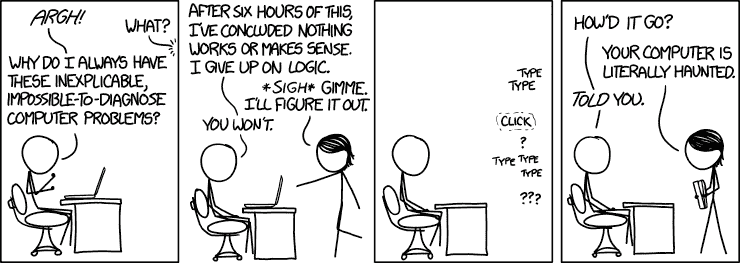

[https://xkcd.com/1316/](https://xkcd.com/1316/)

即使是约翰·斯基特——程序设计界的查克·诺里斯也不行。这是编写代码时不可避免且令人恼火的一部分。没有什么比一条冗长而晦涩的错误消息更能降低编写一个特别复杂的任务的难度了。因此，能够追踪和处理错误是数据科学家工具箱中的一项基本技能。

机器学习与传统编程略有不同。传统上，编程试图解决一个问题，并且会有一组步骤/逻辑必须被翻译成代码，瞧！它工作了。但是机器学习在这方面有点令人沮丧。你可以把每件事都做对，但还是达不到预期的结果。正因为如此，调试机器学习程序更加困难。

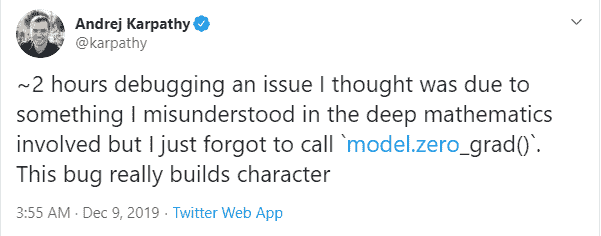

机器学习代码中的错误可能来自两个截然不同的来源-

1.  纯编程/逻辑问题(包括数据处理逻辑)
2.  问题和模型公式

正如 Andrej Karpathy 暗示的，大多数错误通常是因为数字 1。因此，在你深入研究数学之前，做一个基本的健全性检查，看看你是否正确地编写了代码。这不取决于你编程有多好，也不取决于你经验有多丰富。Andrej Karpathy 是斯坦福大学的计算机科学博士，曾在 OpenAI 工作过，现在是特斯拉的人工智能高级总监。这是一个令人印象深刻的侧写，不是吗？他写了许多关于很多话题的博客，这表明他对这些话题有着深刻的理解。他甚至在推特上指出了训练神经网络的常见陷阱。猜猜这些指针是什么？——*“你忘了。zero_grad()"*

总而言之，即使你是 Andrej Karpathy，你也会犯错误，需要知道如何调试才能有效。因此，在这篇博文的其余部分，我将涵盖如何调试机器学习模型的要点，既从编程方面，也从机器学习方面。在进入细节之前，我想先讨论几个*【心态】*，它们会对你大有帮助。

# 心态

# 1.开始称它们为错误，而不是错误

在 Dijkstra 的经典论文[“关于真正教授计算科学的残酷性”](http://www.cs.utexas.edu/users/EWD/transcriptions/EWD10xx/EWD1036.html)中，他认为将 bug 称为错误是有道理的，因为它将错误直接归咎于程序员，而不是在我们睡觉时爬起来删除一行或一个缩进的小精灵。词汇的这种变化对您如何处理代码中的问题有着深远的影响。在程序“几乎正确”之前，英雄程序员会发现并修复一些无法解释的错误。但是一旦你开始称它们为错误，程序就是错误的，而犯错误的程序员应该在这个过程中找到一种方法来纠正它和他自己。它从一部“我对抗世界”的动作片变成了一部深思熟虑的自省剧，讲述了一个男人/女人在电影过程中给他们的性格带来了深刻的变化。

# 2.知道你是个白痴

在他的一次演讲中，[杰瑞米·霍华德](https://www.linkedin.com/in/howardjeremy)提到了一些深刻的东西，它直接来自于心态 1。

> 我们都有这个习惯…当我们发现一个 bug 时，我们会说，“呃！我是傻逼！”所以，不要等着去发现。我已经知道我是个白痴。当你调试的时候，让我们从这个假设开始。
> 
> *杰瑞米·霍华德*

如果我们代码中的某些东西不工作，这意味着我们认为以特定的方式工作，而不是以那种方式工作。所以你必须从认识到你在某些事情上是错误的开始，这对一些人来说可能很难。有经验的程序员会从头开始，检查每一步。但是新程序员倾向于高估他们对特定代码块的信心，并从检查中丢弃它们。因此，他们将飞过他们感到非常自信的代码块，并通过声明“我认为问题是 *x* ”来聚焦于一个代码块。但是调试从来不是“我认为问题是..”而是从“我不知道问题出在哪里，因为我犯了一个错误”开始。

# 编程调试

# 1.不要害怕阅读追溯

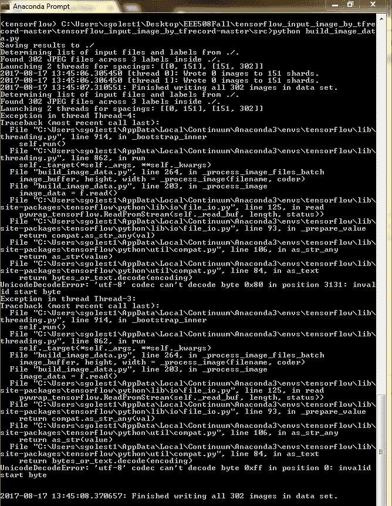

有多少次你看到一个像上面这样的追溯，并认为——*通读所有这些？见鬼不要。*。但是，您将放弃的是信息的金矿和调试的良好起点。

我知道回溯看起来很吓人(为了达到效果，我故意在黑屏上贴了一个非格式化的多线程回溯)，但其实不必如此。如果你使用的是 jupyter 笔记本或任何有价值的 IDE，回溯将被格式化，并且更容易阅读。如果我告诉你，你不需要阅读整个追溯，仍然可以从中获得有用的信息，那会怎么样呢？

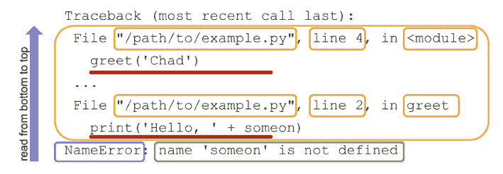

[https://realpython.com/python-traceback/](https://realpython.com/python-traceback/)

让我们稍微分解一下回溯。 [Chad Hansen @ RealPython](https://realpython.com/python-traceback/) 在解释追溯方面做得很好，我建议你看一下，跳过下一段(这是原文的摘录)。对于那些只想要摘要的人，请继续阅读。

> 阅读回溯的首要规则是从下到上。
> 
> ***蓝框:*** *回溯的最后一行是错误信息行。这是你的第一个线索，它是什么样的错误。Python 有许多类型内置错误，这些错误会导致不同类型的问题。*
> 
> ***绿色框:*** *异常名称后是错误信息。请非常非常密切地关注这一部分，因为这实际上是为什么它不工作的答案。通常情况下，开发人员试图放入有意义的信息，这些信息可以直观地引导您找到问题所在。*
> 
> ***黄框:*** *再往上追溯是从下往上移动的各种函数调用，从最近到最近。*
> 
> ***红色下划线:*** *这些调用的第二行包含实际执行的代码。*
> 
> [*查德汉森@ RealPython*](https://realpython.com/python-traceback/)

*黄色方框*和*红色下划线*是定位错误的关键。但是这个特别的方面让很多人害怕，因为这可能会很长；尤其是如果你使用的是 Sci-kit Learn 或者 Tensorflow 这样的库。但是这一部分的伟大之处在于它给出了发生错误的文件名。现在，首先，您应该将重点放在由脚本引起的错误部分，并将来自库中的错误视为您所犯错误的结果(也有例外，在库中确实存在问题，但是您的分析起点应该始终是自省)。

**总结一下:**

1.  查看错误类型，了解抛出的是哪种错误。在谷歌上搜索一下，看看其他人是否也面临同样的错误。
2.  阅读错误消息，了解可能出现了什么问题。
3.  在您的脚本中找到引发错误的那一行，并仔细考虑引发这个特定错误的可能性。

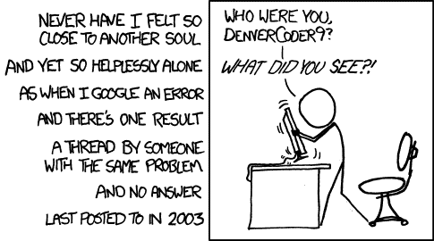

[https://xkcd.com/979/](https://xkcd.com/979/)

# 2.二进位检索

如果代码中的错误抛出一个异常和一个有用的回溯，您应该认为自己是幸运的。但很多时候，错误并不是那么表面的。它要么不抛出错误，要么以完全不同的形式出现，并引发一个无法解释的异常。这种错误是最难调试的。

这些错误通常在数据科学项目的数据处理管道中表现出来。而且，由于我们没有错误发生的确切位置或行号，我们需要找到那个位置。现在，你如何在一大段代码中找到错误呢？从头到尾阅读是一种可靠的方式，但这是一个非常低效的过程。

计算机工程师会立刻告诉你，当你从线性搜索到二分搜索法，时间复杂度从 O(N)到 O(log N)。具有讽刺意味的是，这些对这一点了如指掌的工程师在调试时会求助于线性搜索。

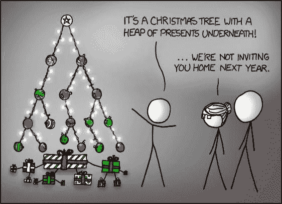

这个过程非常简单。让我们以一个简单的 bug 为例。pandas 数据帧中一列的 dtype 在代码中的某个地方发生了变化，这打乱了数据处理流程。

1.  **设计一个简单的测试用例来检查问题**。对于我们的例子，它可以简单到检查特定列的 dtype。
2.  **将代码一分为二**。您可以注释掉一半代码，或者在中途放一个记录器来检查 dtype。
3.  **找进攻劈**。如果第一个块末尾的 dtype 是您所期望的，那么第二个块就是罪魁祸首，反之亦然。
4.  **选择攻击性分割**，重复 2-4 次，直到你把注意力集中在出错的那条线上。

# 3.扔掉笔记本

现在我说了一句亵渎神明的话，引起了你的注意，让我澄清一下。Jupyter Notebooks 是一款出色的工具，我一直在使用它，但用于快速原型制作。一旦你在编码过程中取得了实质性的进展，并且你有了一个很长的代码块，它就会变得难以处理。

想象一下做我之前在笔记本上描述的二分搜索法。如果你的代码被分割成不同的单元，你将会一个单元接一个单元地执行，折磨你的键盘。如果你的代码被合并到一个单元格中，那么你将会拆分单元格，创建新的单元格来检查，等等。这是一个令人头疼的问题。

调试数据科学和调试代码之间有一条细微的界限，这两个过程需要稍微不同的工具。如果你正在解决你的模型中的一个难题，你必须重复很多并尝试不同的东西，没有比 Jupyter 笔记本更好的工具了。但是，如果你有一个隐藏的错误，比如数据管道，或者功能工程管道，抛弃 Jupyter 笔记本，使用你选择的 IDE。我的首选工具是 VSCode 和 Spyder，这取决于具体的用例。

当我告诉许多数据科学家“单步调试”代码并进行调试时，他们一脸茫然。当我告诉他们这个叫做调试器的神奇的东西时，我注意到他们睁大了眼睛，它可以让你放置断点，观察某些变量，让你一行一行地通过代码，甚至可以放置一个条件断点。几乎所有的 ide 中都有这个调试器，但是在高层次上功能是相同的。如果你是那些数据科学家中的一员，我强烈建议你立即检查调试器，无论是在 [VSCode](https://docs.microsoft.com/en-us/visualstudio/debugger/using-breakpoints?view=vs-2019) ，Spyder，PyCharm，还是任何其他支持它的 IDE 中。

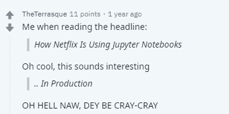

# 4.隔离误差源

在机器学习中，错误可能是由于编程逻辑或数学造成的，能够快速诊断和隔离错误源非常重要，这样您就不会浪费一整天来跟踪错误。

我举个例子来说明我的观点。我正在训练一个用于时间序列预测的 LSTM，并对架构进行修补以适应一些外部变量。很快，我明白了网络没有正确训练，损失曲线看起来不对。这里可能有很多地方出错了 LSTMs 的数据处理(这总是数据泄露的陷阱),我为输入矩阵做的标准化工作，我对 LSTM 架构做的修补工作。因此，我只是创建了一个虚拟的时间序列作为外生变量的函数，关闭了标准化，并运行我的数据处理。当我检查格式化的数组时，一切正常。所以我排除了数据处理。然后，我通过 LSTM 运行数据，观察培训损失的下降。完美！修补也不是问题。现在，我已经将错误的来源隔离到标准化部分，我在标准化函数中放置了几个断点，逐步执行该函数，并找出了我犯的愚蠢错误。

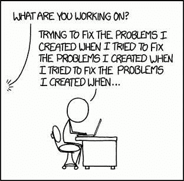

[https://xkcd.com/1739/](https://xkcd.com/1739/)

# 2.数据科学调试

# 1.如果结果好得令人难以置信，那么它们很可能是真的。

你是否曾经运行一个模型，并在一个难题上达到 90%的准确率，并且你为自己没有付出太多努力就获得了如此出色的结果而感到欢欣鼓舞？但是，你脑中有个小小的声音在唠叨你，告诉你这是不可能的。我在这里给那个声音一个放大器。听听吧。通常情况下，那个声音是对的。

你一定是无意中发现了数据科学中被称为“数据泄露”的怪物。大家可能都知道，当你用来训练机器学习算法的数据碰巧含有你试图预测的信息时，数据泄漏就会导致夸大的性能。在你的模型中，有很多方式可能会发生数据泄漏，我在下面列出了其中的一些，以帮助你启动你的思路

*   当你对分类变量使用目标均值编码时，你使用整个数据集对它们进行编码，而不仅仅是训练。
*   当数据本质上是时态的，并且您最终使用未来的信息来拟合模型时。例如使用 K 倍交叉验证。
*   当数据中存在重复项，并且这些重复项在训练和验证中被拆分时。
*   当您对整个数据集运行 PCA 并在您的模型中使用提取的组件时。

# 2.不平衡数据集

如果你正在处理一个高度不平衡的分类问题，它有自己的 pitalls。

我看到人们最常犯的一个错误是度量标准，尤其是当存在高度的阶级不平衡时。我经历过太多的面试，面试者不停地谈论他如何在 xyz 欺诈检测类型的问题中获得 90%的准确率。即使经过相当多的刺激和线索，这些人中的大部分人似乎并没有将[准确性悖论](https://en.wikipedia.org/wiki/Accuracy_paradox)联系起来。当我提醒他们精确或回忆时，我会得到教科书上的答案或公式。在这一点上，我放弃任何进一步的讨论，例如 [F1 的分数偏向多数派](https://arxiv.org/ftp/arxiv/papers/1503/1503.06410.pdf)等等。

过采样或欠采样是处理不平衡类的训练的方法之一(这并不理想，因为您正在改变问题的固有分布)。但问题是，如果在进行验证分割之前进行过采样或欠采样，并在欠采样或过采样数据集上测量模型的性能，那么您将走上一条通向模型失败的黑暗而多风的道路。

# 3.误差分析

您的模型中的错误将准确地告诉您需要让您的模型表现得更好的故事。从你的结果中提取这个故事的过程就是错误分析。当我进行误差分析时，它包括两个部分——消融研究，以确定系统每个组件的误差/收益，如预处理、降维、建模等。，并对结果和其中的错误进行分析，就像[吴恩达告诉我们做的](https://www.youtube.com/watch?v=JoAxZsdw_3w)。

通过打开或关闭机器学习管道的组件，或者用基本事实替换它们，您可以快速识别它们的影响。这也是识别有泄漏的特征的非常快速的方法。如果您发现模型过于依赖一个单一的特性，而放弃该特性会极大地影响性能，那么这应该是开始调查该变量的数据泄漏的一个线索。要回顾特性归属的最新方法，请查看我之前关于可解释性的[博客系列](https://deep-and-shallow.com/2019/11/13/interpretability-cracking-open-the-black-box-part-i/)。

错误分析的另一部分是吴恩达在 Coursera 的课程中教授的内容。这都是关于手动检查错误分类的案例，试图确定一个模式，并最终设计一个行动计划来减轻这种模式。在表格数据的情况下，通过尝试在不同的分类拆分上检查性能拆分，可以更有效地对该过程进行分类。你的错误集中在特定类型的样本上吗？也许它需要一个新的功能来帮助学习它们。

对于回归问题，您可以查看不同分类拆分处的误差，或者绘制预测-基础事实散点图或残差图，以进一步分析误差的来源。

让我们简短地浏览一下优秀的库 [Yellowbrick](https://www.scikit-yb.org/en/latest/index.html) 提供的不同可视化。

## 分类器可视化

1.混淆矩阵

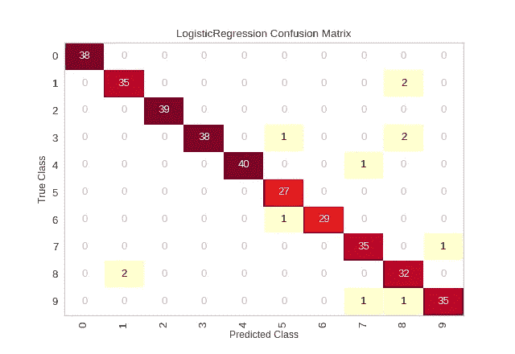

[https://www.scikit-yb.org/en/latest/](https://www.scikit-yb.org/en/latest/)

我们使用混淆矩阵来理解哪些类是最容易混淆的，而不是因为我们自己也被混淆了。因此，我们确定了最容易混淆的类别，并对它们进行分析以找出原因。例如，对于计算机视觉任务，我们查看这些类的样本，并检查人类是否能够容易地识别两者之间的差异。

2.ROC AUC 曲线

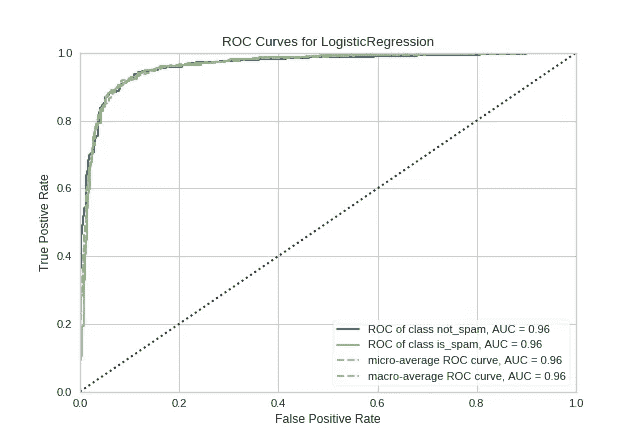

[https://www.scikit-yb.org/en/latest/](https://www.scikit-yb.org/en/latest/)

曲线下的接收器操作特征/面积允许用户可视化分类器的灵敏度和特异性之间的权衡。

3.类别预测误差

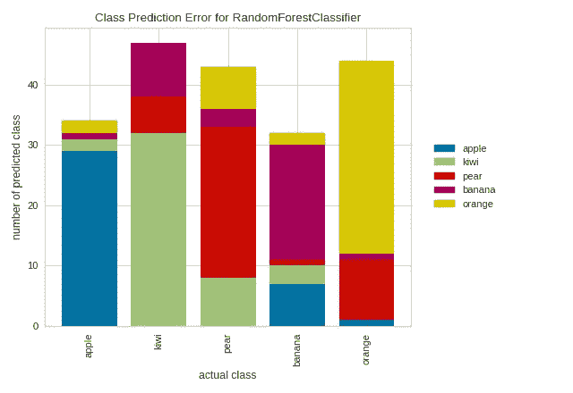

[https://www.scikit-yb.org/en/latest/](https://www.scikit-yb.org/en/latest/)

该图是对传统混淆矩阵的扭曲，可用于相同的目的。不知道为什么，我总觉得这个图比混乱矩阵直观多了。

## 2.回归可视化

1.残差图

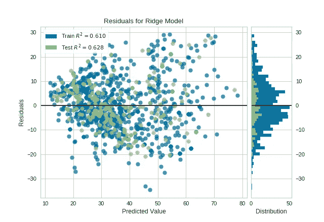

[https://www.scikit-yb.org/en/latest/](https://www.scikit-yb.org/en/latest/)

残差图显示了垂直轴上的残差和水平轴上的因变量之间的差异，允许您检测目标中可能受或多或少误差影响的区域。该图还显示了预测值与我们预测该值的能力之间的关系。它还显示了训练残差与测试残差的不同之处。分析这个图会给你很多关于为什么一个模型失败了，或者它失败在哪里的见解。

2.预测误差图

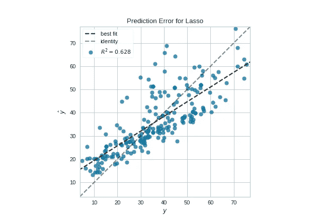

[https://www.scikit-yb.org/en/latest/](https://www.scikit-yb.org/en/latest/)

预测误差图显示了数据集的实际目标与模型生成的预测值的对比。通过与 45 度线进行比较，我们可以使用此图诊断回归模型，其中预测与模型完全匹配。

这绝不是可能出错的事情的详尽清单，也不意味着会出错。这篇文章的目的是让你的思维过程开始，更有效地组织你的调试工作，并建立一个有利于调试的心态。如果我为一个阅读这篇文章的人做到了以上任何一点，我认为这种努力是值得的。

***前去调试！***

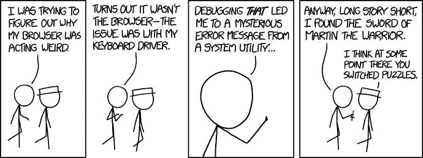

[https://xkcd.com/1722/](https://xkcd.com/1722/)

*原载于 2019 年 12 月 14 日*[*http://deep-and-shallow.com*](https://deep-and-shallow.com/2019/12/14/practical-debugging-for-data-science/)*。*