# 非参数功效分析、p 值、置信区间和偏倚检查指南

> 原文：<https://towardsdatascience.com/practical-experiment-fundamentals-all-data-scientists-should-know-f11c77fea1b2?source=collection_archive---------18----------------------->

## 所有数据科学家都应该知道的实际实验基础

## 代码设置

[R for Data Science](https://r4ds.had.co.nz/) 是一个免费的、令人惊叹的读物，学习如何使用本文中使用的 tidyverse 代码。

```
# purrr in parallel
library(furrr)
# Read R for Data Science if you haven't
# to learn about the tidyverse
library(tidyverse)
# process in parallel
plan(multiprocess)
```

# 为什么这篇文章教给你的东西很重要

随机实验是因果推断的黄金标准:如果你想得到一个对治疗效果的**无偏**(你的估计方法的平均值是真实值)估计，随机实验是最好的方法。

但是实验是昂贵的。因此，如果我们要投资做一个实验，我们需要知道我们将能够在实验中收集足够的数据，以便有很大的机会来测量一个效应(如果它存在的话)。一个**能力分析**会告诉我们需要多少数据。

我们还想知道我们测量的效果不仅仅是偶然的结果。只有在治疗没有效果的情况下(p 值**)，我们测量到的效果与我们在实验中测量到的效果一样极端的可能性足够低时，我们才会宣布我们的效果**具有统计显著性**。**

**此外，我们希望能够通过提供一个**置信区间**来提供测量效果的精确程度的一些感觉，置信区间是一个效果值的范围，如果以相同的方式对以相同方式重复的许多实验进行相同的计算，将包括大部分时间的真实效果(例如 95%)。**

**最后，我们想知道我们的实验设计是否有缺陷，以至于我们没有办法以无偏见的方式来衡量效果。**

**这篇文章将使你能够进行功耗分析，计算 p 值，获得置信区间，并检查设计中的偏差，而无需做出任何假设(**非参数化**)。**

# **示例实验**

**假设我是一个狗足球营销人员。在以前的广告中，我用下面左边的图片展示了狗足球是多么有趣。我假设，如果我添加一个类似“泰迪批准”的有趣说明，看到广告的更大一部分人(p)会购买一个足球(p 称为“转化率”)。**

**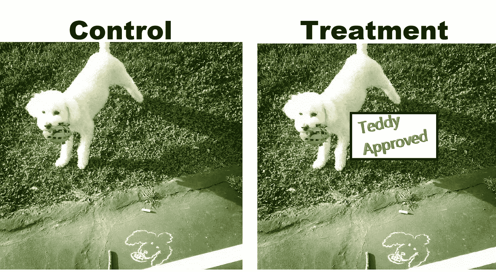**

**为了测试我的假设，每次人们将要看到我的一个广告时，我会随机给他们看两张图片中的一张:一张**对照**图片(没有标签)或一张**治疗**图片，上面有“泰迪批准”。然后，我会比较各组内的转化率(p_{control}对 p_{teddy_approved})，看看标签是否提高了转化率(转化率= #客户订购足球/ #客户看到广告)。**

# **假设**

****零假设**是没有效果的假设:在广告中添加“Teddy Approved”不会增加转化率；**

**h _ 0:p _ { teddy _ approved }—p _ { control } = 0**

**我们用我们的**替代假设**来检验这一点，即标签会增加转化率。**

**h _ a:p _ { teddy _ approved }-p _ { control } > 0**

**我们通过计算假设零假设为真的情况下，我们将看到我们的实验性**测试统计数据**(看到标签的客户和没有看到标签的客户之间的转换率差异) **p 值**。如果这种可能性足够低(例如，< 5%)，我们拒绝 h0，并且可以说该标签显著地(在统计意义上)增加了转化率。在我们的功效分析中，我们将确定真正的差异 p_{teddy_approved} — p_{control}需要有多大，或者我们需要收集多少数据才能有很高的几率(例如> 80%)观察到具有显著 p 值的测试统计(即高**功效**)。**

**这里的关键是我们需要能够计算在零假设下看到我们的测试统计的不同值的概率:我们需要知道我们的样本转换率的差异分布是什么样的\ hat { p } _*{ teddy _ approved }-\ hat { p } _*{ control }假定转换率的真实差异是 0:p _ { teddy _ approved }-p _ { control } = 0。**

**我们可以使用一些参数假设。例如，我们可以假设正态性并进行 t 检验。然而，在许多情况下，数据是高度倾斜的，这个假设不成立。如果我们能够非参数化地模拟转换率的差异(没有任何假设)，并自己描绘出这种分布，那就更好了。为此，我们需要一些数据。**

# **史料**

**让我们假设我们有没有贴标签的历史信息:我们有一组看过对照组图片的顾客的数据，以及他们是否购买了足球。如果零假设为真，则该历史数据的转换率的数据生成过程应该类似于实验期间的过程，因为添加标签对转换率没有影响。*也就是说，我们可以认为这个历史数据集类似于在零假设下实验期间收集的假设数据集的实现。**

***请注意，我们假设时间不会影响转化率的可变性。如果我们对使用模拟进行功效分析不感兴趣(例如，我们只想计算置信区间/p 值或确认我们的设计没有偏差)，我们可以对真实的实验数据应用随机化推断来消除这种假设。**

**让我们创建一个玩具历史数据集，假设客户之间的转换是独立的，并且在看到控制广告后购买的真实概率 p_{control}是`0.01`。**

```
# function to make historical data
make_historical_data <- function(
  # one row per customer
  number_of_customers = 1000,
  # each customer's chance of ordering
  null_conversion_rate = .01,
  # to make results replicable
  seed = 22) 

  {
  set.seed(seed)
  return(tibble(
    # each customer that saw an ad 1,2,3,...
    customer_id = 1:number_of_customers,
    # whether the customer bought a football or not
    # bernoulli draw with specified prob
    customer_purchased = rbinom(number_of_customers, 1, null_conversion_rate) #
  ))
}
# make the data
historical_data <- make_historical_data()
# take a look
# 1 row per customer
# some purchases
historical_data %>% head()
```

**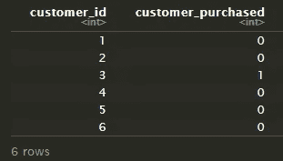**

# **零点下的模拟**

**根据我们的历史数据集，有两种主要方法来模拟在零假设下观察到的组间转化率的差异:**

1.  ****随机化推断**——探索随机分配到对照组和治疗组有多少可变性**
2.  ****引导** —探索数据生成过程中的可变性**

**我们将重点关注随机化推断，但自举也将在本文末尾描述。**

# **随机化推断**

**随机化推断是我识别数据可变性的首选方法。我第一次遇到它是在格伯和格林的野外实验中。这本书是一个严谨，简洁，写得很好的因果推理和实验方法的符号介绍。我强烈推荐。**

**随机化推断背后的想法是，不确定性自然产生于对治疗组的随机分配。这有点像回答这样一个问题:如果我们只是不同地分配我们的治疗组，效果会有多大？**

**模拟你的效果的步骤如下**

1.  **准备一个数据集，其实验单元的数量与你在实验中的数量相同。您可以使用历史数据进行功效分析，或者使用实验结果的实际数据来获得 p 值和置信区间。**
2.  **在你的数据集中随机分配一个假设的治疗。处理分配方法应遵循您将在实验中使用的相同分配方法(例如，如果您将聚类分配给处理，在这里也要这样做)。**
3.  **使用假设处理分配计算检验统计量**
4.  **多次重复上述步骤**
5.  **从各种假设的随机分配中计算出的检验统计量的分布可以认为是零分布下的检验统计量的分布。**

**我们可以把它变成一个函数:**

```
# run one simulation with
#   an assignment function
#   and an effect size calculating function
randomly_assign_and_find_effect_size <- function(
  # data to use for randomization inference
  # historical for power analyses
  # experiment outcomes for p values and confidence intervals
  dataset,
  # function that adds a random treatment assignment to the dataset
  random_assignment_function,
  # function that calculates the effect size using the assignment
  effect_size_function,
  # dummy var to allow us to use furrr::future_map_dbl
  dummy
  ){
  return(
    # with your dataset
    dataset %>% 
      # assign hypothetical treatment randomly
      #   how you would in the experiment
      random_assignment_function() %>%
      # estimate the effect given the hypothetical treatment
      effect_size_function()
  )
}# run the above function many times
randomization_inference <- function(
  dataset,
  # number of simulations to run
  number_of_simulations,
  # function that adds a random treatment assignment to the dataset
  random_assignment_function,
  # function that calculates the effect size using the assignment
  effect_size_function,
  # allows us to make results reproducible
  seed = 42
){
  set.seed(seed)
  # purrr::map
  #   applies a function (here the assign and find effect function)
  #   to each element of the supplied vector 1:number_of_simulations
  # purrr::map_dbl
  #   is like map but returns a vector of doubles instead of a list
  # furrr::future_map_dbl
  #   is like map_dbl, but uses parallel computing to speed things up
  future_map_dbl(
    # for each simulation
    1:number_of_simulations,
    # randomly assign and find effect size
    randomly_assign_and_find_effect_size,
    # using the provided data set
    dataset = dataset,
    # and provided assignment function
    random_assignment_function = random_assignment_function,
    # and provided effect size generating function
    effect_size_function = effect_size_function
    )
}
```

## **例子**

**在我们的示例实验中，每一个看到广告的客户都会以 50%的概率随机看到没有标签的图片或者有标签的图片。我们可以按照这种方法建立一个分配函数:**

```
add_hypothetical_random_assignment <- function(dataset){
  return(
  dataset %>% dplyr::mutate(
    # randomly assign each customer to treatment or control
    # in_treatment is a new column with 1 if treated and 0 otherwise
    in_treatment=rbinom(n = nrow(dataset),
                        size = 1,
                        prob = 0.5 # treatment with 50% prob
                        )
    )
  )
}
```

**我们测量的效果是转化率的差异。因此，让我们创建一个获得效果大小的函数:它计算治疗组和对照组的平均转化率，并取其差值。**

```
calculate_difference_in_conversion <- function(dataset){
  return(
  dataset %>% 
    # get conversion for control and treatment
    dplyr::group_by(in_treatment) %>% 
    dplyr::summarise(conversion=mean(customer_purchased)) %>%
    # get difference in conversion rates
    tidyr::spread(in_treatment,conversion) %>% 
    dplyr::mutate(difference_in_conversion = `1` - `0`) %>% 
    dplyr::pull(difference_in_conversion)
  )
}
```

**现在，让我们使用随机化推断来可视化我们的测试统计的分布(转换率的差异)。图表底部的线条显示了每次随机化的效果大小。曲线的高度表示在 x 轴的那个区域中发现了多少模拟效果尺寸。**

```
simulated_effect_sizes_ri <- randomization_inference(
    dataset = historical_data,
    number_of_simulations = 10000,
    # use the assignment function we just defined
    random_assignment_function = add_hypothetical_random_assignment,
    # use the effect size function we just defined
    effect_size_function = calculate_difference_in_conversion
)
```

**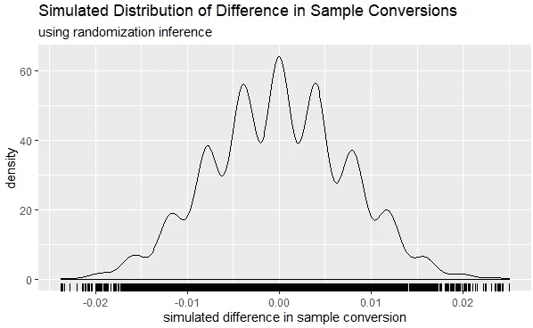**

# **功率分析**

**既然我们知道了如何得到模拟的效果大小，我们就可以进行功效分析了。功效分析背后的想法是，我们想知道我们需要多少数据才能有很高的几率获得具有统计意义的结果。我们想在实验开始前做这件事，这样我们就不会浪费时间和金钱去做一个不能测量任何东西的实验。**

**假设在零假设下，如果有 5%或更少的机会看到转化率的变化或更大的变化，我们将宣布转化率的变化是显著的。我们在上一节中描绘了零值下的效应大小分布，因此很容易找到这个临界值点(它只是我们模拟的效应大小的第 95 个百分位数)。**

```
critical_point_ri_1000 <- simulated_effect_sizes_ri %>%
  # get 95th percentile
  quantile(.95)
```

**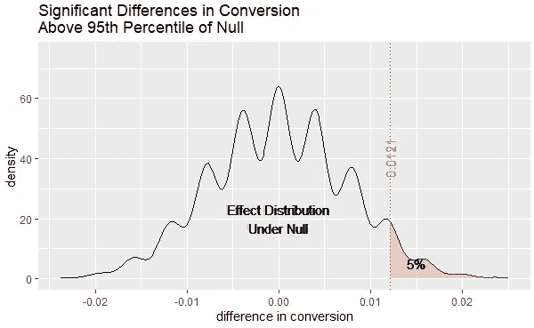**

**假设我们希望至少有 80%的机会得到一个重要的结果。这里的技巧是假设真实的效应大小是不变的，这样我们就可以通过真实的效应大小来改变零点下的效应大小分布。我们移动分布，直到其下 80%的区域超出临界区域。我们需要移动的量被称为**最小可测量效应**(“MME”)，因为它是转化率中最小的真实差异，我们将能够以至少 80%的概率获得统计上显著的结果。这种最小的可测量效应可以通过取临界值和在零值下模拟的效应大小分布的第 20 个百分位数之间的差值来计算。**

```
(minimum_measurable_effect_ri_1000 <- critical_point_ri_1000 -
  simulated_effect_sizes_ri %>% # 95th percentile
  quantile(.2) # 20th percentile
)
```

**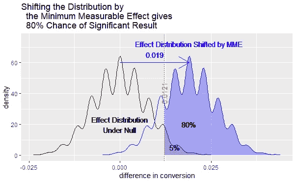**

**考虑到我们的转换率从 0.01 开始，0.019 的转换率的最小可测量差异似乎是不合理的。然而，所有这些都是假设我们将在实验过程中收集 1000 个客户(就像我们在历史数据中收集的一样)。如果我们增加样本量，我们可以得到更多的能量。让我们看看，如果我们创建一个 100 倍大的历史数据集，最小可测量的影响是如何变化的。**

```
# 100x larger historical data
historical_data_100x <-
  make_historical_data(number_of_customers = 100000)# randomization inference to simulate the null
simulated_effect_sizes_ri_100x <- randomization_inference(
  dataset = historical_data_100x,
  number_of_simulations = 10000,
  random_assignment_function = add_hypothetical_random_assignment,
  effect_size_function = calculate_difference_in_conversion
)
# critical point
critical_point_ri_100000 <- simulated_effect_sizes_ri_100x %>%
  quantile(.95)
# mme
minimum_measurable_effect_ri_100000 <- critical_point_ri_100000 -
  simulated_effect_sizes_ri_100x %>%
  quantile(.2)
```

**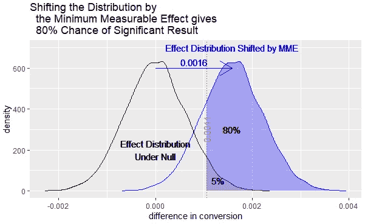**

**随着更多的数据，最小可测量的影响减少到 0.0016，这仍然很大，但至少是一个可能的影响大小来衡量。**

**如果我们一起绘制两个模拟分布，精度的提高会更加明显:**

**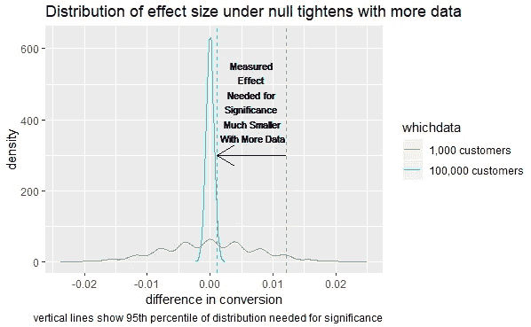**

# **实验数据的 p 值**

**使用模拟效应大小很容易计算 p 值。我们想知道在零的情况下，我们有多大的机会看到至少和我们测量的效应大小一样极端的效应大小。我们可以通过找出测量的效应大小在我们的模拟效应大小的分布中的百分位数来找到这个。我们可以继续使用我们使用历史数据模拟的效应大小，但是我们可以将随机化推断应用到实际的实验数据中，以便在实际的实验过程中更好地了解零效应下的效应大小的分布。**

**让我们假设真实的效果大小是 0.0005:标签将增加 0.0005 的转化率。然后，我们将制作一个数据集来表示我们的实验结果。**

```
true_effect_size <- 0.0005
experiment_data <- make_historical_data(100000, seed = 2) %>%
  add_hypothetical_random_assignment() %>%
  # average conversion is
  # base conversion = 0.01
  #   + true_effect_size if in treatment
  mutate(customer_purchased = rbinom(100000, 1, prob = .01 + in_treatment * true_effect_size))# difference in conversion rates in the experimental data
(
  experiment_measured_effect <-
    calculate_difference_in_conversion(experiment_data)
)
[1] 0.001496594
```

**我们在实验中发现转化率有 0.0015 的差异。现在，为了获得效应大小的 p 值，我们将**

1.  **应用随机化推断，利用实验数据追踪出在零效应下效应大小的分布**
2.  **找出我们测量的效应大小的分布的百分位数**
3.  **计算 1 减去百分位数= p 值**

```
# trace out the null
simulated_effect_sizes_ri_experiment <- randomization_inference(
  dataset = experiment_data,
  number_of_simulations = 10000,
  random_assignment_function = add_hypothetical_random_assignment,
  effect_size_function = calculate_difference_in_conversion
)
# what percentile in the simulated effects distribution
#   is the experiment measured effect
# ecdf is the "empirical cumulative distribution function"
# we are finding where in this function the experiment measured effect lies
percentile <-
  ecdf(simulated_effect_sizes_ri_experiment)(experiment_measured_effect)
(p_value <- 1 - percentile)
[1] 0.0105
```

**p 值为 0.01。我们发现该标签在 95%的水平上显著提高了转化率。p 值是测量效应右侧分布下的面积:**

**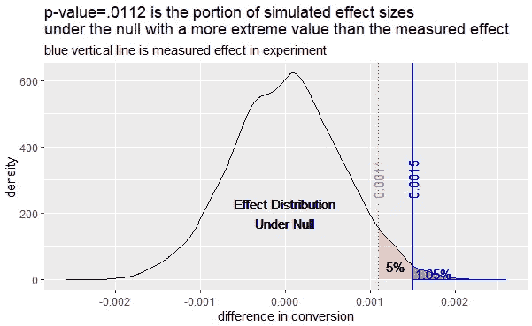**

# **置信区间**

**只要你的实验设计是无偏的(见下一节),在零效应下模拟效应大小分布的置信区间是很容易的。只要改变分布，使其集中在实验测量的效应大小上。然后，95%置信区间的界限是该移位分布的 2.5 和 97.5 个百分点。**

```
# shift the distribution of simulated effect sizes
#   by the measured effect size
simulated_effect_sizes_ri_experiment_plus_measured_effect <-
  simulated_effect_sizes_ri_experiment +
  experiment_measured_effect(
  confidence_interval_ri_experiment <-
    quantile(
      simulated_effect_sizes_ri_experiment_plus_measured_effect,
      c(.025, .975) # 2.5th and 97.5th percentile
    )
)
2.5%        97.5% 
0.0002208507 0.0027817045
```

**这个置信区间包含真实效应:0.0005。**

**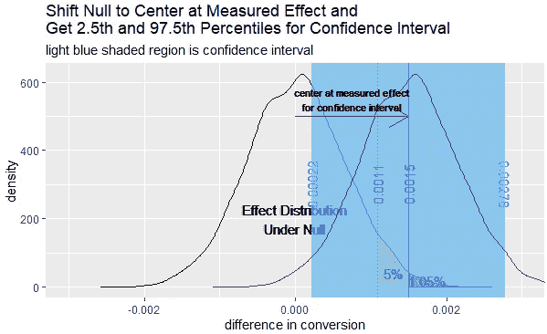**

# **检查偏差(重要！)**

**在我们的例子中，我们使用了一个非常简洁的实验设计:我们比较了同一时期的苹果和苹果组(因为客户被随机分配到他们)，并计算了平均值的差异。在这种情况下，测得的转化率差异将是由添加的标签引起的转化率的真实差异的**无偏**估计:尽管我们测量的治疗效果是随机的，但平均而言，它将是真实的治疗效果:**

**e[\ hat { p }*{ teddy _ approved }—\ hat { p }*{ control }]= p _ { teddy _ approved }—p _ { control }**

**我们可以做一个直觉的检查，通过确认我们的模拟在无效效应大小下的平均值接近 0:在无效效应下 p _ { teddy _ approved }—p _ { control } = 0，所以如果我们有一个无偏的设计，hat { e }[\ hat { p }*{ teddy _ approved }——\ hat { p }*{ control }]=\frac{1}{n}\sum_{i=1}^{n}\hat{p}*{ teddy _ approved } —\ hat { p }*{ control } \大约为 0。**

```
mean(simulated_effect_sizes_ri_100x)
[1] 7.434415e-07
```

**鉴于平均值如此接近于 0，我们通过了这一检验。尽管这并不能证实设计是无偏的，但它给了我们更多的信心。**

**然而，许多实验并没有这样一个清晰的设计，测量的效应大小可能会有偏差。在这种情况下，你应该尽你所能来纠正设计，使其不偏不倚。但是，可能会出现这样的情况，即您运行了一个实验，但无法在实验后纠正偏差。在这种情况下，只要均匀地应用偏倚，您仍然可以使用相同的 p 值方法:随机化推断仍然表明实际分配测量的效应大小在其他假设分配下测量的效应大小的前 95%,即使所有测量的效应都有偏倚。然而，你需要调整你报告的效应大小和置信区间。这样做的一个快速和肮脏的方法是只报告测量的效应大小减去在零分布下模拟的效应大小的平均值。然后，用和上面一样的方法建立一个置信区间，但是以调整后的效果大小为中心。**

## **例子**

**我们来做一个例子。假设我们只能向一个地理区域(例如，某个大都市区域)中的每个客户显示一种类型的广告。现在我们不能按客户随机分配治疗。我们可以随机将一半的地理区域分配给处理(添加标签)条件，另一半分配给控制(无标签)条件。然后，考虑两组之间的转换差异，这将使我们回到上面的干净设计。然而，考虑到高水平的聚类处理，这可能具有较低的精度。**

**为了更加精确，有人提出了一种设计，我们也查看前一时期的地理，以获得更多的“控制”数据。然后，我们将计算试验期内治疗的跨地区平均转化率与试验前期和试验期内随机分配到对照组的跨地区平均转化率之间的差异。为了简化起见，让我们假设所有地理周期都有相同数量的客户(这样我们可以很容易地取平均值)。**

```
add_hypothetical_random_assignment_geo <- function(
  dataset
){
  # get the distinct geos
  randomized_geos <- dataset %>%
    dplyr::select(geo) %>% 
    dplyr::distinct() %>% 
    dplyr::pull(geo) %>% 
    # and randomize their order
    sample()

  # first half assigned to treatment
  treated_geos <- randomized_geos[1:length(randomized_geos) %/% 2]

  # add treatment assignment as a column to the data
  return(
    dataset %>% 
      dplyr::mutate(
        in_treatment = dplyr::case_when(
          # treatment col is 1 only if in treated geo
          (geo %in% treated_geos) & 
            # and only during the second period
            #   (first period is all control)
            (period==2) ~ 1,
          T ~ 0
        )
      )
  )
}get_effect_on_conversion_geos_biased <- function(
  dataset
){
  return(
    # get mean of outcome for treatment and control period-groups
    dataset %>% 
      dplyr::group_by(in_treatment) %>% 
      dplyr::summarise(conversion_rate=mean(observed_conversion_rate)) %>% 
      # get differnce between treatment and control period-groups
      tidyr::spread(key=in_treatment,value=conversion_rate) %>% 
      dplyr::mutate(diff_in_conversion=`1` - `0`) %>% 
      dplyr::pull(diff_in_conversion)
  )
}
```

**这种设计是有缺陷的，因为实验期和前期之间的差异会意外地归因于治疗。例如，让我们假设在不进行治疗的情况下，转化率从前期到实验期自然会翻倍，看看会发生什么。**

**我们将有一个数据集，每个地理区域有两行(每个期间一行)。假设真实效果大小为 0.002。**

```
set.seed(42)
true_effect_size <- .002geo_design_experiment_data <-
  tibble(
    # 2 periods
    period = rep(1:2, each = 26),
    # 26 geos a, b, c, ...
    geo = rep(letters, 2)
    ) %>%
  # add treatment indicator (1 for half of classes in period 2 else 0)
  add_hypothetical_random_assignment_geo() %>%
  # add conversion rates
  mutate(
    true_control_conversion_rate = case_when(
      # random between .02 and .05 in first period
      period == 1 ~ rep(seq(0.02, 0.05, length.out = 26), 2),
      # doubled in second period naturally without treatment
      T ~ rep(seq(0.02, 0.05, length.out = 26), 2) * 2
    ),
    # add some noise to the true rate for the measured rate
    observed_conversion_rate = true_control_conversion_rate +
      rnorm(52, sd = .001),
    # add the true effect size to the measured rate
    # for treatment groups (treatment will == 1 for half of geos in period 2)
    observed_conversion_rate = case_when(
      in_treatment == 1 ~ observed_conversion_rate + true_effect_size,
      T ~ observed_conversion_rate
    )
  )
# look at the first 6 rows for each period
# to see how preiod-geo data looks
geo_design_experiment_data %>% 
  group_by(period) %>% 
  slice(1:6)
```

**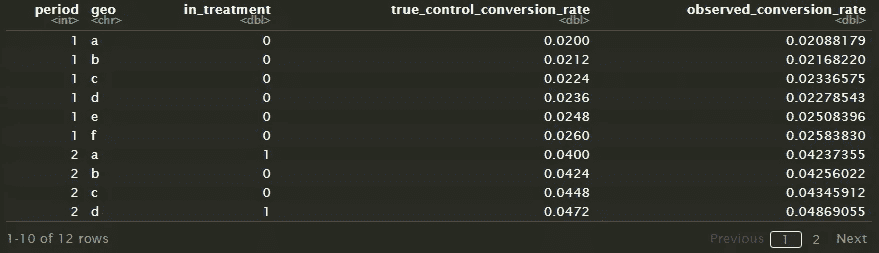**

**然后，我们观察一个如下的实验结果。**

```
(
  measured_effect_size_geos_biased <- geo_design_experiment_data %>%
    get_effect_on_conversion_geos_biased()
)
[1] 0.02418268
```

**我们测得的转换差异是真实效果的 10 倍以上！**

**现在我们可以执行随机化推断来模拟空值下的效应大小。**

```
simulated_effect_sizes_ri_geos_biased <- randomization_inference(
  dataset = geo_design_experiment_data,
  number_of_simulations = 10000,
  random_assignment_function = add_hypothetical_random_assignment_geo,
  effect_size_function = get_effect_on_conversion_geos_biased
)
```

**如果我们有一个无偏的设计，在零值下的平均值应该是零。让我们对模拟值的平均值进行直觉检查。**

```
(estimated_bias <- mean(simulated_effect_sizes_ri_geos_biased))
[1] 0.02392901
```

**我们没有通过 gut 检查，因为平均值不接近 0。在这种情况下，我们会想看看是否有更好的、无偏见的方法来衡量效果(例如，添加周期固定效果或进行差异中的差异设计)，但如果我们找不到更好的设计，我们至少会想调整我们报告的效果。**

**例如，不是报告 0.024183 作为效应大小，我们可以减去估计偏差(0.023929:零偏差下模拟效应的平均值)并报告 0.024183 - 0.023929 = 0.000254 作为效应大小。请注意，这并不一定会使您的调整估计无偏，但这是一个比您知道有偏差的结果更诚实的报告。**

**我们还希望调整我们的置信区间，将我们模拟的效应大小分布集中在这个调整后的效应大小(而不是测量的效应大小)的零值下，并得到 2.5%和 97.5%的百分位数。**

**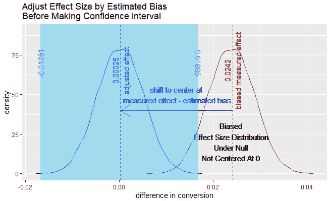**

# **摘要**

**在这篇文章中，我们已经讨论了非参数化的方法**

*   **模拟零分布下的效应大小:假设随机重新分配治疗，用假设分配多次计算效应大小。**
*   **做功效分析:最小可测量的效果是第 95 个百分位数减去第 20 个百分位数。**
*   **计算 p 值:找出在零值下的模拟效应大小比实验数据中测量的效应大小更极端的比例。**
*   **获得置信区间:将效应大小的分布集中在测量的效应大小的零值下，并获得置信界限的 2.5 和 97.5 个百分点。**
*   **检查并调整偏差:零值下模拟效应大小的平均值应为 0。如果不是，通过在零值下的模拟效应大小的平均值来调整测量的效应大小(并使用调整后的效应大小来定中心置信区间)。**

**在我的其他帖子中了解更多信息:**

*   **[所有数据科学家都应该知道的实验赋值方法](/an-experiment-assignment-method-all-data-scientists-should-know-e4d57d96b26b?source=friends_link&sk=e4580b55c82b514cadf41e07cf8eccbc)**
*   **[冷静点！何时将协变量添加到线性回归中](/get-a-grip-when-to-add-covariates-in-a-linear-regression-f6a5a47930e5?source=email-534d9d75f626-1584307789520-layerCake.autoLayerCakeWriterNotification-------------------------5b264995_1b97_4e64_a82a_770b76c90329&sk=fa2da69f55faa9641bdc8e19bb3ce4af)**

**如果你想了解自举，请继续阅读。**

# **号外:自举呢？**

**自举是模拟效果大小分布的另一种方法。**

**bootstrapping 不是使用数据中处理分配产生的自然变化，而是探索您抽取的特定人群样本的不确定性。这个想法是，假设您的数据遵循的最自然的分布就是在您的样本中实际观察到的分布。因此，只需从您的数据中取样并替换，即可创建一个模拟。**

**该过程工作如下:**

1.  **您可以使用历史数据进行功效分析或计算实验测量效果的 p 值。您使用实验结果中的实际数据来建立置信区间。**
2.  **从你的数据集中随机抽取替换数据(如果你的作业是聚类的，则在最高的聚类级别)，直到你创建了一个与实验中相同大小的数据集(引导)。画得低一点会人为提高你的精度。**
3.  **使用模拟数据集计算检验统计量**
4.  **多次重复上述步骤**
5.  **从具有替换的各种假设随机样本计算的检验统计量的分布可以被认为是当使用历史数据时在零分布下的检验统计量的分布，或者当使用实验数据时在真实效应大小下的检验统计量的分布。**
6.  **使用历史数据时，功效分析的最小可测量效果仍然是第 95 个百分点减去第 20 个百分点。p 值仍然是 1 减去模拟效应大小分布中实际测量效应的百分位数。当用真实实验结果的替换来绘图时，可以使用自举效应大小的 2.5 和 97.5 个百分点来找到置信区间的界限。**

```
make_bootstrap_and_find_effect_size <- function(
  dataset,
  cluster_variables_to_sample_with_replacement,
  num_clusters_to_sample,
  effect_size_function,
  dummy # so we can use map
  ){
  return(
    # with your dataset
    dataset %>% 
      # build a bootstrap
      # first get the distinct sets of cluster variables
      dplyr::select_at(cluster_variables_to_sample_with_replacement) %>% 
      dplyr::distinct() %>% 
      # sample these clusters with replacement until you reach
      # the specified size
      dplyr::sample_n(num_clusters_to_sample, replace=T) %>%
      # attach back to the dataset to get the variables needed
      # to estimate the effect size
      dplyr::inner_join(dataset, by=cluster_variables_to_sample_with_replacement) %>% 
      # estimate the effect given the bootstrap
      effect_size_function()
  )
}bootstrapping <- function(
  dataset,
  number_of_simulations,
  cluster_variables_to_sample_with_replacement,
  num_clusters_to_sample,
  effect_size_function,
  seed=42
){
  set.seed(seed)
    future_map_dbl(
      # for each simulation
      1:number_of_simulations,
      # randomly assign and find effect size
      make_bootstrap_and_find_effect_size,
      # using the provided data set
      dataset = dataset,
      # and the specified clusters
      cluster_variables_to_sample_with_replacement = cluster_variables_to_sample_with_replacement,
      # with the specified number of samples with replacement
      num_clusters_to_sample=num_clusters_to_sample,
      # and provided effect size generating function
      effect_size_function = effect_size_function
  )
}
```

## **例子**

**使用 bootstrapping，我们需要一个初始化的假设处理，这样当我们用替换进行采样时，处理也随之而来。**

```
set.seed(42)
historical_data_w_assignment <- historical_data %>% 
  add_hypothetical_random_assignment()
```

**然后，我们可以应用自举过程(注意，我们没有对数据进行聚类，所以我们只是使用每个单元进行采样)。**

```
simulated_effect_sizes_bs <- bootstrapping(
    dataset = historical_data_w_assignment,
    number_of_simulations = 10000,
    cluster_variables_to_sample_with_replacement = "customer_id",
    # assume experiment data is the same size as input data
    num_clusters_to_sample = nrow(historical_data_w_assignment),
    effect_size_function = calculate_difference_in_conversion
  )
```

**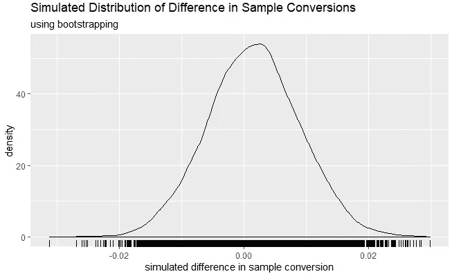**

## **随机化推理与自举**

**因果推理的巨人苏珊·艾希和圭多·安本斯[“强调基于随机化的推理，而不是基于抽样的推理。”](https://arxiv.org/abs/1607.00698)该链接是了解更多信息的绝佳途径。出于几个原因，我更喜欢随机推断而不是自举。**

*   **使用随机化推断更容易识别设计中的偏差。正如文章中所示，我们对实验数据进行了简单的 gut 检查，以确定我们的设计方法是否有偏差:检查使用实验数据的模拟效应大小在零下的均值是否为 0。使用 bootstrapping 进行这种检查要困难得多，因为如果对实验数据进行重新采样，它应该以测量的效果大小为中心，而不是 0。您可以使用历史数据，看看引导是否不等于 0，但通常实验期间的一些非线性时间差会导致偏差(这在历史数据中看不到)。**
*   **随机化推断会自动考虑样本中聚类的相关性。统计分析中一个非常常见的错误是没有考虑聚集的标准误差。如果我们在聚类级别(如上面的地理位置)分配治疗，然后在单元级别(如客户)执行分析，回归或 t 检验得出的默认标准误差不会考虑治疗分配中的相关性，您可能会高估实际的精确度。但是通过随机化推断，只要你在模拟实验中以同样的方式分配治疗，它就会自动解释这些聚集的标准误差。这也是我建议在聚类级别进行自举的一个重要原因:在单元级别对聚类分配处理进行重采样会产生不一致的方差估计。**
*   **随机化推断通常更快。Bootstrapping 需要计算量非常大的随机采样，每次模拟都要进行替换，而随机化推断只需要重新分配治疗。但是，如果重新分配治疗的成本很高，则随机化推断可能会较慢(例如，如果您将一半的产品类别暴露于治疗，然后计算每个客户被视为其应用治疗的产品的百分比，则您必须计算每个客户在每个新治疗分配中被视为治疗的产品的百分比，这将非常昂贵)。**