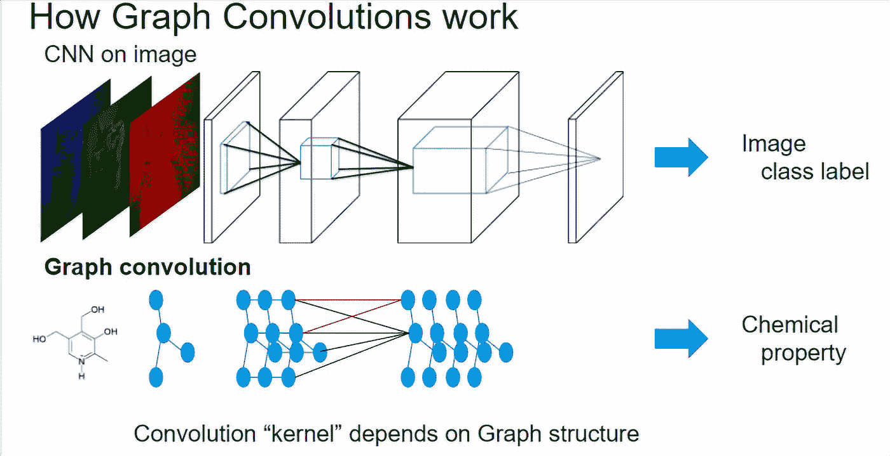
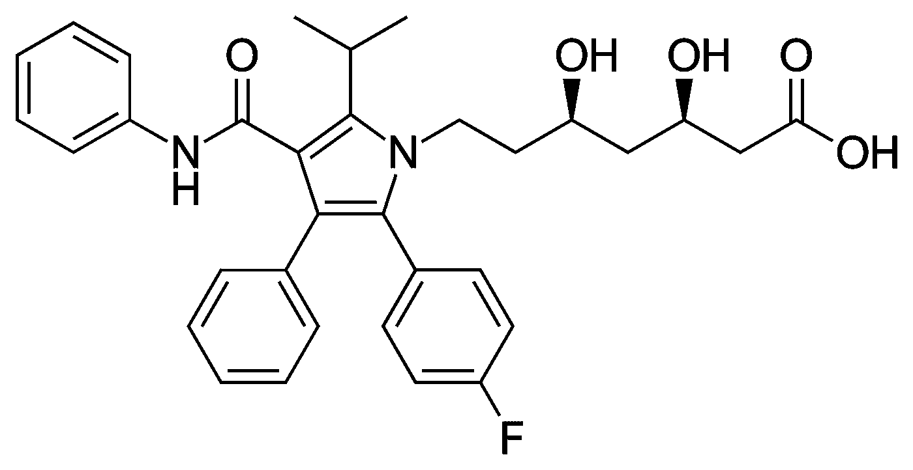
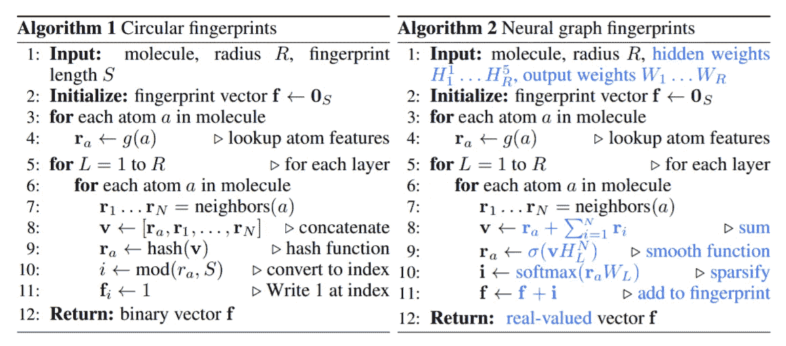
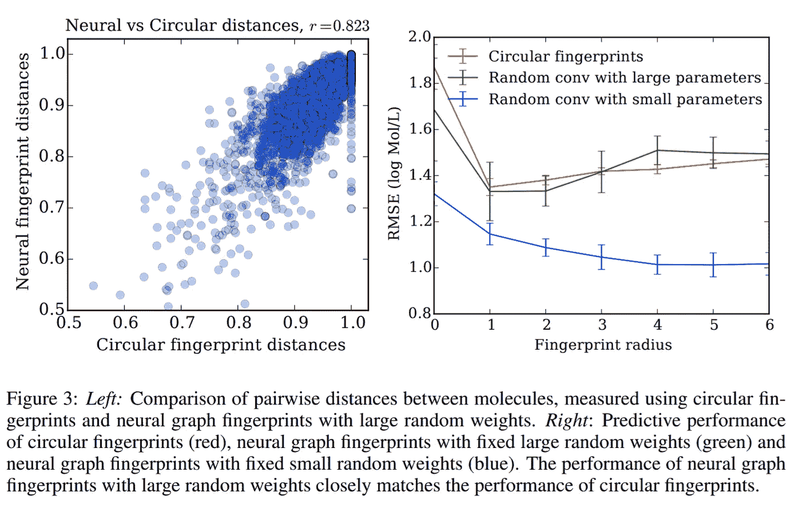

# 用于分子机器学习的实用图形神经网络

> 原文：<https://towardsdatascience.com/practical-graph-neural-networks-for-molecular-machine-learning-5e6dee7dc003?source=collection_archive---------1----------------------->

Graph convolutions

## 直到最近，从业者将使用分子指纹(本质上是不同分子亚结构的一键编码)作为机器学习模型的输入。然而，该领域正开始朝着使用深度学习自动学习指纹本身(自动特征工程)的方向发展。这是一个实现简单神经指纹的演示。

# 1.化学指纹

化学指纹[1]长期以来一直是用于将化学结构表示为数字的表示方法，这些数字是机器学习模型的合适输入。简而言之，化学指纹表明是否存在化学特征或亚结构，如下所示:

Chemical fingerprints

在我的另一篇博文[中提供了化学指纹的简要总结。](/a-practical-introduction-to-the-use-of-molecular-fingerprints-in-drug-discovery-7f15021be2b1)

使用 RDkit [2]可以在 Python 中轻松计算指纹，如下所示:

How to make a fingerprint in Python

上面，我们计算了[阿伐他汀](https://en.wikipedia.org/wiki/Atorvastatin)的指纹，这种药物在 2003-2013 年间创造了超过 1000 亿美元的收入。

Atorvastatin/Lipitor

# 2.图形卷积

几年前的某个时候，人们开始意识到[3]我们可以计算一个可微指纹，而不是计算一个不可微指纹。然后，通过反向传播，我们不仅可以训练深度学习模型，还可以训练指纹生成函数本身。承诺将是学习更丰富的分子表示。

Circular vs Neural fingerprints [3]

其思想是将相邻节点的特征聚集在一起。这就是“图形卷积”这个名字的由来，因为我们对每个原子的相邻原子进行卷积(执行某种聚合)。

我们可以使用[py torch-Geometric](https://github.com/rusty1s/pytorch_geometric)【4】实现上面提出的神经图指纹算法。以下实现允许批量训练(PyTorch-Geometric 将一批分子/图形建模为一个大的不连接图形)。

## 2a。原子特征和键连接(边指数)

我们将使用这些 atom 特性:

A)一个[原子序数](https://en.wikipedia.org/wiki/Atomic_number)(它也决定原子类型)

b)连接在原子上的氢的数量。

这些是基本特性，但对我们的目的来说已经足够了。

最后，我们可以定义模型。

我们可以测试我们的模型，以确保它的工作:

# 3.通过反向传播学习指纹

[3]中一个有趣的发现是，随机初始化的神经指纹在模拟化学特征方面与传统指纹一样好，甚至更好。

Duvenaud et al. [3]

如果随机初始化的指纹和传统指纹一样好，那么如果我们通过反向传播来训练指纹，它们肯定会做得更好。

这是希望和承诺，但我们必须确保我们不要在小数据集中过度拟合噪声。让我们在真实数据集上尝试我们的神经指纹。我们将使用 DeepChem [7]的 BACE [6]回归数据集。

我们现在在我们的神经指纹之上建立一个小的 MLP(多层感知器)。我们只给它一个隐藏层(维度 100):

定义我们用于培训和验证的效用函数:

最后，我们的优化器和训练循环:

Training loop

注意，当我们训练模型时，我们训练神经指纹以及它上面的线性层。

# 4.展望未来，以及当前的最新技术

上述数据集包含约 1000 个分子和 1 个靶标。目前的数据集有 10 万多个分子和 100 多个目标。因此，大规模多任务监督预训练可用于获得非常丰富的表示[8]。

此外，人们开始使用无监督图预训练技术[9]，跟随 NLP 中无监督预训练的成功之路[10]。

Pretaining graph neural networks on millions of molecules

# 5.结论

我们看到神经指纹可以用来代替传统指纹。随机初始化的神经指纹表现得和传统指纹一样好，甚至更好。如果有足够的数据并采取措施避免过度拟合，经过训练的神经指纹有可能形成更丰富的表示。

# 6.后续步骤

在 LinkedIn 上与我联系，让我知道你是否最终使用了神经指纹。

# 参考

[1] D 罗杰斯，m 哈恩。扩展连接指纹。化学信息与建模杂志，50(5):742–754，2010。

[2] G .兰德鲁姆。RDKit:开源化学信息学。【www.rdkit.org】T2。【于 2013 年 4 月 11 日获取】。

[3]迪韦瑙德、马克劳林、阿吉莱拉-伊帕拉吉雷、戈麦斯-邦巴雷里、希尔泽尔、阿斯普鲁-古齐克、亚当斯。用于学习分子指纹的图上卷积网络。 *arXiv 预印本* arXiv:1509.09292，2015。

[4] M .菲，J. E .伦森。PyTorch 几何图形的快速图形表示学习。 *arXiv 预印本* arXiv:1903.02428，2019。

[5]鲁梅尔哈特、辛顿、威廉斯。通过反向传播误差学习表征。*性质* **323，**533–536(1986)doi:10.1038/323533 A0

[6] R. Vassar，D. M. Kovacs，Y. Riquang，P. C. Wong。健康和阿尔茨海默病中的β-分泌酶 BACE:调节、细胞生物学、功能和治疗潜力。 [*J 神经科学*](https://www.ncbi.nlm.nih.gov/pmc/articles/PMC2879048/#) *。* 2009 年 10 月 14 日；29(41): 12787–12794.

[7] DeepChem:药物发现和量子化学的深度学习模型。https://github . com/deep chem/deep chem，访问时间:2017–09–27。

[8] B. Ramsundar 等人,《药物发现的大规模多任务网络》。arXiv 预印本 : 1502.02072，2015

[9]胡、刘、戈麦斯、兹特尼克、梁、、莱斯科维奇。图形神经网络的预训练策略。 *arXiv 预印本* : 1905.12265，2019

[10] J .德夫林、m .张、k .李、k .图塔诺瓦。BERT:用于语言理解的深度双向转换器的预训练。arXiv 预印本 : 1810.04805，2018