# 异常值检测方法实用指南

> 原文：<https://towardsdatascience.com/practical-guide-to-outlier-detection-methods-6b9f947a161e?source=collection_archive---------13----------------------->

## 如何系统地检测单变量数据集中的异常值


Photo by [Tom Paolini](https://unsplash.com/@tomrico?utm_source=medium&utm_medium=referral) on [Unsplash](https://unsplash.com?utm_source=medium&utm_medium=referral)

我将讨论在 **R Studio** 中实现的四种异常检测方法的细节。我将提到异常值是什么，为什么它很重要，为什么会出现异常值。这些方法如下:

1.  *图基的方法*
2.  *推特异常检测*
3.  z 分数法
4.  *平均绝对偏差(MADe)法*

简而言之，离群值是指与数据集中的其他值有很大差异(远远小于或大于)的数据点。异常值可能是因为随机变化，或者可能证明了一些科学上有趣的事情。无论如何，在仔细调查之前，我们不应该简单地排除无关的观察。理解它们以及它们在正确的学习环境中的出现对于能够处理它们是很重要的。

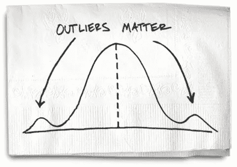

***为什么会出现离群值？***

离群值有几个原因:
1。样本中的一些观察结果是极端的；
2。数据被不恰当地缩放；
3。数据输入出错。

> **数据集和预处理**

我的公共数据集显示了该公司从 2014 年到 2017 年的每周销售额，它提供了“年”、“周”和“销售额”列，如下所示。

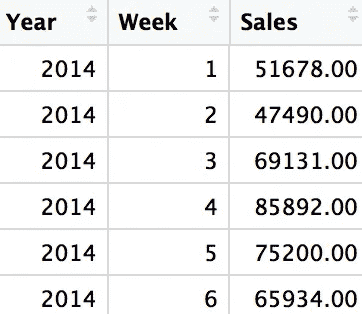

**Figure 1:** Original Dataset

数据集的维度是 201 x 3，数据包括 NA 值。我查看了空白值的那一周，然后通过取与数据集中的空白值相同的那一周的观察值的平均值来填补空白。

```
dim(sales_data)
[1] 201   3sum(is.na(sales_data$Sales))
[1] 4
```

该曲线图指出了 2014 年至 2017 年土耳其的饮料销售额。

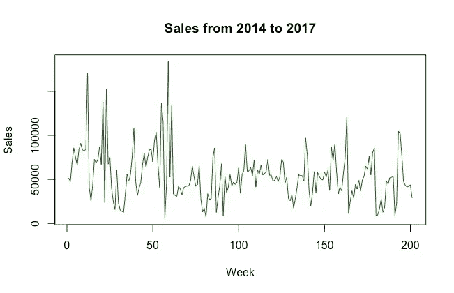

**Figure 2:** Time Series Analysis

现在，是时候深入研究异常检测方法了。

1.  ***图基氏法(盒须)***

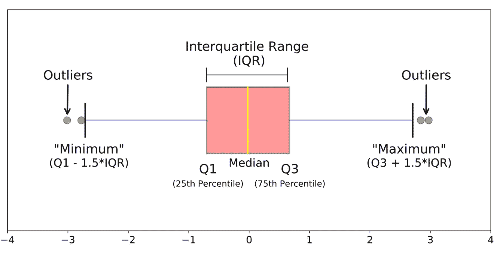

**Figure 3:** Box and Whiskers

1.  **最小值:**数据集中的最小值(**Q1–1.5 * IQR**)
2.  **第一个四分位数:**低于该值的 25%的数据包含在内( **Q1** )
3.  **中值:**数字范围中的中间数( **Q2** )
4.  **第三个四分位数:**包含高于该值的 25%的数据( **Q3** )
5.  **最大值:**数据集中的最大值( **Q3+1.5*IQR** )
6.  **四分位范围(IQR):** 数据集中的观察范围( **Q3-Q1** )

这种方法对于指示分布是否*偏斜*以及数据集中是否存在潜在的异常观察非常有用。

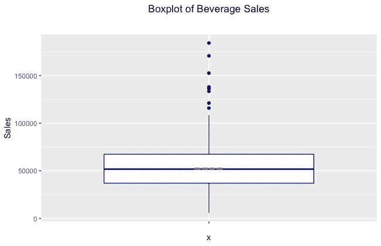

**Figure 4:** Box plot of sales dataset

*“gg plot”*是 R 中功能强大的数据可视化软件包之一；于是我用*【gg plot】*包来画销售箱线图。如上所示，蓝点表示异常值，红点表示数据集的中值。 ***的数据是左倾的。***

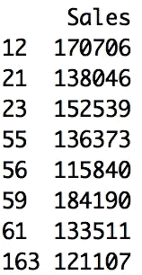

如左表所示，模型在数据集中检测到 ***8 个异常值*** 。我可以明确地说，这些数据点不同于数据集的其余部分。事实上，离群点的销售值在 11.5 万以上。

***2。推特异常检测***

AnomalyDetection 是一个开源的 R 包，用于检测异常情况，从统计的角度来看，在存在季节性和潜在趋势的情况下，它是健壮的。AnomalyDetection 包可用于多种环境，如新软件发布、用户参与帖子和金融工程问题。称为季节性混合 ESD 的基本算法建立在用于检测异常的通用 ESD 测试的基础上。它可用于发现全局和**局部异常。**

下面可以看到，我实现了 Twitter 异常，然后模型通过取 alpha 值为 0.05，与 Tukey 的方法比较，在数据集中发现了 ***6 个异常值*** 。异常点在表格中被标识为一个圆圈。

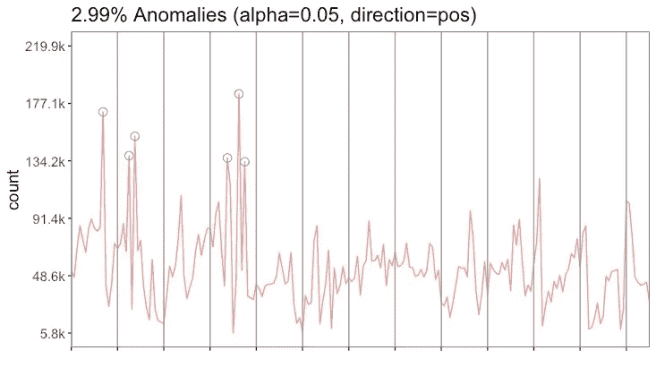

**Figure 5:** Twitter Anomalies

下表显示了哪些数据点被标记为异常值。该指数累计显示了销售的周数。这些异常值通常属于 2014 年和 2015 年。

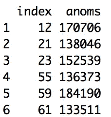

***3。z 值法***

Z-score 查找平均值为 0 且标准差为 1 的数据分布。Z 得分法依靠数据的平均值和标准偏差来衡量集中趋势和分散程度。由于平均值和标准偏差受到异常值*的严重影响，这在很多情况下是有问题的。*

*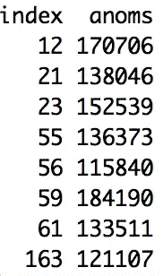*

*从统计学的角度来看，使用 1.96 的临界值将得到 p = 0.05 的等价 p 值。结果，该方法在 201 次观察中检测到 8 个极值点。Z-score 方法在这个数据集上符合盒须现象。这些点大多出现在 2014 年。*

****4。制作方法****

*在统计学中，**中位数绝对偏差** ( **MAD** )是单变量数据可变性的稳健度量。此外，MAD 类似于标准偏差，但与标准偏差相比，它对数据中的极值不太敏感。*

*我首先计算了中值，然后对于每个数据点，我计算了该值和中值之间的距离。MAD 被定义为这些距离的中间值。然后，这个量(MAD)需要乘以 1.4826，以确保它接近实际标准偏差。*

*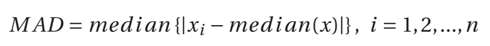*

*通过应用下面的公式，使用中位数和 MADe 来检测异常值。*

*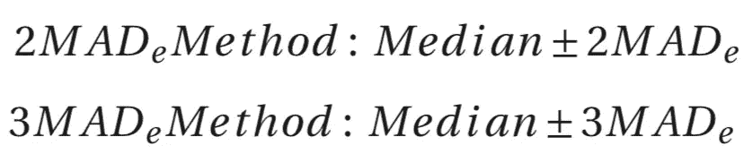*

*作为该方法的结果，如上所示，发现了 9 个异常值。*

*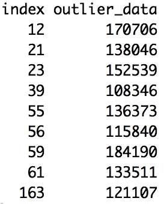*

> ***期末笔记***

*我执行了四种异常值检测方法，每种方法可能在数据集上产生不同的结果。因此，你必须*选择其中一个来观察异常值* **或者** *可以将所有方法中最常见的点标注为极值点*。在这种情况下，在我上面提到的方法中有 6 个共同的极端点。*

*下一步，在预测建模之前，将通过考虑不同的方式来转换离群点。这将产生更准确的预测模型。*

****你可以在这里看到所有代码***[](https://github.com/abdullahsaka/OutlierDetection)****下一个故事即将到来……*****