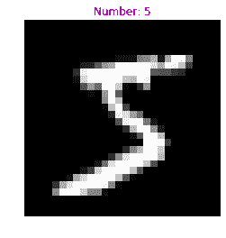
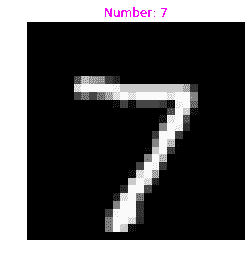
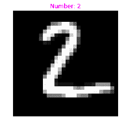
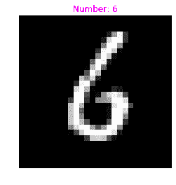
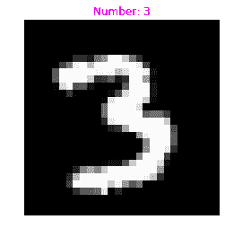

# 基于 Keras 的实用机器学习

> 原文：<https://towardsdatascience.com/practical-machine-learning-with-keras-19d0e5b2558?source=collection_archive---------20----------------------->

## 使用 Keras 快速构建实用的 ML 模型


Image by [Comfreak](https://pixabay.com/users/comfreak-51581/?utm_source=link-attribution&amp;utm_medium=referral&amp;utm_campaign=image&amp;utm_content=3010309) from [Pixabay](https://pixabay.com/?utm_source=link-attribution&amp;utm_medium=referral&amp;utm_campaign=image&amp;utm_content=3010309)

# 这篇文章是关于什么的？

在本文中，我尝试解释了什么是 keras，并总结了我在 keras 中构建模型的所有方法，解释了所有实用的技巧以及与之相关的所有细微差别。这篇文章将教你几种在建模中使用的增加复杂性的常用技术。

*   序列模型
*   功能 API(高级)
*   模型子类化(高级)

我们将使用一个非常著名的叫做 MNIST 的手写数字数据集，用这三种不同的方法制作 CNN 模型。我还将介绍基本的加载和使用数据。

# 这篇文章不是什么？

本文不会教你机器学习背后的理论或数学。如果你是机器学习的新手或者刚刚开始学习，我会提供一些资源来帮助你。

*   吴恩达的《机器学习》:这是一门非常适合初学者的课程，怎么推荐都不为过。
    [【免费】https://www.coursera.org/learn/machine-learning](https://www.coursera.org/learn/machine-learning)
*   Deep Learning 的深度学习专业化:这也是吴恩达教的，这是一个完整的专业化，而且非常好。https://www.coursera.org/specializations/deep-learning

好了，现在让我们开始学习。

# Keras 是什么？

Keras 是一个高级神经网络 API，用 Python 编写，能够在 [TensorFlow](https://github.com/tensorflow/tensorflow) 、 [CNTK](https://github.com/Microsoft/cntk) 或 [Theano](https://github.com/Theano/Theano) 之上运行(我们将使用 Keras 和 TensorFlow 作为后端)。

跳过正式的定义，keras 是一个易于使用的机器学习库，可用于快速原型制作，以构建复杂的定制模型，用于研究和生产以及介于两者之间的任何事情。Keras 有一个非常模块化和可组合的 API，从这个意义上说，Keras 模型是通过将可配置的构建块连接在一起而制成的(您很快就会看到这有多简单)。

# 让我们把手弄脏吧

现在您对 keras 有所了解，让我们直接进入它的实际实现。

## 导入 tf.keras

`[tf.keras](https://www.tensorflow.org/api_docs/python/tf/keras)`是 TensorFlow 对 [Keras API 规范](https://keras.io/)的实现。这是一个高级 API，用于构建和训练模型，包括对 TensorFlow 特定功能的一流支持。

## 加载数据

```
Original shape:  (60000, 28, 28) (60000,) (10000, 28, 28) (10000,)
After reshape and normalize:  (60000, 28, 28, 1) (10000, 28, 28, 1) (60000,) (10000,)
```

## 画出一个训练例子



## 将标签转换为分类标签

```
(60000, 28, 28, 1) (10000, 28, 28, 1) (60000, 10) (10000, 10)
```

现在我们已经加载了数据，并准备好投入到机器学习模型中，我们可以编写我们的第一个模型了。我的朋友，你做得很好，给你一张猫的照片作为奖励。


cat motivation: let’s learn some more

# 顺序模型

在 keras 中，模型可以被分解成各层之间有不同连接的图形。最常见的类型是一堆层，因此得名顺序。

让我们看看添加激活、初始化器和正则化的不同方法:

*   **激活**:该参数设置层的激活功能。默认为不激活。
*   **kernel_initializer** 和 **bias_initializer** :初始化方案为层创建权重。默认是 **Glorot 制服。**
*   **kernel _ regulator**和**bias _ regulator**:对权重应用 L1 和 L2 正则化，控制模型的过拟合。默认情况下没有正则化。

## 为 MNIST 造一个

让我们建立一个模型来对 MNIST 数据进行分类。这里我们将展示如何定义卷积层和最大池层。我们将使用一个标准的结构来建立一个 CNN: Conv 层，然后是最大池层。然后，我们使用展平图层展平图层，并应用完全连接的密集图层，之后是最终分类图层，该图层将预测分类为 10[0–9]个输出类。当我们调用 model.summary()时，您会更清楚地看到这个结构。

```
Model: "sequential_1" _________________________________________________________________ Layer (type)                 Output Shape              Param #    ================================================================= conv2d (Conv2D)              (None, 26, 26, 32)        320        _________________________________________________________________ max_pooling2d (MaxPooling2D) (None, 13, 13, 32)        0          _________________________________________________________________ conv2d_1 (Conv2D)            (None, 11, 11, 64)        18496      _________________________________________________________________ max_pooling2d_1 (MaxPooling2 (None, 5, 5, 64)          0          _________________________________________________________________ conv2d_2 (Conv2D)            (None, 3, 3, 64)          36928      _________________________________________________________________ flatten (Flatten)            (None, 576)               0          _________________________________________________________________ dense_9 (Dense)              (None, 64)                36928      _________________________________________________________________ dense_10 (Dense)             (None, 10)                650        ================================================================= Total params: 93,322 Trainable params: 93,322 Non-trainable params: 0 _________________________________________________________________
```

## 编译模型

既然我们的模型已经构建好了，我们必须通过调用 compile 方法来配置模型。它需要三个重要参数:

*   **优化器**:简单来说，就是决定你的损失函数应该如何减少的函数。
*   **损失**:这是损失函数，计算你的预测与实际标签有多远。这是优化器最小化的损失。
*   **指标**:用于监控培训过程。我们可以得到关于损失或精确度降低或增加的信息。

## 训练模型

我们已经为训练准备好了一切，让我们训练我们的第一个 keras 模型。我们通过在模型上调用 **fit** 方法来训练模型。除了训练数据和标签之外，该模型还采用了一些重要的参数:

*   **历元**:一个历元是整个输入数据的一次迭代。迭代可以在较小的批量中完成。
*   **batch_size** :模型将数据分割成更小的数据批次，然后输入到训练步骤中。除了最后一批可能较小之外，每一批的大小都相同。
*   **validation_data** :这在很多机器学习文献中也被称为交叉验证集。这在每次训练迭代之后测量模型的性能。

```
Train on 60000 samples, validate on 10000 samples
Epoch 1/5
60000/60000 [==============================] - 9s 150us/sample - loss: 0.1473 - acc: 0.9552 - val_loss: 0.0674 - val_acc: 0.9783
Epoch 2/5
60000/60000 [==============================] - 7s 117us/sample - loss: 0.0483 - acc: 0.9850 - val_loss: 0.0668 - val_acc: 0.9772
Epoch 3/5
60000/60000 [==============================] - 7s 116us/sample - loss: 0.0330 - acc: 0.9899 - val_loss: 0.0397 - val_acc: 0.9882
Epoch 4/5
60000/60000 [==============================] - 7s 118us/sample - loss: 0.0266 - acc: 0.9913 - val_loss: 0.0292 - val_acc: 0.9910
Epoch 5/5
60000/60000 [==============================] - 7s 117us/sample - loss: 0.0204 - acc: 0.9936 - val_loss: 0.0284 - val_acc: 0.9920<tensorflow.python.keras.callbacks.History at 0x7f6020679828>
```

[ **注意**:出于本教程的目的，我们已经将验证数据和测试数据视为相同，但是在实践中，您应该将一些模型看不到的数据保留为测试数据。]

## 测试性能

为了测试我们的模型的性能，我们可以通过分别对模型使用预测和评估函数来获得预测或直接评估模型并获得损失和准确性。

```
Prediction shape:  (10000, 10)Model evaluation: 
10000/10000 [==============================] - 1s 65us/sample - loss: 0.0334 - acc: 0.9891
[0.033432122451053876, 0.9891]
```

让我们检查一下我们对第一个测试示例的预测，并把它变成一个方便的方法，这样我们就可以用不同的指数为后面的模型调用它。



恭喜你，你已经制作了你的第一个 keras 模型，并对它进行了训练和评估。你应该得到另一张猫的照片作为激励，因为一些预先的东西就要来了。


cat motivation: let’s gooooooooo!

# 功能 API

在实践中经常使用序列模型，但在许多特殊情况下，您可能希望定义一些简单的层堆栈无法定义的任意模型。我们可以在复杂模型中求助于 Keras 功能 API，例如:

*   多输入模型
*   多输出模型
*   具有共享层的模型，即同一层被多次调用
*   具有非顺序数据流的模型(例如:ResNets 中的剩余连接)

使用函数式 API 构建模型遵循一组规则:

1.  层实例是可调用的，并返回一个张量作为其输出。
2.  要实际创建一个模型，我们必须将输入和输出张量传递给 tf.keras.Model 实例。
3.  模型的训练类似于顺序模型的训练。

说够了，现在让我们建立一个。

模型的训练和评估保持不变，所以我在这里只给出代码。在这一次，我们只是没有使用验证集，而是使用测试集来评估训练后的未知数据的模型。

```
10000/10000 [==============================] - 1s 71us/sample - loss: 0.0368 - acc: 0.9914
[0.03678753161538142, 0.9914]
```



现在，您知道了如何根据自己的喜好在模型中建立奇怪而复杂的连接，但是如果您必须定义自己的前进路线，那该怎么办呢？我们有一个解决方案，但首先，你应该欣赏你的努力工作，这个猫的形象。


# 模型子类化

我们已经建立了我们的模型，定义了我们自己的数据流，但是我们仍然不能完全控制模型的向前传递。我们可以通过子类化 tf.keras.Model 实例来构建一个完全可定制的模型。

这涉及到几个步骤，请密切注意:

1.  我们要创建一个 tf.keras.Model 的类实例，并在 ***__init__*** 方法中把所有的层定义为类的属性(基本可以比作不熟悉 python 类的人用的构造函数)。
2.  然后我们必须在 ***调用*** 方法中定义我们的自定义向前传递。
3.  如果我们想使用我们的子类模型作为函数式模型的一部分，我们也可以覆盖***compute _ output _ shape***方法(**可选方法**

让我们将理论付诸实践，为识别 MNIST 数据建立一个子类模型:

让我们训练、评估和测试我们的模型。



恭喜你，现在你知道了制作几乎所有类型模型的工具。在得出结论之前，让我们再学习一件非常方便的事情，就在猫休息之后。


when you code and your cat motivates you

# 自定义回调

回调是传递给模型的对象，用于在训练期间自定义和扩展其行为。您可以编写自己的自定义回调，或者使用内置的[***TF . keras . callbacks***](https://www.tensorflow.org/api_docs/python/tf/keras/callbacks)包括:

*   [***TF . keras . callbacks . model check point***](https://www.tensorflow.org/api_docs/python/tf/keras/callbacks/ModelCheckpoint):定期保存你的模型的检查点。
*   [***TF . keras . callbacks . learning rate scheduler***](https://www.tensorflow.org/api_docs/python/tf/keras/callbacks/LearningRateScheduler):训练时动态改变学习率。
*   [***TF . keras . callbacks . early stopping***](https://www.tensorflow.org/api_docs/python/tf/keras/callbacks/EarlyStopping):当验证性能停止提高时，中断/停止训练过程。
*   [***TF . keras . callbacks . tensor board***](https://www.tensorflow.org/api_docs/python/tf/keras/callbacks/TensorBoard):使用 [TensorBoard](https://www.tensorflow.org/guide/summaries_and_tensorboard) 监控模型的行为。

fit 方法的回调参数需要一个回调数组，我们将在那里传递回调。在本例中，我们将使用两种最常见的方法 LearningRateScheduler 和 EarlyStopping。

让我们像以前一样训练、评估和测试我们的模型。



# 结论

我希望你觉得这篇文章很有用，而且因为有猫而有点娱乐性。如果你事先知道一点机器学习，这可能是有用的，因为这篇文章完全是面向实践的，希望现在你应该出去做一些真正令人敬畏的项目。

下面是整个 [**代码**](https://colab.research.google.com/drive/1C2STpQWW7YoQZmLtdlPQ7ndJ9X1erzqa#scrollTo=wcL3bgdvO-C1) 的链接:

如果你对这篇文章有任何疑问，或者如果我犯了什么错误，欢迎在评论中发表。这里有一个 chonky 猫阅读整篇文章。


你可以在推特[这里](https://twitter.com/guywithpajamas)找到我。
如果你更喜欢 LinkedIn，请点击这里[找到我](https://www.linkedin.com/in/arkajyoti-mukherjee-03b633154/)。或者如果 Github 是你的东西，我也在那里。

如果你对机器学习、Tensorflow 有任何问题，请随时联系我，或者如果这是你的事情，就用 cat gif 来联系我。我不是专家，但我会尽力帮助你。

❤再见