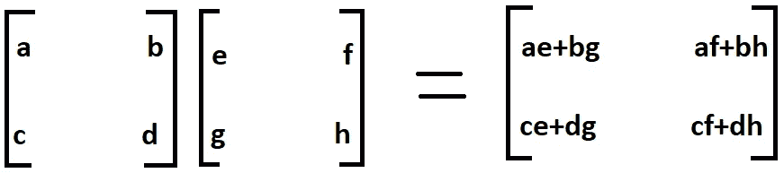

# 实用数字——通过函数理解 Python 库

> 原文：<https://towardsdatascience.com/practical-numpy-understanding-python-library-through-its-functions-adf2e3841894?source=collection_archive---------8----------------------->


Photo by [Mika Baumeister](https://unsplash.com/@mbaumi?utm_source=medium&utm_medium=referral) on [Unsplash](https://unsplash.com?utm_source=medium&utm_medium=referral)

在开始数据科学和机器学习的旅程之前，了解一些在数据科学领域无处不在的 python 库是非常重要的，比如 Numpy、Pandas 和 Matplotlib。Numpy 就是这样一个用于数组处理的强大的库，以及一个大型的高级数学函数集合来操作这些数组。这些函数分为线性代数、三角学、统计学、矩阵操作等类别。今天我们将看到几个如此重要的函数的例子。

# 得到 NumPy

要在本地机器上安装 NumPy，我建议从[这里](https://www.anaconda.com/download/)下载 anaconda 包发行版，它安装 python 和其他重要的 python 库，包括 NumPy、Pandas 和 Matplotlib，对机器学习很有用。Anaconda 支持 Windows、Mac 和 Linux。要快速开始使用 NumPy 而不在本地机器上安装任何东西，请查看 [Google Colab](https://colab.research.google.com/) 。它免费提供与你的 Google Drive 账户相关联的云端 Jupyter 笔记本，并且预装了所有重要的软件包。您也可以在 GPU 上运行您的代码，这有助于加快计算速度，尽管我们在本教程中不需要 GPU 计算。要快速开始使用 Google Colab，请查看同一网站上这篇令人惊叹的文章[。](https://medium.com/deep-learning-turkey/google-colab-free-gpu-tutorial-e113627b9f5d)

# 熟悉基础知识

N umPy 的主要对象是一个同质多维数组。与 python 的 array 类只处理一维数组不同，NumPy 的`ndarray` 类可以处理多维数组，并提供更多功能。NumPy 的维度被称为轴。例如，下面的数组有 2 个维度或 2 个轴，即行和列。有时，维数也称为特定数组或矩阵的秩。

```
[[1, 4, 7],
 [2, 5, 8],
 [3, 6, 9]]
```

## 导入数字

使用以下命令导入 umPy。注意这里的`np` 是别名遵循的约定，这样我们就不需要每次都写`numpy`。

```
import numpy as np
```

## 创建数组

用 NumPy 创建数组有很多方法，但最常用的方法是使用`array` 函数。一旦创建了一个数组，我们也可以使用`ndim` 方法检查它的尺寸。

```
#creating a one-dimensional array
a = np.array([1 ,2 ,3])
print (a)#ouptput
[1 2 3]a.ndim#output
1#creating a two-dimensional array
b = np.array([
             [1, 5 , 7], [2, 4, 6]
             ])
print (b)#output
[[1 5 7]
 [2 4 6]]b.ndim#output
2#creating a three-dimensional array
c = np.array([
             [[1,2,3], [3,4,5]], 
             [[5,6,7], [7,8,9]]
             ])
print (c)#output
[[[1,2,3]
 [3,4,5]] [[[5,6,7]
   [7,8,9]]]c.ndim#output
3
```

您还可以在创建数组时使用参数`dtype` 指定数组的数据类型，并使用它来检查数组的数据类型。

```
d = np.array([1 , 4 , 7], dtype=float)
print (d)#output
[1\. 4\. 7.]a.dtype#output
dtype('int64')
```

## 创建数组的一些特殊方法

umPy 提供了多种创建数组的方法。有像`zeros`和`ones`这样的特殊函数，它们分别创建只包含 0 和 1 的元素数组。您还可以将数组的长度(在一维情况下)或形状(在多维情况下)指定为参数。可以使用`arange`方法创建在给定间隔内具有均匀间隔值的数组。默认情况下，值之间的间距假定为 1 个单位，但是我们可以在参数中指定值之间的间距以及间隔的起始值和结束值。注意`arange`方法并不打印作为参数指定的间隔的最后一个值。

```
zeros_array = np.zeros(3, dtype=int)
print (zeros_array)#output
[0 0 0]zeros_array_nd = np.zeros((3,2), dtype=int)
print (zeros_array_nd)#output
[[0 0]
 [0 0]
 [0 0]]ones_array = np.ones(4, dtype=int)
print (ones_array)#output
[1 1 1 1]ones_array_nd = np.ones((2,3), dtype=int)
print (ones_array_nd)#output
[[1 1 1]
 [1 1 1]]range_array = np.arange(2,5)
print (range_array)#output
[2 3 4]range_array_space = np.arange(1,7,2)
print (range_array_space)#output
[1 3 5]
```

## 数组的形状

数组的 shape 属性返回一个描述其维度的元组。参考上面的例子，我们创建了数组 **b** ，这是一个二维数组，因此我们得到它的形状为(2，3 ),这意味着它有 2 行 3 列。这里注意数组 **c** 的 shape 属性返回(2，2，3)，这是因为数组 **c** 是一个三维数组，它表示有两个各有 2 行 3 列的数组。NumPy 还提供了`reshape`方法来调整数组的大小。

```
b.shape#output
(2, 3)B = b.reshape(3,2)
print (B)#output 
[[1 5]
 [7 2]
 [4 6]]c.shape#output
(2, 2, 3)C = c.resize(2,3,2)
print (C)#output
[[[1 2]
  [3 3]
  [4 5]] [[5 6]
  [7 8]
  [8 9]]]
```

## 数组的索引

可以使用标准 python 语法`x[obj]`索引 umPy 数组，其中 x 是数组，obj 是选择。在 NumPy 数组中，就像 python 一样，所有的索引都是从零开始的。NumPy 中的切片与 Python 中的类似。当`obj`是由方括号内的`start:stop:step`符号构造的切片对象时，就会发生基本切片。切片期间，并不总是需要所有三个`start`、`stop`和`step`都出现在方括号内。如果切片时出现负整数 j，则索引将被视为 n+j，其中 n 是数组中元素的数量。在多维数组的情况下，切片是以在方括号内传递元组的形式完成的，具有相同的符号约定。在高级索引中，以列表形式传递的第一个参数只是我们想要选择的特定行，第二个参数的列表指示我们想要从该行中选择的特定元素。

```
#Basic Slicing
x = np.array([9,8,7,6,5,4,3,2,1,0])
print(x[2:5])                      #output: [7 6 5]
print(x[5:])                       #output: [4 3 2 1 0]
print(x[:4])                       #output: [9 8 7 6]
print(x[1:7:3])                    #output: [8 5]
print(x[-5:10])                    #output: [4 3 2 1 0]#Boolean Indexing
print(x[x>4])                      #output: [9 8 7 6 5]#Indexing in multidimensional array
y = np.array([
             [1, 3],
             [4, 6],
             [7, 9]])#Advanced Indexing 
print(y[:2,1:2])                   #output: [[3]
                                             [6]]print(y[[0,1,2], [1,0,1]])         #output: [3, 4, 9]
```

# 向量、矩阵及其基本运算

在线性代数和机器学习领域，一维数组称为向量，二维数组称为矩阵。一个更高级的或 n 维的数组称为 n 维张量。作为各种机器学习和深度学习模型的输入的数据仅仅是矩阵和张量的形式，因此学习矩阵运算变得非常重要。

## 矩阵的转置

E 在本文的前面，我们看到了二维数组的形状和整形的概念，其中`shape`方法返回一个描述矩阵的行数和列数的元组。矩阵的转置是一个新的矩阵，它的行是原矩阵的列。这使得新矩阵的列成为原始矩阵的行。这是一个矩阵及其转置。让我们继续以矩阵“b”为例。

```
print (b)#output
[[1 5 7]
 [2 4 6]]b.shape#output
(2, 3)b_transpose = b.T
print (b_transpose)#output
[[1 2]
 [5 4]
 [7 6]]b_transpose.shape#output
(3, 2)
```

## 算术运算

M 个如果形状相同，可以相加或相减。一个矩阵中的一个元素对应于另一个矩阵中相同位置的元素被加或减。

**A***ij+***B***ij =***C***ij*

也可以将标量值添加到矩阵中，这意味着将该值添加到矩阵的每个元素中。使用`*`运算符或`multiply`方法执行元素乘法。元素乘法不同于矩阵乘法，矩阵乘法我们将在线性代数一节中看到。类似地，我们可以按元素划分两个矩阵，并找到矩阵中每个元素的平方根和指数值，如下例所示。

```
A = np.array([[5, 6], 
              [7, 8]])B = np.array([[4, 3],
              [2, 1]])add = A + B                #np.add(A,B) can also be used
print (add)#output
[[9 9]
 [9 9]]sub = A - B                #np.subtract(A,B)can also be used
print (sub)#output
[[1 3]
 [5 7]]add_scalar = A + 5
print (add_scalar)#output
[[10 11]
 [12 13]]multiply = A * B            #np.multiply(A,B) can also be used
print (multiply)#output
[[20 18]
  [14 8]]divide = A / B              #np.divide(A,B) can also be used
print (divide)#output
[[1.25 2]
 [3.5  8]]square_root = np.sqrt(A)
print (square_root)#output
[[2.23606798 2.44948974]
 [2.64575131 2.82842712]]exponential = np.exp(A)
print (exponential)#output
[[ 148.4131591   403.42879349]
 [1096.63315843 2980.95798704]]
```

## 广播

B roadcasting 是机器学习中的一个重要概念。广播基本上意味着将两个不同形状的矩阵相加。当两个不同形状的矩阵相加时，较小的矩阵通过自身延伸呈现较大矩阵的形状。在上面的例子中，我们向矩阵 **A** 添加了一个标量，我们实际上使用了广播，其中标量采用了矩阵 **A** 的形状。让我们看看下面的例子。这里，矩阵 **X** 具有(3，3)的形状，矩阵 **Y** 具有(3，1)的形状，但是两个矩阵相加的结果是新的(3，3)矩阵，因为矩阵 Y 将其自身扩展为(3，3)矩阵。

```
X = np.array([
             [1,2,3], 
             [4,5,6], 
             [7,8,9]
                   ])Y = np.array([[2],[4],[6]])matrix_broad = X + Y
print (matrix_broad)#output
[[3 4 5]
 [8 9 10]
 [13 14 15]]
```

# 线性代数函数

T 点积(也称为内积)是行和列之间乘积的总和，如下图所示。NumPy 提供了`dot`方法来计算两个矩阵的点积。为了计算两个矩阵的点积，第一个矩阵的列数应该等于第二个矩阵的行数。如果不遵守此规则，NumPy 将抛出一个错误，指出形状没有对齐。



Matrix multiplication or Dot product

```
matrix_1 = np.array([
                    [2, 3],
                    [1, 4],
                    [4, 5]])matrix_2 = np.array([
                    [2, 3, 5],
                    [1, 6, 7]])dot_product = np.dot(matrix_1, matrix_2)
print (dot_product)#output
[[7 24 31]
 [6 27 33]
 [13 42 55]]
```

在上面的例子中， **matrix_1** 的形状为(3，2)，而 **matrix_2** 的形状为(2，3)，即 **matrix_1** 的列数等于 **matrix_2** 的行数，得到的矩阵的形状为(3，3)。

## 矩阵的行列式、逆矩阵和范数

线性代数的函数可以在模块`linalg`中找到。下面列出了一些功能。

```
#Determinant for 2 dimensional matrix
matrix_A = np.array([
                    [1, 2],
                    [3, 4]
                          ])
det_A = np.linalg.det(matrix_A)
print (det_A)#output 
-2.0#Determinant for 3 dimensional tensor (stack of matrices)
matrix_A_3d = np.arange(1,13).reshape(3,2,2)
det_A_3d = np.linalg.det(matrix_A_3d)
print (det_A_3d)#output 
[-2\. -2\. -2.]#Inverse of 2-D Matrix and 3-D Tensor
inv_A = np.linalg.inv(matrix_A)
inv_A_3d = np.linalg.inv(matrix_A_3d)print (inv_A)
print (inv_A_3d)#output
[[-2\.   1.]  
 [1.5 -0.5]][[[-2\.   1\. ]   [ 1.5 -0.5]]   
 [[-4\.   3\. ]   [ 3.5 -2.5]]   
 [[-6\.   5\. ]   [ 5.5 -4.5]]]Norm of 2-D Matrix and 3-D Tensor
norm_A = np.linalg.norm(matrix_A)
norm_A_3d = np.linalg.norm(matrix_A_3d)print (norm_A)
print (Norm_A_3d)#output
5.47722557505
25.49509756796
```

# 统计功能

N umPy 有一套丰富的函数来执行统计操作。NumPy 的`random`模块的`rand`和`randn`方法用于分别生成所需维数的随机值和正态分布值的矩阵和张量。当我们想要为深度学习模型的第一次正向传播生成随机权重时，这些函数就很方便了。我们还可以计算输入数据的平均值、中值和标准差，如下所示。

```
#Create array of desired shape with random values
random_array = np.random.rand(3,2)
print (random_array)#output
[[0.42598214 0.49227853]  
 [0.06742446 0.46793263]  
 [0.23422854 0.80702256]]#Create array with values from a normal distribution
random_normal_array = np.random.randn(3,2)
print (random_normal_array)#output
[[ 1.99670851  0.40954136]  
 [ 0.5125924  -0.04957141]  
 [ 0.33359663  0.26610965]]P = np.array([
             [10, 12, 14],
             [8, 10, 12],
             [3, 5, 7]])#Calculate mean of the whole array, columns and rows respectively
P_mean = np.mean(P)                   #output: 9.0
P_mean_column = np.mean(P, axis=0)    #output: [7\. 9\. 11.]
P_mean_row = np.mean(P, axis=1)       #output: [12\. 10\. 5.] #Calculate median of the whole array, columns and rows respectively
print(np.median(P))                   #output: 10.0
print(np.median(P, axis=0))           #output: [8\. 10\. 12.]
print(np.median(P, axis=1))           #output: [12\. 10\. 5.]#Calculate standard deviation of the whole array, columns and rows #respectively
print(np.std(P))
print(np.std(P, axis=0))
print(np.std(P, axis=1))#output
3.366501646120693 
[2.94392029 2.94392029 2.94392029] 
[1.63299316 1.63299316 1.63299316]
```

# 结论

umPy 是 Python 中科学计算的基本库，本文展示了一些最常用的函数。理解 NumPy 是机器学习和深度学习之旅的第一个重大步骤。

希望这篇文章对你有用。请发表你的看法，评论和赞赏。