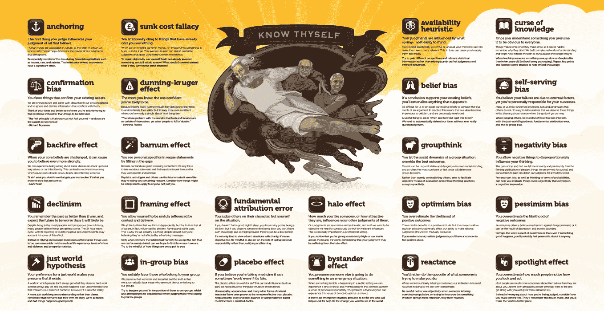

# 数据科学家实用心理学

> 原文：<https://towardsdatascience.com/practical-psychology-for-data-scientists-74b4b031b777?source=collection_archive---------16----------------------->

## 8 种常见的认知偏差及其对你的意义

[Image source](https://yourbias.is/)

你并不像你想象的那样有逻辑。我们都不是。我们每天都容易受到认知偏差的影响。如果你有幸读过丹尼尔·卡内曼的《T2 思维》、《快与慢》和《T3》，那么你对这个现实就再熟悉不过了。我们是不完美的生物，世界是一个[不完美的地方](https://www.youtube.com/watch?v=qlllvd_AMDw)。

鉴于数据科学的实验性和研究导向性，我们比大多数人更容易受到这些偏见的影响。我们代表着数据和洞察力之间的媒介。我们将字符串、整型和浮点转换成可操作的建议、模型和可视化。

这个角色伴随着巨大的责任。当我们的思维被认知偏见劫持时，坏事就会发生。做出不明智的决定，传播不正确的信息。在这篇文章中，我们将通过解决常见的偏见来避免这些情况，它们可能出现在哪里，以及如何识别它们。

# 确认偏差

可以说是认知偏差的典型代表，确认偏差是指我们倾向于确认我们现有信念的事物。这是有充分理由的。确认偏差无处不在。我们希望自己是对的。见鬼，错了真不舒服。你真的能责怪我们的思想时不时地试图欺骗我们吗？

这对数据科学家来说尤其危险。想想你最后一次执行某种分析的时候。如果你对这个项目感兴趣，那么你可能会带着一些假设、想法或你认为会发生的有利结果进入这个项目。这就是偏见发挥作用的地方。

你更有可能把你的发现解释为支持你先前信念的证据。我们不能完全避免这一点，但是如果你意识到了这一点，那么你就可以意识到什么时候可能会出现确认偏差，并相应地调整你的想法。

> 建议:在进行分析之前，写下任何假设、想法和信念。之后，重新阅读这份笔记并[再次检查](https://www.babson.edu/academics/executive-education/babson-insight/finance-and-accounting/auditors-pitfall-five-ways-to-overcome-confirmation-bias/)你的见解，确保它们是正确的。

# 叙事谬误

我们喜欢好故事。至少提利昂是这么认为的。数据科学和分析也不例外。叙事谬误是这样一种观点，即我们想把点点滴滴连接起来编织一个故事，即使没有故事可讲。我们迫切希望现实符合我们的世界模型，但它往往不符合。

让我们考虑一个例子。你是一家消费互联网公司的数据科学家，日活跃用户数量增加了，但花在产品上的平均时间却下降了。你怎么解释这个？

有人可能会用一个类似于“我们引入了对产品参与度较低的低意向用户”的故事来报告这一点。这似乎是合理的，但我们能肯定这一点吗？没有更多的研究来证实这一说法，我们只是以一种似乎最合理的方式将这些点联系起来。这并不总是一件坏事；故事是传达真知灼见的好工具，但应该明智而有目的地使用。

> 建议:你看到的信号是否足够强，足以说明它不是由噪音引起的？如果是这样，你可能已经有了一个因果故事。没关系，但是花一点时间根据你现有的数据列出其他可能的原因。意识到你的故事是许多[可能解释中的一种](https://conversionxl.com/blog/narrative-fallacy-optimization/)。

# 参照效应

简而言之，锚定效应表明你判断的第一件事会影响你对接下来事情的判断。这就是为什么当你买东西的时候，你会首先得到一个更贵的产品。你固定在那个昂贵的价格点上，所以当你看到更便宜的东西时，它看起来并不那么糟糕。

当我们必须进行比较时，你可以看到这将如何影响数据科学家。如果你正在考虑一些新的独立功能的影响，你如何解释第一个功能将会影响你如何看待第二个功能。

当你比较两个组或使用事物作为基准时，记住这一点很重要。

> 建议:提前下锚。如果你认为任何一个特征的有效升力大约是 2%,那么在你分析之前把它写下来。这允许你在你的判断被改变后回到你的[无偏基准](https://www.schwab.com/resource-center/insights/content/weigh-anchor-overcoming-anchoring-bias)。

# 可用性偏差

我们的想法很大程度上是基于我们过去的经验。这不是突破性的信息，但可用性偏差使它更进一步。可用性偏见说我们不仅仅依靠我们的经验来做决定，我们也更喜欢那些更容易想到的经验。

当我们发展假设时，这是显而易见的。如果你最近读了一篇关于深度学习技术的论文，在为你的下一个模型进行头脑风暴时，你会更倾向于走这条路。如果你在一个领域做了一个重要的项目，那么你将在这个背景下解释下一个项目。

你想到的第一件事会是最容易想到的。这并不一定意味着它是对的。

> 建议:在做决定和头脑风暴假设时，利用你的关系网。允许他人带来[不同的视角](https://www.brighthubpm.com/methods-strategies/129548-pms-tame-availability-bias/)。如果他们在不同的团队，致力于不同的问题，加分。

# 晕轮效应

光环效应描述了一种现象，即把事物的一小部分应用于整体。当谈到第一印象时，这种认知偏见经常在社会背景下被提及。我不必告诉你握手和介绍很重要。

作为数据科学家，我们经常与利益相关者合作项目，以便[推动影响](https://www.conordewey.com/posts/job-is-done-ds)。尽管我们可能会有不同的想法，但影响力的游戏是真实存在的。做好工作是一回事，但有效地让别人支持你的工作是另一回事。这是一个棘手的问题，但光环效应是一个强有力的起点。以正确的方式开始你的项目，然后观察事情的发展。

> 建议:大多数项目都是从某种简报或会议开始的。这段时间，你要带头。作为一个内向的人，这可能很难做到，但通过乐观的视角解释你对项目的愿景对培养热情和组织支持大有帮助[向前迈进](https://medium.com/thrive-global/the-halo-effect-5f4f4f3a5150)。

# 沉没成本谬论

我个人最喜欢的一个观点是，在管理时间表和项目时，沉没成本谬误会打击我们。当你非理性地抓住已经让你付出代价的东西不放时，它就会发生。

我们经常继续做一个项目，仅仅是因为我们已经投入了时间，即使它不是我们能做的最有影响力的事情。意识到这一点并不难。如果它正在发生，你可能已经有了直觉。棘手的部分是打电话。

退出一个项目并继续前进是一颗难以下咽的药丸。虽然这份清单上的其他偏见肯定更隐蔽，但沉没成本谬误可能是最难正面应对的。

> 建议:尽管很难，但要关注未来的结果。过去的就过去了。这是无法改变的，也不应该左右你的决定。就目前的项目状况而言，这是实现未来成果的最佳投资时机吗？如果答案是否定的，那就继续这段旅程吧。

# 知识的诅咒

交流并不容易。当知识的诅咒控制了我们，这就更不容易了。知识的诅咒是当你知道一些事情，并认为它对每个人都是显而易见的。对于数据科学家来说，这可能是一个严重的致命弱点。

我们天生就是技术型的。我们做了大量的分析。我们挖掘了许多假设。慢慢地，我们用数据建立起一幅幕后真实情况的画面。

当我们分享这些见解时，往往会出错。我们不记得其他人没有像我们一样尽职尽责。他们对这个问题的理解还不一致。他们还没有探究所有的假设。因此，当我们交流结果时，结果会显得难以解释或过于复杂。

> 建议:设身处地为你的利益相关者着想。对于对这个问题没有深入理解的人来说，这有意义吗？我的演示文稿或文档是否过于复杂？尽可能清晰简洁地交流。首先关注可行的见解，然后[如果需要的话再深入](https://simplystatistics.org/2018/06/04/trustworthy-data-analysis/)。

# 信息偏差

作为数据科学家，我们渴望信息。这是我们工作的核心。我们对细节的关注是我们最大的优点之一，也是最大的缺陷。如果你不熟悉，信息偏见是指在不影响行动的情况下继续寻找信息的倾向。

[分析瘫痪](https://en.wikipedia.org/wiki/Analysis_paralysis)是一种无法避免的瘟疫。在某种程度上，尽管探索很重要，但深入研究问题的收益减少不会直接影响项目的更大成果。在这种情况下，你的时间最好花在别的地方。

> 建议:从[最小可行性分析](https://www.conordewey.com/blog/mva-minimum-viable-analysis/)开始。尽可能少地获取信息和理解的基线。向你的利益相关者展示并获得他们的反馈。令人惊讶的是，通常情况下，这就足够了。

# 摘要

意识到我们并不像自己想象的那样能够控制自己的决定和思维，这既令人不安又令人着迷。随着世界上可访问信息的深度，清晰和相对无偏见的思维已经成为一个经常被忽视的超级大国。

在这篇文章中，我列出了一些我认为有用的实践。这些可以大致分为以下几点:

*   事先把事情写下来
*   与不同观点的人交谈
*   问自己一些尖锐的问题
*   设身处地为利益相关者着想

这四样东西会带你走很长的路。事先把事情写下来会让你保持诚实。与他人交谈将帮助你检查你的认知盲点。难题会让你正面面对艰难的决定。对利益相关者的同情会帮助你产生更有意义的工作。

认知偏差是不可避免的，但这并不意味着我们必须在他们掌控方向盘时无所事事。有了正确的系统，我们可以采取措施驯服它们。勇往直前去征服。

感谢阅读！请随意查看下面我的一些类似文章，并订阅我的时事通讯中的**以获得有趣的链接和新内容。**

*   **[为新的和有抱负的数据科学家汇编建议](https://www.conordewey.com/blog/compilation-of-advice-for-new-and-aspiring-data-scientists/)**
*   **[数据科学家是思想家](https://www.conordewey.com/blog/data-scientists-are-thinkers/)**
*   **[数据科学家的 13 份重要简讯](https://www.conordewey.com/blog/13-essential-newsletters-for-data-scientists-remastered/)**

**你可以在 Medium 上关注我更多类似的帖子，也可以在 Twitter 上找到我。想了解更多关于我和我在做什么，请查看我的网站。**